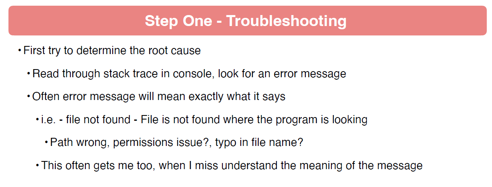
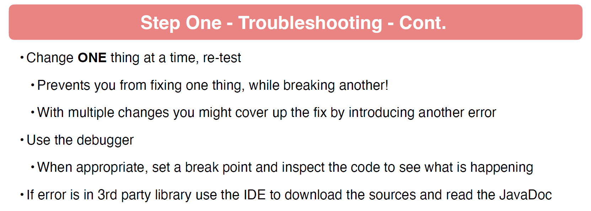
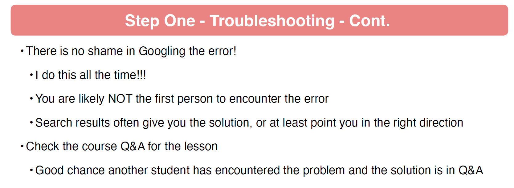
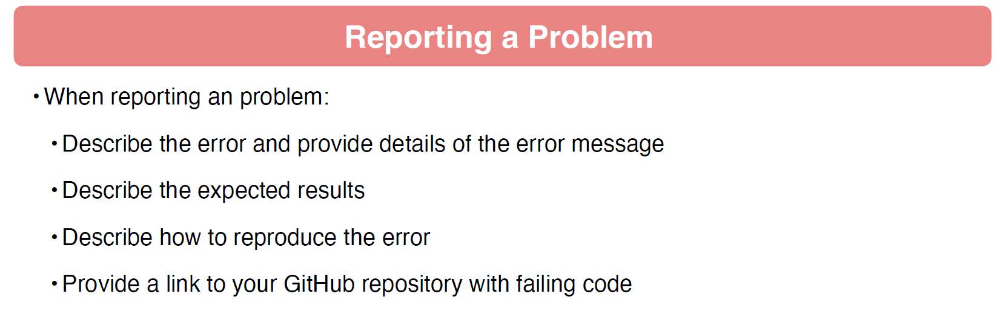
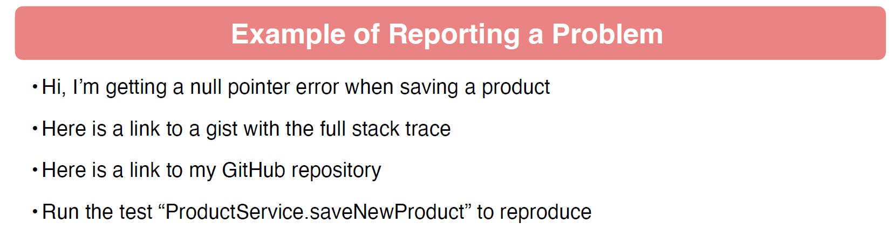
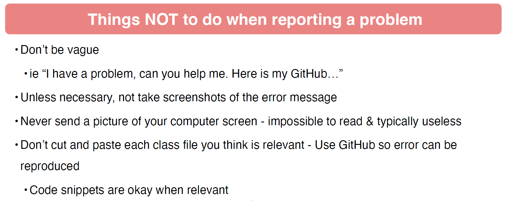
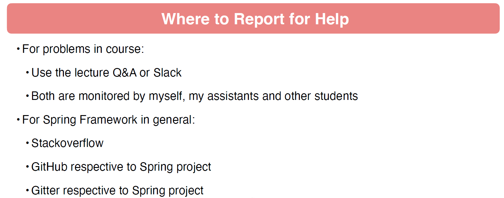

# Introduction

## Course Introduction

## 002 Instructor Introduction

## 003 Getting the Most out of this Course 

## 004 Setting Up Your Development Environment

## 005 Is Your IDE Free Like a Puppy

## 007 Getting Help with the Spring Framework

