# 02 - Building a Spring Boot Web App

## 001 Introduction
## 002 Introduction to Spring
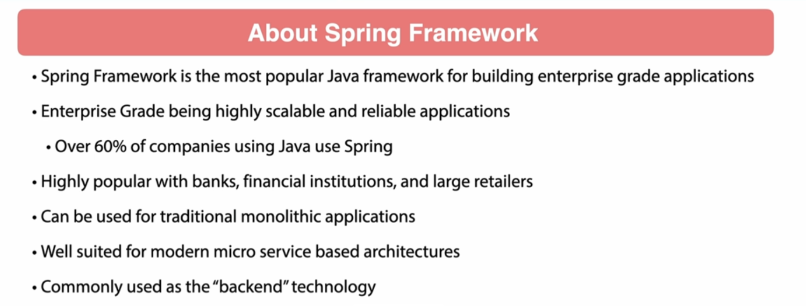
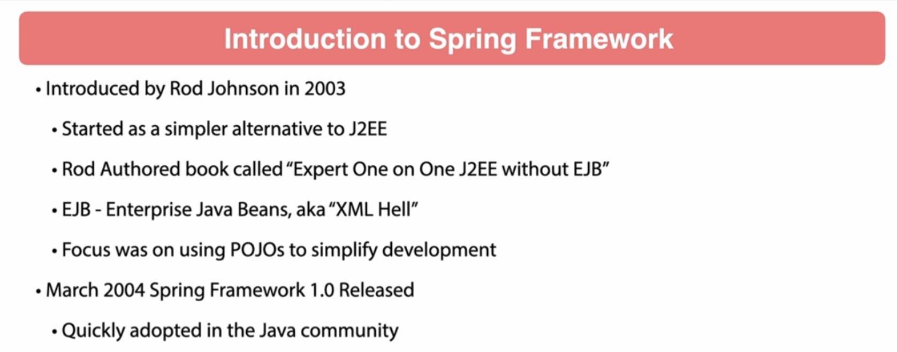
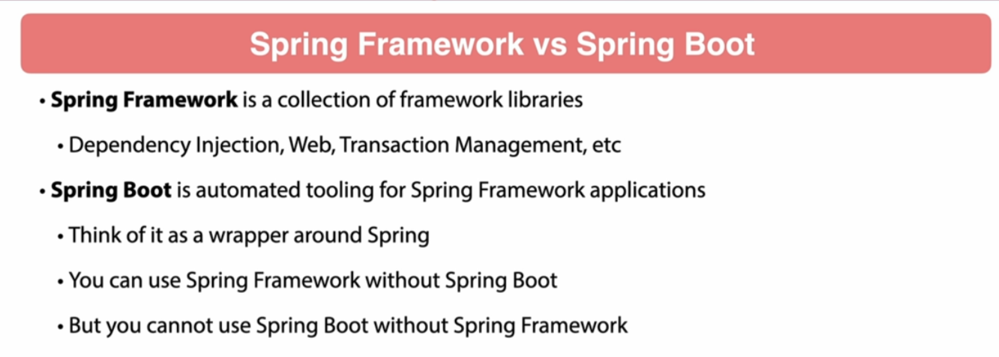
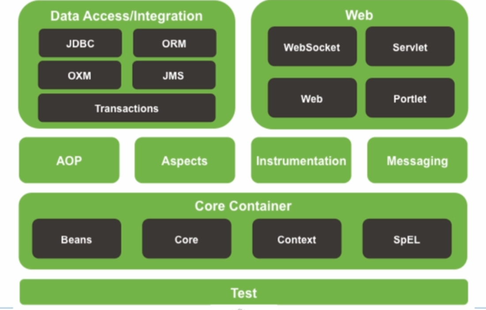
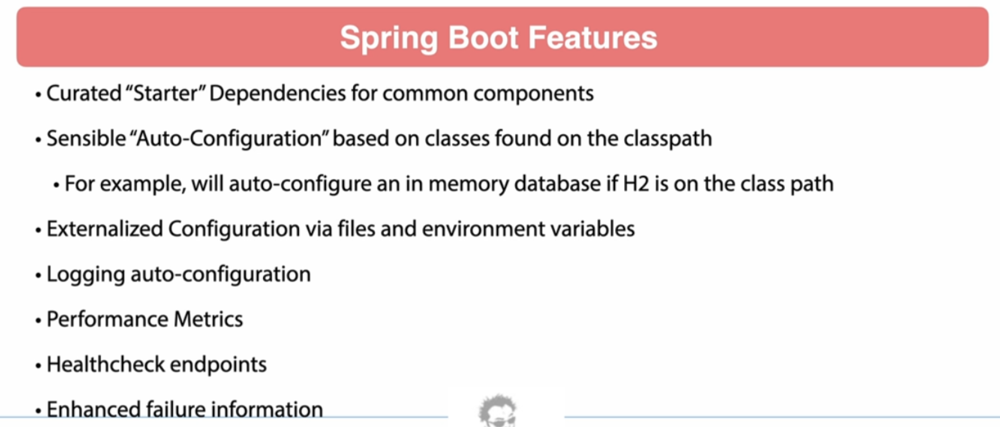
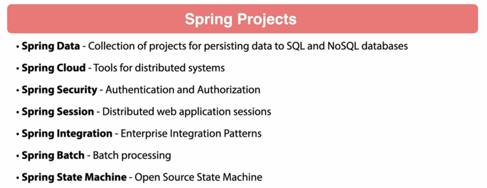
## 003 Application Overview
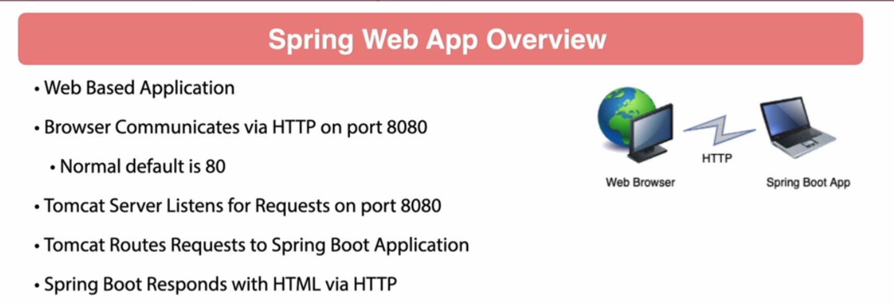

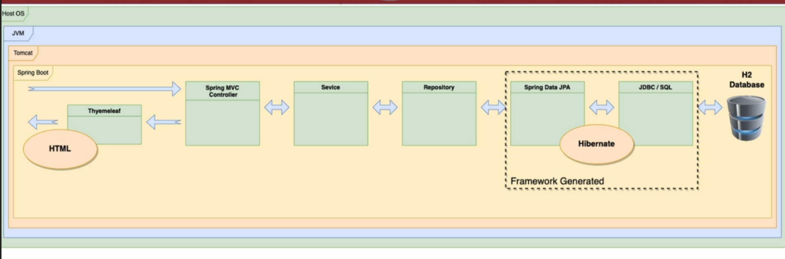
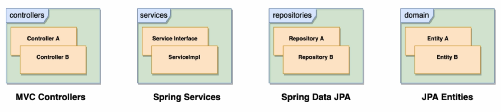

## 004 Spring Initilizer
go to start.spring.io

```xml
<?xml version="1.0" encoding="UTF-8"?>
<project xmlns="http://maven.apache.org/POM/4.0.0" xmlns:xsi="http://www.w3.org/2001/XMLSchema-instance"
         xsi:schemaLocation="http://maven.apache.org/POM/4.0.0 https://maven.apache.org/xsd/maven-4.0.0.xsd">
    <modelVersion>4.0.0</modelVersion>
    <parent>
        <groupId>org.springframework.boot</groupId>
        <artifactId>spring-boot-starter-parent</artifactId>
        <version>3.3.2</version>
        <relativePath/> <!-- lookup parent from repository -->
    </parent>
    <groupId>com.wchamara</groupId>
    <artifactId>spring-6-webapp</artifactId>
    <version>0.0.1-SNAPSHOT</version>
    <name>spring-6-webapp</name>
    <description>spring-6-webapp</description>
    <url/>
    <licenses>
        <license/>
    </licenses>
    <developers>
        <developer/>
    </developers>
    <scm>
        <connection/>
        <developerConnection/>
        <tag/>
        <url/>
    </scm>
    <properties>
        <java.version>21</java.version>
    </properties>
    <dependencies>
        <dependency>
            <groupId>org.springframework.boot</groupId>
            <artifactId>spring-boot-starter-data-jpa</artifactId>
        </dependency>
        <dependency>
            <groupId>org.springframework.boot</groupId>
            <artifactId>spring-boot-starter-web</artifactId>
        </dependency>

        <dependency>
            <groupId>org.springframework.boot</groupId>
            <artifactId>spring-boot-devtools</artifactId>
            <scope>runtime</scope>
            <optional>true</optional>
        </dependency>
        <dependency>
            <groupId>com.h2database</groupId>
            <artifactId>h2</artifactId>
            <scope>runtime</scope>
        </dependency>
        <dependency>
            <groupId>org.springframework.boot</groupId>
            <artifactId>spring-boot-starter-test</artifactId>
            <scope>test</scope>
        </dependency>
    </dependencies>

    <build>
        <plugins>
            <plugin>
                <groupId>org.springframework.boot</groupId>
                <artifactId>spring-boot-maven-plugin</artifactId>
            </plugin>
        </plugins>
    </build>

</project>
```
## 005 Open Project in IntelliJ

[maven folder structure](https://maven.apache.org/guides/introduction/introduction-to-the-standard-directory-layout.html)

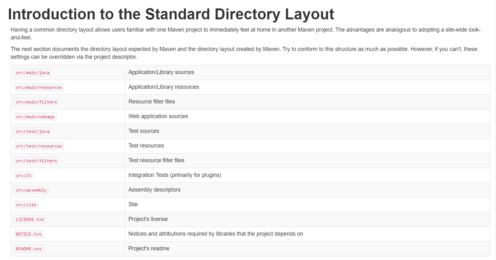
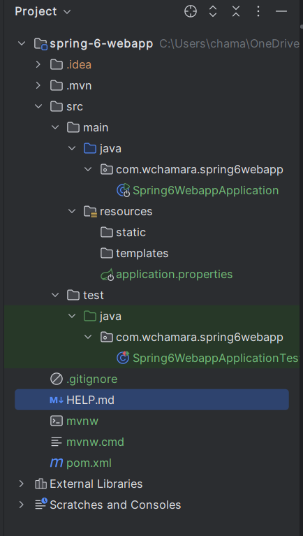
## 006 Using JPA Entities
```java
package com.wchamara.spring6webapp.domain;

import jakarta.persistence.Entity;
import jakarta.persistence.GeneratedValue;
import jakarta.persistence.GenerationType;
import jakarta.persistence.Id;

/**
 * Represents an author entity.
 * This class is mapped to a database table using JPA annotations.
 */
@Entity
public class Author {

    /**
     * The unique identifier for the author.
     * This value is automatically generated.
     */
    @Id
    @GeneratedValue(strategy = GenerationType.AUTO)
    private long id;

    /**
     * The first name of the author.
     */
    private String firstName;

    /**
     * The last name of the author.
     */
    private String lastName;

}
```
```java
package com.wchamara.spring6webapp.domain;

import jakarta.persistence.Entity;
import jakarta.persistence.GeneratedValue;
import jakarta.persistence.GenerationType;
import jakarta.persistence.Id;

/**
 * Represents a book entity.
 * This class is mapped to a database table using JPA annotations.
 */
@Entity
public class Book {

    /**
     * The unique identifier for the book.
     * This value is automatically generated.
     */
    @Id
    @GeneratedValue(strategy = GenerationType.AUTO)
    private long id;

    /**
     * The title of the book.
     */
    private String title;

    /**
     * The ISBN of the book.
     */
    private String isbn;
}
```
## 007 JPA Relationships
```java
```java
package com.wchamara.spring6webapp.domain;

import jakarta.persistence.*;

import java.util.Set;

/**
 * Represents an author entity.
 * This class is mapped to a database table using JPA annotations.
 */
@Entity
public class Author {

    /**
     * The unique identifier for the author.
     * This value is automatically generated.
     */
    @Id
    @GeneratedValue(strategy = GenerationType.AUTO)
    private long id;

    /**
     * The first name of the author.
     */
    private String firstName;

    /**
     * The last name of the author.
     */
    private String lastName;

    /**
     * The set of books associated with the author.
     * This relationship is managed by the Book entity.
     */
    @ManyToMany(mappedBy = "authors")
    private Set<Book> books;

    /**
     * Gets the unique identifier for the author.
     * @return the unique identifier for the author.
     */
    public long getId() {
        return id;
    }

    /**
     * Sets the unique identifier for the author.
     * @param id the unique identifier for the author.
     */
    public void setId(long id) {
        this.id = id;
    }

    /**
     * Gets the first name of the author.
     * @return the first name of the author.
     */
    public String getFirstName() {
        return firstName;
    }

    /**
     * Sets the first name of the author.
     * @param firstName the first name of the author.
     */
    public void setFirstName(String firstName) {
        this.firstName = firstName;
    }

    /**
     * Gets the last name of the author.
     * @return the last name of the author.
     */
    public String getLastName() {
        return lastName;
    }

    /**
     * Sets the last name of the author.
     * @param lastName the last name of the author.
     */
    public void setLastName(String lastName) {
        this.lastName = lastName;
    }
}
```
```java

The selected code snippet is part of the `Author` class in a Spring Boot application using JPA (Java Persistence API) for ORM (Object-Relational Mapping). The code defines a many-to-many relationship between the `Author` and `Book` entities.

The `@ManyToMany` annotation is used to specify that the `Author` entity has a many-to-many relationship with the `Book` entity. This means that an author can be associated with multiple books, and a book can be associated with multiple authors. The `mappedBy` attribute in the `@ManyToMany` annotation indicates that the `books` field in the `Author` class is the inverse side of the relationship, and the `authors` field in the `Book` class owns the relationship.

```java
@ManyToMany(mappedBy = "authors")
```

The `private Set<Book> books;` line declares a collection of `Book` objects associated with the `Author`. The `Set` collection type is used to ensure that each book is unique within the collection.

```java
private Set<Book> books;
```

Together, these lines of code establish a bidirectional many-to-many relationship between the `Author` and `Book` entities, allowing the application to navigate from an author to their books and vice versa.


```java
package com.wchamara.spring6webapp.domain;

import jakarta.persistence.*;

import java.util.Set;

/**
 * Represents a book entity.
 * This class is mapped to a database table using JPA annotations.
 */
@Entity
public class Book {

    /**
     * The unique identifier for the book.
     * This value is automatically generated.
     */
    @Id
    @GeneratedValue(strategy = GenerationType.AUTO)
    private long id;

    /**
     * The title of the book.
     */
    private String title;

    /**
     * The ISBN of the book.
     */
    private String isbn;

    /**
     * The set of authors associated with the book.
     * This relationship is managed by the Author entity.
     */
    @ManyToMany
    @JoinTable(name = "author_book", joinColumns = @JoinColumn(name = "book_id"),
            inverseJoinColumns = @JoinColumn(name = "author_id"))
    private Set<Author> authors;

    /**
     * Gets the unique identifier for the book.
     * @return the unique identifier for the book.
     */
    public long getId() {
        return id;
    }

    /**
     * Sets the unique identifier for the book.
     * @param id the unique identifier for the book.
     */
    public void setId(long id) {
        this.id = id;
    }

    /**
     * Gets the title of the book.
     * @return the title of the book.
     */
    public String getTitle() {
        return title;
    }

    /**
     * Sets the title of the book.
     * @param title the title of the book.
     */
    public void setTitle(String title) {
        this.title = title;
    }

    /**
     * Gets the ISBN of the book.
     * @return the ISBN of the book.
     */
    public String getIsbn() {
        return isbn;
    }

    /**
     * Sets the ISBN of the book.
     * @param isbn the ISBN of the book.
     */
    public void setIsbn(String isbn) {
        this.isbn = isbn;
    }
}
```
```
## 008 Code Examples in GitHub
## 009 Equality in Hibernate
## 010 Spring Data Repositories
## 011 Initializing Data with Spring
## 012 Publisher Relationships
## 013 Introduction to H2 Database Console
## 014 Introduction to Spring MVC
## 015 Create Service Layer
## 016 Configuring Spring Controllers
## 017 Thymeleaf Templates
## 018 Project Review