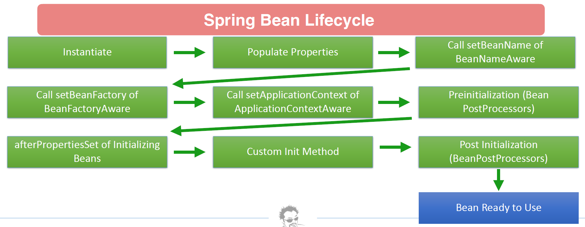
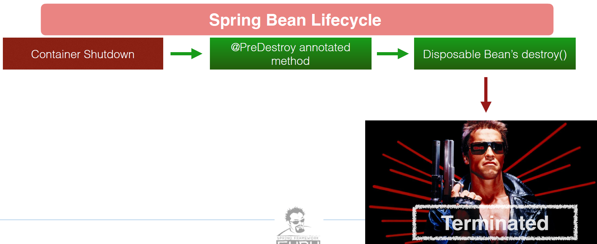
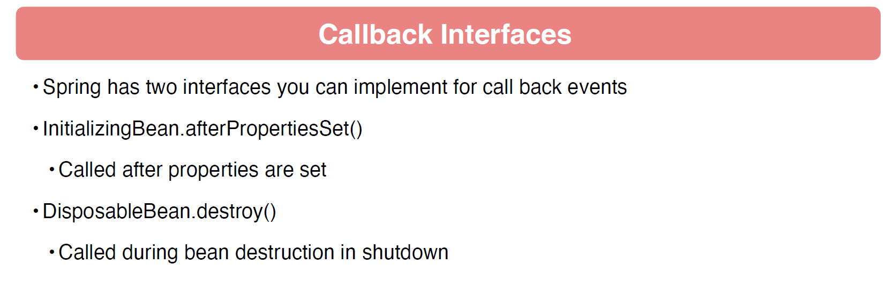
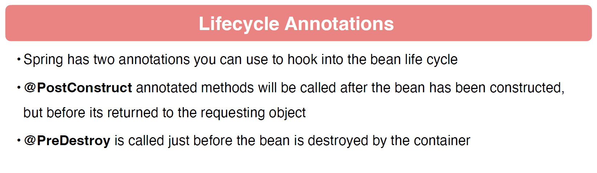
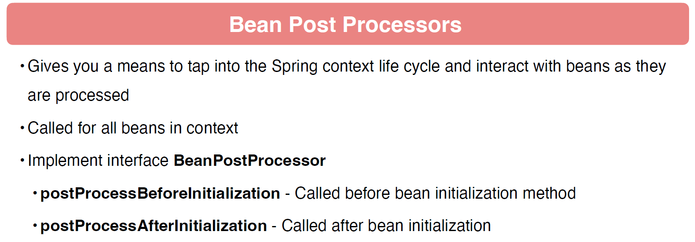
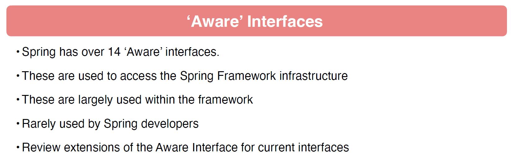
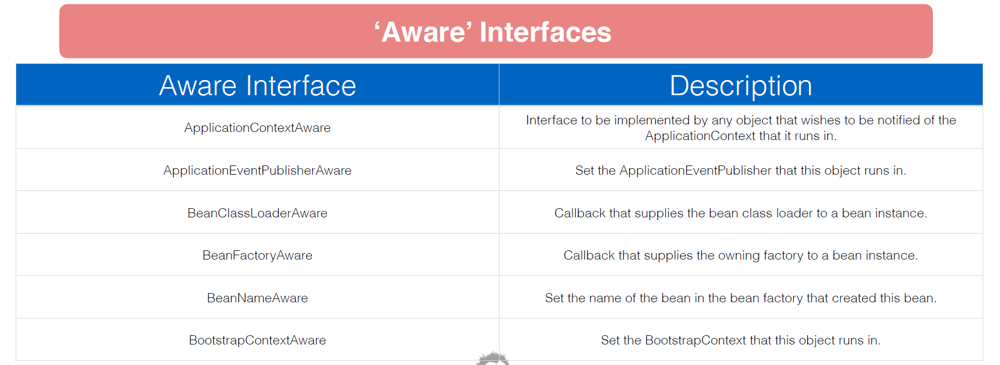
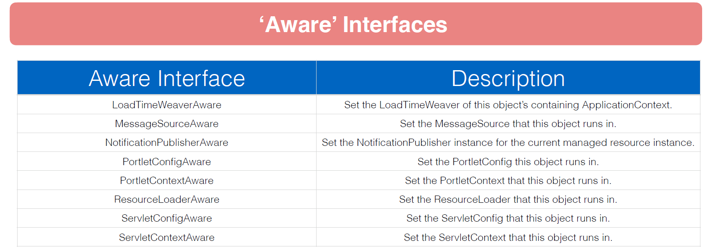

# 03 - Dependency Injection with Spring
## 001 Introduction

## 002 SOLID Principles of OOP


## 003 The Spring Context
```java
package com.wchamara.spring6di.controller;

import org.springframework.stereotype.Controller;

/**
 * Controller class that handles requests and returns responses.
 */
@Controller
public class MyController {

    /**
     * Method that prints a message to the console and returns a greeting.
     *
     * @return A greeting message "Hello World!"
     */
    public String sayHello() {
        System.out.println("I am the Controller");
        return "Hello World!";
    }

}
```

```java
package com.wchamara.spring6di;

import com.wchamara.spring6di.controller.MyController;
import org.springframework.boot.SpringApplication;
import org.springframework.boot.autoconfigure.SpringBootApplication;
import org.springframework.context.ConfigurableApplicationContext;

/**
 * The main application class for the Spring Boot application.
 */
@SpringBootApplication
public class Spring6DiApplication {

    /**
     * The main method which serves as the entry point for the Spring Boot application.
     *
     * @param args Command line arguments
     */
    public static void main(String[] args) {

        // Start the Spring application and obtain the application context
        ConfigurableApplicationContext context = SpringApplication.run(Spring6DiApplication.class, args);

        // Retrieve the MyController bean from the application context
        MyController myController = context.getBean(MyController.class);

        // Call the sayHello method of MyController and store the result
        String greeting = myController.sayHello();

        // Print the greeting to the console
        System.out.println(greeting);
    }

}
```

## 004 Spring Test Context
```java
package com.wchamara.spring6di;

import com.wchamara.spring6di.controller.MyController;
import org.junit.jupiter.api.Test;
import org.springframework.beans.factory.annotation.Autowired;
import org.springframework.boot.test.context.SpringBootTest;
import org.springframework.context.ApplicationContext;

/**
 * Test class for the Spring6DiApplication.
 */
@SpringBootTest
class Spring6DiApplicationTests {

    /**
     * The application context used for retrieving beans.
     */
    @Autowired
    private ApplicationContext context;

    /**
     * The MyController bean used for testing.
     */
    @Autowired
    private MyController myController;

    /**
     * Test method to verify that the MyController bean can be retrieved from the application context.
     */
    @Test
    void testGetControllerFromContext() {
        // Retrieve the MyController bean from the application context
        MyController myController = context.getBean(MyController.class);

        // Call the sayHello method of MyController and store the result
        String greeting = myController.sayHello();

        // Print the greeting to the console
        System.out.println(greeting);
    }

    /**
     * Test method to verify that the MyController bean can be autowired and used.
     */
    @Test
    void testGetControllerFromAutowired() {
        // Call the sayHello method of MyController and store the result
        String greeting = myController.sayHello();

        // Print the greeting to the console
        System.out.println(greeting);
    }
}
```

## 005 Basics of Dependency Injection


## 006 Dependencies Without Injection
```java
package com.wchamara.spring6di.service;

public interface GreetingService {
    String sayGreeting();
}

```
```java
package com.wchamara.spring6di.service;

public class GreetingServiceImpl implements GreetingService {
    @Override
    public String sayGreeting() {
        return "Hello Every One From Base Greeting Service";
    }
}

```
```java
package com.wchamara.spring6di.controller;

import com.wchamara.spring6di.service.GreetingService;
import com.wchamara.spring6di.service.GreetingServiceImpl;
import org.springframework.stereotype.Controller;

/**
 * Controller class that handles requests and returns responses.
 */
@Controller
public class MyController {


    /**
     * Represents a controller class that handles requests and returns responses.
     * This class is responsible for handling the business logic related to greetings.
     */
    private final GreetingService greetingService;

    /**
     * This class represents a controller that handles requests and returns responses.
     * It is responsible for managing the flow of data between the user interface and the business logic.
     */
    public MyController() {
        this.greetingService = new GreetingServiceImpl();
    }


    /**
     * Method that prints a message to the console and returns a greeting.
     *
     * @return A greeting message "Hello World!"
     */
    public String sayHello() {
        System.out.println("I am the Controller");
        return greetingService.sayGreeting();
    }

}
```
```java
package com.wchamara.spring6di.controller;

import org.junit.jupiter.api.Test;

class MyControllerTest {

    @Test
    void sayHello() {
        MyController myController = new MyController();

        System.out.println(myController.sayHello());
    }

}
```

## 007 Dependency Injection without Spring
```java
package com.wchamara.spring6di.controller;

import com.wchamara.spring6di.service.GreetingService;

public class PropertyInjectedController {

    public GreetingService greetingService;

    public String sayGreeting() {
        return greetingService.sayGreeting();
    }

}

```
```java
package com.wchamara.spring6di.controller;

import com.wchamara.spring6di.service.GreetingServiceImpl;
import org.junit.jupiter.api.BeforeEach;
import org.junit.jupiter.api.Test;

class PropertyInjectedControllerTest {

    PropertyInjectedController controller;

    @BeforeEach
    void setUp() {
        controller = new PropertyInjectedController();
        controller.greetingService = new GreetingServiceImpl();
    }

    @Test
    void sayGreeting() {
        System.out.println(controller.sayGreeting());
    }
}
```
```java
package com.wchamara.spring6di.controller;

import com.wchamara.spring6di.service.GreetingService;

public class SetterInjectedController {

    private GreetingService greetingService;

    public void setGreetingService(GreetingService greetingService) {
        this.greetingService = greetingService;
    }

    public String sayGreeting() {
        return greetingService.sayGreeting();
    }
}

```
```java
package com.wchamara.spring6di.controller;

import com.wchamara.spring6di.service.GreetingServiceImpl;
import org.junit.jupiter.api.BeforeEach;
import org.junit.jupiter.api.Test;

class SetterInjectedControllerTest {

    SetterInjectedController controller;

    @BeforeEach
    void setUp() {
        controller = new SetterInjectedController();
        controller.setGreetingService(new GreetingServiceImpl());
    }

    @Test
    void setterControllerTest() {
        System.out.println(controller.sayGreeting());
    }

}
```
```java
package com.wchamara.spring6di.controller;

import com.wchamara.spring6di.service.GreetingService;

public class ConstructorInjectedController {

    GreetingService greetingService;

    public ConstructorInjectedController(GreetingService greetingService) {
        this.greetingService = greetingService;
    }

    public String sayGreeting() {
        return greetingService.sayGreeting();
    }

}

```
```java
package com.wchamara.spring6di.controller;

import com.wchamara.spring6di.service.GreetingServiceImpl;
import org.junit.jupiter.api.BeforeEach;
import org.junit.jupiter.api.Test;

class ConstructorInjectedControllerTest {

    ConstructorInjectedController controller;

    @BeforeEach
    void setUp() {
        controller = new ConstructorInjectedController(new GreetingServiceImpl());
    }

    @Test
    void sayGreeting() {
        System.out.println(controller.sayGreeting());
    }
}
```

## 008 Dependency Injection using Spring Framework
```java
package com.wchamara.spring6di.controller;

import com.wchamara.spring6di.service.GreetingService;
import org.springframework.stereotype.Controller;

@Controller
public class ConstructorInjectedController {

    GreetingService greetingService;

    public ConstructorInjectedController(GreetingService greetingService) {
        this.greetingService = greetingService;
    }

    public String sayGreeting() {
        return greetingService.sayGreeting();
    }

}

```
```java
package com.wchamara.spring6di.service;

import org.springframework.stereotype.Service;

@Service
public class GreetingServiceImpl implements GreetingService {

    @Override
    public String sayGreeting() {
        return "Hello Every One From Base Greeting Service";
    }
}

```
```java
package com.wchamara.spring6di.controller;

import com.wchamara.spring6di.service.GreetingService;
import org.springframework.beans.factory.annotation.Autowired;
import org.springframework.stereotype.Controller;

@Controller
public class PropertyInjectedController {
    
    @Autowired
    public GreetingService greetingService;

    public String sayGreeting() {
        return greetingService.sayGreeting();
    }

}

```
```java
package com.wchamara.spring6di.controller;

import org.junit.jupiter.api.Test;
import org.springframework.beans.factory.annotation.Autowired;
import org.springframework.boot.test.context.SpringBootTest;

@SpringBootTest
class PropertyInjectedControllerTest {

    @Autowired
    PropertyInjectedController controller;

    @Test
    void sayGreeting() {
        System.out.println(controller.sayGreeting());
    }
}
```
```java
package com.wchamara.spring6di.controller;

import com.wchamara.spring6di.service.GreetingService;
import org.springframework.beans.factory.annotation.Autowired;
import org.springframework.stereotype.Controller;

@Controller
public class SetterInjectedController {

    private GreetingService greetingService;

    @Autowired
    public void setGreetingService(GreetingService greetingService) {
        this.greetingService = greetingService;
    }

    public String sayGreeting() {
        return greetingService.sayGreeting();
    }
}

```
```java
package com.wchamara.spring6di.controller;

import org.junit.jupiter.api.Test;
import org.springframework.beans.factory.annotation.Autowired;
import org.springframework.boot.test.context.SpringBootTest;

@SpringBootTest
class SetterInjectedControllerTest {

    @Autowired
    SetterInjectedController controller;


    @Test
    void setterControllerTest() {
        System.out.println(controller.sayGreeting());
    }

}
```
```java
package com.wchamara.spring6di.controller;

import org.junit.jupiter.api.Test;
import org.springframework.beans.factory.annotation.Autowired;
import org.springframework.boot.test.context.SpringBootTest;

@SpringBootTest
class ConstructorInjectedControllerTest {

    @Autowired
    ConstructorInjectedController controller;

    @Test
    void sayGreeting() {
        System.out.println(controller.sayGreeting());
    }
}
```


## 009 Primary Beans

```java
package com.wchamara.spring6di.service;

import org.springframework.context.annotation.Primary;
import org.springframework.stereotype.Service;

@Service
@Primary
public class PrimaryGreetingServiceImpl implements GreetingService {
    /**
     * @return
     */
    @Override
    public String sayGreeting() {
        return "Hello From Primary Greeting Service";
    }
}
```
## 010 Using Qualifiers
```java
package com.wchamara.spring6di.service;

import org.springframework.stereotype.Service;

@Service
public class GreetingServicePropertyInject implements GreetingService {
    /**
     * @return
     */
    @Override
    public String sayGreeting() {
        return "Hello From Property Injected Greeting Service";
    }
}

``
```java
package com.wchamara.spring6di.service;

import org.springframework.stereotype.Service;

@Service
public class GreetingServiceSetterInjectImpl implements GreetingService {
    /**
     * @return
     */
    @Override
    public String sayGreeting() {
        return "Hello From Setter Injected Greeting Service";
    }
}

``
```java
package com.wchamara.spring6di.service;

import org.springframework.stereotype.Service;

@Service
public class GreetingServiceConstructorInjectImpl implements GreetingService {
    /**
     * @return
     */
    @Override
    public String sayGreeting() {
        return "Hello From Constructor Injected Greeting Service";
    }
}

``
```java
package com.wchamara.spring6di.controller;

import com.wchamara.spring6di.service.GreetingService;
import org.springframework.beans.factory.annotation.Autowired;
import org.springframework.beans.factory.annotation.Qualifier;
import org.springframework.stereotype.Controller;

@Controller
public class PropertyInjectedController {

    @Autowired
    @Qualifier("greetingServicePropertyInject")
    public GreetingService greetingService;

    public String sayGreeting() {
        return greetingService.sayGreeting();
    }

}

``
```java
package com.wchamara.spring6di.controller;

import com.wchamara.spring6di.service.GreetingService;
import org.springframework.beans.factory.annotation.Autowired;
import org.springframework.beans.factory.annotation.Qualifier;
import org.springframework.stereotype.Controller;

@Controller
public class SetterInjectedController {

    private GreetingService greetingService;

    @Autowired
    public void setGreetingService(@Qualifier("greetingServiceSetterInjectImpl") GreetingService greetingService) {
        this.greetingService = greetingService;
    }

    public String sayGreeting() {
        return greetingService.sayGreeting();
    }
}

``
```java
package com.wchamara.spring6di.controller;

import com.wchamara.spring6di.service.GreetingService;
import org.springframework.beans.factory.annotation.Qualifier;
import org.springframework.stereotype.Controller;

@Controller
public class ConstructorInjectedController {

    GreetingService greetingService;

    public ConstructorInjectedController(@Qualifier("greetingServiceConstructorInjectImpl") GreetingService greetingService) {
        this.greetingService = greetingService;
    }

    public String sayGreeting() {
        return greetingService.sayGreeting();
    }

}

``


## 011 Spring Profiles
```java
package com.wchamara.spring6di.service.i18n;

import com.wchamara.spring6di.service.GreetingService;
import org.springframework.context.annotation.Profile;
import org.springframework.stereotype.Service;

@Profile({"EN", "default"})
@Service("i18nService")
public class EnglishGreetingService implements GreetingService {
    @Override
    public String sayGreeting() {
        return "Hello Every One From English Greeting Service";
    }
}
```
```java
package com.wchamara.spring6di.service.i18n;

import com.wchamara.spring6di.service.GreetingService;
import org.springframework.context.annotation.Profile;
import org.springframework.stereotype.Service;

@Profile("DE")
@Service("i18nService")
public class GermanGreetingService implements GreetingService {
    /**
     * @return
     */
    @Override
    public String sayGreeting() {
        return "Hallo Jeder von Deutscher Grußdienst";
    }
}

```
```java
package com.wchamara.spring6di.service.i18n;

import com.wchamara.spring6di.service.GreetingService;
import org.springframework.context.annotation.Profile;
import org.springframework.stereotype.Service;

@Profile({"EN", "default"})
@Service("i18nService")
public class EnglishGreetingService implements GreetingService {
    @Override
    public String sayGreeting() {
        return "Hello Every One From English Greeting Service";
    }
}

```
```java
package com.wchamara.spring6di.service.i18n;

import com.wchamara.spring6di.service.GreetingService;
import org.springframework.context.annotation.Profile;
import org.springframework.stereotype.Service;

@Profile("DE")
@Service("i18nService")
public class GermanGreetingService implements GreetingService {
    /**
     * @return
     */
    @Override
    public String sayGreeting() {
        return "Hallo Jeder von Deutscher Grußdienst";
    }
}

```
```java
package com.wchamara.spring6di.service.i18n;

import com.wchamara.spring6di.controller.MyI18nController;
import org.junit.jupiter.api.Test;
import org.springframework.beans.factory.annotation.Autowired;
import org.springframework.boot.test.context.SpringBootTest;
import org.springframework.test.context.ActiveProfiles;

@ActiveProfiles("EN")
@SpringBootTest
class GermanGreetingServiceTest {

    @Autowired
    MyI18nController myI18nController;

    @Test
    void getGreeting() {
        System.out.println(myI18nController.sayHello());
    }
}
```

## 012 Default Profile

```java
package com.wchamara.spring6di.service.i18n;

import com.wchamara.spring6di.service.GreetingService;
import org.springframework.context.annotation.Profile;
import org.springframework.stereotype.Service;

@Profile({"EN", "default"})
@Service("i18nService")
public class EnglishGreetingService implements GreetingService {
    @Override
    public String sayGreeting() {
        return "Hello Every One From English Greeting Service";
    }
}

```

## 013 Spring Bean Life Cycle









## 014 Spring Bean Life Cycle Demo

```java
package com.wchamara.spring6di.controller;

import com.wchamara.spring6di.service.GreetingService;
import com.wchamara.spring6di.service.GreetingServiceImpl;
import org.springframework.stereotype.Controller;

/**
 * Controller class that handles requests and returns responses.
 */
@Controller
public class MyController {


    /**
     * Represents a controller class that handles requests and returns responses.
     * This class is responsible for handling the business logic related to greetings.
     */
    private final GreetingService greetingService;

    /**
     * This class represents a controller that handles requests and returns responses.
     * It is responsible for managing the flow of data between the user interface and the business logic.
     */
    public MyController() {
        this.greetingService = new GreetingServiceImpl();
    }


    /**
     * Method that prints a message to the console and returns a greeting.
     *
     * @return A greeting message "Hello World!"
     */
    public String sayHello() {
        System.out.println("I am the Controller");
        return greetingService.sayGreeting();
    }

    public void beforeInit() {
        System.out.println("Before Init - Called by Bean Post Processor");
    }

    public void afterInit() {
        System.out.println("After Init - Called by Bean Post Processor");
    }
}
```
```java
package com.wchamara.spring6di.service;

import com.wchamara.spring6di.controller.MyController;
import jakarta.annotation.PostConstruct;
import jakarta.annotation.PreDestroy;
import org.springframework.beans.BeansException;
import org.springframework.beans.factory.*;
import org.springframework.beans.factory.annotation.Value;
import org.springframework.beans.factory.config.BeanPostProcessor;
import org.springframework.context.ApplicationContext;
import org.springframework.context.ApplicationContextAware;
import org.springframework.stereotype.Component;


@Component
public class LifeCycleDemoBean implements InitializingBean, DisposableBean, BeanNameAware,
        BeanFactoryAware, ApplicationContextAware, BeanPostProcessor {

    public LifeCycleDemoBean() {
        System.out.println("## I'm in the LifeCycleBean Constructor ##");
    }

    private String javaVer;

    @Value("${java.specification.version}")
    public void setJavaVer(String javaVer) {
        this.javaVer = javaVer;
        System.out.println("## 1 Properties Set. Java Ver: " + this.javaVer);
    }

    @Override
    public void setBeanName(String name) {
        System.out.println("## 2 BeanNameAware My Bean Name is: " + name);
    }

    @Override
    public void setBeanFactory(BeanFactory beanFactory) throws BeansException {
        System.out.println("## 3 BeanFactoryAware - Bean Factory has been set");
    }

    @Override
    public void setApplicationContext(ApplicationContext applicationContext) throws BeansException {
        System.out.println("## 4 ApplicationContextAware - Application context has been set");
    }

    @PostConstruct
    public void postConstruct() {
        System.out.println("## 5 postConstruct The Post Construct annotated method has been called");
    }

    @Override
    public void afterPropertiesSet() throws Exception {
        System.out.println("## 6 afterPropertiesSet Populate Properties The LifeCycleBean has its properties set!");
    }

    @PreDestroy
    public void preDestroy() {
        System.out.println("## 7 The @PreDestroy annotated method has been called");
    }

    @Override
    public void destroy() throws Exception {
        System.out.println("## 8 DisposableBean.destroy The Lifecycle bean has been terminated");
    }

    @Override
    public Object postProcessBeforeInitialization(Object bean, String beanName) throws BeansException {
        System.out.println("## postProcessBeforeInitialization: " + beanName);

        if (bean instanceof MyController) {
            MyController myController = (MyController) bean;
            System.out.println("Calling before init");
            myController.beforeInit();
        }

        return BeanPostProcessor.super.postProcessBeforeInitialization(bean, beanName);
    }

    @Override
    public Object postProcessAfterInitialization(Object bean, String beanName) throws BeansException {
        System.out.println("## postProcessAfterInitialization: " + beanName);

        if (bean instanceof MyController) {
            MyController myController = (MyController) bean;
            System.out.println("Calling after init");
            myController.afterInit();
        }

        return BeanPostProcessor.super.postProcessAfterInitialization(bean, beanName);
    }


}
```

```shell
## I'm in the LifeCycleBean Constructor ##
## 1 Properties Set. Java Ver: 21
## 2 BeanNameAware My Bean Name is: lifeCycleDemoBean
## 3 BeanFactoryAware - Bean Factory has been set
## 4 ApplicationContextAware - Application context has been set
## 5 postConstruct The Post Construct annotated method has been called
## 6 afterPropertiesSet Populate Properties The LifeCycleBean has its properties set!
## postProcessBeforeInitialization: spring6DiApplication
## postProcessAfterInitialization: spring6DiApplication
## postProcessBeforeInitialization: greetingServiceConstructorInjectImpl
## postProcessAfterInitialization: greetingServiceConstructorInjectImpl
## postProcessBeforeInitialization: constructorInjectedController
## postProcessAfterInitialization: constructorInjectedController
## postProcessBeforeInitialization: myController
Calling before init
Before Init - Called by Bean Post Processor
## postProcessAfterInitialization: myController
Calling after init
After Init - Called by Bean Post Processor
## postProcessBeforeInitialization: i18nService
## postProcessAfterInitialization: i18nService
## postProcessBeforeInitialization: myI18nController
## postProcessAfterInitialization: myI18nController
## postProcessBeforeInitialization: greetingServicePropertyInject
## postProcessAfterInitialization: greetingServicePropertyInject
## postProcessBeforeInitialization: propertyInjectedController
## postProcessAfterInitialization: propertyInjectedController
## postProcessBeforeInitialization: greetingServiceSetterInjectImpl
## postProcessAfterInitialization: greetingServiceSetterInjectImpl
## postProcessBeforeInitialization: setterInjectedController
## postProcessAfterInitialization: setterInjectedController
## postProcessBeforeInitialization: greetingServiceImpl
## postProcessAfterInitialization: greetingServiceImpl
## postProcessBeforeInitialization: primaryGreetingServiceImpl
## postProcessAfterInitialization: primaryGreetingServiceImpl
## postProcessBeforeInitialization: org.springframework.boot.autoconfigure.AutoConfigurationPackages
## postProcessAfterInitialization: org.springframework.boot.autoconfigure.AutoConfigurationPackages
## postProcessBeforeInitialization: org.springframework.boot.autoconfigure.context.PropertyPlaceholderAutoConfiguration
## postProcessAfterInitialization: org.springframework.boot.autoconfigure.context.PropertyPlaceholderAutoConfiguration
## postProcessBeforeInitialization: org.springframework.boot.autoconfigure.aop.AopAutoConfiguration$ClassProxyingConfiguration
## postProcessAfterInitialization: org.springframework.boot.autoconfigure.aop.AopAutoConfiguration$ClassProxyingConfiguration
## postProcessBeforeInitialization: org.springframework.boot.autoconfigure.aop.AopAutoConfiguration
## postProcessAfterInitialization: org.springframework.boot.autoconfigure.aop.AopAutoConfiguration
## postProcessBeforeInitialization: org.springframework.boot.autoconfigure.availability.ApplicationAvailabilityAutoConfiguration
## postProcessAfterInitialization: org.springframework.boot.autoconfigure.availability.ApplicationAvailabilityAutoConfiguration
## postProcessBeforeInitialization: applicationAvailability
## postProcessAfterInitialization: applicationAvailability
## postProcessBeforeInitialization: org.springframework.boot.autoconfigure.context.ConfigurationPropertiesAutoConfiguration
## postProcessAfterInitialization: org.springframework.boot.autoconfigure.context.ConfigurationPropertiesAutoConfiguration
## postProcessBeforeInitialization: org.springframework.boot.context.properties.BoundConfigurationProperties
## postProcessAfterInitialization: org.springframework.boot.context.properties.BoundConfigurationProperties
## postProcessBeforeInitialization: org.springframework.boot.context.properties.EnableConfigurationPropertiesRegistrar.methodValidationExcludeFilter
## postProcessAfterInitialization: org.springframework.boot.context.properties.EnableConfigurationPropertiesRegistrar.methodValidationExcludeFilter
## postProcessBeforeInitialization: org.springframework.boot.autoconfigure.context.LifecycleAutoConfiguration
## postProcessAfterInitialization: org.springframework.boot.autoconfigure.context.LifecycleAutoConfiguration
## postProcessBeforeInitialization: spring.lifecycle-org.springframework.boot.autoconfigure.context.LifecycleProperties
## postProcessAfterInitialization: spring.lifecycle-org.springframework.boot.autoconfigure.context.LifecycleProperties
## postProcessBeforeInitialization: lifecycleProcessor
## postProcessAfterInitialization: lifecycleProcessor
## postProcessBeforeInitialization: spring.info-org.springframework.boot.autoconfigure.info.ProjectInfoProperties
## postProcessAfterInitialization: spring.info-org.springframework.boot.autoconfigure.info.ProjectInfoProperties
## postProcessBeforeInitialization: org.springframework.boot.autoconfigure.info.ProjectInfoAutoConfiguration
## postProcessAfterInitialization: org.springframework.boot.autoconfigure.info.ProjectInfoAutoConfiguration
## postProcessBeforeInitialization: org.springframework.boot.autoconfigure.sql.init.SqlInitializationAutoConfiguration
## postProcessAfterInitialization: org.springframework.boot.autoconfigure.sql.init.SqlInitializationAutoConfiguration
## postProcessBeforeInitialization: spring.sql.init-org.springframework.boot.autoconfigure.sql.init.SqlInitializationProperties
## postProcessAfterInitialization: spring.sql.init-org.springframework.boot.autoconfigure.sql.init.SqlInitializationProperties
## postProcessBeforeInitialization: spring.ssl-org.springframework.boot.autoconfigure.ssl.SslProperties
## postProcessAfterInitialization: spring.ssl-org.springframework.boot.autoconfigure.ssl.SslProperties
## postProcessBeforeInitialization: org.springframework.boot.autoconfigure.ssl.SslAutoConfiguration
## postProcessAfterInitialization: org.springframework.boot.autoconfigure.ssl.SslAutoConfiguration
## postProcessBeforeInitialization: fileWatcher
## postProcessAfterInitialization: fileWatcher
## postProcessBeforeInitialization: sslPropertiesSslBundleRegistrar
## postProcessAfterInitialization: sslPropertiesSslBundleRegistrar
## postProcessBeforeInitialization: sslBundleRegistry
## postProcessAfterInitialization: sslBundleRegistry
## postProcessBeforeInitialization: org.springframework.boot.autoconfigure.task.TaskExecutorConfigurations$ThreadPoolTaskExecutorBuilderConfiguration
## postProcessAfterInitialization: org.springframework.boot.autoconfigure.task.TaskExecutorConfigurations$ThreadPoolTaskExecutorBuilderConfiguration
## postProcessBeforeInitialization: spring.task.execution-org.springframework.boot.autoconfigure.task.TaskExecutionProperties
## postProcessAfterInitialization: spring.task.execution-org.springframework.boot.autoconfigure.task.TaskExecutionProperties
## postProcessBeforeInitialization: threadPoolTaskExecutorBuilder
## postProcessAfterInitialization: threadPoolTaskExecutorBuilder
## postProcessBeforeInitialization: org.springframework.boot.autoconfigure.task.TaskExecutorConfigurations$TaskExecutorBuilderConfiguration
## postProcessAfterInitialization: org.springframework.boot.autoconfigure.task.TaskExecutorConfigurations$TaskExecutorBuilderConfiguration
## postProcessBeforeInitialization: taskExecutorBuilder
## postProcessAfterInitialization: taskExecutorBuilder
## postProcessBeforeInitialization: org.springframework.boot.autoconfigure.task.TaskExecutorConfigurations$SimpleAsyncTaskExecutorBuilderConfiguration
## postProcessAfterInitialization: org.springframework.boot.autoconfigure.task.TaskExecutorConfigurations$SimpleAsyncTaskExecutorBuilderConfiguration
## postProcessBeforeInitialization: simpleAsyncTaskExecutorBuilder
## postProcessAfterInitialization: simpleAsyncTaskExecutorBuilder
## postProcessBeforeInitialization: org.springframework.boot.autoconfigure.task.TaskExecutorConfigurations$TaskExecutorConfiguration
## postProcessAfterInitialization: org.springframework.boot.autoconfigure.task.TaskExecutorConfigurations$TaskExecutorConfiguration
## postProcessBeforeInitialization: org.springframework.boot.autoconfigure.task.TaskExecutionAutoConfiguration
## postProcessAfterInitialization: org.springframework.boot.autoconfigure.task.TaskExecutionAutoConfiguration
## postProcessBeforeInitialization: org.springframework.boot.autoconfigure.task.TaskSchedulingConfigurations$ThreadPoolTaskSchedulerBuilderConfiguration
## postProcessAfterInitialization: org.springframework.boot.autoconfigure.task.TaskSchedulingConfigurations$ThreadPoolTaskSchedulerBuilderConfiguration
## postProcessBeforeInitialization: spring.task.scheduling-org.springframework.boot.autoconfigure.task.TaskSchedulingProperties
## postProcessAfterInitialization: spring.task.scheduling-org.springframework.boot.autoconfigure.task.TaskSchedulingProperties
## postProcessBeforeInitialization: threadPoolTaskSchedulerBuilder
## postProcessAfterInitialization: threadPoolTaskSchedulerBuilder
## postProcessBeforeInitialization: org.springframework.boot.autoconfigure.task.TaskSchedulingConfigurations$TaskSchedulerBuilderConfiguration
## postProcessAfterInitialization: org.springframework.boot.autoconfigure.task.TaskSchedulingConfigurations$TaskSchedulerBuilderConfiguration
## postProcessBeforeInitialization: taskSchedulerBuilder
## postProcessAfterInitialization: taskSchedulerBuilder
## postProcessBeforeInitialization: org.springframework.boot.autoconfigure.task.TaskSchedulingConfigurations$SimpleAsyncTaskSchedulerBuilderConfiguration
## postProcessAfterInitialization: org.springframework.boot.autoconfigure.task.TaskSchedulingConfigurations$SimpleAsyncTaskSchedulerBuilderConfiguration
## postProcessBeforeInitialization: simpleAsyncTaskSchedulerBuilder
## postProcessAfterInitialization: simpleAsyncTaskSchedulerBuilder
## postProcessBeforeInitialization: org.springframework.boot.autoconfigure.task.TaskSchedulingAutoConfiguration
## postProcessAfterInitialization: org.springframework.boot.autoconfigure.task.TaskSchedulingAutoConfiguration
## postProcessBeforeInitialization: applicationTaskExecutor
## postProcessAfterInitialization: applicationTaskExecutor
2024-08-10T15:05:20.068+05:30  INFO 31864 --- [spring-6-di] [           main] c.w.spring6di.Spring6DiApplicationTests  : Started Spring6DiApplicationTests in 0.605 seconds (process running for 1.244)
## postProcessBeforeInitialization: com.wchamara.spring6di.Spring6DiApplicationTests.ORIGINAL
## postProcessAfterInitialization: com.wchamara.spring6di.Spring6DiApplicationTests.ORIGINAL
WARNING: A Java agent has been loaded dynamically (C:\Users\chama\.m2\repository\net\bytebuddy\byte-buddy-agent\1.14.18\byte-buddy-agent-1.14.18.jar)
WARNING: If a serviceability tool is in use, please run with -XX:+EnableDynamicAgentLoading to hide this warning
WARNING: If a serviceability tool is not in use, please run with -Djdk.instrument.traceUsage for more information
WARNING: Dynamic loading of agents will be disallowed by default in a future release
OpenJDK 64-Bit Server VM warning: Sharing is only supported for boot loader classes because bootstrap classpath has been appended
I am the Controller
Hello Every One From Base Greeting Service
## 7 The @PreDestroy annotated method has been called
## 8 DisposableBean.destroy The Lifecycle bean has been terminated
```