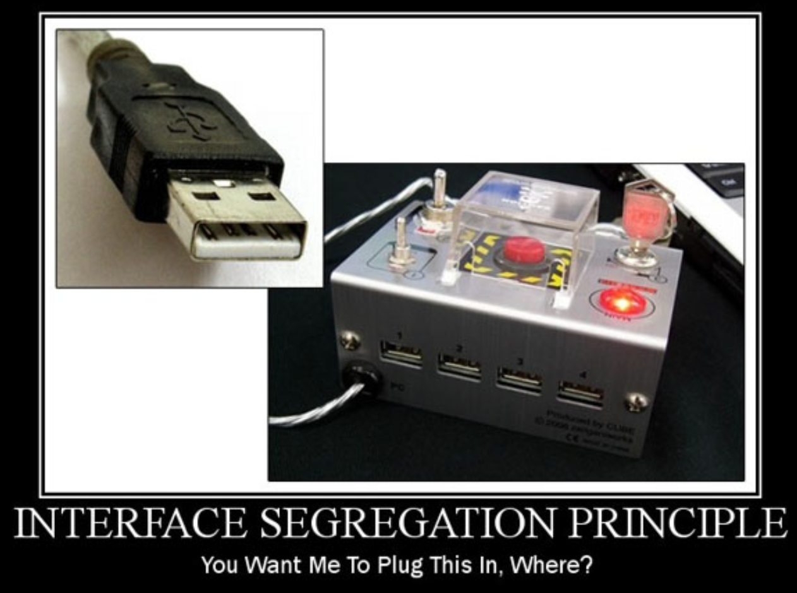

# 03 - Dependency Injection with Spring
## 001 Introduction

## 002 SOLID Principles of OOP





## 003 The Spring Context
```java
package com.wchamara.spring6di.controller;

import org.springframework.stereotype.Controller;

/**
 * Controller class that handles requests and returns responses.
 */
@Controller
public class MyController {

    /**
     * Method that prints a message to the console and returns a greeting.
     *
     * @return A greeting message "Hello World!"
     */
    public String sayHello() {
        System.out.println("I am the Controller");
        return "Hello World!";
    }

}
```

```java
package com.wchamara.spring6di;

import com.wchamara.spring6di.controller.MyController;
import org.springframework.boot.SpringApplication;
import org.springframework.boot.autoconfigure.SpringBootApplication;
import org.springframework.context.ConfigurableApplicationContext;

/**
 * The main application class for the Spring Boot application.
 */
@SpringBootApplication
public class Spring6DiApplication {

    /**
     * The main method which serves as the entry point for the Spring Boot application.
     *
     * @param args Command line arguments
     */
    public static void main(String[] args) {

        // Start the Spring application and obtain the application context
        ConfigurableApplicationContext context = SpringApplication.run(Spring6DiApplication.class, args);

        // Retrieve the MyController bean from the application context
        MyController myController = context.getBean(MyController.class);

        // Call the sayHello method of MyController and store the result
        String greeting = myController.sayHello();

        // Print the greeting to the console
        System.out.println(greeting);
    }

}
```

## 004 Spring Test Context
```java
package com.wchamara.spring6di;

import com.wchamara.spring6di.controller.MyController;
import org.junit.jupiter.api.Test;
import org.springframework.beans.factory.annotation.Autowired;
import org.springframework.boot.test.context.SpringBootTest;
import org.springframework.context.ApplicationContext;

/**
 * Test class for the Spring6DiApplication.
 */
@SpringBootTest
class Spring6DiApplicationTests {

    /**
     * The application context used for retrieving beans.
     */
    @Autowired
    private ApplicationContext context;

    /**
     * The MyController bean used for testing.
     */
    @Autowired
    private MyController myController;

    /**
     * Test method to verify that the MyController bean can be retrieved from the application context.
     */
    @Test
    void testGetControllerFromContext() {
        // Retrieve the MyController bean from the application context
        MyController myController = context.getBean(MyController.class);

        // Call the sayHello method of MyController and store the result
        String greeting = myController.sayHello();

        // Print the greeting to the console
        System.out.println(greeting);
    }

    /**
     * Test method to verify that the MyController bean can be autowired and used.
     */
    @Test
    void testGetControllerFromAutowired() {
        // Call the sayHello method of MyController and store the result
        String greeting = myController.sayHello();

        // Print the greeting to the console
        System.out.println(greeting);
    }
}
```

## 005 Basics of Dependency Injection


## 006 Dependencies Without Injection


## 007 Dependency Injection without Spring


## 008 Dependency Injection using Spring Framework


## 009 Primary Beans


## 010 Using Qualifiers


## 011 Spring Profiles


## 012 Default Profile


## 013 Spring Bean Life Cycle


## 014 Spring Bean Life Cycle Demo