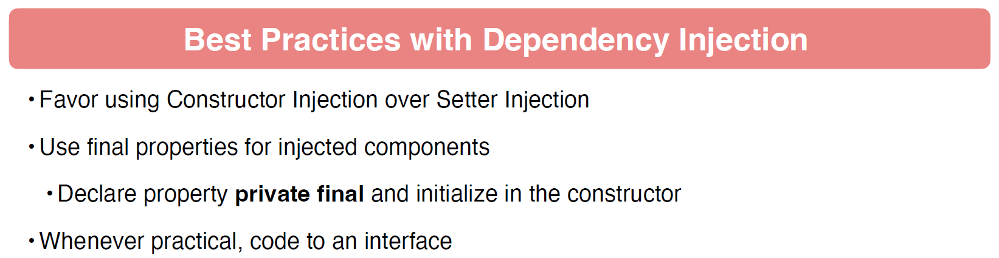

# 03 - Dependency Injection with Spring
## 001 Introduction

## 002 SOLID Principles of OOP


## 003 The Spring Context
```java
package com.wchamara.spring6di.controller;

import org.springframework.stereotype.Controller;

/**
 * Controller class that handles requests and returns responses.
 */
@Controller
public class MyController {

    /**
     * Method that prints a message to the console and returns a greeting.
     *
     * @return A greeting message "Hello World!"
     */
    public String sayHello() {
        System.out.println("I am the Controller");
        return "Hello World!";
    }

}
```

```java
package com.wchamara.spring6di;

import com.wchamara.spring6di.controller.MyController;
import org.springframework.boot.SpringApplication;
import org.springframework.boot.autoconfigure.SpringBootApplication;
import org.springframework.context.ConfigurableApplicationContext;

/**
 * The main application class for the Spring Boot application.
 */
@SpringBootApplication
public class Spring6DiApplication {

    /**
     * The main method which serves as the entry point for the Spring Boot application.
     *
     * @param args Command line arguments
     */
    public static void main(String[] args) {

        // Start the Spring application and obtain the application context
        ConfigurableApplicationContext context = SpringApplication.run(Spring6DiApplication.class, args);

        // Retrieve the MyController bean from the application context
        MyController myController = context.getBean(MyController.class);

        // Call the sayHello method of MyController and store the result
        String greeting = myController.sayHello();

        // Print the greeting to the console
        System.out.println(greeting);
    }

}
```

## 004 Spring Test Context
```java
package com.wchamara.spring6di;

import com.wchamara.spring6di.controller.MyController;
import org.junit.jupiter.api.Test;
import org.springframework.beans.factory.annotation.Autowired;
import org.springframework.boot.test.context.SpringBootTest;
import org.springframework.context.ApplicationContext;

/**
 * Test class for the Spring6DiApplication.
 */
@SpringBootTest
class Spring6DiApplicationTests {

    /**
     * The application context used for retrieving beans.
     */
    @Autowired
    private ApplicationContext context;

    /**
     * The MyController bean used for testing.
     */
    @Autowired
    private MyController myController;

    /**
     * Test method to verify that the MyController bean can be retrieved from the application context.
     */
    @Test
    void testGetControllerFromContext() {
        // Retrieve the MyController bean from the application context
        MyController myController = context.getBean(MyController.class);

        // Call the sayHello method of MyController and store the result
        String greeting = myController.sayHello();

        // Print the greeting to the console
        System.out.println(greeting);
    }

    /**
     * Test method to verify that the MyController bean can be autowired and used.
     */
    @Test
    void testGetControllerFromAutowired() {
        // Call the sayHello method of MyController and store the result
        String greeting = myController.sayHello();

        // Print the greeting to the console
        System.out.println(greeting);
    }
}
```

## 005 Basics of Dependency Injection



## 006 Dependencies Without Injection
```java
package com.wchamara.spring6di.service;

public interface GreetingService {
    String sayGreeting();
}

```
```java
package com.wchamara.spring6di.service;

public class GreetingServiceImpl implements GreetingService {
    @Override
    public String sayGreeting() {
        return "Hello Every One From Base Greeting Service";
    }
}

```
```java
package com.wchamara.spring6di.controller;

import com.wchamara.spring6di.service.GreetingService;
import com.wchamara.spring6di.service.GreetingServiceImpl;
import org.springframework.stereotype.Controller;

/**
 * Controller class that handles requests and returns responses.
 */
@Controller
public class MyController {


    /**
     * Represents a controller class that handles requests and returns responses.
     * This class is responsible for handling the business logic related to greetings.
     */
    private final GreetingService greetingService;

    /**
     * This class represents a controller that handles requests and returns responses.
     * It is responsible for managing the flow of data between the user interface and the business logic.
     */
    public MyController() {
        this.greetingService = new GreetingServiceImpl();
    }


    /**
     * Method that prints a message to the console and returns a greeting.
     *
     * @return A greeting message "Hello World!"
     */
    public String sayHello() {
        System.out.println("I am the Controller");
        return greetingService.sayGreeting();
    }

}
```
```java
package com.wchamara.spring6di.controller;

import org.junit.jupiter.api.Test;

class MyControllerTest {

    @Test
    void sayHello() {
        MyController myController = new MyController();

        System.out.println(myController.sayHello());
    }

}
```

## 007 Dependency Injection without Spring
```java
package com.wchamara.spring6di.controller;

import com.wchamara.spring6di.service.GreetingService;

public class PropertyInjectedController {

    public GreetingService greetingService;

    public String sayGreeting() {
        return greetingService.sayGreeting();
    }

}

```
```java
package com.wchamara.spring6di.controller;

import com.wchamara.spring6di.service.GreetingServiceImpl;
import org.junit.jupiter.api.BeforeEach;
import org.junit.jupiter.api.Test;

class PropertyInjectedControllerTest {

    PropertyInjectedController controller;

    @BeforeEach
    void setUp() {
        controller = new PropertyInjectedController();
        controller.greetingService = new GreetingServiceImpl();
    }

    @Test
    void sayGreeting() {
        System.out.println(controller.sayGreeting());
    }
}
```
```java
package com.wchamara.spring6di.controller;

import com.wchamara.spring6di.service.GreetingService;

public class SetterInjectedController {

    private GreetingService greetingService;

    public void setGreetingService(GreetingService greetingService) {
        this.greetingService = greetingService;
    }

    public String sayGreeting() {
        return greetingService.sayGreeting();
    }
}

```
```java
package com.wchamara.spring6di.controller;

import com.wchamara.spring6di.service.GreetingServiceImpl;
import org.junit.jupiter.api.BeforeEach;
import org.junit.jupiter.api.Test;

class SetterInjectedControllerTest {

    SetterInjectedController controller;

    @BeforeEach
    void setUp() {
        controller = new SetterInjectedController();
        controller.setGreetingService(new GreetingServiceImpl());
    }

    @Test
    void setterControllerTest() {
        System.out.println(controller.sayGreeting());
    }

}
```
```java
package com.wchamara.spring6di.controller;

import com.wchamara.spring6di.service.GreetingService;

public class ConstructorInjectedController {

    GreetingService greetingService;

    public ConstructorInjectedController(GreetingService greetingService) {
        this.greetingService = greetingService;
    }

    public String sayGreeting() {
        return greetingService.sayGreeting();
    }

}

```
```java
package com.wchamara.spring6di.controller;

import com.wchamara.spring6di.service.GreetingServiceImpl;
import org.junit.jupiter.api.BeforeEach;
import org.junit.jupiter.api.Test;

class ConstructorInjectedControllerTest {

    ConstructorInjectedController controller;

    @BeforeEach
    void setUp() {
        controller = new ConstructorInjectedController(new GreetingServiceImpl());
    }

    @Test
    void sayGreeting() {
        System.out.println(controller.sayGreeting());
    }
}
```

## 008 Dependency Injection using Spring Framework
```java
package com.wchamara.spring6di.controller;

import com.wchamara.spring6di.service.GreetingService;
import org.springframework.stereotype.Controller;

@Controller
public class ConstructorInjectedController {

    GreetingService greetingService;

    public ConstructorInjectedController(GreetingService greetingService) {
        this.greetingService = greetingService;
    }

    public String sayGreeting() {
        return greetingService.sayGreeting();
    }

}

```
```java
package com.wchamara.spring6di.service;

import org.springframework.stereotype.Service;

@Service
public class GreetingServiceImpl implements GreetingService {

    @Override
    public String sayGreeting() {
        return "Hello Every One From Base Greeting Service";
    }
}

```
```java
package com.wchamara.spring6di.controller;

import com.wchamara.spring6di.service.GreetingService;
import org.springframework.beans.factory.annotation.Autowired;
import org.springframework.stereotype.Controller;

@Controller
public class PropertyInjectedController {
    
    @Autowired
    public GreetingService greetingService;

    public String sayGreeting() {
        return greetingService.sayGreeting();
    }

}

```
```java
package com.wchamara.spring6di.controller;

import org.junit.jupiter.api.Test;
import org.springframework.beans.factory.annotation.Autowired;
import org.springframework.boot.test.context.SpringBootTest;

@SpringBootTest
class PropertyInjectedControllerTest {

    @Autowired
    PropertyInjectedController controller;

    @Test
    void sayGreeting() {
        System.out.println(controller.sayGreeting());
    }
}
```
```java
package com.wchamara.spring6di.controller;

import com.wchamara.spring6di.service.GreetingService;
import org.springframework.beans.factory.annotation.Autowired;
import org.springframework.stereotype.Controller;

@Controller
public class SetterInjectedController {

    private GreetingService greetingService;

    @Autowired
    public void setGreetingService(GreetingService greetingService) {
        this.greetingService = greetingService;
    }

    public String sayGreeting() {
        return greetingService.sayGreeting();
    }
}

```
```java
package com.wchamara.spring6di.controller;

import org.junit.jupiter.api.Test;
import org.springframework.beans.factory.annotation.Autowired;
import org.springframework.boot.test.context.SpringBootTest;

@SpringBootTest
class SetterInjectedControllerTest {

    @Autowired
    SetterInjectedController controller;


    @Test
    void setterControllerTest() {
        System.out.println(controller.sayGreeting());
    }

}
```
```java
package com.wchamara.spring6di.controller;

import org.junit.jupiter.api.Test;
import org.springframework.beans.factory.annotation.Autowired;
import org.springframework.boot.test.context.SpringBootTest;

@SpringBootTest
class ConstructorInjectedControllerTest {

    @Autowired
    ConstructorInjectedController controller;

    @Test
    void sayGreeting() {
        System.out.println(controller.sayGreeting());
    }
}
```


## 009 Primary Beans

```java
package com.wchamara.spring6di.service;

import org.springframework.context.annotation.Primary;
import org.springframework.stereotype.Service;

@Service
@Primary
public class PrimaryGreetingServiceImpl implements GreetingService {
    /**
     * @return
     */
    @Override
    public String sayGreeting() {
        return "Hello From Primary Greeting Service";
    }
}
```
## 010 Using Qualifiers


## 011 Spring Profiles


## 012 Default Profile


## 013 Spring Bean Life Cycle


## 014 Spring Bean Life Cycle Demo