# 05 - Project Lombok

## 001 Introduction
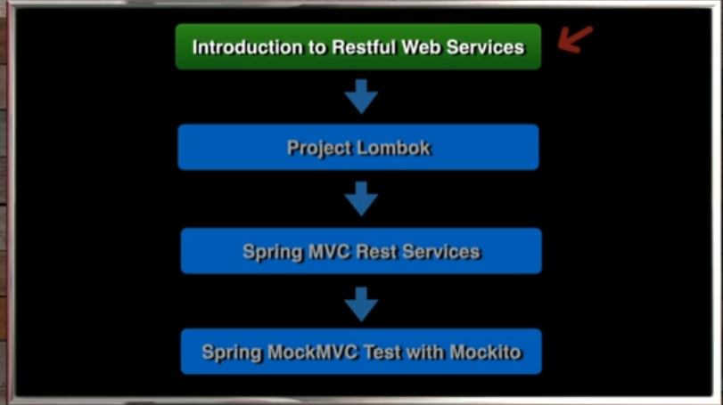
## 002 Create New Project
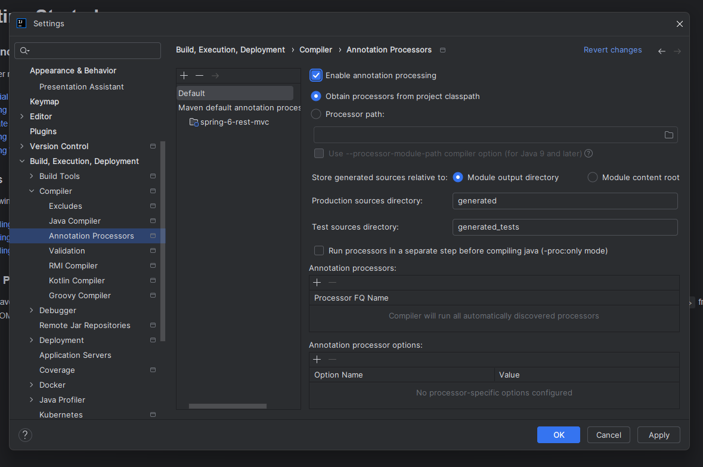
```xml
<?xml version="1.0" encoding="UTF-8"?>
<project xmlns="http://maven.apache.org/POM/4.0.0" xmlns:xsi="http://www.w3.org/2001/XMLSchema-instance"
         xsi:schemaLocation="http://maven.apache.org/POM/4.0.0 https://maven.apache.org/xsd/maven-4.0.0.xsd">
    <!-- Model version for the POM -->
    <modelVersion>4.0.0</modelVersion>
    
    <!-- Parent project information -->
    <parent>
        <groupId>org.springframework.boot</groupId>
        <artifactId>spring-boot-starter-parent</artifactId>
        <version>3.3.2</version>
        <relativePath/> <!-- lookup parent from repository -->
    </parent>
    
    <!-- Project coordinates -->
    <groupId>com.wchamara</groupId>
    <artifactId>spring-6-rest-mvc</artifactId>
    <version>0.0.1-SNAPSHOT</version>
    
    <!-- Project metadata -->
    <name>spring-6-rest-mvc</name>
    <description>spring-6-rest-mvc</description>
    <url/>
    
    <!-- Licensing information -->
    <licenses>
        <license/>
    </licenses>
    
    <!-- Developer information -->
    <developers>
        <developer/>
    </developers>
    
    <!-- Source control management information -->
    <scm>
        <connection/>
        <developerConnection/>
        <tag/>
        <url/>
    </scm>
    
    <!-- Project properties -->
    <properties>
        <java.version>21</java.version>
    </properties>
    
    <!-- Project dependencies -->
    <dependencies>
        <!-- Spring Boot Starter Web dependency -->
        <dependency>
            <groupId>org.springframework.boot</groupId>
            <artifactId>spring-boot-starter-web</artifactId>
        </dependency>

        <!-- Spring Boot DevTools dependency -->
        <dependency>
            <groupId>org.springframework.boot</groupId>
            <artifactId>spring-boot-devtools</artifactId>
            <scope>runtime</scope>
            <optional>true</optional>
        </dependency>
        
        <!-- Lombok dependency -->
        <dependency>
            <groupId>org.projectlombok</groupId>
            <artifactId>lombok</artifactId>
            <optional>true</optional>
        </dependency>
        
        <!-- Spring Boot Starter Test dependency -->
        <dependency>
            <groupId>org.springframework.boot</groupId>
            <artifactId>spring-boot-starter-test</artifactId>
            <scope>test</scope>
        </dependency>
    </dependencies>

    <!-- Build configuration -->
    <build>
        <plugins>
            <!-- Spring Boot Maven Plugin -->
            <plugin>
                <groupId>org.springframework.boot</groupId>
                <artifactId>spring-boot-maven-plugin</artifactId>
                <configuration>
                    <excludes>
                        <exclude>
                            <groupId>org.projectlombok</groupId>
                            <artifactId>lombok</artifactId>
                        </exclude>
                    </excludes>
                </configuration>
            </plugin>
        </plugins>
    </build>
</project>
```
## 002 NewProjectSpring6RestMVC
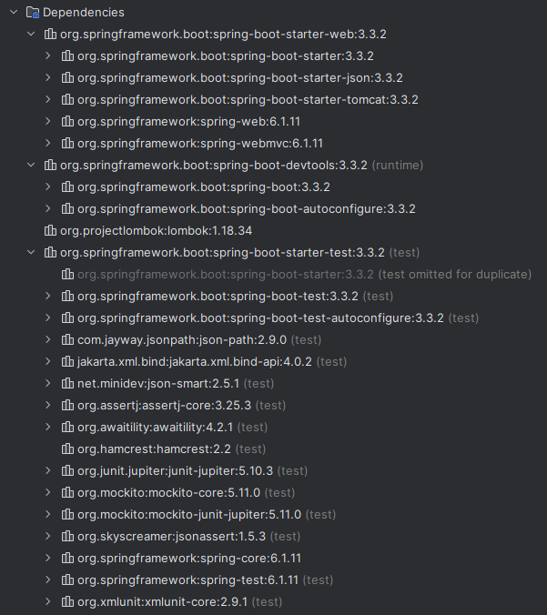
## 003 Project Lombok Features
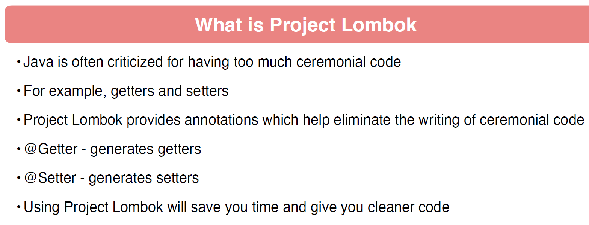
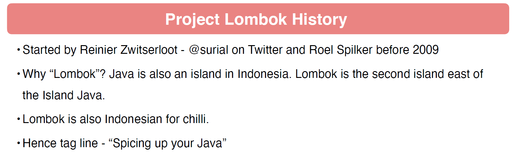
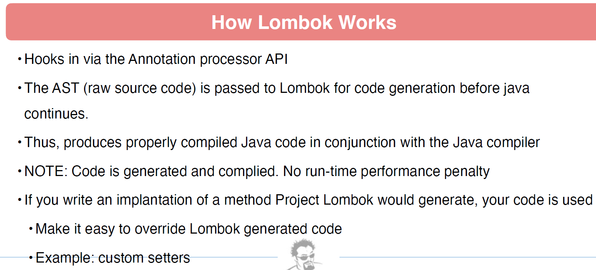
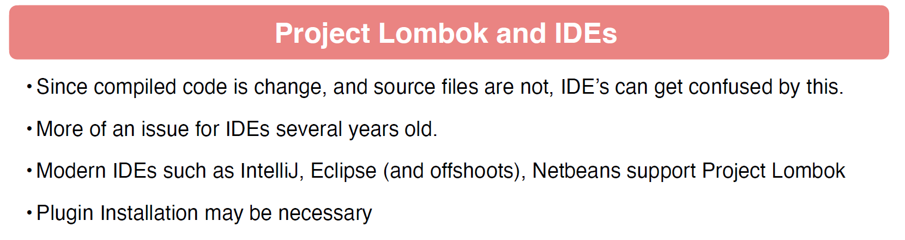
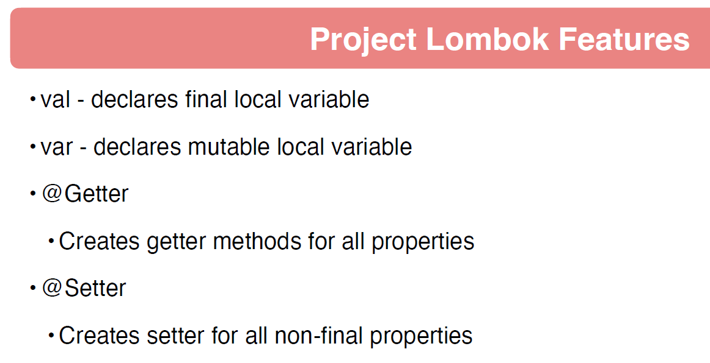
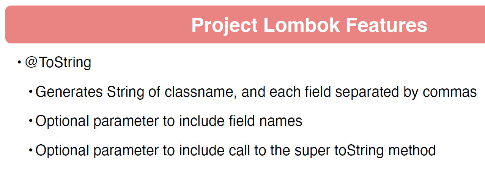
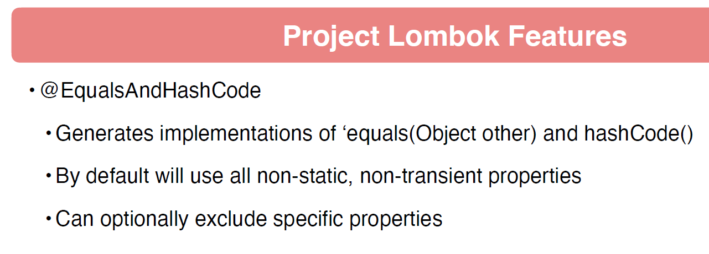
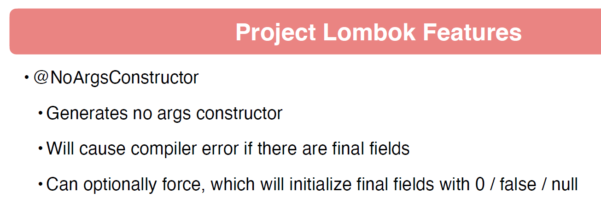
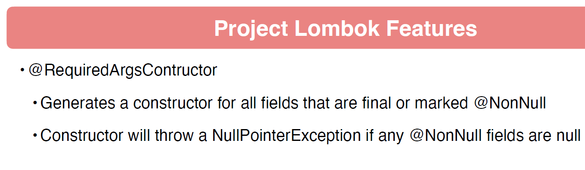
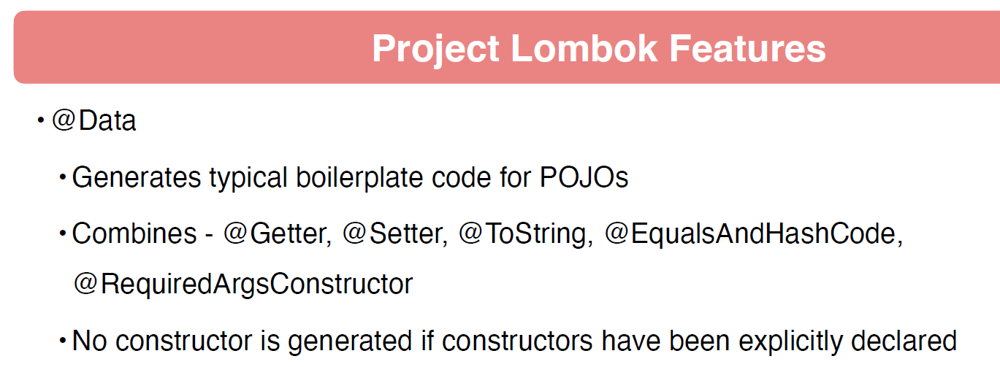
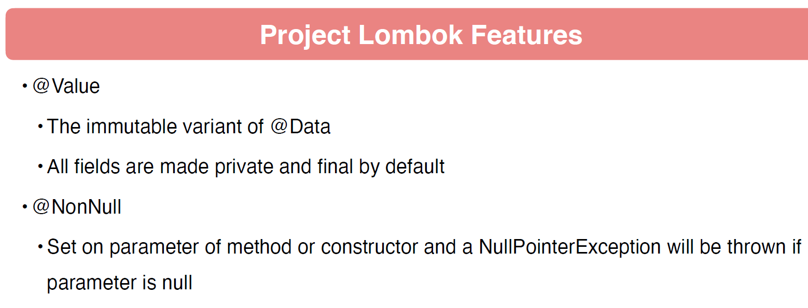
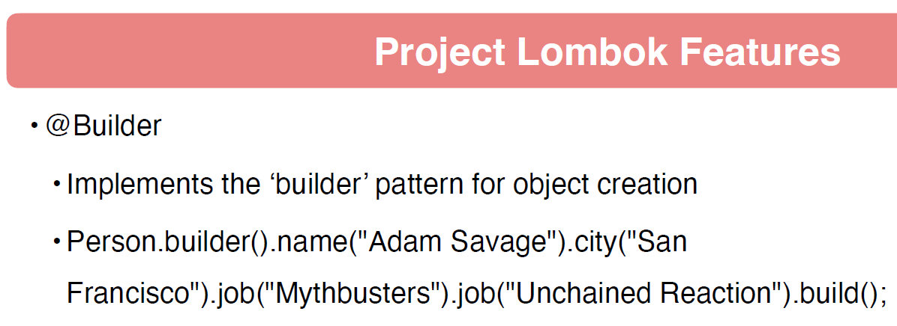
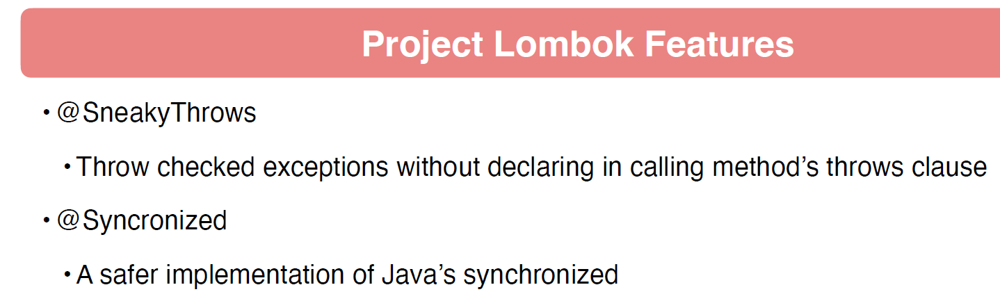
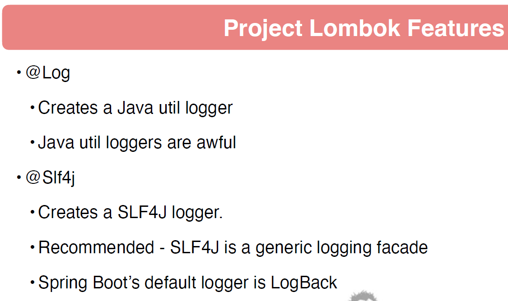
## 004 Project Lombok POJOs
```java
package com.wchamara.spring6restmvc;

import lombok.Data;

import java.math.BigDecimal;
import java.time.LocalDateTime;
import java.util.UUID;

@Data
public class Beer {
    private UUID id;
    private Integer version;
    private String beerName;
    private String beerStyle;
    private Long upc;
    private Integer quantityOnHand;
    private BigDecimal price;
    private LocalDateTime createdDate;
    private LocalDateTime updatedDate;
}

```
```java
//
// Source code recreated from a .class file by IntelliJ IDEA
// (powered by FernFlower decompiler)
//

package com.wchamara.spring6restmvc;

import java.math.BigDecimal;
import java.time.LocalDateTime;
import java.util.UUID;
import lombok.Generated;

public class Beer {
    private UUID id;
    private Integer version;
    private String beerName;
    private String beerStyle;
    private Long upc;
    private Integer quantityOnHand;
    private BigDecimal price;
    private LocalDateTime createdDate;
    private LocalDateTime updatedDate;

    @Generated
    public Beer() {
    }

    @Generated
    public UUID getId() {
        return this.id;
    }

    @Generated
    public Integer getVersion() {
        return this.version;
    }

    @Generated
    public String getBeerName() {
        return this.beerName;
    }

    @Generated
    public String getBeerStyle() {
        return this.beerStyle;
    }

    @Generated
    public Long getUpc() {
        return this.upc;
    }

    @Generated
    public Integer getQuantityOnHand() {
        return this.quantityOnHand;
    }

    @Generated
    public BigDecimal getPrice() {
        return this.price;
    }

    @Generated
    public LocalDateTime getCreatedDate() {
        return this.createdDate;
    }

    @Generated
    public LocalDateTime getUpdatedDate() {
        return this.updatedDate;
    }

    @Generated
    public void setId(final UUID id) {
        this.id = id;
    }

    @Generated
    public void setVersion(final Integer version) {
        this.version = version;
    }

    @Generated
    public void setBeerName(final String beerName) {
        this.beerName = beerName;
    }

    @Generated
    public void setBeerStyle(final String beerStyle) {
        this.beerStyle = beerStyle;
    }

    @Generated
    public void setUpc(final Long upc) {
        this.upc = upc;
    }

    @Generated
    public void setQuantityOnHand(final Integer quantityOnHand) {
        this.quantityOnHand = quantityOnHand;
    }

    @Generated
    public void setPrice(final BigDecimal price) {
        this.price = price;
    }

    @Generated
    public void setCreatedDate(final LocalDateTime createdDate) {
        this.createdDate = createdDate;
    }

    @Generated
    public void setUpdatedDate(final LocalDateTime updatedDate) {
        this.updatedDate = updatedDate;
    }

    @Generated
    public boolean equals(final Object o) {
        if (o == this) {
            return true;
        } else if (!(o instanceof Beer)) {
            return false;
        } else {
            Beer other = (Beer)o;
            if (!other.canEqual(this)) {
                return false;
            } else {
                label119: {
                    Object this$version = this.getVersion();
                    Object other$version = other.getVersion();
                    if (this$version == null) {
                        if (other$version == null) {
                            break label119;
                        }
                    } else if (this$version.equals(other$version)) {
                        break label119;
                    }

                    return false;
                }

                Object this$upc = this.getUpc();
                Object other$upc = other.getUpc();
                if (this$upc == null) {
                    if (other$upc != null) {
                        return false;
                    }
                } else if (!this$upc.equals(other$upc)) {
                    return false;
                }

                label105: {
                    Object this$quantityOnHand = this.getQuantityOnHand();
                    Object other$quantityOnHand = other.getQuantityOnHand();
                    if (this$quantityOnHand == null) {
                        if (other$quantityOnHand == null) {
                            break label105;
                        }
                    } else if (this$quantityOnHand.equals(other$quantityOnHand)) {
                        break label105;
                    }

                    return false;
                }

                Object this$id = this.getId();
                Object other$id = other.getId();
                if (this$id == null) {
                    if (other$id != null) {
                        return false;
                    }
                } else if (!this$id.equals(other$id)) {
                    return false;
                }

                label91: {
                    Object this$beerName = this.getBeerName();
                    Object other$beerName = other.getBeerName();
                    if (this$beerName == null) {
                        if (other$beerName == null) {
                            break label91;
                        }
                    } else if (this$beerName.equals(other$beerName)) {
                        break label91;
                    }

                    return false;
                }

                Object this$beerStyle = this.getBeerStyle();
                Object other$beerStyle = other.getBeerStyle();
                if (this$beerStyle == null) {
                    if (other$beerStyle != null) {
                        return false;
                    }
                } else if (!this$beerStyle.equals(other$beerStyle)) {
                    return false;
                }

                label77: {
                    Object this$price = this.getPrice();
                    Object other$price = other.getPrice();
                    if (this$price == null) {
                        if (other$price == null) {
                            break label77;
                        }
                    } else if (this$price.equals(other$price)) {
                        break label77;
                    }

                    return false;
                }

                label70: {
                    Object this$createdDate = this.getCreatedDate();
                    Object other$createdDate = other.getCreatedDate();
                    if (this$createdDate == null) {
                        if (other$createdDate == null) {
                            break label70;
                        }
                    } else if (this$createdDate.equals(other$createdDate)) {
                        break label70;
                    }

                    return false;
                }

                Object this$updatedDate = this.getUpdatedDate();
                Object other$updatedDate = other.getUpdatedDate();
                if (this$updatedDate == null) {
                    if (other$updatedDate != null) {
                        return false;
                    }
                } else if (!this$updatedDate.equals(other$updatedDate)) {
                    return false;
                }

                return true;
            }
        }
    }

    @Generated
    protected boolean canEqual(final Object other) {
        return other instanceof Beer;
    }

    @Generated
    public int hashCode() {
        int PRIME = true;
        int result = 1;
        Object $version = this.getVersion();
        result = result * 59 + ($version == null ? 43 : $version.hashCode());
        Object $upc = this.getUpc();
        result = result * 59 + ($upc == null ? 43 : $upc.hashCode());
        Object $quantityOnHand = this.getQuantityOnHand();
        result = result * 59 + ($quantityOnHand == null ? 43 : $quantityOnHand.hashCode());
        Object $id = this.getId();
        result = result * 59 + ($id == null ? 43 : $id.hashCode());
        Object $beerName = this.getBeerName();
        result = result * 59 + ($beerName == null ? 43 : $beerName.hashCode());
        Object $beerStyle = this.getBeerStyle();
        result = result * 59 + ($beerStyle == null ? 43 : $beerStyle.hashCode());
        Object $price = this.getPrice();
        result = result * 59 + ($price == null ? 43 : $price.hashCode());
        Object $createdDate = this.getCreatedDate();
        result = result * 59 + ($createdDate == null ? 43 : $createdDate.hashCode());
        Object $updatedDate = this.getUpdatedDate();
        result = result * 59 + ($updatedDate == null ? 43 : $updatedDate.hashCode());
        return result;
    }

    @Generated
    public String toString() {
        String var10000 = String.valueOf(this.getId());
        return "Beer(id=" + var10000 + ", version=" + this.getVersion() + ", beerName=" + this.getBeerName() + ", beerStyle=" + this.getBeerStyle() + ", upc=" + this.getUpc() + ", quantityOnHand=" + this.getQuantityOnHand() + ", price=" + String.valueOf(this.getPrice()) + ", createdDate=" + String.valueOf(this.getCreatedDate()) + ", updatedDate=" + String.valueOf(this.getUpdatedDate()) + ")";
    }
}

```
## 005 Project Lombok Builders
```java
package com.wchamara.spring6restmvc.service;

import com.wchamara.spring6restmvc.model.Beer;
import com.wchamara.spring6restmvc.model.BeerStyle;
import org.springframework.stereotype.Service;

import java.math.BigDecimal;
import java.time.LocalDateTime;
import java.util.UUID;

@Service
public class BeerServiceImpl implements BeerService {

    @Override
    public Beer getBeerById(UUID id) {
        return Beer.builder()
                .id(UUID.randomUUID())
                .version(1)
                .beerName("Galaxy Cat")
                .beerStyle(BeerStyle.PALE_ALE)
                .upc("123456")
                .price(BigDecimal.valueOf(12.95))
                .quantityOnHand(200)
                .createdDate(LocalDateTime.now())
                .updatedDate(LocalDateTime.now())
                .build();
    }
}

```


## 006 Project Lombok Constructors

```java
package com.wchamara.spring6restmvc.controller;

import com.wchamara.spring6restmvc.service.BeerService;
import lombok.AllArgsConstructor;
import org.springframework.stereotype.Controller;

@AllArgsConstructor
@Controller
public class BeerController {
    private final BeerService beerService;
}

```

```java
//
// Source code recreated from a .class file by IntelliJ IDEA
// (powered by FernFlower decompiler)
//

package com.wchamara.spring6restmvc.controller;

import com.wchamara.spring6restmvc.service.BeerService;
import lombok.Generated;
import org.springframework.stereotype.Controller;

@Controller
public class BeerController {
    private final BeerService beerService;

    @Generated
    public BeerController(final BeerService beerService) {
        this.beerService = beerService;
    }
}
```
## 007 Project Lombok Logging
## 008 Delombok