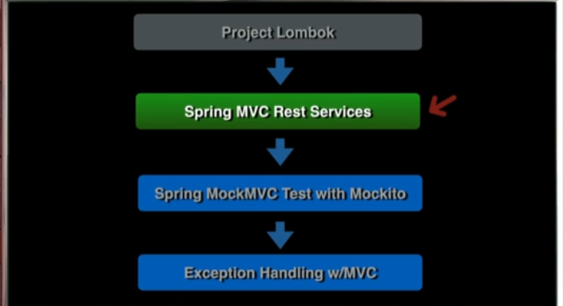
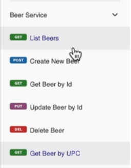
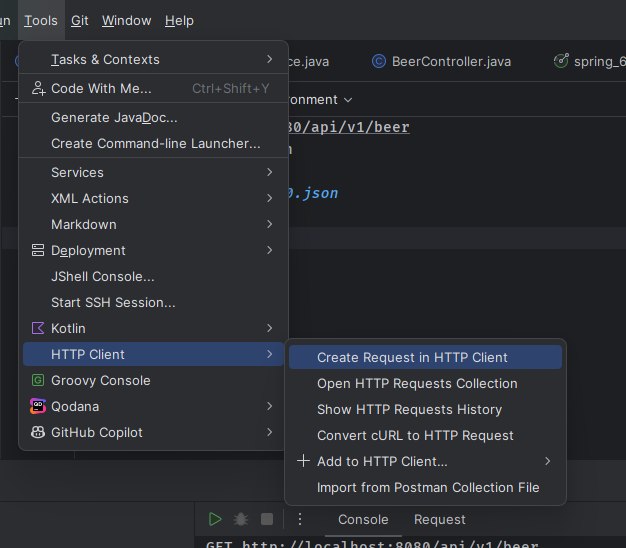
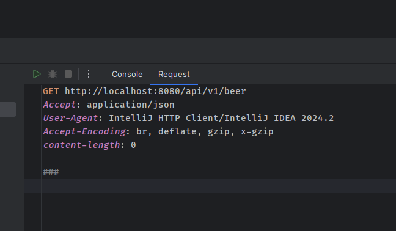
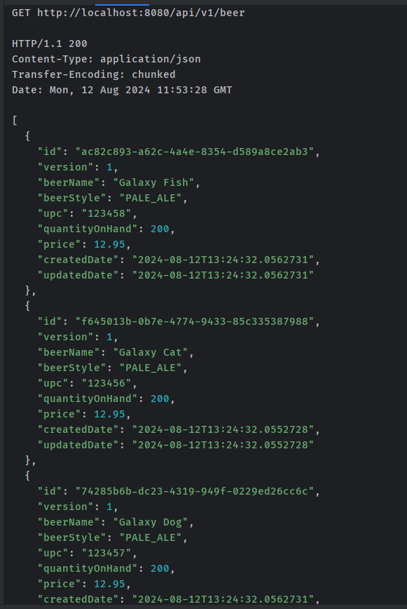

# 06 - Spring MVC Rest Services

## 001 Introduction

## 002 Introducing SFG Beer Works

## 003 HTTP GET with Spring MVC List Operation
```java
package com.wchamara.spring6restmvc.service;

import com.wchamara.spring6restmvc.model.Beer;
import com.wchamara.spring6restmvc.model.BeerStyle;
import org.springframework.stereotype.Service;

import java.math.BigDecimal;
import java.time.LocalDateTime;
import java.util.*;

@Service
public class BeerServiceImpl implements BeerService {

    private Map<UUID, Beer> beerMap = new HashMap<>();

    public BeerServiceImpl() {
        Beer beer1 = Beer.builder()
                .id(UUID.randomUUID())
                .version(1)
                .beerName("Galaxy Cat")
                .beerStyle(BeerStyle.PALE_ALE)
                .upc("123456")
                .price(BigDecimal.valueOf(12.95))
                .quantityOnHand(200)
                .createdDate(LocalDateTime.now())
                .updatedDate(LocalDateTime.now())
                .build();

        Beer beer2 = Beer.builder()
                .id(UUID.randomUUID())
                .version(1)
                .beerName("Galaxy Dog")
                .beerStyle(BeerStyle.PALE_ALE)
                .upc("123457")
                .price(BigDecimal.valueOf(12.95))
                .quantityOnHand(200)
                .createdDate(LocalDateTime.now())
                .updatedDate(LocalDateTime.now())
                .build();

        Beer beer3 = Beer.builder()
                .id(UUID.randomUUID())
                .version(1)
                .beerName("Galaxy Fish")
                .beerStyle(BeerStyle.PALE_ALE)
                .upc("123458")
                .price(BigDecimal.valueOf(12.95))
                .quantityOnHand(200)
                .createdDate(LocalDateTime.now())
                .updatedDate(LocalDateTime.now())
                .build();

        beerMap.put(beer1.getId(), beer1);
        beerMap.put(beer2.getId(), beer2);
        beerMap.put(beer3.getId(), beer3);


    }

    @Override
    public Beer getBeerById(UUID id) {
        return beerMap.get(id);
    }

    @Override
    public List<Beer> listAllBeers() {
        return new ArrayList<>(beerMap.values());
    }
}

```
```java
package com.wchamara.spring6restmvc.service;

import com.wchamara.spring6restmvc.model.Beer;

import java.util.List;
import java.util.UUID;

public interface BeerService {
    Beer getBeerById(UUID id);

    List<Beer> listAllBeers();
}

```
```java
package com.wchamara.spring6restmvc.controller;

import com.wchamara.spring6restmvc.model.Beer;
import com.wchamara.spring6restmvc.service.BeerService;
import lombok.AllArgsConstructor;
import lombok.extern.slf4j.Slf4j;
import org.springframework.web.bind.annotation.RequestMapping;
import org.springframework.web.bind.annotation.RestController;

import java.util.List;
import java.util.UUID;

@AllArgsConstructor
@Slf4j
@RestController
public class BeerController {
    private final BeerService beerService;

    public Beer getBeerById(UUID id) {
        log.debug("getBeerById() called in BeerController with id: {}", id);
        return beerService.getBeerById(id);
    }

    @RequestMapping("api/v1/beer")
    public List<Beer> listAllBeers() {
        log.debug("listAllBeers() called in BeerController");
        return beerService.listAllBeers();
    }
}

```

## 004 HTTP Client



## 005 Using Path Parameters - Get By Id
```java
package com.wchamara.spring6restmvc.controller;

import com.wchamara.spring6restmvc.model.Beer;
import com.wchamara.spring6restmvc.service.BeerService;
import lombok.AllArgsConstructor;
import lombok.extern.slf4j.Slf4j;
import org.springframework.web.bind.annotation.GetMapping;
import org.springframework.web.bind.annotation.PathVariable;
import org.springframework.web.bind.annotation.RequestMapping;
import org.springframework.web.bind.annotation.RestController;

import java.util.List;
import java.util.UUID;

@AllArgsConstructor
@Slf4j
@RestController
@RequestMapping("api/v1/beer")
public class BeerController {
    private final BeerService beerService;

    @GetMapping("{id}")
    public Beer getBeerById(@PathVariable("id") UUID id) {
        log.debug("getBeerById() called in BeerController with id: {}", id);
        return beerService.getBeerById(id);
    }

    @GetMapping
    public List<Beer> listAllBeers() {
        log.debug("listAllBeers() called in BeerController");
        return beerService.listAllBeers();
    }
}
```
The selected code is a Java class named BeerController that serves as a RESTful API controller for managing beer-related operations. It is annotated with @RestController, indicating that it handles HTTP requests and returns the response directly as the body of the response, rather than rendering a view.

The class has a constructor annotated with @AllArgsConstructor, which is a Lombok annotation that generates a constructor with all the required dependencies. This constructor is used to inject an instance of the BeerService class into the BeerController.

The BeerController class has two methods annotated with @GetMapping. The first method, getBeerById, takes a UUID parameter named id and returns a Beer object. It is responsible for retrieving a beer by its ID. Inside the method, there is a logging statement that logs the ID of the beer being retrieved. The method delegates the actual retrieval operation to the beerService instance by calling the getBeerById method on it.

The second method, listAllBeers, does not take any parameters and returns a list of Beer objects. It is responsible for retrieving all the beers. Similar to the previous method, it logs a debug message indicating that the method has been called. The method delegates the retrieval operation to the beerService instance by calling the listAllBeers method on it.

Overall, this BeerController class provides endpoints for retrieving a single beer by ID and retrieving a list of all beers. It relies on the BeerService class to perform the actual operations.
## 006 Spring Boot Development Tools

## 007 HTTP POST with Spring MVC
```java
package com.wchamara.spring6restmvc.service;

import com.wchamara.spring6restmvc.model.Beer;

import java.util.List;
import java.util.UUID;

public interface BeerService {
    Beer getBeerById(UUID id);

    List<Beer> listAllBeers();

    Beer saveNewBeer(Beer beer);
}

```

```java
package com.wchamara.spring6restmvc.service;

import com.wchamara.spring6restmvc.model.Beer;
import com.wchamara.spring6restmvc.model.BeerStyle;
import org.springframework.stereotype.Service;

import java.math.BigDecimal;
import java.time.LocalDateTime;
import java.util.*;

@Service
public class BeerServiceImpl implements BeerService {

    private Map<UUID, Beer> beerMap = new HashMap<>();

    public BeerServiceImpl() {
        Beer beer1 = Beer.builder()
                .id(UUID.randomUUID())
                .version(1)
                .beerName("Galaxy Cat")
                .beerStyle(BeerStyle.PALE_ALE)
                .upc("123456")
                .price(BigDecimal.valueOf(12.95))
                .quantityOnHand(200)
                .createdDate(LocalDateTime.now())
                .updatedDate(LocalDateTime.now())
                .build();

        Beer beer2 = Beer.builder()
                .id(UUID.randomUUID())
                .version(1)
                .beerName("Galaxy Dog")
                .beerStyle(BeerStyle.PALE_ALE)
                .upc("123457")
                .price(BigDecimal.valueOf(12.95))
                .quantityOnHand(200)
                .createdDate(LocalDateTime.now())
                .updatedDate(LocalDateTime.now())
                .build();

        Beer beer3 = Beer.builder()
                .id(UUID.randomUUID())
                .version(1)
                .beerName("Galaxy Fish")
                .beerStyle(BeerStyle.PALE_ALE)
                .upc("123458")
                .price(BigDecimal.valueOf(12.95))
                .quantityOnHand(200)
                .createdDate(LocalDateTime.now())
                .updatedDate(LocalDateTime.now())
                .build();

        beerMap.put(beer1.getId(), beer1);
        beerMap.put(beer2.getId(), beer2);
        beerMap.put(beer3.getId(), beer3);


    }

    @Override
    public Beer getBeerById(UUID id) {
        return beerMap.get(id);
    }

    @Override
    public List<Beer> listAllBeers() {
        return new ArrayList<>(beerMap.values());
    }

    @Override
    public Beer saveNewBeer(Beer beer) {
        Beer savedBeer = Beer.builder()
                .id(UUID.randomUUID())
                .version(1)
                .beerName(beer.getBeerName())
                .beerStyle(beer.getBeerStyle())
                .upc(beer.getUpc())
                .price(beer.getPrice())
                .quantityOnHand(beer.getQuantityOnHand())
                .createdDate(LocalDateTime.now())
                .updatedDate(LocalDateTime.now())
                .build();
        beerMap.put(savedBeer.getId(), savedBeer);
        return beer;
    }
}

```
```java
package com.wchamara.spring6restmvc.controller;

import com.wchamara.spring6restmvc.model.Beer;
import com.wchamara.spring6restmvc.service.BeerService;
import lombok.AllArgsConstructor;
import lombok.extern.slf4j.Slf4j;
import org.springframework.http.HttpStatus;
import org.springframework.http.ResponseEntity;
import org.springframework.web.bind.annotation.*;

import java.util.List;
import java.util.UUID;

@AllArgsConstructor
@Slf4j
@RestController
@RequestMapping("api/v1/beer")
public class BeerController {
    private final BeerService beerService;

    @GetMapping("{id}")
    public Beer getBeerById(@PathVariable("id") UUID id) {
        log.debug("getBeerById() called in BeerController with id: {}", id);
        return beerService.getBeerById(id);
    }

    @GetMapping
    public List<Beer> listAllBeers() {
        log.debug("listAllBeers() called in BeerController");
        return beerService.listAllBeers();
    }

    @PostMapping
    public ResponseEntity saveNewBeer(@RequestBody Beer beer) {
        log.debug("saveNewBeer() called in BeerController with beer: {}", beer);
        Beer savedBeer = beerService.saveNewBeer(beer);

        return new ResponseEntity(HttpStatus.CREATED);
    }
}

```

## 008 Set Header on HTTP Response
```java
package com.wchamara.spring6restmvc.controller;

import com.wchamara.spring6restmvc.model.Beer;
import com.wchamara.spring6restmvc.service.BeerService;
import lombok.AllArgsConstructor;
import lombok.extern.slf4j.Slf4j;
import org.springframework.http.HttpHeaders;
import org.springframework.http.HttpStatus;
import org.springframework.http.ResponseEntity;
import org.springframework.web.bind.annotation.*;

import java.util.List;
import java.util.UUID;

@AllArgsConstructor
@Slf4j
@RestController
@RequestMapping("api/v1/beer")
public class BeerController {
    private final BeerService beerService;

    @GetMapping("{id}")
    public Beer getBeerById(@PathVariable("id") UUID id) {
        log.debug("getBeerById() called in BeerController with id: {}", id);
        return beerService.getBeerById(id);
    }

    @GetMapping
    public List<Beer> listAllBeers() {
        log.debug("listAllBeers() called in BeerController");
        return beerService.listAllBeers();
    }

    @PostMapping
    public ResponseEntity saveNewBeer(@RequestBody Beer beer) {
        log.debug("saveNewBeer() called in BeerController with beer: {}", beer);
        Beer savedBeer = beerService.saveNewBeer(beer);
        HttpHeaders headers = new HttpHeaders();
        headers.add("Location", "api/v1/beer/" + savedBeer.getId());

        return new ResponseEntity(headers, HttpStatus.CREATED);
    }
}
```
## 009 HTTP PUT with Spring MVC
```java
package com.wchamara.spring6restmvc.service;

import com.wchamara.spring6restmvc.model.Beer;

import java.util.List;
import java.util.UUID;

public interface BeerService {
    Beer getBeerById(UUID id);

    List<Beer> listAllBeers();

    Beer saveNewBeer(Beer beer);

    void updateBeer(UUID id, Beer beer);
}

```
```java
package com.wchamara.spring6restmvc.service;

import com.wchamara.spring6restmvc.model.Beer;
import com.wchamara.spring6restmvc.model.BeerStyle;
import org.springframework.stereotype.Service;

import java.math.BigDecimal;
import java.time.LocalDateTime;
import java.util.*;

@Service
public class BeerServiceImpl implements BeerService {

    private Map<UUID, Beer> beerMap = new HashMap<>();

    public BeerServiceImpl() {
        Beer beer1 = Beer.builder()
                .id(UUID.fromString("60501fcd-487e-4d83-8c67-3001482e35a2"))
                .version(1)
                .beerName("Galaxy Cat")
                .beerStyle(BeerStyle.PALE_ALE)
                .upc("123456")
                .price(BigDecimal.valueOf(12.95))
                .quantityOnHand(200)
                .createdDate(LocalDateTime.now())
                .updatedDate(LocalDateTime.now())
                .build();

        Beer beer2 = Beer.builder()
                .id(UUID.randomUUID())
                .version(1)
                .beerName("Galaxy Dog")
                .beerStyle(BeerStyle.PALE_ALE)
                .upc("123457")
                .price(BigDecimal.valueOf(12.95))
                .quantityOnHand(200)
                .createdDate(LocalDateTime.now())
                .updatedDate(LocalDateTime.now())
                .build();

        Beer beer3 = Beer.builder()
                .id(UUID.randomUUID())
                .version(1)
                .beerName("Galaxy Fish")
                .beerStyle(BeerStyle.PALE_ALE)
                .upc("123458")
                .price(BigDecimal.valueOf(12.95))
                .quantityOnHand(200)
                .createdDate(LocalDateTime.now())
                .updatedDate(LocalDateTime.now())
                .build();

        beerMap.put(beer1.getId(), beer1);
        beerMap.put(beer2.getId(), beer2);
        beerMap.put(beer3.getId(), beer3);


    }

    @Override
    public Beer getBeerById(UUID id) {
        return beerMap.get(id);
    }

    @Override
    public List<Beer> listAllBeers() {
        return new ArrayList<>(beerMap.values());
    }

    @Override
    public Beer saveNewBeer(Beer beer) {
        Beer savedBeer = Beer.builder()
                .id(UUID.randomUUID())
                .version(1)
                .beerName(beer.getBeerName())
                .beerStyle(beer.getBeerStyle())
                .upc(beer.getUpc())
                .price(beer.getPrice())
                .quantityOnHand(beer.getQuantityOnHand())
                .createdDate(LocalDateTime.now())
                .updatedDate(LocalDateTime.now())
                .build();
        beerMap.put(savedBeer.getId(), savedBeer);
        return savedBeer;
    }

    @Override
    public void updateBeer(UUID id, Beer beer) {
        Beer existingBeer = beerMap.get(id);
        existingBeer.setBeerName(beer.getBeerName());
        existingBeer.setBeerStyle(beer.getBeerStyle());
        existingBeer.setUpc(beer.getUpc());
        existingBeer.setPrice(beer.getPrice());
        existingBeer.setQuantityOnHand(beer.getQuantityOnHand());
        existingBeer.setUpdatedDate(LocalDateTime.now());
        beerMap.put(id, existingBeer);
    }
}

```
```java
package com.wchamara.spring6restmvc.controller;

import com.wchamara.spring6restmvc.model.Beer;
import com.wchamara.spring6restmvc.service.BeerService;
import lombok.AllArgsConstructor;
import lombok.extern.slf4j.Slf4j;
import org.springframework.http.HttpHeaders;
import org.springframework.http.HttpStatus;
import org.springframework.http.ResponseEntity;
import org.springframework.web.bind.annotation.*;

import java.util.List;
import java.util.UUID;

@AllArgsConstructor
@Slf4j
@RestController
@RequestMapping("api/v1/beer")
public class BeerController {
    private final BeerService beerService;

    @GetMapping("{id}")
    public Beer getBeerById(@PathVariable("id") UUID id) {
        log.debug("getBeerById() called in BeerController with id: {}", id);
        return beerService.getBeerById(id);
    }

    @GetMapping
    public List<Beer> listAllBeers() {
        log.debug("listAllBeers() called in BeerController");
        return beerService.listAllBeers();
    }

    @PostMapping
    public ResponseEntity saveNewBeer(@RequestBody Beer beer) {
        log.debug("saveNewBeer() called in BeerController with beer: {}", beer);
        Beer savedBeer = beerService.saveNewBeer(beer);
        HttpHeaders headers = new HttpHeaders();
        headers.add("Location", "api/v1/beer/" + savedBeer.getId());

        return new ResponseEntity(headers, HttpStatus.CREATED);
    }

    @PutMapping("{id}")
    public ResponseEntity updateBeer(@PathVariable("id") UUID id, @RequestBody Beer beer) {
        log.debug("updateBeer() called in BeerController with id: {} and beer: {}", id, beer);
        beerService.updateBeer(id, beer);
        return new ResponseEntity(HttpStatus.NO_CONTENT);
    }
}

```
## 010 HTTP DELETE with Spring MVC
## 011 HTTP PATCH with Spring MVC
