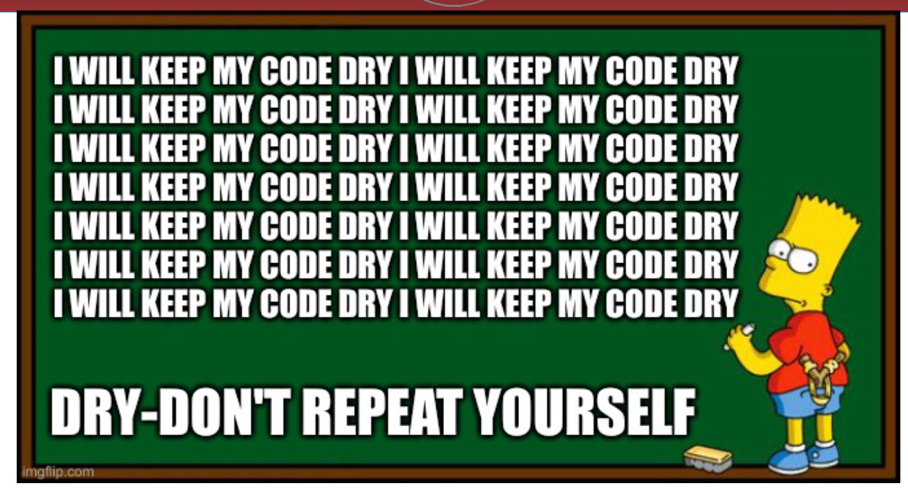
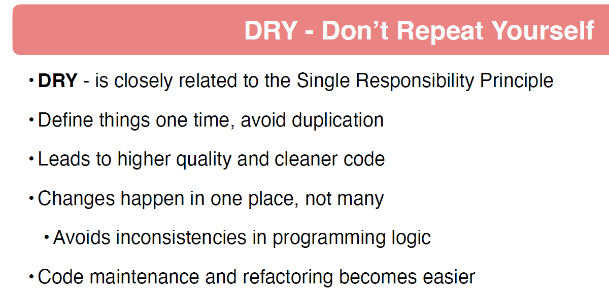
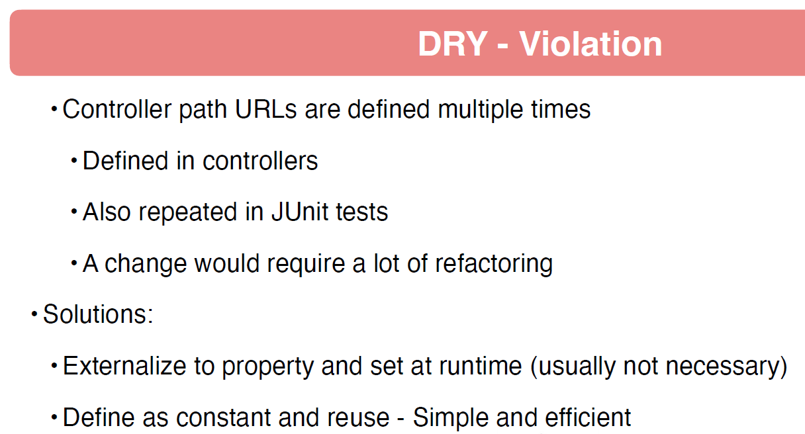

# 07 - Spring MockMVC Test with Mockito

## 001 Introduction

## 002 Introduction to Testing with MockMVC


## 003 MockMVC Configuration
```java
package com.wchamara.spring6restmvc.controller;

import com.wchamara.spring6restmvc.service.BeerService;
import org.junit.jupiter.api.Test;
import org.springframework.beans.factory.annotation.Autowired;
import org.springframework.boot.test.autoconfigure.web.servlet.WebMvcTest;
import org.springframework.boot.test.mock.mockito.MockBean;
import org.springframework.test.web.servlet.MockMvc;

import java.util.UUID;

import static org.springframework.test.web.servlet.request.MockMvcRequestBuilders.get;
import static org.springframework.test.web.servlet.result.MockMvcResultMatchers.status;

/**
 * This is a test class for the BeerController class.
 * It is used to test the functionality of the getBeerByIdReturnsBeer method.
 * The method performs a GET request to retrieve a beer by its ID and expects a successful response with status code 200.
 * The test uses the @WebMvcTest annotation to focus on testing the web layer of the BeerController.
 * It autowires the MockMvc instance and mocks the BeerService dependency using the @MockBean annotation.
 */
@WebMvcTest(BeerController.class)
class BeerControllerTest {
    @Autowired
    MockMvc mockMvc;

    @MockBean
    BeerService beerService;

    @Test
    void getBeerByIdReturnsBeer() throws Exception {
        UUID beerId = UUID.fromString("60501fcd-487e-4d83-8c67-3001482e35a2");
        String url = "/api/v1/beer/" + beerId;
        mockMvc.perform(get(url).accept("application/json"))
                .andExpect(status().isOk());
    }
}
```
## 004 Return Data With Mockito
```java
package com.wchamara.spring6restmvc.controller;

import com.wchamara.spring6restmvc.model.Beer;
import com.wchamara.spring6restmvc.service.BeerService;
import com.wchamara.spring6restmvc.service.BeerServiceImpl;
import org.junit.jupiter.api.Test;
import org.springframework.beans.factory.annotation.Autowired;
import org.springframework.boot.test.autoconfigure.web.servlet.WebMvcTest;
import org.springframework.boot.test.mock.mockito.MockBean;
import org.springframework.http.MediaType;
import org.springframework.test.web.servlet.MockMvc;

import java.util.UUID;

import static org.mockito.ArgumentMatchers.any;
import static org.mockito.BDDMockito.given;
import static org.springframework.test.web.servlet.request.MockMvcRequestBuilders.get;
import static org.springframework.test.web.servlet.result.MockMvcResultMatchers.content;
import static org.springframework.test.web.servlet.result.MockMvcResultMatchers.status;

//@SpringBootTest
@WebMvcTest(BeerController.class)
class BeerControllerTest {
    @Autowired
    MockMvc mockMvc;

    @MockBean
    BeerService beerService;

    BeerServiceImpl beerServiceImpl = new BeerServiceImpl();

    @Test
    void getBeerByIdReturnsBeer() throws Exception {
        Beer beer = beerServiceImpl.listAllBeers().get(0);
        given(beerService.getBeerById(any(UUID.class))).willReturn(beer);
        UUID beerId = UUID.fromString("60501fcd-487e-4d83-8c67-3001482e35a2");
        String url = "/api/v1/beer/" + beerId;
        mockMvc.perform(get(url).accept(MediaType.APPLICATION_JSON))
                .andExpect(status().isOk())
                .andExpect(content().contentType(MediaType.APPLICATION_JSON));
    }


}
```
## 005 Using JSON Matchers
```java
package com.wchamara.spring6restmvc.controller;

import com.wchamara.spring6restmvc.model.Beer;
import com.wchamara.spring6restmvc.service.BeerService;
import com.wchamara.spring6restmvc.service.BeerServiceImpl;
import org.junit.jupiter.api.Test;
import org.springframework.beans.factory.annotation.Autowired;
import org.springframework.boot.test.autoconfigure.web.servlet.WebMvcTest;
import org.springframework.boot.test.mock.mockito.MockBean;
import org.springframework.http.MediaType;
import org.springframework.test.web.servlet.MockMvc;

import java.util.UUID;

import static org.mockito.ArgumentMatchers.any;
import static org.mockito.BDDMockito.given;
import static org.springframework.test.web.servlet.request.MockMvcRequestBuilders.get;
import static org.springframework.test.web.servlet.result.MockMvcResultMatchers.*;

//@SpringBootTest
@WebMvcTest(BeerController.class)
class BeerControllerTest {
    @Autowired
    MockMvc mockMvc;

    @MockBean
    BeerService beerService;

    BeerServiceImpl beerServiceImpl = new BeerServiceImpl();

    @Test
    void getBeerByIdReturnsBeer() throws Exception {
        Beer beer = beerServiceImpl.listAllBeers().get(0);
        given(beerService.getBeerById(any(UUID.class))).willReturn(beer);

        String url = "/api/v1/beer/" + beer.getId();
        mockMvc.perform(get(url).accept(MediaType.APPLICATION_JSON))
                .andExpect(status().isOk())
                .andExpect(content().contentType(MediaType.APPLICATION_JSON))
                .andExpect(jsonPath("$.id").value(beer.getId().toString()))
                .andExpect(jsonPath("$.beerName").value(beer.getBeerName()))
                .andExpect(jsonPath("$.beerStyle").value(beer.getBeerStyle().toString()))
                .andExpect(jsonPath("$.upc").value(beer.getUpc()))
                .andExpect(jsonPath("$.quantityOnHand").value(beer.getQuantityOnHand()))
                .andExpect(jsonPath("$.price").value(beer.getPrice().toString()))
                .andExpect(jsonPath("$.createdDate").exists())
                .andExpect(jsonPath("$.updatedDate").exists());
        ;
    }


}
```
## 006 MockMVC Test List Beers
```java
package com.wchamara.spring6restmvc.controller;

import com.wchamara.spring6restmvc.model.Beer;
import com.wchamara.spring6restmvc.service.BeerService;
import com.wchamara.spring6restmvc.service.BeerServiceImpl;
import org.junit.jupiter.api.Test;
import org.springframework.beans.factory.annotation.Autowired;
import org.springframework.boot.test.autoconfigure.web.servlet.WebMvcTest;
import org.springframework.boot.test.mock.mockito.MockBean;
import org.springframework.http.MediaType;
import org.springframework.test.web.servlet.MockMvc;

import java.util.UUID;

import static org.mockito.ArgumentMatchers.any;
import static org.mockito.BDDMockito.given;
import static org.springframework.test.web.servlet.request.MockMvcRequestBuilders.get;
import static org.springframework.test.web.servlet.result.MockMvcResultMatchers.*;

//@SpringBootTest
@WebMvcTest(BeerController.class)
class BeerControllerTest {
    @Autowired
    MockMvc mockMvc;

    @MockBean
    BeerService beerService;

    BeerServiceImpl beerServiceImpl = new BeerServiceImpl();

    @Test
    void listAllBeersReturnsListOfBeers() throws Exception {
        given(beerService.listAllBeers()).willReturn(beerServiceImpl.listAllBeers());

        mockMvc.perform(get("/api/v1/beer").accept(MediaType.APPLICATION_JSON))
                .andExpect(status().isOk())
                .andExpect(content().contentType(MediaType.APPLICATION_JSON))
                .andExpect(jsonPath("$[0].id").exists())
                .andExpect(jsonPath("$[0].beerName").exists())
                .andExpect(jsonPath("$[0].beerStyle").exists())
                .andExpect(jsonPath("$[0].upc").exists())
                .andExpect(jsonPath("$[0].quantityOnHand").exists())
                .andExpect(jsonPath("$[0].price").exists())
                .andExpect(jsonPath("$[0].createdDate").exists())
                .andExpect(jsonPath("$[0].updatedDate").exists());
    }
}
```
## 007 Create JSON Using Jackson

```java
package com.wchamara.spring6restmvc.controller;

import com.fasterxml.jackson.databind.ObjectMapper;
import com.wchamara.spring6restmvc.model.Beer;
import com.wchamara.spring6restmvc.service.BeerService;
import com.wchamara.spring6restmvc.service.BeerServiceImpl;
import org.junit.jupiter.api.Test;
import org.springframework.beans.factory.annotation.Autowired;
import org.springframework.boot.test.autoconfigure.web.servlet.WebMvcTest;
import org.springframework.boot.test.mock.mockito.MockBean;
import org.springframework.http.MediaType;
import org.springframework.test.web.servlet.MockMvc;

import java.util.UUID;

import static org.mockito.ArgumentMatchers.any;
import static org.mockito.BDDMockito.given;
import static org.springframework.test.web.servlet.request.MockMvcRequestBuilders.get;
import static org.springframework.test.web.servlet.result.MockMvcResultMatchers.*;

//@SpringBootTest
@WebMvcTest(BeerController.class)
class BeerControllerTest {
    @Autowired
    MockMvc mockMvc;

    @MockBean
    BeerService beerService;

    @Autowired
    ObjectMapper objectMapper;

    BeerServiceImpl beerServiceImpl = new BeerServiceImpl();

    @Test
    void saveNewBeerReturnsCreated() throws Exception {
        Beer beer = beerServiceImpl.listAllBeers().get(0);
        System.out.println(objectMapper.writeValueAsString(beer));

    }


}
``` 
## 008 MockMVC Test Create Beer
```java
package com.wchamara.spring6restmvc.controller;

import com.fasterxml.jackson.databind.ObjectMapper;
import com.wchamara.spring6restmvc.model.Beer;
import com.wchamara.spring6restmvc.service.BeerService;
import com.wchamara.spring6restmvc.service.BeerServiceImpl;
import org.junit.jupiter.api.Test;
import org.springframework.beans.factory.annotation.Autowired;
import org.springframework.boot.test.autoconfigure.web.servlet.WebMvcTest;
import org.springframework.boot.test.mock.mockito.MockBean;
import org.springframework.http.MediaType;
import org.springframework.test.web.servlet.MockMvc;

import java.util.UUID;

import static org.mockito.ArgumentMatchers.any;
import static org.mockito.BDDMockito.given;
import static org.springframework.test.web.servlet.request.MockMvcRequestBuilders.get;
import static org.springframework.test.web.servlet.request.MockMvcRequestBuilders.post;
import static org.springframework.test.web.servlet.result.MockMvcResultMatchers.*;

//@SpringBootTest
@WebMvcTest(BeerController.class)
class BeerControllerTest {
    @Autowired
    MockMvc mockMvc;

    @MockBean
    BeerService beerService;

    @Autowired
    ObjectMapper objectMapper;

    BeerServiceImpl beerServiceImpl = new BeerServiceImpl();

    @Test
    void saveNewBeerReturnsCreated() throws Exception {
        Beer beer = beerServiceImpl.listAllBeers().get(0);
        beer.setId(null);
        beer.setVersion(null);

        given(beerService.saveNewBeer(any())).willReturn(beerServiceImpl.listAllBeers().get(1));

        mockMvc.perform(
                        post("/api/v1/beer")
                                .accept(MediaType.APPLICATION_JSON)
                                .contentType(MediaType.APPLICATION_JSON)
                                .content(objectMapper.writeValueAsString(beer))
                )
                .andExpect(status().isCreated())
                .andExpect(header().exists("Location"));

    }


}
```
## 009 MockMVC Test Update Beer
```java
package com.wchamara.spring6restmvc.controller;

import com.fasterxml.jackson.databind.ObjectMapper;
import com.wchamara.spring6restmvc.model.Beer;
import com.wchamara.spring6restmvc.service.BeerService;
import com.wchamara.spring6restmvc.service.BeerServiceImpl;
import org.junit.jupiter.api.Test;
import org.springframework.beans.factory.annotation.Autowired;
import org.springframework.boot.test.autoconfigure.web.servlet.WebMvcTest;
import org.springframework.boot.test.mock.mockito.MockBean;
import org.springframework.http.MediaType;
import org.springframework.test.web.servlet.MockMvc;

import java.util.UUID;

import static org.mockito.ArgumentMatchers.any;
import static org.mockito.BDDMockito.given;
import static org.mockito.Mockito.verify;
import static org.springframework.test.web.servlet.request.MockMvcRequestBuilders.*;
import static org.springframework.test.web.servlet.result.MockMvcResultMatchers.*;

//@SpringBootTest
@WebMvcTest(BeerController.class)
class BeerControllerTest {
    @Autowired
    MockMvc mockMvc;

    @MockBean
    BeerService beerService;

    @Autowired
    ObjectMapper objectMapper;

    BeerServiceImpl beerServiceImpl = new BeerServiceImpl();

    @Test
    void updateBeerReturnsNoContent() throws Exception {
        Beer beer = beerServiceImpl.listAllBeers().get(0);
        given(beerService.getBeerById(any(UUID.class))).willReturn(beer);

        String urlTemplate = "/api/v1/beer/" + beer.getId();
        mockMvc.perform(
                        put(urlTemplate)
                                .accept(MediaType.APPLICATION_JSON)
                                .contentType(MediaType.APPLICATION_JSON)
                                .content(objectMapper.writeValueAsString(beer))
                )
                .andExpect(status().isNoContent());
        verify(beerService).updateBeer(any(UUID.class), any(Beer.class));
    }


}
```
## 010 MockMVC Test Delete Beer
```java
package com.wchamara.spring6restmvc.controller;

import com.fasterxml.jackson.databind.ObjectMapper;
import com.wchamara.spring6restmvc.model.Beer;
import com.wchamara.spring6restmvc.service.BeerService;
import com.wchamara.spring6restmvc.service.BeerServiceImpl;
import org.junit.jupiter.api.Test;
import org.mockito.ArgumentCaptor;
import org.mockito.Captor;
import org.springframework.beans.factory.annotation.Autowired;
import org.springframework.boot.test.autoconfigure.web.servlet.WebMvcTest;
import org.springframework.boot.test.mock.mockito.MockBean;
import org.springframework.http.MediaType;
import org.springframework.test.web.servlet.MockMvc;

import java.util.UUID;

import static org.assertj.core.api.AssertionsForClassTypes.assertThat;
import static org.mockito.ArgumentMatchers.any;
import static org.mockito.BDDMockito.given;
import static org.mockito.Mockito.verify;
import static org.springframework.test.web.servlet.request.MockMvcRequestBuilders.*;
import static org.springframework.test.web.servlet.result.MockMvcResultMatchers.*;

//@SpringBootTest
@WebMvcTest(BeerController.class)
class BeerControllerTest {
    @Autowired
    MockMvc mockMvc;

    @MockBean
    BeerService beerService;

    @Captor
    ArgumentCaptor<UUID> uuidArgumentCaptor;

    @Autowired
    ObjectMapper objectMapper;

    BeerServiceImpl beerServiceImpl = new BeerServiceImpl();

    @Test
    void deleteBeerReturnsNoContent() throws Exception {
        Beer beer = beerServiceImpl.listAllBeers().get(0);
        given(beerService.getBeerById(any(UUID.class))).willReturn(beer);

        String urlTemplate = "/api/v1/beer/" + beer.getId();
        mockMvc.perform(delete(urlTemplate))
                .andExpect(status().isNoContent());

        verify(beerService).deleteBeer(uuidArgumentCaptor.capture());

        assertThat(uuidArgumentCaptor.getValue()).isEqualTo(beer.getId());
    }


}
```
## 011 MockMVC Test Patch Beer
```java
package com.wchamara.spring6restmvc.controller;

import com.fasterxml.jackson.databind.ObjectMapper;
import com.wchamara.spring6restmvc.model.Beer;
import com.wchamara.spring6restmvc.service.BeerService;
import com.wchamara.spring6restmvc.service.BeerServiceImpl;
import org.junit.jupiter.api.Test;
import org.mockito.ArgumentCaptor;
import org.mockito.Captor;
import org.springframework.beans.factory.annotation.Autowired;
import org.springframework.boot.test.autoconfigure.web.servlet.WebMvcTest;
import org.springframework.boot.test.mock.mockito.MockBean;
import org.springframework.http.MediaType;
import org.springframework.test.web.servlet.MockMvc;

import java.util.HashMap;
import java.util.Map;
import java.util.UUID;

import static org.assertj.core.api.AssertionsForClassTypes.assertThat;
import static org.mockito.ArgumentMatchers.any;
import static org.mockito.BDDMockito.given;
import static org.mockito.Mockito.verify;
import static org.springframework.test.web.servlet.request.MockMvcRequestBuilders.*;
import static org.springframework.test.web.servlet.result.MockMvcResultMatchers.*;

//@SpringBootTest
@WebMvcTest(BeerController.class)
class BeerControllerTest {
    @Autowired
    MockMvc mockMvc;

    @MockBean
    BeerService beerService;

    @Captor
    ArgumentCaptor<UUID> uuidArgumentCaptor;

    @Captor
    ArgumentCaptor<Beer> beerArgumentCaptor;

    @Autowired
    ObjectMapper objectMapper;

    BeerServiceImpl beerServiceImpl = new BeerServiceImpl();

    @Test
    void patchBeerReturnsNoContent() throws Exception {
        Beer beer = beerServiceImpl.listAllBeers().get(0);

        Map<String, Object> beerMap = new HashMap<>();

        beerMap.put("beerName", "New Beer Name");
//        given(beerService.getBeerById(any(UUID.class))).willReturn(beer);

        String urlTemplate = "/api/v1/beer/" + beer.getId();
        mockMvc.perform(
                        patch(urlTemplate)
                                .accept(MediaType.APPLICATION_JSON)
                                .contentType(MediaType.APPLICATION_JSON)
                                .content(objectMapper.writeValueAsString(beerMap))
                )
                .andExpect(status().isNoContent());

        verify(beerService).patchBeer(uuidArgumentCaptor.capture(), beerArgumentCaptor.capture());
        assertThat(uuidArgumentCaptor.getValue()).isEqualTo(beer.getId());
        assertThat(beerArgumentCaptor.getValue().getBeerName()).isEqualTo("New Beer Name");

    }


}
```
## 012 DRY - Don't Repeat Yourself




## 013 DRY - Refactoring

```java
package com.wchamara.spring6restmvc.model;

import lombok.Builder;
import lombok.Data;

import java.time.LocalDateTime;
import java.util.UUID;

/**
 * Created by jt, Spring Framework Guru.
 */
@Data
@Builder
public class Customer {

    private String name;
    private UUID id;
    private Integer version;
    private LocalDateTime createdDate;
    private LocalDateTime updateDate;
}
```
```java
package com.wchamara.spring6restmvc.service;


import com.wchamara.spring6restmvc.model.Customer;

import java.util.List;
import java.util.UUID;

/**
 * Created by jt, Spring Framework Guru.
 */
public interface CustomerService {

    Customer getCustomerById(UUID uuid);

    List<Customer> getAllCustomers();

    Customer saveNewCustomer(Customer customer);

    void updateCustomerById(UUID customerId, Customer customer);

    void deleteCustomerById(UUID customerId);

    void patchCustomerById(UUID customerId, Customer customer);
}
```
```java
package com.wchamara.spring6restmvc.service;

import com.wchamara.spring6restmvc.model.Customer;
import org.springframework.stereotype.Service;
import org.springframework.util.StringUtils;

import java.time.LocalDateTime;
import java.util.*;

/**
 * Created by jt, Spring Framework Guru.
 */
@Service
public class CustomerServiceImpl implements CustomerService {

    private Map<UUID, Customer> customerMap;

    public CustomerServiceImpl() {
        Customer customer1 = Customer.builder()
                .id(UUID.randomUUID())
                .name("Customer 1")
                .version(1)
                .createdDate(LocalDateTime.now())
                .updateDate(LocalDateTime.now())
                .build();

        Customer customer2 = Customer.builder()
                .id(UUID.randomUUID())
                .name("Customer 2")
                .version(1)
                .createdDate(LocalDateTime.now())
                .updateDate(LocalDateTime.now())
                .build();

        Customer customer3 = Customer.builder()
                .id(UUID.randomUUID())
                .name("Customer 3")
                .version(1)
                .createdDate(LocalDateTime.now())
                .updateDate(LocalDateTime.now())
                .build();

        customerMap = new HashMap<>();
        customerMap.put(customer1.getId(), customer1);
        customerMap.put(customer2.getId(), customer2);
        customerMap.put(customer3.getId(), customer3);
    }

    @Override
    public void patchCustomerById(UUID customerId, Customer customer) {
        Customer existing = customerMap.get(customerId);

        if (StringUtils.hasText(customer.getName())) {
            existing.setName(customer.getName());
        }
    }

    @Override
    public void deleteCustomerById(UUID customerId) {
        customerMap.remove(customerId);
    }

    @Override
    public void updateCustomerById(UUID customerId, Customer customer) {
        Customer existing = customerMap.get(customerId);
        existing.setName(customer.getName());
    }

    @Override
    public Customer saveNewCustomer(Customer customer) {

        Customer savedCustomer = Customer.builder()
                .id(UUID.randomUUID())
                .version(1)
                .updateDate(LocalDateTime.now())
                .createdDate(LocalDateTime.now())
                .name(customer.getName())
                .build();

        customerMap.put(savedCustomer.getId(), savedCustomer);

        return savedCustomer;
    }

    @Override
    public Customer getCustomerById(UUID uuid) {
        return customerMap.get(uuid);
    }

    @Override
    public List<Customer> getAllCustomers() {
        return new ArrayList<>(customerMap.values());
    }
}
```
```java
package com.wchamara.spring6restmvc.controller;

import com.wchamara.spring6restmvc.model.Customer;
import com.wchamara.spring6restmvc.service.CustomerService;
import lombok.RequiredArgsConstructor;
import org.springframework.http.HttpHeaders;
import org.springframework.http.HttpStatus;
import org.springframework.http.ResponseEntity;
import org.springframework.web.bind.annotation.*;

import java.util.List;
import java.util.UUID;

/**
 * Created by jt, Spring Framework Guru.
 */

@RequiredArgsConstructor
@RestController
public class CustomerController {
    public static final String CUSTOMER_PATH = "/api/v1/customer";
    public static final String CUSTOMER_PATH_ID = CUSTOMER_PATH + "/{customerId}";

    private final CustomerService customerService;

    @PatchMapping(CUSTOMER_PATH_ID)
    public ResponseEntity patchCustomerById(@PathVariable("customerId") UUID customerId,
                                            @RequestBody Customer customer) {

        customerService.patchCustomerById(customerId, customer);

        return new ResponseEntity(HttpStatus.NO_CONTENT);
    }

    @DeleteMapping(CUSTOMER_PATH_ID)
    public ResponseEntity deleteCustomerById(@PathVariable("customerId") UUID customerId) {

        customerService.deleteCustomerById(customerId);

        return new ResponseEntity(HttpStatus.NO_CONTENT);
    }

    @PutMapping(CUSTOMER_PATH_ID)
    public ResponseEntity updateCustomerByID(@PathVariable("customerId") UUID customerId,
                                             @RequestBody Customer customer) {

        customerService.updateCustomerById(customerId, customer);

        return new ResponseEntity(HttpStatus.NO_CONTENT);
    }

    @PostMapping(CUSTOMER_PATH)
    public ResponseEntity handlePost(@RequestBody Customer customer) {
        Customer savedCustomer = customerService.saveNewCustomer(customer);

        HttpHeaders headers = new HttpHeaders();
        headers.add("Location", CUSTOMER_PATH + "/" + savedCustomer.getId().toString());

        return new ResponseEntity(headers, HttpStatus.CREATED);
    }

    @GetMapping(CUSTOMER_PATH)
    public List<Customer> listAllCustomers() {
        return customerService.getAllCustomers();
    }

    @GetMapping(value = CUSTOMER_PATH_ID)
    public Customer getCustomerById(@PathVariable("customerId") UUID id) {
        return customerService.getCustomerById(id);
    }

}
```
```java
package com.wchamara.spring6restmvc.controller;

import com.fasterxml.jackson.databind.ObjectMapper;
import com.wchamara.spring6restmvc.model.Customer;
import com.wchamara.spring6restmvc.service.CustomerService;
import com.wchamara.spring6restmvc.service.CustomerServiceImpl;
import org.junit.jupiter.api.BeforeEach;
import org.junit.jupiter.api.Test;
import org.mockito.ArgumentCaptor;
import org.mockito.Captor;
import org.springframework.beans.factory.annotation.Autowired;
import org.springframework.boot.test.autoconfigure.web.servlet.WebMvcTest;
import org.springframework.boot.test.mock.mockito.MockBean;
import org.springframework.http.MediaType;
import org.springframework.test.web.servlet.MockMvc;

import java.util.HashMap;
import java.util.Map;
import java.util.UUID;

import static org.assertj.core.api.Assertions.assertThat;
import static org.hamcrest.core.Is.is;
import static org.mockito.ArgumentMatchers.any;
import static org.mockito.BDDMockito.given;
import static org.mockito.Mockito.verify;
import static org.springframework.test.web.servlet.request.MockMvcRequestBuilders.*;
import static org.springframework.test.web.servlet.result.MockMvcResultMatchers.*;

@WebMvcTest(CustomerController.class)
class CustomerControllerTest {

    @MockBean
    CustomerService customerService;

    @Autowired
    MockMvc mockMvc;

    @Autowired
    ObjectMapper objectMapper;

    CustomerServiceImpl customerServiceImpl;
    @Captor
    ArgumentCaptor<UUID> uuidArgumentCaptor;
    @Captor
    ArgumentCaptor<Customer> customerArgumentCaptor;

    @BeforeEach
    void setUp() {
        customerServiceImpl = new CustomerServiceImpl();
    }

    @Test
    void testPatchCustomer() throws Exception {
        Customer customer = customerServiceImpl.getAllCustomers().get(0);

        Map<String, Object> customerMap = new HashMap<>();
        customerMap.put("name", "New Name");

        mockMvc.perform(patch(CustomerController.CUSTOMER_PATH + "/" + customer.getId())
                        .contentType(MediaType.APPLICATION_JSON)
                        .content(objectMapper.writeValueAsString(customerMap)))
                .andExpect(status().isNoContent());

        verify(customerService).patchCustomerById(uuidArgumentCaptor.capture(),
                customerArgumentCaptor.capture());

        assertThat(uuidArgumentCaptor.getValue()).isEqualTo(customer.getId());
        assertThat(customerArgumentCaptor.getValue().getName())
                .isEqualTo(customerMap.get("name"));
    }

    @Test
    void testDeleteCustomer() throws Exception {
        Customer customer = customerServiceImpl.getAllCustomers().get(0);

        mockMvc.perform(delete(CustomerController.CUSTOMER_PATH + "/" + customer.getId())
                        .contentType(MediaType.APPLICATION_JSON))
                .andExpect(status().isNoContent());

        verify(customerService).deleteCustomerById(uuidArgumentCaptor.capture());

        assertThat(customer.getId()).isEqualTo(uuidArgumentCaptor.getValue());
    }

    @Test
    void testUpdateCustomer() throws Exception {
        Customer customer = customerServiceImpl.getAllCustomers().get(0);

        mockMvc.perform(put(CustomerController.CUSTOMER_PATH + "/" + customer.getId())
                        .content(objectMapper.writeValueAsString(customer))
                        .contentType(MediaType.APPLICATION_JSON)
                        .accept(MediaType.APPLICATION_JSON))
                .andExpect(status().isNoContent());

        verify(customerService).updateCustomerById(uuidArgumentCaptor.capture(), any(Customer.class));

        assertThat(customer.getId()).isEqualTo(uuidArgumentCaptor.getValue());
    }

    @Test
    void testCreateCustomer() throws Exception {
        Customer customer = customerServiceImpl.getAllCustomers().get(0);
        customer.setId(null);
        customer.setVersion(null);

        given(customerService.saveNewCustomer(any(Customer.class)))
                .willReturn(customerServiceImpl.getAllCustomers().get(1));

        mockMvc.perform(post(CustomerController.CUSTOMER_PATH).contentType(MediaType.APPLICATION_JSON)
                        .accept(MediaType.APPLICATION_JSON)
                        .content(objectMapper.writeValueAsString(customer)))
                .andExpect(status().isCreated())
                .andExpect(header().exists("Location"));
    }

    @Test
    void listAllCustomers() throws Exception {
        given(customerService.getAllCustomers()).willReturn(customerServiceImpl.getAllCustomers());

        mockMvc.perform(get(CustomerController.CUSTOMER_PATH)
                        .accept(MediaType.APPLICATION_JSON))
                .andExpect(status().isOk())
                .andExpect(content().contentType(MediaType.APPLICATION_JSON))
                .andExpect(jsonPath("$.length()", is(3)));
    }

    @Test
    void getCustomerById() throws Exception {
        Customer customer = customerServiceImpl.getAllCustomers().get(0);

        given(customerService.getCustomerById(customer.getId())).willReturn(customer);

        mockMvc.perform(get(CustomerController.CUSTOMER_PATH + "/" + customer.getId())
                        .accept(MediaType.APPLICATION_JSON))
                .andExpect(status().isOk())
                .andExpect(content().contentType(MediaType.APPLICATION_JSON))
                .andExpect(jsonPath("$.name", is(customer.getName())));

    }
}
```
```java
package com.wchamara.spring6restmvc.controller;

import com.wchamara.spring6restmvc.model.Beer;
import com.wchamara.spring6restmvc.service.BeerService;
import lombok.RequiredArgsConstructor;
import lombok.extern.slf4j.Slf4j;
import org.springframework.http.HttpHeaders;
import org.springframework.http.HttpStatus;
import org.springframework.http.ResponseEntity;
import org.springframework.web.bind.annotation.*;

import java.util.List;
import java.util.UUID;

@RequiredArgsConstructor
@Slf4j
@RestController
public class BeerController {

    public static final String BEER_PATH = "/api/v1/beer";
    public static final String BEER_PATH_ID = BEER_PATH + "/{id}";

    private final BeerService beerService;

    @GetMapping(BEER_PATH_ID)
    public Beer getBeerById(@PathVariable("id") UUID id) {
        log.debug("getBeerById() called in BeerController with id: {}", id);
        return beerService.getBeerById(id);
    }

    @GetMapping(BEER_PATH)
    public List<Beer> listAllBeers() {
        log.debug("listAllBeers() called in BeerController");
        return beerService.listAllBeers();
    }

    @PostMapping(BEER_PATH)
    public ResponseEntity saveNewBeer(@RequestBody Beer beer) {
        log.debug("saveNewBeer() called in BeerController with beer: {}", beer);
        Beer savedBeer = beerService.saveNewBeer(beer);
        HttpHeaders headers = new HttpHeaders();
        headers.add("Location", "api/v1/beer/" + savedBeer.getId());

        return new ResponseEntity(headers, HttpStatus.CREATED);
    }

    @PutMapping(BEER_PATH_ID)
    public ResponseEntity updateBeer(@PathVariable("id") UUID id, @RequestBody Beer beer) {
        log.debug("updateBeer() called in BeerController with id: {} and beer: {}", id, beer);
        beerService.updateBeer(id, beer);
        return new ResponseEntity(HttpStatus.NO_CONTENT);
    }

    @DeleteMapping(BEER_PATH_ID)
    public ResponseEntity deleteBeer(@PathVariable("id") UUID id) {
        log.debug("deleteBeer() called in BeerController with id: {}", id);
        beerService.deleteBeer(id);
        return new ResponseEntity(HttpStatus.NO_CONTENT);
    }

    @PatchMapping(BEER_PATH_ID)
    public ResponseEntity patchBeer(@PathVariable("id") UUID id, @RequestBody Beer beer) {
        log.debug("patchBeer() called in BeerController with id: {} and beer: {}", id, beer);
        beerService.patchBeer(id, beer);
        return new ResponseEntity(HttpStatus.NO_CONTENT);
    }
}

```
```java
package com.wchamara.spring6restmvc.controller;

import com.fasterxml.jackson.databind.ObjectMapper;
import com.wchamara.spring6restmvc.model.Beer;
import com.wchamara.spring6restmvc.service.BeerService;
import com.wchamara.spring6restmvc.service.BeerServiceImpl;
import org.junit.jupiter.api.Test;
import org.mockito.ArgumentCaptor;
import org.mockito.Captor;
import org.springframework.beans.factory.annotation.Autowired;
import org.springframework.boot.test.autoconfigure.web.servlet.WebMvcTest;
import org.springframework.boot.test.mock.mockito.MockBean;
import org.springframework.http.MediaType;
import org.springframework.test.web.servlet.MockMvc;

import java.util.HashMap;
import java.util.Map;
import java.util.UUID;

import static org.assertj.core.api.AssertionsForClassTypes.assertThat;
import static org.mockito.ArgumentMatchers.any;
import static org.mockito.BDDMockito.given;
import static org.mockito.Mockito.verify;
import static org.springframework.test.web.servlet.request.MockMvcRequestBuilders.*;
import static org.springframework.test.web.servlet.result.MockMvcResultMatchers.*;

//@SpringBootTest
@WebMvcTest(BeerController.class)
class BeerControllerTest {
    @Autowired
    MockMvc mockMvc;

    @MockBean
    BeerService beerService;

    @Captor
    ArgumentCaptor<UUID> uuidArgumentCaptor;

    @Captor
    ArgumentCaptor<Beer> beerArgumentCaptor;

    @Autowired
    ObjectMapper objectMapper;

    BeerServiceImpl beerServiceImpl = new BeerServiceImpl();

    @Test
    void getBeerByIdReturnsBeer() throws Exception {
        Beer beer = beerServiceImpl.listAllBeers().get(0);
        given(beerService.getBeerById(any(UUID.class))).willReturn(beer);

        String url = BeerController.BEER_PATH + "/" + beer.getId();
        mockMvc.perform(get(url).accept(MediaType.APPLICATION_JSON))
                .andExpect(status().isOk())
                .andExpect(content().contentType(MediaType.APPLICATION_JSON))
                .andExpect(jsonPath("$.id").value(beer.getId().toString()))
                .andExpect(jsonPath("$.beerName").value(beer.getBeerName()))
                .andExpect(jsonPath("$.beerStyle").value(beer.getBeerStyle().toString()))
                .andExpect(jsonPath("$.upc").value(beer.getUpc()))
                .andExpect(jsonPath("$.quantityOnHand").value(beer.getQuantityOnHand()))
                .andExpect(jsonPath("$.price").value(beer.getPrice().toString()))
                .andExpect(jsonPath("$.createdDate").exists())
                .andExpect(jsonPath("$.updatedDate").exists());
        ;
    }

    @Test
    void listAllBeersReturnsListOfBeers() throws Exception {
        given(beerService.listAllBeers()).willReturn(beerServiceImpl.listAllBeers());

        mockMvc.perform(get(BeerController.BEER_PATH).accept(MediaType.APPLICATION_JSON))
                .andExpect(status().isOk())
                .andExpect(content().contentType(MediaType.APPLICATION_JSON))
                .andExpect(jsonPath("$[0].id").exists())
                .andExpect(jsonPath("$[0].beerName").exists())
                .andExpect(jsonPath("$[0].beerStyle").exists())
                .andExpect(jsonPath("$[0].upc").exists())
                .andExpect(jsonPath("$[0].quantityOnHand").exists())
                .andExpect(jsonPath("$[0].price").exists())
                .andExpect(jsonPath("$[0].createdDate").exists())
                .andExpect(jsonPath("$[0].updatedDate").exists());
    }

    @Test
    void saveNewBeerReturnsCreated() throws Exception {
        Beer beer = beerServiceImpl.listAllBeers().get(0);
        beer.setId(null);
        beer.setVersion(null);

        given(beerService.saveNewBeer(any())).willReturn(beerServiceImpl.listAllBeers().get(1));

        mockMvc.perform(
                        post(BeerController.BEER_PATH)
                                .accept(MediaType.APPLICATION_JSON)
                                .contentType(MediaType.APPLICATION_JSON)
                                .content(objectMapper.writeValueAsString(beer))
                )
                .andExpect(status().isCreated())
                .andExpect(header().exists("Location"));

    }

    @Test
    void updateBeerReturnsNoContent() throws Exception {
        Beer beer = beerServiceImpl.listAllBeers().get(0);
        given(beerService.getBeerById(any(UUID.class))).willReturn(beer);

        String urlTemplate = BeerController.BEER_PATH + "/" + beer.getId();
        mockMvc.perform(
                        put(urlTemplate)
                                .accept(MediaType.APPLICATION_JSON)
                                .contentType(MediaType.APPLICATION_JSON)
                                .content(objectMapper.writeValueAsString(beer))
                )
                .andExpect(status().isNoContent());
        verify(beerService).updateBeer(any(UUID.class), any(Beer.class));
    }

    @Test
    void deleteBeerReturnsNoContent() throws Exception {
        Beer beer = beerServiceImpl.listAllBeers().get(0);
        given(beerService.getBeerById(any(UUID.class))).willReturn(beer);

        String urlTemplate = BeerController.BEER_PATH + "/" + beer.getId();
        mockMvc.perform(delete(urlTemplate))
                .andExpect(status().isNoContent());

        verify(beerService).deleteBeer(uuidArgumentCaptor.capture());

        assertThat(uuidArgumentCaptor.getValue()).isEqualTo(beer.getId());
    }

    @Test
    void patchBeerReturnsNoContent() throws Exception {
        Beer beer = beerServiceImpl.listAllBeers().get(0);

        Map<String, Object> beerMap = new HashMap<>();

        beerMap.put("beerName", "New Beer Name");
//        given(beerService.getBeerById(any(UUID.class))).willReturn(beer);

        String urlTemplate = BeerController.BEER_PATH + "/" + beer.getId();
        mockMvc.perform(
                        patch(urlTemplate)
                                .accept(MediaType.APPLICATION_JSON)
                                .contentType(MediaType.APPLICATION_JSON)
                                .content(objectMapper.writeValueAsString(beerMap))
                )
                .andExpect(status().isNoContent());

        verify(beerService).patchBeer(uuidArgumentCaptor.capture(), beerArgumentCaptor.capture());
        assertThat(uuidArgumentCaptor.getValue()).isEqualTo(beer.getId());
        assertThat(beerArgumentCaptor.getValue().getBeerName()).isEqualTo("New Beer Name");

    }


}
```
```java

```
```java

```


## 014 URI Builder