# 07 - Spring MockMVC Test with Mockito

## 001 Introduction
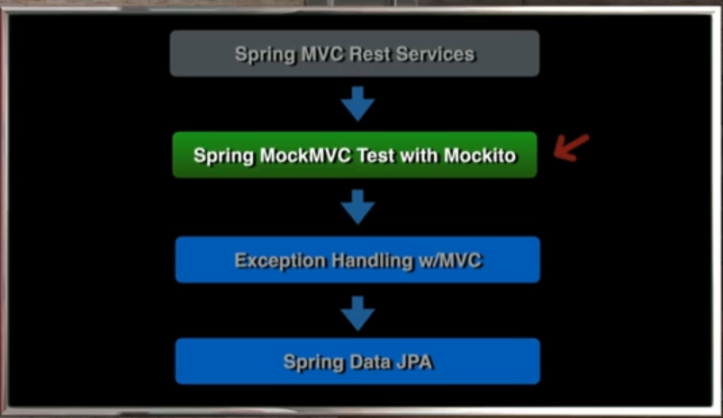
## 002 Introduction to Testing with MockMVC
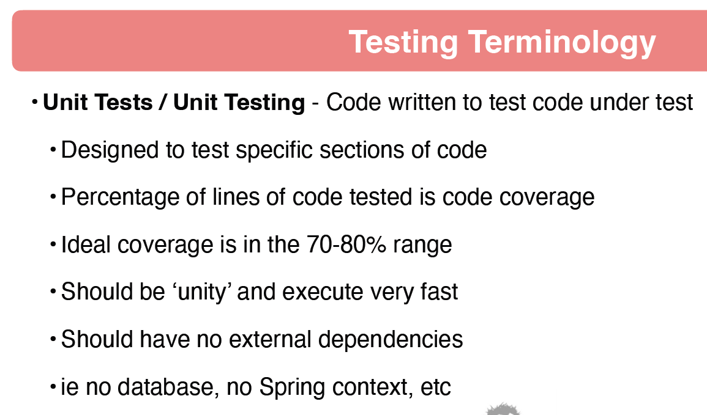
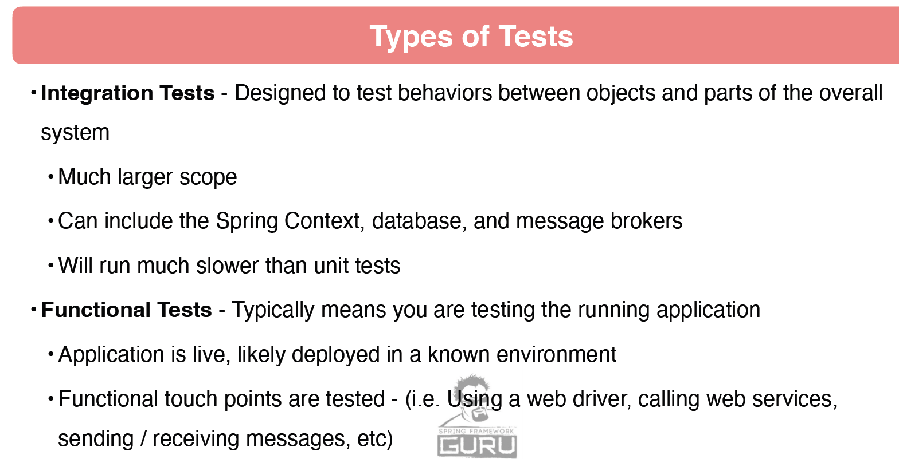
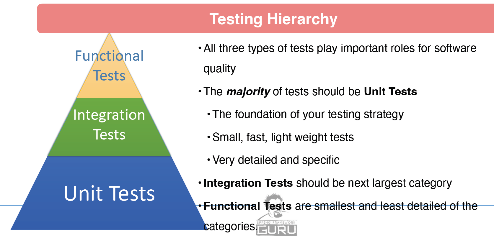
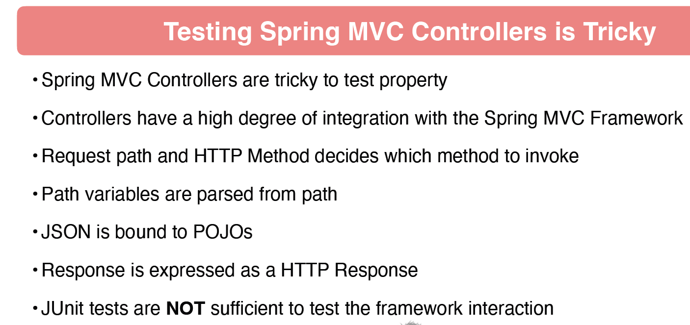
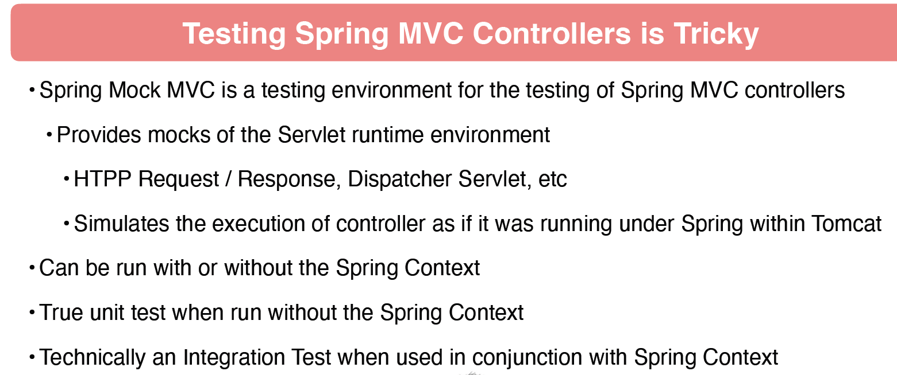
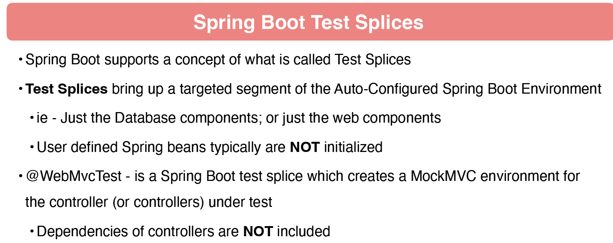
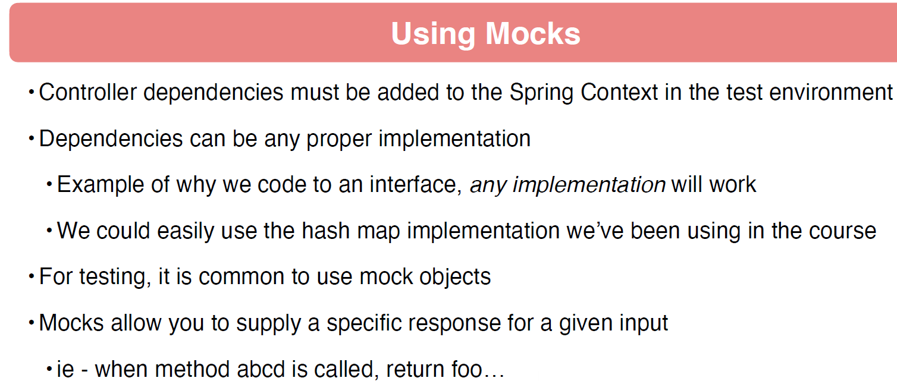
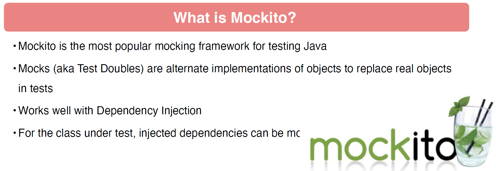
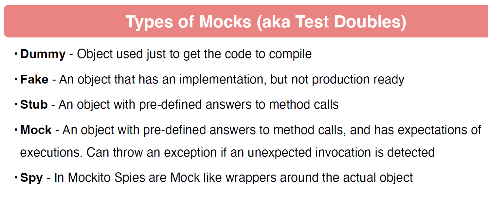
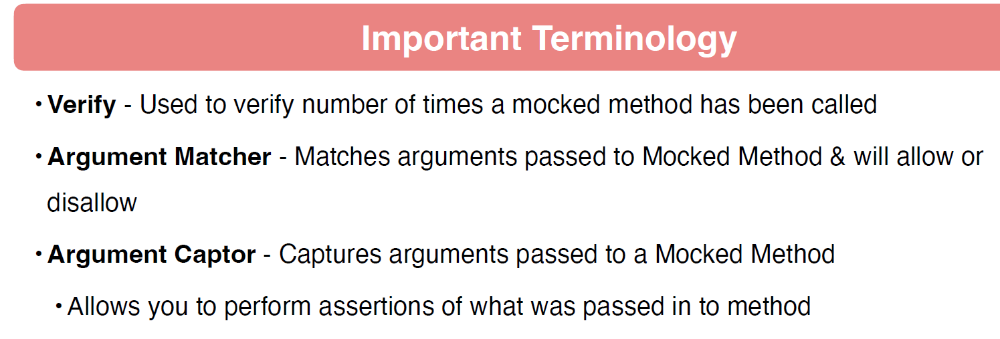
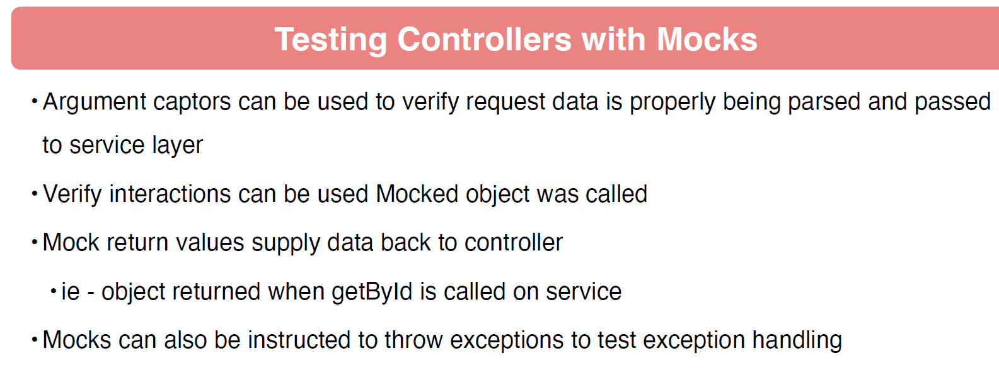
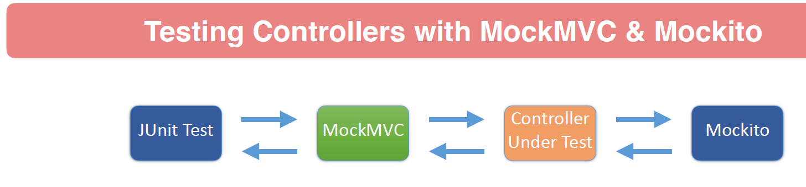
## 003 MockMVC Configuration
```java
package com.wchamara.spring6restmvc.controller;

import com.wchamara.spring6restmvc.service.BeerService;
import org.junit.jupiter.api.Test;
import org.springframework.beans.factory.annotation.Autowired;
import org.springframework.boot.test.autoconfigure.web.servlet.WebMvcTest;
import org.springframework.boot.test.mock.mockito.MockBean;
import org.springframework.test.web.servlet.MockMvc;

import java.util.UUID;

import static org.springframework.test.web.servlet.request.MockMvcRequestBuilders.get;
import static org.springframework.test.web.servlet.result.MockMvcResultMatchers.status;

/**
 * This is a test class for the BeerController class.
 * It is used to test the functionality of the getBeerByIdReturnsBeer method.
 * The method performs a GET request to retrieve a beer by its ID and expects a successful response with status code 200.
 * The test uses the @WebMvcTest annotation to focus on testing the web layer of the BeerController.
 * It autowires the MockMvc instance and mocks the BeerService dependency using the @MockBean annotation.
 */
@WebMvcTest(BeerController.class)
class BeerControllerTest {
    @Autowired
    MockMvc mockMvc;

    @MockBean
    BeerService beerService;

    @Test
    void getBeerByIdReturnsBeer() throws Exception {
        UUID beerId = UUID.fromString("60501fcd-487e-4d83-8c67-3001482e35a2");
        String url = "/api/v1/beer/" + beerId;
        mockMvc.perform(get(url).accept("application/json"))
                .andExpect(status().isOk());
    }
}
```
## 004 Return Data With Mockito
```java
package com.wchamara.spring6restmvc.controller;

import com.wchamara.spring6restmvc.model.Beer;
import com.wchamara.spring6restmvc.service.BeerService;
import com.wchamara.spring6restmvc.service.BeerServiceImpl;
import org.junit.jupiter.api.Test;
import org.springframework.beans.factory.annotation.Autowired;
import org.springframework.boot.test.autoconfigure.web.servlet.WebMvcTest;
import org.springframework.boot.test.mock.mockito.MockBean;
import org.springframework.http.MediaType;
import org.springframework.test.web.servlet.MockMvc;

import java.util.UUID;

import static org.mockito.ArgumentMatchers.any;
import static org.mockito.BDDMockito.given;
import static org.springframework.test.web.servlet.request.MockMvcRequestBuilders.get;
import static org.springframework.test.web.servlet.result.MockMvcResultMatchers.content;
import static org.springframework.test.web.servlet.result.MockMvcResultMatchers.status;

//@SpringBootTest
@WebMvcTest(BeerController.class)
class BeerControllerTest {
    @Autowired
    MockMvc mockMvc;

    @MockBean
    BeerService beerService;

    BeerServiceImpl beerServiceImpl = new BeerServiceImpl();

    @Test
    void getBeerByIdReturnsBeer() throws Exception {
        Beer beer = beerServiceImpl.listAllBeers().get(0);
        given(beerService.getBeerById(any(UUID.class))).willReturn(beer);
        UUID beerId = UUID.fromString("60501fcd-487e-4d83-8c67-3001482e35a2");
        String url = "/api/v1/beer/" + beerId;
        mockMvc.perform(get(url).accept(MediaType.APPLICATION_JSON))
                .andExpect(status().isOk())
                .andExpect(content().contentType(MediaType.APPLICATION_JSON));
    }


}
```
## 005 Using JSON Matchers
```java
package com.wchamara.spring6restmvc.controller;

import com.wchamara.spring6restmvc.model.Beer;
import com.wchamara.spring6restmvc.service.BeerService;
import com.wchamara.spring6restmvc.service.BeerServiceImpl;
import org.junit.jupiter.api.Test;
import org.springframework.beans.factory.annotation.Autowired;
import org.springframework.boot.test.autoconfigure.web.servlet.WebMvcTest;
import org.springframework.boot.test.mock.mockito.MockBean;
import org.springframework.http.MediaType;
import org.springframework.test.web.servlet.MockMvc;

import java.util.UUID;

import static org.mockito.ArgumentMatchers.any;
import static org.mockito.BDDMockito.given;
import static org.springframework.test.web.servlet.request.MockMvcRequestBuilders.get;
import static org.springframework.test.web.servlet.result.MockMvcResultMatchers.*;

//@SpringBootTest
@WebMvcTest(BeerController.class)
class BeerControllerTest {
    @Autowired
    MockMvc mockMvc;

    @MockBean
    BeerService beerService;

    BeerServiceImpl beerServiceImpl = new BeerServiceImpl();

    @Test
    void getBeerByIdReturnsBeer() throws Exception {
        Beer beer = beerServiceImpl.listAllBeers().get(0);
        given(beerService.getBeerById(any(UUID.class))).willReturn(beer);

        String url = "/api/v1/beer/" + beer.getId();
        mockMvc.perform(get(url).accept(MediaType.APPLICATION_JSON))
                .andExpect(status().isOk())
                .andExpect(content().contentType(MediaType.APPLICATION_JSON))
                .andExpect(jsonPath("$.id").value(beer.getId().toString()))
                .andExpect(jsonPath("$.beerName").value(beer.getBeerName()))
                .andExpect(jsonPath("$.beerStyle").value(beer.getBeerStyle().toString()))
                .andExpect(jsonPath("$.upc").value(beer.getUpc()))
                .andExpect(jsonPath("$.quantityOnHand").value(beer.getQuantityOnHand()))
                .andExpect(jsonPath("$.price").value(beer.getPrice().toString()))
                .andExpect(jsonPath("$.createdDate").exists())
                .andExpect(jsonPath("$.updatedDate").exists());
        ;
    }


}
```
## 006 MockMVC Test List Beers
```java
package com.wchamara.spring6restmvc.controller;

import com.wchamara.spring6restmvc.model.Beer;
import com.wchamara.spring6restmvc.service.BeerService;
import com.wchamara.spring6restmvc.service.BeerServiceImpl;
import org.junit.jupiter.api.Test;
import org.springframework.beans.factory.annotation.Autowired;
import org.springframework.boot.test.autoconfigure.web.servlet.WebMvcTest;
import org.springframework.boot.test.mock.mockito.MockBean;
import org.springframework.http.MediaType;
import org.springframework.test.web.servlet.MockMvc;

import java.util.UUID;

import static org.mockito.ArgumentMatchers.any;
import static org.mockito.BDDMockito.given;
import static org.springframework.test.web.servlet.request.MockMvcRequestBuilders.get;
import static org.springframework.test.web.servlet.result.MockMvcResultMatchers.*;

//@SpringBootTest
@WebMvcTest(BeerController.class)
class BeerControllerTest {
    @Autowired
    MockMvc mockMvc;

    @MockBean
    BeerService beerService;

    BeerServiceImpl beerServiceImpl = new BeerServiceImpl();

    @Test
    void listAllBeersReturnsListOfBeers() throws Exception {
        given(beerService.listAllBeers()).willReturn(beerServiceImpl.listAllBeers());

        mockMvc.perform(get("/api/v1/beer").accept(MediaType.APPLICATION_JSON))
                .andExpect(status().isOk())
                .andExpect(content().contentType(MediaType.APPLICATION_JSON))
                .andExpect(jsonPath("$[0].id").exists())
                .andExpect(jsonPath("$[0].beerName").exists())
                .andExpect(jsonPath("$[0].beerStyle").exists())
                .andExpect(jsonPath("$[0].upc").exists())
                .andExpect(jsonPath("$[0].quantityOnHand").exists())
                .andExpect(jsonPath("$[0].price").exists())
                .andExpect(jsonPath("$[0].createdDate").exists())
                .andExpect(jsonPath("$[0].updatedDate").exists());
    }


}
```
## 007 Create JSON Using Jackson
## 008 MockMVC Test Create Beer
## 009 MockMVC Test Update Beer
## 010 MockMVC Test Delete Beer
## 011 MockMVC Test Patch Beer
## 012 DRY - Don't Repeat Yourself
## 013 DRY - Refactoring
## 014 URI Builder