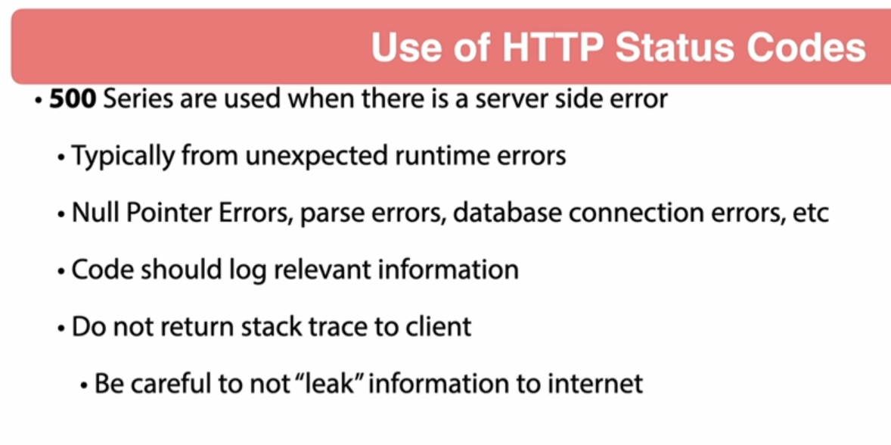

# 08 - Exception Handling with Spring MVC
## 001 Introduction

## 002 Exception Handling Overview





## 003 Throw Custom Exception with Mockito
let's create a custom exception class called `ResourceNotFoundException` in the `com.example.exception` package.

```java
package com.wchamara.spring6restmvc.controller;

public class NotFoundException extends RuntimeException {

    /**
     * Constructs a new runtime exception with {@code null} as its
     * detail message.  The cause is not initialized, and may subsequently be
     * initialized by a call to {@link #initCause}.
     */
    public NotFoundException() {
        super();
    }

    /**
     * Constructs a new runtime exception with the specified detail message.
     * The cause is not initialized, and may subsequently be initialized by a
     * call to {@link #initCause}.
     *
     * @param message the detail message. The detail message is saved for
     *                later retrieval by the {@link #getMessage()} method.
     */
    public NotFoundException(String message) {
        super(message);
    }

    /**
     * Constructs a new runtime exception with the specified detail message and
     * cause.  <p>Note that the detail message associated with
     * {@code cause} is <i>not</i> automatically incorporated in
     * this runtime exception's detail message.
     *
     * @param message the detail message (which is saved for later retrieval
     *                by the {@link #getMessage()} method).
     * @param cause   the cause (which is saved for later retrieval by the
     *                {@link #getCause()} method).  (A {@code null} value is
     *                permitted, and indicates that the cause is nonexistent or
     *                unknown.)
     * @since 1.4
     */
    public NotFoundException(String message, Throwable cause) {
        super(message, cause);
    }

    /**
     * Constructs a new runtime exception with the specified cause and a
     * detail message of {@code (cause==null ? null : cause.toString())}
     * (which typically contains the class and detail message of
     * {@code cause}).  This constructor is useful for runtime exceptions
     * that are little more than wrappers for other throwables.
     *
     * @param cause the cause (which is saved for later retrieval by the
     *              {@link #getCause()} method).  (A {@code null} value is
     *              permitted, and indicates that the cause is nonexistent or
     *              unknown.)
     * @since 1.4
     */
    public NotFoundException(Throwable cause) {
        super(cause);
    }

    /**
     * Constructs a new runtime exception with the specified detail
     * message, cause, suppression enabled or disabled, and writable
     * stack trace enabled or disabled.
     *
     * @param message            the detail message.
     * @param cause              the cause.  (A {@code null} value is permitted,
     *                           and indicates that the cause is nonexistent or unknown.)
     * @param enableSuppression  whether or not suppression is enabled
     *                           or disabled
     * @param writableStackTrace whether or not the stack trace should
     *                           be writable
     * @since 1.7
     */
    protected NotFoundException(String message, Throwable cause, boolean enableSuppression, boolean writableStackTrace) {
        super(message, cause, enableSuppression, writableStackTrace);
    }
}
```

let's write a test for resource not found exception.

```java
    @Test
    void getBeerByIdWillReturnNotFoundException() throws Exception {

        given(beerService.getBeerById(any(UUID.class))).willThrow(NotFoundException.class);


        mockMvc.perform(get(BeerController.BEER_PATH_ID, UUID.randomUUID()).accept(MediaType.APPLICATION_JSON))
                .andExpect(status().isNotFound());
    }
```

## 004 Using Exception Handler
```java
    /**
     * Handles the NotFoundException and returns a ResponseEntity with a not found status.
     * This method is called in the BeerController.
     *
     * @return ResponseEntity with a not found status.
     */
    @ExceptionHandler(NotFoundException.class)
    public ResponseEntity handleNotFoundException() {
        log.debug("handleNotFoundException() called in BeerController");
        return ResponseEntity.notFound().build();
    }
```


## 005 Controller Advice

let's create a new class called `ExceptionController` in the `com.example.controller` package.

by using the `@ControllerAdvice` annotation, we can handle exceptions globally across multiple controllers.


```java
package com.wchamara.spring6restmvc.controller;

import lombok.extern.slf4j.Slf4j;
import org.springframework.http.ResponseEntity;
import org.springframework.web.bind.annotation.ControllerAdvice;
import org.springframework.web.bind.annotation.ExceptionHandler;

@ControllerAdvice
@Slf4j
public class ExceptionController {


    @ExceptionHandler(NotFoundException.class)
    public ResponseEntity handleNotFoundException() {
        log.debug("handleNotFoundException() called in ExceptionController");
        return ResponseEntity.notFound().build();
    }
}
```

let's write a test for the `NotFoundException` exception.

```java
    @Test
    void getCustomerByIdWillThrowNotFoundException() throws Exception {


        given(customerService.getCustomerById(any(UUID.class))).willThrow(NotFoundException.class);

        mockMvc.perform(get(CustomerController.CUSTOMER_PATH_ID, UUID.randomUUID())
                        .accept(MediaType.APPLICATION_JSON))
                .andExpect(status().isNotFound());

    }
```

## 006 Using ResponseStatus Annotation
```java
package com.wchamara.spring6restmvc.controller;

import org.springframework.http.HttpStatus;
import org.springframework.web.bind.annotation.ResponseStatus;

@ResponseStatus(value = HttpStatus.NOT_FOUND, reason = "Value Not Found")
public class NotFoundException extends RuntimeException {

    /**
     * Constructs a new runtime exception with {@code null} as its
     * detail message.  The cause is not initialized, and may subsequently be
     * initialized by a call to {@link #initCause}.
     */
    public NotFoundException() {
        super();
    }

    /**
     * Constructs a new runtime exception with the specified detail message.
     * The cause is not initialized, and may subsequently be initialized by a
     * call to {@link #initCause}.
     *
     * @param message the detail message. The detail message is saved for
     *                later retrieval by the {@link #getMessage()} method.
     */
    public NotFoundException(String message) {
        super(message);
    }

    /**
     * Constructs a new runtime exception with the specified detail message and
     * cause.  <p>Note that the detail message associated with
     * {@code cause} is <i>not</i> automatically incorporated in
     * this runtime exception's detail message.
     *
     * @param message the detail message (which is saved for later retrieval
     *                by the {@link #getMessage()} method).
     * @param cause   the cause (which is saved for later retrieval by the
     *                {@link #getCause()} method).  (A {@code null} value is
     *                permitted, and indicates that the cause is nonexistent or
     *                unknown.)
     * @since 1.4
     */
    public NotFoundException(String message, Throwable cause) {
        super(message, cause);
    }

    /**
     * Constructs a new runtime exception with the specified cause and a
     * detail message of {@code (cause==null ? null : cause.toString())}
     * (which typically contains the class and detail message of
     * {@code cause}).  This constructor is useful for runtime exceptions
     * that are little more than wrappers for other throwables.
     *
     * @param cause the cause (which is saved for later retrieval by the
     *              {@link #getCause()} method).  (A {@code null} value is
     *              permitted, and indicates that the cause is nonexistent or
     *              unknown.)
     * @since 1.4
     */
    public NotFoundException(Throwable cause) {
        super(cause);
    }

    /**
     * Constructs a new runtime exception with the specified detail
     * message, cause, suppression enabled or disabled, and writable
     * stack trace enabled or disabled.
     *
     * @param message            the detail message.
     * @param cause              the cause.  (A {@code null} value is permitted,
     *                           and indicates that the cause is nonexistent or unknown.)
     * @param enableSuppression  whether or not suppression is enabled
     *                           or disabled
     * @param writableStackTrace whether or not the stack trace should
     *                           be writable
     * @since 1.7
     */
    protected NotFoundException(String message, Throwable cause, boolean enableSuppression, boolean writableStackTrace) {
        super(message, cause, enableSuppression, writableStackTrace);
    }
}

```
## 007 Using Java Optional

```java
package com.wchamara.spring6restmvc.service;

import com.wchamara.spring6restmvc.model.Beer;

import java.util.List;
import java.util.Optional;
import java.util.UUID;

public interface BeerService {
    Optional<Beer> getBeerById(UUID id);

    List<Beer> listAllBeers();

    Beer saveNewBeer(Beer beer);

    void updateBeer(UUID id, Beer beer);

    void deleteBeer(UUID id);

    void patchBeer(UUID id, Beer beer);
}

```
```java
package com.wchamara.spring6restmvc.service;

import com.wchamara.spring6restmvc.model.Beer;
import com.wchamara.spring6restmvc.model.BeerStyle;
import org.springframework.stereotype.Service;

import java.math.BigDecimal;
import java.time.LocalDateTime;
import java.util.*;

@Service
public class BeerServiceImpl implements BeerService {

    private Map<UUID, Beer> beerMap = new HashMap<>();

    public BeerServiceImpl() {
        Beer beer1 = Beer.builder()
                .id(UUID.fromString("60501fcd-487e-4d83-8c67-3001482e35a2"))
                .version(1)
                .beerName("Galaxy Cat")
                .beerStyle(BeerStyle.PALE_ALE)
                .upc("123456")
                .price(BigDecimal.valueOf(12.95))
                .quantityOnHand(200)
                .createdDate(LocalDateTime.now())
                .updatedDate(LocalDateTime.now())
                .build();

        Beer beer2 = Beer.builder()
                .id(UUID.randomUUID())
                .version(1)
                .beerName("Galaxy Dog")
                .beerStyle(BeerStyle.PALE_ALE)
                .upc("123457")
                .price(BigDecimal.valueOf(12.95))
                .quantityOnHand(200)
                .createdDate(LocalDateTime.now())
                .updatedDate(LocalDateTime.now())
                .build();

        Beer beer3 = Beer.builder()
                .id(UUID.randomUUID())
                .version(1)
                .beerName("Galaxy Fish")
                .beerStyle(BeerStyle.PALE_ALE)
                .upc("123458")
                .price(BigDecimal.valueOf(12.95))
                .quantityOnHand(200)
                .createdDate(LocalDateTime.now())
                .updatedDate(LocalDateTime.now())
                .build();

        beerMap.put(beer1.getId(), beer1);
        beerMap.put(beer2.getId(), beer2);
        beerMap.put(beer3.getId(), beer3);


    }

    @Override
    public Optional<Beer> getBeerById(UUID id) {
        return Optional.of(beerMap.get(id));
    }


}

```
```java
package com.wchamara.spring6restmvc.controller;

import com.wchamara.spring6restmvc.model.Beer;
import com.wchamara.spring6restmvc.service.BeerService;
import lombok.RequiredArgsConstructor;
import lombok.extern.slf4j.Slf4j;
import org.springframework.http.HttpHeaders;
import org.springframework.http.HttpStatus;
import org.springframework.http.ResponseEntity;
import org.springframework.web.bind.annotation.*;

import java.util.List;
import java.util.UUID;

@RequiredArgsConstructor
@Slf4j
@RestController
public class BeerController {

    public static final String BEER_PATH = "/api/v1/beer";
    public static final String BEER_PATH_ID = BEER_PATH + "/{id}";

    private final BeerService beerService;

    @GetMapping(BEER_PATH_ID)
    public Beer getBeerById(@PathVariable("id") UUID id) {
        log.debug("getBeerById() called in BeerController with id: {}", id);
        return beerService.getBeerById(id).orElseThrow(NotFoundException::new);
    }

}

```
```java
    @Test
    void getBeerByIdWillReturnNotFoundException() throws Exception {

        given(beerService.getBeerById(any(UUID.class))).willReturn(Optional.empty());


        mockMvc.perform(get(BeerController.BEER_PATH_ID, UUID.randomUUID()).accept(MediaType.APPLICATION_JSON))
                .andExpect(status().isNotFound());
    }

```
```java
package com.wchamara.spring6restmvc.service;


import com.wchamara.spring6restmvc.model.Customer;

import java.util.List;
import java.util.Optional;
import java.util.UUID;

/**
 * Created by jt, Spring Framework Guru.
 */
public interface CustomerService {

    Optional<Customer> getCustomerById(UUID uuid);

    List<Customer> getAllCustomers();

    Customer saveNewCustomer(Customer customer);

    void updateCustomerById(UUID customerId, Customer customer);

    void deleteCustomerById(UUID customerId);

    void patchCustomerById(UUID customerId, Customer customer);
}
```
```java

    @Override
    public Optional<Customer> getCustomerById(UUID uuid) {
        return Optional.ofNullable(customerMap.get(uuid));
    }
```
```java
    @Test
    void getCustomerByIdWillThrowNotFoundException() throws Exception {


        given(customerService.getCustomerById(any(UUID.class))).willReturn(Optional.empty());

        mockMvc.perform(get(CustomerController.CUSTOMER_PATH_ID, UUID.randomUUID())
                        .accept(MediaType.APPLICATION_JSON))
                .andExpect(status().isNotFound());

    }
```