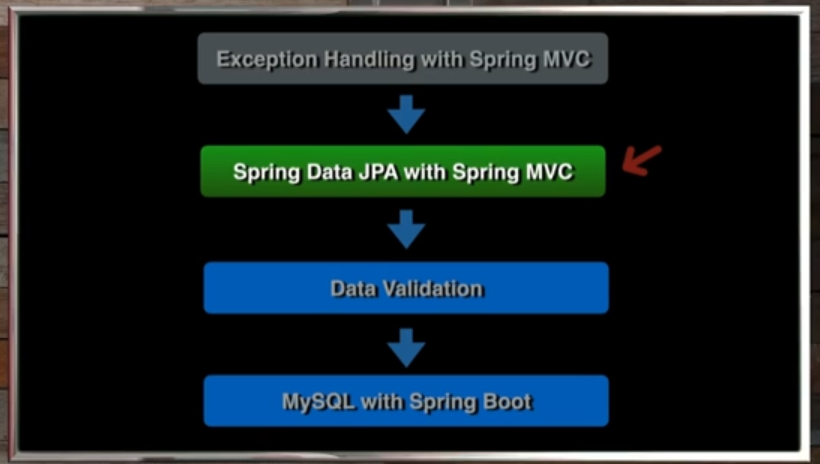
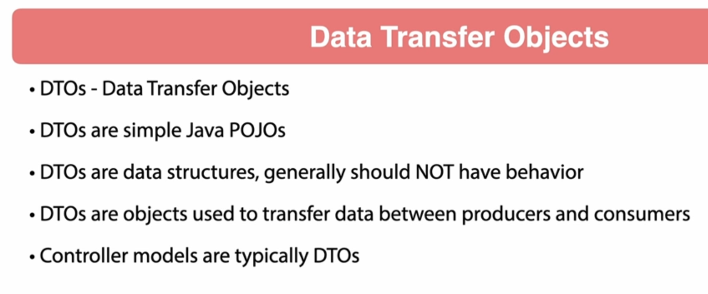
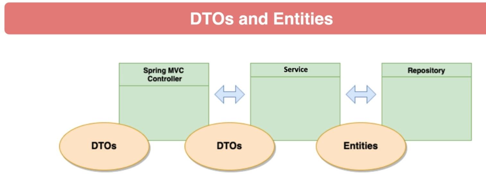
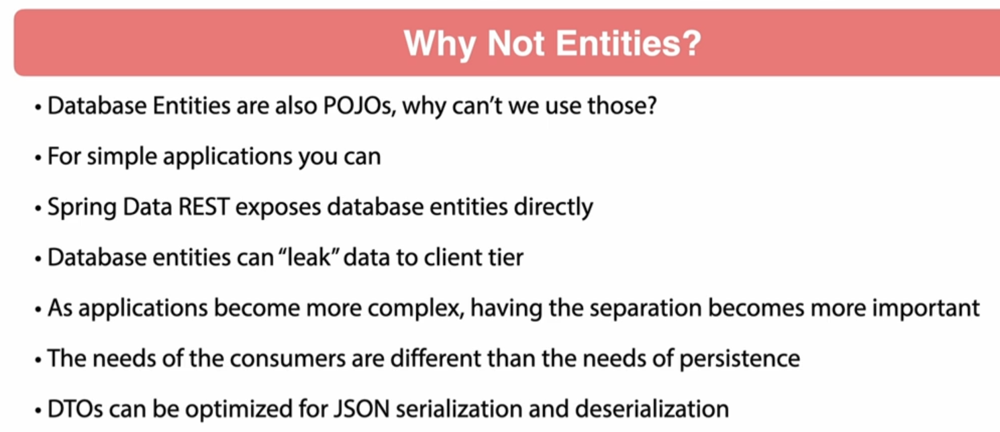
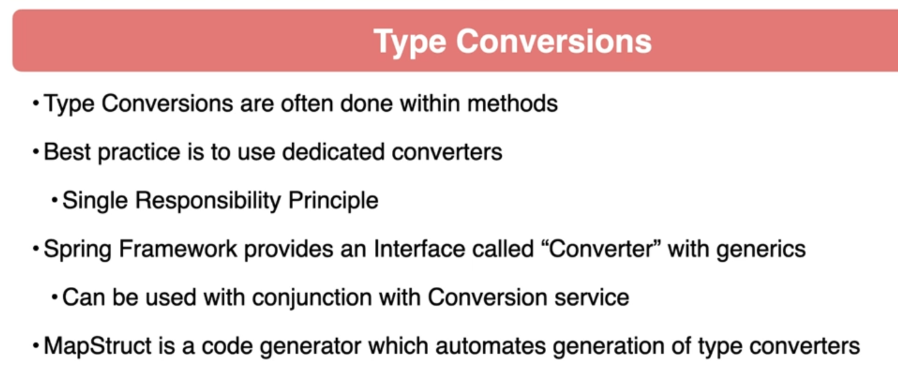
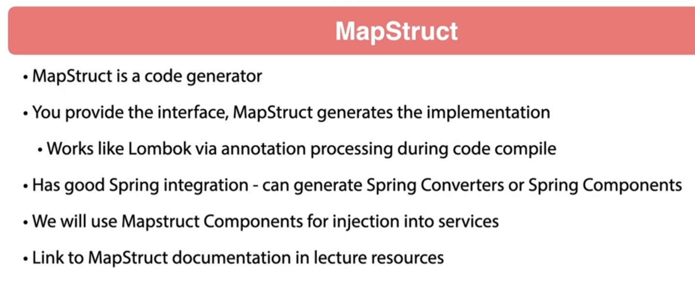

# 09 - Spring Data JPA with Spring MVC

## 001 Introduction

## 002 Data Transfer Objects






## 003 Refactoring to DTOs
```java
package com.wchamara.spring6restmvc.model;

import lombok.Builder;
import lombok.Data;

import java.math.BigDecimal;
import java.time.LocalDateTime;
import java.util.UUID;

@Data
@Builder
public class BeerDTO {
    private UUID id;
    private Integer version;
    private String beerName;
    private BeerStyle beerStyle;
    private String upc;
    private Integer quantityOnHand;
    private BigDecimal price;
    private LocalDateTime createdDate;
    private LocalDateTime updatedDate;
}

```
```java
package com.wchamara.spring6restmvc.model;

import lombok.Builder;
import lombok.Data;

import java.time.LocalDateTime;
import java.util.UUID;

/**
 * Created by jt, Spring Framework Guru.
 */
@Data
@Builder
public class CustomerDTO {

    private String name;
    private UUID id;
    private Integer version;
    private LocalDateTime createdDate;
    private LocalDateTime updateDate;
}
```
```java
package com.wchamara.spring6restmvc.service;

import com.wchamara.spring6restmvc.model.BeerDTO;

import java.util.List;
import java.util.Optional;
import java.util.UUID;

public interface BeerService {
    Optional<BeerDTO> getBeerById(UUID id);

    List<BeerDTO> listAllBeers();

    BeerDTO saveNewBeer(BeerDTO beerDTO);

    void updateBeer(UUID id, BeerDTO beerDTO);

    void deleteBeer(UUID id);

    void patchBeer(UUID id, BeerDTO beerDTO);
}

```
## 004 Spring Data JPA Dependencies
```xml
        <dependency>
            <groupId>org.springframework.boot</groupId>
            <artifactId>spring-boot-starter-data-jpa</artifactId>
        </dependency>
        <dependency>
            <groupId>com.h2database</groupId>
            <artifactId>h2</artifactId>
        </dependency>
```

The selected code includes two dependencies for a Spring Boot project, specified in the `pom.xml` file. These dependencies are essential for integrating JPA (Java Persistence API) and an in-memory H2 database into the project.

The first dependency is for `spring-boot-starter-data-jpa`:
```xml
<dependency>
    <groupId>org.springframework.boot</groupId>
    <artifactId>spring-boot-starter-data-jpa</artifactId>
</dependency>
```
This dependency provides the necessary libraries and configurations to use JPA with Spring Data. It simplifies database interactions by offering a repository abstraction layer, which allows developers to perform CRUD operations without writing boilerplate code. It also includes Hibernate as the default JPA implementation.

The second dependency is for `h2`:
```xml
<dependency>
    <groupId>com.h2database</groupId>
    <artifactId>h2</artifactId>
</dependency>
```
This dependency includes the H2 database, which is an in-memory database commonly used for development and testing purposes. It allows for quick setup and teardown of the database, making it ideal for running tests or developing applications without needing a full-fledged database server.

Together, these dependencies enable the project to use JPA for database operations and H2 as the database, providing a robust and efficient way to manage data within a Spring Boot application.

## 005 Creating JPA Entities

```java
package com.wchamara.spring6restmvc.entities;

import jakarta.persistence.Entity;
import jakarta.persistence.Id;
import jakarta.persistence.Version;
import lombok.*;

import java.time.LocalDateTime;
import java.util.UUID;

@Entity
@AllArgsConstructor
@NoArgsConstructor
@Getter
@Setter
@Builder
public class Customer {
    @Id
    private UUID id;
    @Version
    private Integer version;
    private String name;
    private LocalDateTime createdDate;
    private LocalDateTime updateDate;
}

```
```java
package com.wchamara.spring6restmvc.entities;

import com.wchamara.spring6restmvc.model.BeerStyle;
import jakarta.persistence.Entity;
import jakarta.persistence.Id;
import jakarta.persistence.Version;
import lombok.*;

import java.math.BigDecimal;
import java.time.LocalDateTime;
import java.util.UUID;

@Entity
@AllArgsConstructor
@NoArgsConstructor
@Getter
@Setter
@Builder
public class Beer {

    @Id
    private UUID id;
    @Version
    private Integer version;
    private String beerName;
    private BeerStyle beerStyle;
    private String upc;
    private Integer quantityOnHand;
    private BigDecimal price;
    private LocalDateTime createdDate;
    private LocalDateTime updatedDate;
}

```


## 006 Hibernate UUID Id Generation
```java
package com.wchamara.spring6restmvc.entities;

import jakarta.persistence.*;
import lombok.*;
import org.hibernate.annotations.UuidGenerator;

import java.time.LocalDateTime;
import java.util.UUID;

@Entity
@AllArgsConstructor
@NoArgsConstructor
@Getter
@Setter
@Builder
public class Customer {
    @Id
    @GeneratedValue
    @UuidGenerator
    @Column(length = 36, columnDefinition = "varchar", updatable = false, nullable = false)
    private UUID id;
    @Version
    private Integer version;
    private String name;
    private LocalDateTime createdDate;
    private LocalDateTime updateDate;
}

```
```java
package com.wchamara.spring6restmvc.entities;

import com.wchamara.spring6restmvc.model.BeerStyle;
import jakarta.persistence.*;
import lombok.*;
import org.hibernate.annotations.UuidGenerator;

import java.math.BigDecimal;
import java.time.LocalDateTime;
import java.util.UUID;

@Entity
@AllArgsConstructor
@NoArgsConstructor
@Getter
@Setter
@Builder
public class Beer {

    @Id
    @GeneratedValue
    @UuidGenerator
    @Column(length = 36, columnDefinition = "varchar", updatable = false, nullable = false)
    private UUID id;
    @Version
    private Integer version;
    private String beerName;
    private BeerStyle beerStyle;
    private String upc;
    private Integer quantityOnHand;
    private BigDecimal price;
    private LocalDateTime createdDate;
    private LocalDateTime updatedDate;
}

```

## 007 Spring Data JPA Repositories

```java
package com.wchamara.spring6restmvc.repositories;

import com.wchamara.spring6restmvc.entities.Beer;
import org.springframework.data.jpa.repository.JpaRepository;

import java.util.UUID;

public interface BeerRepository extends JpaRepository<Beer, UUID> {
}

```
```java
package com.wchamara.spring6restmvc.repositories;

import com.wchamara.spring6restmvc.entities.Customer;
import org.springframework.data.jpa.repository.JpaRepository;

import java.util.UUID;

public interface CustomerRepository extends JpaRepository<Customer, UUID> {
}

```


## 008 Spring Boot JPA Test Splice

```java
package com.wchamara.spring6restmvc.repositories;

import com.wchamara.spring6restmvc.entities.Customer;
import org.junit.jupiter.api.Test;
import org.springframework.beans.factory.annotation.Autowired;
import org.springframework.boot.test.autoconfigure.orm.jpa.DataJpaTest;

import static org.assertj.core.api.AssertionsForClassTypes.assertThat;

@DataJpaTest
class CustomerRepositoryTest {

    @Autowired
    CustomerRepository customerRepository;

    @Test
    void savedCustomer() {
        // Given
        Customer customer = Customer.builder().name("Chamara").build();

        // When
        Customer savedCustomer = customerRepository.save(customer);

        // Then
        assertThat(savedCustomer).isNotNull();
        assertThat(savedCustomer.getName()).isEqualTo("Chamara");
        assertThat(savedCustomer.getId()).isNotNull();
    }
}
```
```java
package com.wchamara.spring6restmvc.repositories;

import com.wchamara.spring6restmvc.entities.Beer;
import org.junit.jupiter.api.Test;
import org.springframework.beans.factory.annotation.Autowired;
import org.springframework.boot.test.autoconfigure.orm.jpa.DataJpaTest;

import static org.assertj.core.api.AssertionsForClassTypes.assertThat;

@DataJpaTest
class BeerRepositoryTest {

    @Autowired
    BeerRepository beerRepository;

    @Test
    void saveBeer() {

        Beer budweiser1 = Beer.builder().beerName("Budweiser").build();
        Beer savedBudweiser = beerRepository.save(budweiser1);

        assertThat(savedBudweiser).isNotNull();
        assertThat(savedBudweiser.getBeerName()).isEqualTo("Budweiser");
        assertThat(savedBudweiser.getId()).isNotNull();
    }
}
```
## 009 MapStruct Dependencies and Configuration

```xml
<properties>
    <java.version>21</java.version>
    <org.mapstruct.version>1.6.0</org.mapstruct.version>
</properties>
```

```xml
<dependency>
    <groupId>org.mapstruct</groupId>
    <artifactId>mapstruct</artifactId>
    <version>${org.mapstruct.version}</version>
</dependency>
```

```xml
<plugin>
    <!-- Specifies the group ID of the Maven Compiler Plugin -->
    <groupId>org.apache.maven.plugins</groupId>
    <!-- Specifies the artifact ID of the Maven Compiler Plugin -->
    <artifactId>maven-compiler-plugin</artifactId>
    <!-- Specifies the version of the Maven Compiler Plugin -->
    <version>3.13.0</version>
    <configuration>
        <!-- Sets the source Java version to be used by the compiler -->
        <source>${java.version}</source>
        <!-- Sets the target Java version for the compiled classes -->
        <target>${java.version}</target>
        <annotationProcessorPaths>
            <!-- Specifies the path for the MapStruct annotation processor -->
            <path>
                <groupId>org.mapstruct</groupId>
                <artifactId>mapstruct-processor</artifactId>
                <version>${org.mapstruct.version}</version>
            </path>
            <!-- Specifies the path for the Lombok annotation processor -->
            <path>
                <groupId>org.projectlombok</groupId>
                <artifactId>lombok</artifactId>
                <version>${lombok.version}</version>
            </path>
            <!-- Specifies the path for the Lombok-MapStruct binding processor -->
            <path>
                <groupId>org.projectlombok</groupId>
                <artifactId>lombok-mapstruct-binding</artifactId>
                <version>0.2.0</version>
            </path>
        </annotationProcessorPaths>
        <compilerArgs>
            <!-- Sets the default component model for MapStruct to Spring -->
            <compilerArg>-Amapstruct.defaultComponentModel=spring</compilerArg>
        </compilerArgs>
    </configuration>
</plugin>
```

The selected code configures the Maven Compiler Plugin in a `pom.xml` file for a Java project. This plugin is essential for compiling Java source code and is configured with specific settings to ensure compatibility and proper functionality with the project's requirements.

First, the plugin is identified by its group ID and artifact ID:
```xml
<groupId>org.apache.maven.plugins</groupId>
<artifactId>maven-compiler-plugin</artifactId>
```
The version of the plugin is specified to ensure that a particular version is used:
```xml
<version>3.13.0</version>
```
The `<configuration>` section sets the Java source and target versions, which dictate the version of Java to be used for compiling the source code and the version of the generated bytecode, respectively:
```xml
<source>${java.version}</source>
<target>${java.version}</target>
```
The `<annotationProcessorPaths>` section specifies the paths for annotation processors that the compiler should use. This includes processors for MapStruct and Lombok, which are commonly used for generating boilerplate code and mapping between Java objects:
```xml
<path>
    <groupId>org.mapstruct</groupId>
    <artifactId>mapstruct-processor</artifactId>
    <version>${org.mapstruct.version}</version>
</path>
<path>
    <groupId>org.projectlombok</groupId>
    <artifactId>lombok</artifactId>
    <version>${lombok.version}</version>
</path>
<path>
    <groupId>org.projectlombok</groupId>
    <artifactId>lombok-mapstruct-binding</artifactId>
    <version>0.2.0</version>
</path>
```
Finally, the `<compilerArgs>` section includes additional arguments for the compiler. In this case, it sets the default component model for MapStruct to Spring, which integrates MapStruct with the Spring framework:
```xml
<compilerArg>-Amapstruct.defaultComponentModel=spring</compilerArg>
```
This configuration ensures that the Maven Compiler Plugin is set up correctly to handle the project's specific needs, including the use of annotation processors and compatibility with the specified Java version.
## 010 MapStruct Mappers

```java
package com.wchamara.spring6restmvc.mapper;

import com.wchamara.spring6restmvc.entities.Customer;
import com.wchamara.spring6restmvc.model.CustomerDTO;
import org.mapstruct.Mapper;

@Mapper
public interface CustomerMapper {

    Customer customerDtoToCustomer(CustomerDTO customerDto);

    CustomerDTO customerToCustomerDto(Customer customer);
}

```
```java
package com.wchamara.spring6restmvc.mapper;

import com.wchamara.spring6restmvc.entities.Beer;
import com.wchamara.spring6restmvc.model.BeerDTO;
import org.mapstruct.Mapper;

@Mapper
public interface BeerMapper {

    Beer beerDtoToBeer(BeerDTO beerDto);

    BeerDTO beerToBeerDto(Beer beer);
}

```
```java
package com.wchamara.spring6restmvc.mapper;

import com.wchamara.spring6restmvc.entities.Beer;
import com.wchamara.spring6restmvc.model.BeerDTO;
import javax.annotation.processing.Generated;
import org.springframework.stereotype.Component;

@Generated(
    value = "org.mapstruct.ap.MappingProcessor",
    date = "2024-08-18T15:48:09+0530",
    comments = "version: 1.6.0, compiler: javac, environment: Java 21.0.3 (Amazon.com Inc.)"
)
@Component
public class BeerMapperImpl implements BeerMapper {

    @Override
    public Beer beerDtoToBeer(BeerDTO beerDto) {
        if ( beerDto == null ) {
            return null;
        }

        Beer.BeerBuilder beer = Beer.builder();

        beer.id( beerDto.getId() );
        beer.version( beerDto.getVersion() );
        beer.beerName( beerDto.getBeerName() );
        beer.beerStyle( beerDto.getBeerStyle() );
        beer.upc( beerDto.getUpc() );
        beer.quantityOnHand( beerDto.getQuantityOnHand() );
        beer.price( beerDto.getPrice() );
        beer.createdDate( beerDto.getCreatedDate() );
        beer.updatedDate( beerDto.getUpdatedDate() );

        return beer.build();
    }

    @Override
    public BeerDTO beerToBeerDto(Beer beer) {
        if ( beer == null ) {
            return null;
        }

        BeerDTO.BeerDTOBuilder beerDTO = BeerDTO.builder();

        beerDTO.id( beer.getId() );
        beerDTO.version( beer.getVersion() );
        beerDTO.beerName( beer.getBeerName() );
        beerDTO.beerStyle( beer.getBeerStyle() );
        beerDTO.upc( beer.getUpc() );
        beerDTO.quantityOnHand( beer.getQuantityOnHand() );
        beerDTO.price( beer.getPrice() );
        beerDTO.createdDate( beer.getCreatedDate() );
        beerDTO.updatedDate( beer.getUpdatedDate() );

        return beerDTO.build();
    }
}

```
```java
package com.wchamara.spring6restmvc.mapper;

import com.wchamara.spring6restmvc.entities.Customer;
import com.wchamara.spring6restmvc.model.CustomerDTO;
import javax.annotation.processing.Generated;
import org.springframework.stereotype.Component;

@Generated(
    value = "org.mapstruct.ap.MappingProcessor",
    date = "2024-08-18T15:48:09+0530",
    comments = "version: 1.6.0, compiler: javac, environment: Java 21.0.3 (Amazon.com Inc.)"
)
@Component
public class CustomerMapperImpl implements CustomerMapper {

    @Override
    public Customer customerDtoToCustomer(CustomerDTO customerDto) {
        if ( customerDto == null ) {
            return null;
        }

        Customer.CustomerBuilder customer = Customer.builder();

        customer.id( customerDto.getId() );
        customer.version( customerDto.getVersion() );
        customer.name( customerDto.getName() );
        customer.createdDate( customerDto.getCreatedDate() );
        customer.updateDate( customerDto.getUpdateDate() );

        return customer.build();
    }

    @Override
    public CustomerDTO customerToCustomerDto(Customer customer) {
        if ( customer == null ) {
            return null;
        }

        CustomerDTO.CustomerDTOBuilder customerDTO = CustomerDTO.builder();

        customerDTO.name( customer.getName() );
        customerDTO.id( customer.getId() );
        customerDTO.version( customer.getVersion() );
        customerDTO.createdDate( customer.getCreatedDate() );
        customerDTO.updateDate( customer.getUpdateDate() );

        return customerDTO.build();
    }
}

```

## 011 JPA Services
```java
package com.wchamara.spring6restmvc.service;

import com.wchamara.spring6restmvc.mapper.BeerMapper;
import com.wchamara.spring6restmvc.model.BeerDTO;
import com.wchamara.spring6restmvc.repositories.BeerRepository;
import lombok.RequiredArgsConstructor;
import org.springframework.context.annotation.Primary;
import org.springframework.stereotype.Service;

import java.util.List;
import java.util.Optional;
import java.util.UUID;

@Service
@Primary
@RequiredArgsConstructor
public class BeerServiceImplJPA implements BeerService {

    BeerRepository beerRepository;

    BeerMapper beerMapper;

    @Override
    public Optional<BeerDTO> getBeerById(UUID id) {
        return Optional.empty();
    }

    @Override
    public List<BeerDTO> listAllBeers() {
        return List.of();
    }

    @Override
    public BeerDTO saveNewBeer(BeerDTO beerDTO) {
        return null;
    }

    @Override
    public void updateBeer(UUID id, BeerDTO beerDTO) {

    }

    @Override
    public void deleteBeer(UUID id) {

    }

    @Override
    public void patchBeer(UUID id, BeerDTO beerDTO) {

    }
}

```

```java
package com.wchamara.spring6restmvc.service;

import com.wchamara.spring6restmvc.model.CustomerDTO;
import lombok.RequiredArgsConstructor;
import org.springframework.context.annotation.Primary;
import org.springframework.stereotype.Service;

import java.util.List;
import java.util.Optional;
import java.util.UUID;

@Primary
@RequiredArgsConstructor
@Service
public class CustomerServiceImplJPA implements CustomerService {
    @Override
    public Optional<CustomerDTO> getCustomerById(UUID uuid) {
        return Optional.empty();
    }

    @Override
    public List<CustomerDTO> getAllCustomers() {
        return List.of();
    }

    @Override
    public CustomerDTO saveNewCustomer(CustomerDTO customer) {
        return null;
    }

    @Override
    public void updateCustomerById(UUID customerId, CustomerDTO customer) {

    }

    @Override
    public void deleteCustomerById(UUID customerId) {

    }

    @Override
    public void patchCustomerById(UUID customerId, CustomerDTO customer) {

    }
}

```
## 012 JPA Get Operations
```java
package com.wchamara.spring6restmvc.service;

import com.wchamara.spring6restmvc.mapper.BeerMapper;
import com.wchamara.spring6restmvc.model.BeerDTO;
import com.wchamara.spring6restmvc.repositories.BeerRepository;
import lombok.RequiredArgsConstructor;
import org.springframework.context.annotation.Primary;
import org.springframework.stereotype.Service;

import java.util.List;
import java.util.Optional;
import java.util.UUID;

@Service
@Primary
@RequiredArgsConstructor
public class BeerServiceImplJPA implements BeerService {

    private final BeerRepository beerRepository;

    private final BeerMapper beerMapper;

    @Override
    public Optional<BeerDTO> getBeerById(UUID id) {
        return Optional.ofNullable(beerMapper.beerToBeerDto(beerRepository.findById(id).orElse(null)));
    }

    @Override
    public List<BeerDTO> listAllBeers() {
        return beerRepository.findAll().stream().map(beerMapper::beerToBeerDto).toList();
    }

}

```


## 013 Controller Integration Test
```java

```


## 014 Testing for expected Exceptions
```java

```


## 015 JPA Save New Beer Operation

```java

```

## 016 JPA Update Beer by Id Operation

```java

```

## 017 JPA Update Beer Not Found
```java

```


## 018 JPA Delete Beer by Id
```java

```


## 019 JPA Delete by Id Not Found

```java

```
