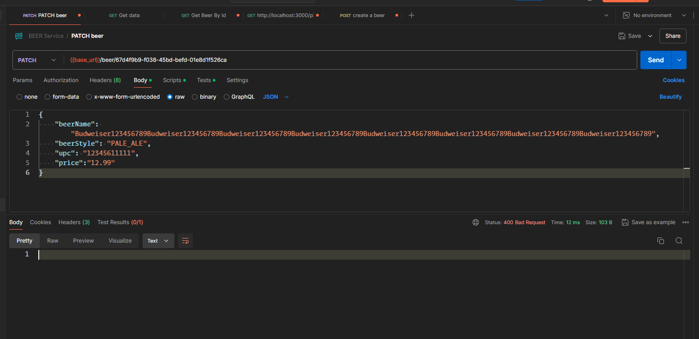

# 10 - Data Validation

## 001 Introduction

### Overview of Spring Data Validation

Spring Data Validation refers to the process of ensuring that the data being processed in a Spring application is correct and adheres to the expected format and constraints. This is a crucial aspect of any application that handles user input or interacts with a database, as it helps prevent errors, inconsistencies, and potential security vulnerabilities.

### Key Concepts

1. **Bean Validation (JSR 380)**:
   - **Hibernate Validator**: Spring uses Hibernate Validator as the default implementation of the Bean Validation API (JSR 380). This API provides a set of annotations to enforce validation rules on Java beans.
   - **Annotations**: Common annotations include `@NotNull`, `@Size`, `@Min`, `@Max`, `@Pattern`, and `@Email`. These annotations can be placed on fields, methods, or parameters to enforce validation.
     ```java
     public class User {
         @NotNull
         private String name;

         @Email
         private String email;

         @Size(min = 5, max = 14)
         private String password;
     }
     ```

2. **Validation in Spring MVC**:
   - **Controller-Level Validation**: In a Spring MVC application, validation can be applied at the controller level using the `@Valid` or `@Validated` annotations. When a form is submitted, the input data is automatically validated before it reaches the business logic.
   - **BindingResult**: After validation, a `BindingResult` object can be used to check if any validation errors occurred.
     ```java
     @PostMapping("/register")
     public String registerUser(@Valid @ModelAttribute("user") User user, BindingResult result) {
         if (result.hasErrors()) {
             return "registrationForm";
         }
         // proceed with registration
         return "success";
     }
     ```

3. **Custom Validators**:
   - **Custom Annotations**: If the built-in annotations are not sufficient, you can create custom validation annotations by implementing the `ConstraintValidator` interface.
     ```java
     @Target({ ElementType.FIELD })
     @Retention(RetentionPolicy.RUNTIME)
     @Constraint(validatedBy = CustomValidator.class)
     public @interface CustomConstraint {
         String message() default "Invalid value";
         Class<?>[] groups() default {};
         Class<? extends Payload>[] payload() default {};
     }
     ```
   - **Validator Implementation**: The logic for the custom validation is implemented in a class that implements `ConstraintValidator`.
     ```java
     public class CustomValidator implements ConstraintValidator<CustomConstraint, String> {
         @Override
         public boolean isValid(String value, ConstraintValidatorContext context) {
             return value != null && value.matches("[A-Za-z0-9]+");
         }
     }
     ```

4. **Global Exception Handling**:
   - **Controller Advice**: Spring allows you to handle validation errors globally using `@ControllerAdvice` and `@ExceptionHandler` annotations. This ensures that you can manage all validation errors in a consistent manner across your application.
     ```java
     @ControllerAdvice
     public class GlobalExceptionHandler {
         @ExceptionHandler(MethodArgumentNotValidException.class)
         public ResponseEntity<Object> handleValidationExceptions(MethodArgumentNotValidException ex) {
             Map<String, String> errors = new HashMap<>();
             ex.getBindingResult().getAllErrors().forEach(error -> {
                 String fieldName = ((FieldError) error).getField();
                 String errorMessage = error.getDefaultMessage();
                 errors.put(fieldName, errorMessage);
             });
             return new ResponseEntity<>(errors, HttpStatus.BAD_REQUEST);
         }
     }
     ```

### Benefits of Spring Data Validation
- **Error Prevention**: Early detection of errors before data reaches the business logic or database.
- **Security**: Prevents injection attacks by ensuring that data conforms to expected patterns.
- **Consistency**: Ensures that the data conforms to business rules consistently across the application.

### Conclusion
Spring Data Validation is an essential feature in Spring applications for maintaining data integrity, security, and consistency. It leverages the powerful Bean Validation API and integrates seamlessly into the Spring ecosystem, providing developers with robust tools to validate data effectively.

For more detailed information, you can refer to the [Spring Framework documentation](https://docs.spring.io/spring-framework/docs/current/reference/html/core.html#validation) and the [JSR 380 Bean Validation API](https://beanvalidation.org/2.0-jsr380/).
## 002 Data Validation Overview


## 003 Java Bean Validation Maven Dependencies
### Adding Spring Starter Validation to Maven or Gradle Projects

To incorporate Spring's validation features into your project, you can add the Spring Boot Starter Validation dependency. This starter includes everything needed to start validating your data in a Spring Boot application.

#### Maven
Add the following dependency to your `pom.xml`:

```xml
<dependencies>
    <!-- Other dependencies -->

    <!-- Spring Boot Starter Validation -->
    <dependency>
        <groupId>org.springframework.boot</groupId>
        <artifactId>spring-boot-starter-validation</artifactId>
    </dependency>

</dependencies>
```

#### Gradle
Add the following to your `build.gradle`:

```groovy
dependencies {
    // Other dependencies

    // Spring Boot Starter Validation
    implementation 'org.springframework.boot:spring-boot-starter-validation'
}
```

### Real-World Examples of Validation

#### Example 1: User Registration Form Validation

Imagine you are building a user registration form that collects basic information like name, email, and password. You want to ensure that the data entered is valid before it is processed.

##### Entity Class with Validation Annotations

```java
import jakarta.validation.constraints.Email;
import jakarta.validation.constraints.NotBlank;
import jakarta.validation.constraints.Size;

public class UserRegistrationDto {

    @NotBlank(message = "Name is required")
    private String name;

    @Email(message = "Email should be valid")
    @NotBlank(message = "Email is required")
    private String email;

    @Size(min = 8, message = "Password should be at least 8 characters")
    @NotBlank(message = "Password is required")
    private String password;

    // Getters and Setters
}
```

##### Controller to Handle Validation

```java
import org.springframework.http.HttpStatus;
import org.springframework.http.ResponseEntity;
import org.springframework.validation.BindingResult;
import org.springframework.web.bind.annotation.PostMapping;
import org.springframework.web.bind.annotation.RequestBody;
import org.springframework.web.bind.annotation.RestController;
import jakarta.validation.Valid;

@RestController
public class UserController {

    @PostMapping("/register")
    public ResponseEntity<String> registerUser(@Valid @RequestBody UserRegistrationDto userDto, BindingResult result) {
        if (result.hasErrors()) {
            return new ResponseEntity<>(result.getAllErrors().toString(), HttpStatus.BAD_REQUEST);
        }

        // Proceed with registration logic
        return new ResponseEntity<>("User registered successfully", HttpStatus.OK);
    }
}
```

In this example:
- **`@NotBlank`** ensures that the `name`, `email`, and `password` fields are not null or empty.
- **`@Email`** ensures the `email` field contains a valid email format.
- **`@Size(min = 8)`** ensures the `password` is at least 8 characters long.

If the user submits invalid data, the `BindingResult` object collects all validation errors, which can then be returned as a response to inform the user.

#### Example 2: Product Management System

Consider an application that manages products with fields like `name`, `price`, and `expirationDate`.

##### Product Entity with Validation

```java
import jakarta.validation.constraints.Min;
import jakarta.validation.constraints.NotBlank;
import jakarta.validation.constraints.NotNull;
import jakarta.validation.constraints.PastOrPresent;
import java.time.LocalDate;

public class Product {

    @NotBlank(message = "Product name is required")
    private String name;

    @NotNull(message = "Price is required")
    @Min(value = 1, message = "Price should be greater than zero")
    private Double price;

    @PastOrPresent(message = "Expiration date cannot be in the future")
    private LocalDate expirationDate;

    // Getters and Setters
}
```

##### Product Controller

```java
import org.springframework.http.HttpStatus;
import org.springframework.http.ResponseEntity;
import org.springframework.web.bind.annotation.PostMapping;
import org.springframework.web.bind.annotation.RequestBody;
import org.springframework.web.bind.annotation.RestController;
import jakarta.validation.Valid;

@RestController
public class ProductController {

    @PostMapping("/products")
    public ResponseEntity<String> addProduct(@Valid @RequestBody Product product) {
        // Business logic to save the product

        return new ResponseEntity<>("Product added successfully", HttpStatus.CREATED);
    }
}
```

In this example:
- **`@NotBlank`** ensures the product name is not empty.
- **`@Min(1)`** ensures the price is greater than zero.
- **`@PastOrPresent`** ensures the expiration date is either in the past or present, not in the future.

### Further Enhancements

- **Custom Validation**: If built-in validators are insufficient, you can create custom validation annotations and validators by implementing the `ConstraintValidator` interface.
- **Global Error Handling**: Use `@ControllerAdvice` to handle validation errors globally across your application, providing consistent error responses.

These examples should give you a clear understanding of how to implement and use validation in real-world Spring Boot applications. The provided patterns help ensure that your application handles input data correctly and provides meaningful feedback when validation errors occur.

### Additional Resources
- [Spring Boot Documentation - Validation](https://docs.spring.io/spring-boot/docs/current/reference/htmlsingle/#boot-features-validation)
- [Hibernate Validator Documentation](https://hibernate.org/validator/documentation/)


## 004 Controller Binding Validation

```java
    @PostMapping(BEER_PATH)
    public ResponseEntity saveNewBeer(@Valid @RequestBody BeerDTO beerDTO) {
        log.debug("saveNewBeer() called in BeerController with beer: {}", beerDTO);
        BeerDTO savedBeerDTO = beerService.saveNewBeer(beerDTO);
        HttpHeaders headers = new HttpHeaders();
        headers.add("Location", "api/v1/beer/" + savedBeerDTO.getId());

        return new ResponseEntity(headers, HttpStatus.CREATED);
    }

```

```java
package com.wchamara.spring6restmvc.model;

import jakarta.validation.constraints.NotBlank;
import jakarta.validation.constraints.NotNull;
import lombok.Builder;
import lombok.Data;

import java.math.BigDecimal;
import java.time.LocalDateTime;
import java.util.UUID;

@Data
@Builder
public class BeerDTO {
    private UUID id;
    private Integer version;
    @NotNull
    @NotBlank
    private String beerName;
    private BeerStyle beerStyle;
    private String upc;
    private Integer quantityOnHand;
    private BigDecimal price;
    private LocalDateTime createdDate;
    private LocalDateTime updatedDate;
}

```
```java
    @Test
    void testCreateNewBeerNullBeerName() throws Exception {
        BeerDTO beerDTO = BeerDTO.builder().build();


        given(beerService.saveNewBeer(any())).willReturn(beerServiceImpl.listAllBeers().get(1));

        mockMvc.perform(
                        post(BeerController.BEER_PATH)
                                .accept(MediaType.APPLICATION_JSON)
                                .contentType(MediaType.APPLICATION_JSON)
                                .content(objectMapper.writeValueAsString(beerDTO))
                )
                .andExpect(status().isBadRequest());
        
    }

```
In Spring Boot, both `@Valid` and `@Validated` are used to trigger validation on objects, but they serve slightly different purposes and have different scopes. Here's a detailed comparison:

### `@Valid`

- **Purpose**: The `@Valid` annotation is used to trigger the validation of an object. It is part of the JSR 303/JSR 380 Bean Validation API, which is included in the `javax.validation` (or `jakarta.validation` in newer versions) package.

- **Use Case**: `@Valid` is typically used to validate objects when they are passed as method parameters, especially in Spring MVC controllers. It ensures that the object is validated according to the constraints defined by annotations like `@NotNull`, `@Size`, `@Min`, etc.

- **Nested Validation**: `@Valid` also supports nested validation, meaning that if an object being validated contains other objects, those objects will also be validated.

- **Example**:
  ```java
  @PostMapping("/register")
  public ResponseEntity<String> registerUser(@Valid @RequestBody UserRegistrationDto userDto, BindingResult result) {
      if (result.hasErrors()) {
          return new ResponseEntity<>(result.getAllErrors().toString(), HttpStatus.BAD_REQUEST);
      }
      return new ResponseEntity<>("User registered successfully", HttpStatus.OK);
  }
  ```

### `@Validated`

- **Purpose**: The `@Validated` annotation is a Spring-specific annotation that provides more advanced capabilities compared to `@Valid`. It is part of the `org.springframework.validation.annotation` package.

- **Use Case**: `@Validated` is often used on class-level to enable group validation. It allows you to specify validation groups, which is useful when different validation rules should apply in different contexts.

- **Group Validation**: With `@Validated`, you can validate specific groups of constraints. This is particularly useful when you have different validation requirements based on the operation being performed (e.g., create vs. update).

- **Example with Group Validation**:
  ```java
  @Validated(OnCreate.class)
  @PostMapping("/create")
  public ResponseEntity<String> createUser(@RequestBody UserRegistrationDto userDto, BindingResult result) {
      if (result.hasErrors()) {
          return new ResponseEntity<>(result.getAllErrors().toString(), HttpStatus.BAD_REQUEST);
      }
      return new ResponseEntity<>("User created successfully", HttpStatus.OK);
  }

  @Validated(OnUpdate.class)
  @PutMapping("/update")
  public ResponseEntity<String> updateUser(@RequestBody UserRegistrationDto userDto, BindingResult result) {
      if (result.hasErrors()) {
          return new ResponseEntity<>(result.getAllErrors().toString(), HttpStatus.BAD_REQUEST);
      }
      return new ResponseEntity<>("User updated successfully", HttpStatus.OK);
  }
  ```

  In the above example, `OnCreate` and `OnUpdate` would be marker interfaces used to define different validation groups.

### Key Differences

1. **Scope and Usage**:
   - `@Valid`: Typically used for single-shot validation in method parameters, especially in controller methods.
   - `@Validated`: Used on classes or methods where group validation is needed, providing more control over which validation rules are applied.

2. **Validation Groups**:
   - `@Valid`: Does not support validation groups.
   - `@Validated`: Supports validation groups, allowing for more complex validation scenarios.

3. **Annotations Compatibility**:
   - `@Valid` is a standard annotation from the Bean Validation API (JSR 303/380).
   - `@Validated` is a Spring-specific annotation with additional features.

### When to Use Which?

- Use `@Valid` for basic validation needs, especially when validating request bodies or method parameters in controllers.
- Use `@Validated` when you need to leverage validation groups or more advanced validation features in your Spring application.

### Sources:
- [Spring Framework Documentation](https://docs.spring.io/spring-framework/docs/current/reference/html/core.html#validation)
- [Baeldung - Validation in Spring Boot](https://www.baeldung.com/spring-validated-valid)
- [Javax Validation Specification](https://beanvalidation.org/)
## 005 Custom Validation Handler

```java
package com.wchamara.spring6restmvc.controller;

import org.springframework.http.ResponseEntity;
import org.springframework.web.bind.MethodArgumentNotValidException;
import org.springframework.web.bind.annotation.ControllerAdvice;
import org.springframework.web.bind.annotation.ExceptionHandler;

@ControllerAdvice
public class CustomErrorController {


    @ExceptionHandler(MethodArgumentNotValidException.class)
    ResponseEntity handleBindErrors(MethodArgumentNotValidException errors) {
        return ResponseEntity.badRequest().body(errors.getBindingResult().getFieldError());
    }

}

```

```java
    @Test
    void testCreateNewBeerNullBeerName() throws Exception {
        BeerDTO beerDTO = BeerDTO.builder().build();


        given(beerService.saveNewBeer(any())).willReturn(beerServiceImpl.listAllBeers().get(1));

        ResultActions resultActions = mockMvc.perform(
                        post(BeerController.BEER_PATH)
                                .accept(MediaType.APPLICATION_JSON)
                                .contentType(MediaType.APPLICATION_JSON)
                                .content(objectMapper.writeValueAsString(beerDTO))
                )
                .andExpect(status().isBadRequest());

        System.out.println(resultActions.andReturn().getResponse().getContentAsString());

    }
```

```json 
{
  "codes": [
    "NotNull.beerDTO.beerName",
    "NotNull.beerName",
    "NotNull.java.lang.String",
    "NotNull"
  ],
  "arguments": [
    {
      "codes": [
        "beerDTO.beerName",
        "beerName"
      ],
      "arguments": null,
      "defaultMessage": "beerName",
      "code": "beerName"
    }
  ],
  "defaultMessage": "must not be null",
  "objectName": "beerDTO",
  "field": "beerName",
  "rejectedValue": null,
  "bindingFailure": false,
  "code": "NotNull"
}
```

The code snippet you've provided is a Spring Boot controller advice class that handles specific types of exceptions globally across the application. Here's a breakdown of what each part of the code does:

### 1. `@ControllerAdvice` Annotation

- **Purpose**: The `@ControllerAdvice` annotation is used to define a global exception handler that applies to all controllers in the Spring application. It allows you to centralize your exception handling logic instead of repeating it in each controller.

- **Use Case**: When an exception occurs in any controller, Spring will check if there is a handler for that specific exception type in the `@ControllerAdvice` annotated class. If it finds one, it will execute that method to handle the exception.

### 2. `@ExceptionHandler(MethodArgumentNotValidException.class)`

- **Purpose**: The `@ExceptionHandler` annotation is used to specify the type of exception that the method will handle. In this case, the method is designed to handle `MethodArgumentNotValidException`.

- **`MethodArgumentNotValidException`**: This exception is thrown when a method argument annotated with `@Valid` fails validation. It usually occurs when a request body or request parameter does not meet the validation constraints defined in a DTO (Data Transfer Object) or entity class.

### 3. `ResponseEntity handleBindErrors(MethodArgumentNotValidException errors)`

- **Purpose**: This method is the actual exception handler. When a `MethodArgumentNotValidException` is thrown, Spring calls this method.

- **Parameters**: 
  - `MethodArgumentNotValidException errors`: This parameter contains the details of the validation errors that caused the exception. The `errors.getBindingResult()` method returns the `BindingResult` object that contains all the validation errors.

- **Return Type**: 
  - `ResponseEntity`: This is a Spring type that represents the entire HTTP response, including status code, headers, and body. It allows you to fully customize the response returned to the client.

### 4. `ResponseEntity.badRequest().body(errors.getBindingResult().getFieldError())`

- **Purpose**: This line constructs the HTTP response that will be sent back to the client.
  
- **`ResponseEntity.badRequest()`**: This method sets the HTTP status code to 400 Bad Request, indicating that the request could not be processed due to client-side errors (in this case, validation errors).

- **`errors.getBindingResult().getFieldError()`**: This retrieves the first field error from the `BindingResult` object. The field error contains details about which field failed validation, the rejected value, and the default error message.

- **Response**: The response body will contain information about the first field that failed validation, which might include the field name, the rejected value, and the error message.

### Example Scenario

Suppose you have a user registration form where the `email` field is required and should follow a valid email format. If the user submits an invalid email address, the `MethodArgumentNotValidException` will be thrown because the validation on the `email` field fails.

With the `CustomErrorController` in place:

- The exception will be caught by `handleBindErrors`.
- A 400 Bad Request response will be sent to the client.
- The response body will contain details about the validation error, specifically the first error encountered.

### Conclusion

This approach helps in centralizing and customizing the way validation errors are handled in a Spring Boot application. It ensures that all validation errors across the application are handled consistently and that meaningful error messages are returned to the client, improving the overall robustness and user experience of the application.

## 006 Custom Error Body

```java
package com.wchamara.spring6restmvc.controller;

import java.util.List;
import java.util.Map;

import org.springframework.http.ResponseEntity;
import org.springframework.web.bind.MethodArgumentNotValidException;
import org.springframework.web.bind.annotation.ControllerAdvice;
import org.springframework.web.bind.annotation.ExceptionHandler;

@ControllerAdvice
public class CustomErrorController {

    @ExceptionHandler(MethodArgumentNotValidException.class)
    ResponseEntity handleBindErrors(MethodArgumentNotValidException errors) {

        List errorsList = errors.getFieldErrors().stream().map(fieldError -> {
            Map<String, String> errorMap = Map.of(
                    "field", fieldError.getField(),
                    "message", fieldError.getDefaultMessage());

            return errorMap;
        }).toList();

        return ResponseEntity.badRequest().body(errorsList);
    }

}

```


## 007 JPA Validation

```java
package com.wchamara.spring6restmvc.entities;

import com.wchamara.spring6restmvc.model.BeerStyle;
import jakarta.persistence.*;
import jakarta.validation.constraints.NotBlank;
import jakarta.validation.constraints.NotNull;
import lombok.*;
import org.hibernate.annotations.UuidGenerator;

import java.math.BigDecimal;
import java.time.LocalDateTime;
import java.util.UUID;

@Entity
@AllArgsConstructor
@NoArgsConstructor
@Getter
@Setter
@Builder
public class Beer {

    @Id
    @GeneratedValue
    @UuidGenerator
    @Column(length = 36, columnDefinition = "varchar", updatable = false, nullable = false)
    private UUID id;
    @Version
    private Integer version;

    @NotNull
    @NotBlank
    private String beerName;

    @NotNull
    private BeerStyle beerStyle;

    @NotNull
    @NotBlank
    private String upc;
    private Integer quantityOnHand;

    @NotNull
    private BigDecimal price;
    private LocalDateTime createdDate;
    private LocalDateTime updatedDate;
}

```

```java
package com.wchamara.spring6restmvc.repositories;

import com.wchamara.spring6restmvc.entities.Beer;
import org.junit.jupiter.api.Test;
import org.springframework.beans.factory.annotation.Autowired;
import org.springframework.boot.test.autoconfigure.orm.jpa.DataJpaTest;

import static org.assertj.core.api.AssertionsForClassTypes.assertThat;

@DataJpaTest
class BeerRepositoryTest {

    @Autowired
    BeerRepository beerRepository;

    @Test
    void saveBeer() {

        Beer budweiser1 = Beer.builder().beerName("Budweiser").build();
        Beer savedBudweiser = beerRepository.save(budweiser1);
        beerRepository.flush();
        assertThat(savedBudweiser).isNotNull();
        assertThat(savedBudweiser.getBeerName()).isEqualTo("Budweiser");
        assertThat(savedBudweiser.getId()).isNotNull();
    }
}
```


## 008 Database Constraint Validation
```java
package com.wchamara.spring6restmvc.entities;

import com.wchamara.spring6restmvc.model.BeerStyle;
import jakarta.persistence.*;
import jakarta.validation.constraints.NotBlank;
import jakarta.validation.constraints.NotNull;
import jakarta.validation.constraints.Size;
import lombok.*;
import org.hibernate.annotations.UuidGenerator;

import java.math.BigDecimal;
import java.time.LocalDateTime;
import java.util.UUID;

@Entity
@AllArgsConstructor
@NoArgsConstructor
@Getter
@Setter
@Builder
public class Beer {

    @Id
    @GeneratedValue
    @UuidGenerator
    @Column(length = 36, columnDefinition = "varchar", updatable = false, nullable = false)
    private UUID id;
    @Version
    private Integer version;

    @NotNull
    @NotBlank
    @Size(max = 50)
    private String beerName;

    @NotNull
    private BeerStyle beerStyle;

    @NotNull
    @NotBlank
    @Size(max = 255)
    private String upc;
    private Integer quantityOnHand;

    @NotNull
    private BigDecimal price;
    private LocalDateTime createdDate;
    private LocalDateTime updatedDate;
}

```

```java
package com.wchamara.spring6restmvc.repositories;

import com.wchamara.spring6restmvc.entities.Beer;
import com.wchamara.spring6restmvc.model.BeerStyle;
import jakarta.validation.ConstraintViolationException;
import org.junit.jupiter.api.Test;
import org.springframework.beans.factory.annotation.Autowired;
import org.springframework.boot.test.autoconfigure.orm.jpa.DataJpaTest;

import java.math.BigDecimal;

import static org.assertj.core.api.AssertionsForClassTypes.assertThat;
import static org.junit.jupiter.api.Assertions.assertThrows;

@DataJpaTest
class BeerRepositoryTest {

    @Autowired
    BeerRepository beerRepository;

    @Test
    void saveBeer() {

        Beer budweiser1 = Beer.builder().
                beerName("Budweiser")
                .upc("123456789")
                .beerStyle(BeerStyle.ALE)
                .price(BigDecimal.valueOf(12.99))
                .build();
        Beer savedBudweiser = beerRepository.save(budweiser1);
        beerRepository.flush();
        assertThat(savedBudweiser).isNotNull();
        assertThat(savedBudweiser.getBeerName()).isEqualTo("Budweiser");
        assertThat(savedBudweiser.getId()).isNotNull();
    }

    @Test
    void saveBeerNameTooLong() {
        assertThrows(ConstraintViolationException.class, () -> {
            Beer budweiser1 = Beer.builder().
                    beerName("Budweiser123456789Budweiser123456789Budweiser123456789Budweiser123456789Budweiser123456789Budweiser123456789Budweiser123456789Budweiser123456789")
                    .upc("123456789")
                    .beerStyle(BeerStyle.ALE)
                    .price(BigDecimal.valueOf(12.99))
                    .build();
            Beer savedBudweiser = beerRepository.save(budweiser1);
            beerRepository.flush();
        });


    }
}
```

### Benefits of Doing Validation in Entity Classes

In a Spring Boot application, placing validation annotations directly in your entity classes, like the `Beer` entity in your example, offers several benefits:

#### 1. **Consistency Across Layers**

When validation is defined at the entity level, it ensures that the constraints are applied consistently across all layers of the application, whether you're working with HTTP requests, service methods, or directly interacting with the database.

- **Example**: If a `Beer` entity must have a `beerName` that is not null or blank, this rule is enforced no matter where the entity is used or persisted. This consistency prevents errors that might arise from forgetting to validate data in different parts of the application.

#### 2. **Centralized Validation Rules**

By placing validation annotations on entity classes, you centralize the validation rules, making your codebase easier to maintain. All validation rules related to an entity are located in one place, reducing the risk of discrepancies and making it easier to update validation logic.

- **Example**: If the requirement for `beerName` or `price` changes, you only need to update the entity class rather than updating validation logic scattered across controllers, services, or repositories.

#### 3. **Integration with ORM**

When using an ORM like Hibernate (which is commonly used in Spring applications), validation annotations can work hand-in-hand with the persistence layer. This ensures that entities conform to the validation rules before being persisted to the database, which helps maintain data integrity.

- **Example**: Before a `Beer` entity is saved to the database, Hibernate will check that `beerName`, `beerStyle`, `upc`, and `price` meet the defined constraints, preventing invalid data from being persisted.

#### 4. **Automatic Validation**

Spring Boot, combined with Hibernate Validator, automatically validates entity fields whenever entities are used as input in a controller (e.g., when handling form submissions). This reduces boilerplate code and ensures that entities are always in a valid state when processed by the application.

- **Example**: When a `Beer` entity is created or updated via a REST API, Spring automatically validates the fields based on the annotations, and if the validation fails, it returns an appropriate error response without any additional code.

#### 5. **Improved Code Quality**

Using validation annotations in entity classes helps to ensure that the domain model adheres to business rules, improving the overall quality and robustness of your application. It also helps catch potential errors early in the development process.

- **Example**: Suppose a developer accidentally tries to persist a `Beer` entity without setting a `price`. The validation annotations will prevent this mistake, helping to avoid runtime errors or data integrity issues later on.

#### 6. **Reduced Redundancy**

Without entity-level validation, you'd likely have to replicate the same validation logic in multiple places (e.g., in controllers, services, and repositories), which leads to redundant code and increases the chance of bugs. Entity-level validation eliminates this redundancy.

- **Example**: The rules for a valid `Beer` are defined once in the `Beer` entity class, and those rules apply universally, reducing the need for repetitive checks.

### Example of Validation in Use

In the `Beer` entity:

```java
@NotNull
@NotBlank
private String beerName;

@NotNull
private BeerStyle beerStyle;

@NotNull
@NotBlank
private String upc;

@NotNull
private BigDecimal price;
```

These annotations ensure:
- `beerName` and `upc` cannot be null or blank.
- `beerStyle` and `price` cannot be null.

If any of these conditions are not met, Spring will automatically return a validation error when the entity is being used (e.g., in an API request), thus preventing invalid data from being processed or persisted.

### Summary

Placing validation directly in entity classes in a Spring Boot application provides a centralized, consistent, and automated way to enforce business rules, ensuring that data is validated at every level of the application. This approach reduces redundancy, improves maintainability, and helps maintain data integrity across the system.


### Database Constraint Validation in Spring Boot

Database constraint validation in Spring Boot refers to the enforcement of certain rules at the database level to ensure data integrity and consistency. These constraints are defined in the database schema and are automatically enforced whenever data is inserted, updated, or deleted. In Spring Boot, these constraints are often mapped and managed using JPA (Java Persistence API) annotations.

### Common Types of Database Constraints

1. **Primary Key Constraint**:
   - Ensures that each record in a table has a unique identifier. In Spring Boot, this is typically defined using the `@Id` annotation in the entity class.
   - Example:
     ```java
     @Id
     @GeneratedValue(strategy = GenerationType.IDENTITY)
     private Long id;
     ```

2. **Unique Constraint**:
   - Ensures that all values in a column or a group of columns are unique across the table. This can be defined using the `@Column` annotation with the `unique` attribute or using the `@UniqueConstraint` annotation at the table level.
   - Example:
     ```java
     @Column(unique = true)
     private String email;
     ```

3. **Not Null Constraint**:
   - Ensures that a column cannot have `NULL` values. This is commonly enforced using the `@NotNull` annotation in the entity class.
   - Example:
     ```java
     @NotNull
     private String name;
     ```

4. **Check Constraint**:
   - Ensures that all values in a column satisfy a specific condition. Although this constraint is often enforced directly in the database, it can be mirrored in the entity class using validation annotations like `@Min`, `@Max`, or `@Pattern`.
   - Example:
     ```java
     @Min(0)
     private Integer age;
     ```

5. **Foreign Key Constraint**:
   - Ensures referential integrity by linking the values in a column to the primary key in another table. In Spring Boot, this is managed using the `@ManyToOne`, `@OneToMany`, `@OneToOne`, and `@ManyToMany` annotations.
   - Example:
     ```java
     @ManyToOne
     @JoinColumn(name = "category_id", nullable = false)
     private Category category;
     ```

### Enforcing Database Constraints in Spring Boot

1. **Entity-Level Constraints**:
   - Spring Boot leverages JPA and Hibernate to map these database constraints to Java objects. For example, the `@Column`, `@NotNull`, and `@UniqueConstraint` annotations on an entity class will be translated into the corresponding SQL constraints when the schema is generated.

2. **Validation Annotations**:
   - Annotations like `@NotNull`, `@Size`, `@Pattern`, and `@Email` in entity classes help ensure that data meets the specified criteria before it is even sent to the database. This is part of Bean Validation (JSR 380) and helps in preventing invalid data from being persisted.

3. **Database Initialization**:
   - When using Spring Boot, database constraints can be automatically created as part of the schema generation process. This is controlled by the `spring.jpa.hibernate.ddl-auto` property in the `application.properties` file. Setting this property to `update`, `create`, or `create-drop` will cause Hibernate to generate the appropriate DDL statements, including constraints, when the application starts.

   ```properties
   spring.jpa.hibernate.ddl-auto=update
   ```

4. **Handling Constraint Violations**:
   - If a database constraint is violated during runtime (e.g., trying to insert a duplicate value into a unique column), the database will throw an exception, which Hibernate will translate into a `DataIntegrityViolationException` or a more specific exception.
   - These exceptions can be handled globally using a `@ControllerAdvice` class to return meaningful error messages to the client.

   ```java
   @ControllerAdvice
   public class GlobalExceptionHandler {

       @ExceptionHandler(DataIntegrityViolationException.class)
       public ResponseEntity<String> handleDatabaseConstraintViolation(DataIntegrityViolationException ex) {
           return new ResponseEntity<>("Database constraint violation: " + ex.getMessage(), HttpStatus.CONFLICT);
       }
   }
   ```

### Benefits of Database Constraint Validation

1. **Data Integrity**: Ensures that the data stored in the database remains accurate and consistent according to business rules.
2. **Error Prevention**: Prevents invalid data from being persisted, thereby avoiding potential issues in the application logic or data processing.
3. **Security**: By enforcing constraints at the database level, it helps in preventing SQL injection attacks and other malicious inputs.
4. **Centralized Validation**: While application-level validation is useful, database constraints provide an additional layer of protection, ensuring that data remains valid even if it bypasses application logic (e.g., direct database access).

### Conclusion

Database constraint validation in Spring Boot ensures that data integrity and consistency are maintained at all times. It works in tandem with application-level validation to provide a robust system for managing and enforcing business rules on the data being processed and stored in the database. By leveraging JPA and Hibernate, Spring Boot seamlessly integrates these constraints into the development process, simplifying the task of ensuring data validity across the application.
## 009 Controller Testing with JPA
```java
package com.wchamara.spring6restmvc.service;

import com.wchamara.spring6restmvc.entities.Beer;
import com.wchamara.spring6restmvc.mapper.BeerMapper;
import com.wchamara.spring6restmvc.model.BeerDTO;
import com.wchamara.spring6restmvc.repositories.BeerRepository;
import lombok.RequiredArgsConstructor;
import org.springframework.context.annotation.Primary;
import org.springframework.stereotype.Service;
import org.springframework.util.StringUtils;

import java.util.List;
import java.util.Optional;
import java.util.UUID;
import java.util.concurrent.atomic.AtomicReference;

@Service
@Primary
@RequiredArgsConstructor
public class BeerServiceImplJPA implements BeerService {

    private final BeerRepository beerRepository;

    private final BeerMapper beerMapper;

    @Override
    public Optional<BeerDTO> getBeerById(UUID id) {
        return Optional.ofNullable(beerMapper.beerToBeerDto(beerRepository.findById(id).orElse(null)));
    }

    @Override
    public List<BeerDTO> listAllBeers() {
        return beerRepository.findAll().stream().map(beerMapper::beerToBeerDto).toList();
    }

    @Override
    public BeerDTO saveNewBeer(BeerDTO beerDTO) {
        Beer savedBeer = beerRepository.save(beerMapper.beerDtoToBeer(beerDTO));
        return beerMapper.beerToBeerDto(savedBeer);
    }

    @Override
    public Optional<BeerDTO> updateBeer(UUID id, BeerDTO beerDTO) {
        AtomicReference<Optional<BeerDTO>> beerOptional = new AtomicReference<>();
        beerRepository.findById(id).ifPresentOrElse(beer -> {
            beer.setBeerName(beerDTO.getBeerName());
            beer.setBeerStyle(beerDTO.getBeerStyle());
            beer.setPrice(beerDTO.getPrice());
            beer.setQuantityOnHand(beerDTO.getQuantityOnHand());

            beerOptional.set(Optional.of(beerMapper.beerToBeerDto(beerRepository.save(beer))));

        }, () -> {
            beerOptional.set(Optional.empty());
        });

        return beerOptional.get();
    }

    @Override
    public void deleteBeer(UUID id) {
        beerRepository.deleteById(id);
    }

    @Override
    public Optional<BeerDTO> patchBeer(UUID beerId, BeerDTO beerDTO) {
        AtomicReference<Optional<BeerDTO>> atomicReference = new AtomicReference<>();

        beerRepository.findById(beerId).ifPresentOrElse(foundBeer -> {
            if (StringUtils.hasText(beerDTO.getBeerName())) {
                foundBeer.setBeerName(beerDTO.getBeerName());
            }
            if (beerDTO.getBeerStyle() != null) {
                foundBeer.setBeerStyle(beerDTO.getBeerStyle());
            }
            if (StringUtils.hasText(beerDTO.getUpc())) {
                foundBeer.setUpc(beerDTO.getUpc());
            }
            if (beerDTO.getPrice() != null) {
                foundBeer.setPrice(beerDTO.getPrice());
            }
            if (beerDTO.getQuantityOnHand() != null) {
                foundBeer.setQuantityOnHand(beerDTO.getQuantityOnHand());
            }
            atomicReference.set(Optional.of(beerMapper
                    .beerToBeerDto(beerRepository.save(foundBeer))));
        }, () -> {
            atomicReference.set(Optional.empty());
        });

        return atomicReference.get();
    }
}

```
```java
package com.wchamara.spring6restmvc.controller;

import com.fasterxml.jackson.databind.ObjectMapper;
import com.wchamara.spring6restmvc.entities.Beer;
import com.wchamara.spring6restmvc.model.BeerDTO;
import com.wchamara.spring6restmvc.repositories.BeerRepository;
import jakarta.transaction.Transactional;
import org.junit.jupiter.api.BeforeEach;
import org.junit.jupiter.api.Test;
import org.springframework.beans.factory.annotation.Autowired;
import org.springframework.boot.test.context.SpringBootTest;
import org.springframework.http.HttpStatusCode;
import org.springframework.http.MediaType;
import org.springframework.http.ResponseEntity;
import org.springframework.test.annotation.Rollback;
import org.springframework.test.web.servlet.MockMvc;
import org.springframework.test.web.servlet.setup.MockMvcBuilders;
import org.springframework.web.context.WebApplicationContext;

import java.util.List;
import java.util.Map;
import java.util.UUID;

import static org.assertj.core.api.AssertionsForClassTypes.assertThat;
import static org.junit.jupiter.api.Assertions.assertEquals;
import static org.junit.jupiter.api.Assertions.assertThrows;
import static org.springframework.test.web.servlet.request.MockMvcRequestBuilders.patch;
import static org.springframework.test.web.servlet.result.MockMvcResultMatchers.status;

@SpringBootTest
class BeerControllerIT {

    @Autowired
    BeerController beerController;
    @Autowired
    ObjectMapper objectMapper;
    MockMvc mockMvc;
    @Autowired
    WebApplicationContext webApplicationContext;
    @Autowired
    private BeerRepository beerRepository;

    @BeforeEach
    void setUp() {
        mockMvc = MockMvcBuilders.webAppContextSetup(webApplicationContext).build();
    }


    @Test
    void testListAllBeers() {
        List<BeerDTO> beerDTOS = beerController.listAllBeers();

        assertEquals(3, beerDTOS.size());
    }

    @Test
    @Transactional
    @Rollback
    void testEmptyListBeers() {
        beerRepository.deleteAll();
        List<BeerDTO> beerDTOS = beerController.listAllBeers();
        assertThat(beerDTOS.size()).isEqualTo(0);
    }

    @Test
    void getBeerById() {
        BeerDTO beerDTO = beerController.getBeerById(beerRepository.findAll().get(0).getId());
        assertThat(beerDTO).isNotNull();
    }

    @Test
    void beerByIdNotFound() {
        assertThrows(NotFoundException.class, () -> beerController.getBeerById(UUID.randomUUID()));
    }

    @Test
    @Transactional
    @Rollback
    void testNewBeerSuccess() {

        BeerDTO newBeer1 = BeerDTO.builder().beerName("New Beer").build();
        ResponseEntity responseEntity = beerController.saveNewBeer(newBeer1);

        assertThat(responseEntity).isNotNull();
        assertThat(responseEntity.getStatusCode()).isEqualTo(HttpStatusCode.valueOf(201));
        assertThat(responseEntity.getHeaders().get("Location")).isNotNull();

        String[] location = responseEntity.getHeaders().getLocation().getPath().split("/");
        UUID savedId = UUID.fromString(location[location.length - 1]);

        Beer savedBeer = beerRepository.findById(savedId).get();
        assertThat(savedBeer.getBeerName()).isEqualTo("New Beer");
        assertThat(savedBeer.getId()).isEqualTo(savedId);

    }

    @Test
    @Transactional
    @Rollback
    void testUpdateBeer() {

        BeerDTO beerDTO = beerController.getBeerById(beerRepository.findAll().get(0).getId());
        beerDTO.setBeerName("Updated Beer");
        ResponseEntity responseEntity = beerController.updateBeer(beerDTO.getId(), beerDTO);

        assertThat(responseEntity).isNotNull();
        assertThat(responseEntity.getStatusCode()).isEqualTo(HttpStatusCode.valueOf(204));

        Beer updatedBeer = beerRepository.findById(beerDTO.getId()).get();
        assertThat(updatedBeer.getBeerName()).isEqualTo("Updated Beer");
    }

    @Test
    void testUpdateBeerNotFound() {
        BeerDTO beerDTO = BeerDTO.builder().beerName("Updated Beer").build();
        assertThrows(NotFoundException.class, () -> beerController.updateBeer(UUID.randomUUID(), beerDTO));
    }

    @Test
    void testDeleteBeer() {
        UUID id = beerRepository.findAll().get(0).getId();
        ResponseEntity responseEntity = beerController.deleteBeer(id);
        assertThat(responseEntity).isNotNull();
        assertThat(responseEntity.getStatusCode()).isEqualTo(HttpStatusCode.valueOf(204));
        assertThat(beerRepository.findById(id)).isEmpty();
    }

    @Test
    @Transactional
    @Rollback
    void testDeleteBeerNotFound() {
        assertThrows(NotFoundException.class, () -> beerController.deleteBeer(UUID.randomUUID()));
    }


    @Test
    void updateBeerReturnsNoContent() throws Exception {
        Beer beer = beerRepository.findAll().get(0);

        Map<String, Object> beerMap = Map.of(
                "beerName", "New Beer NameNew Beer NameNew Beer NameNew Beer NameNew BeNew Beer NameNew Beer NameNew Beer NameNew Beer NameNew BeNew Beer NameNew Beer NameNew Beer NameNew Beer NameNew BeNew Beer NameNew Beer NameNew Beer NameNew Beer NameNew BeNew Beer NameNew Beer NameNew Beer NameNew Beer NameNew BeNew Beer NameNew Beer NameNew Beer NameNew Beer NameNew BeNew Beer NameNew Beer NameNew Beer NameNew Beer NameNew Beer NameNew Beer NameNew Beer NameNew Beer NameNew Beer NameNew Beer NameNew Beer NameNew Beer NameNew Beer NameNew Beer NameNew Beer NameNew Beer NameNew Beer NameNew Beer NameNew Beer NameNew Beer NameNew Beer NameNew Beer NameNew Beer NameNew Beer NameNew Beer NameNew Beer NameNew Beer NameNew Beer NameNew Beer NameNew Beer Name",
                "beerStyle", "New Beer Style",
                "price", 12.99,
                "quantityOnHand", 100
        );


        mockMvc.perform(
                        patch(BeerController.BEER_PATH_ID, beer.getId())
                                .accept(MediaType.APPLICATION_JSON)
                                .contentType(MediaType.APPLICATION_JSON)
                                .content(objectMapper.writeValueAsString(beerMap))
                )
                .andExpect(status().isBadRequest());
    }


}
```
```java
package com.wchamara.spring6restmvc.entities;

import com.wchamara.spring6restmvc.model.BeerStyle;
import jakarta.persistence.*;
import jakarta.validation.constraints.NotBlank;
import jakarta.validation.constraints.NotNull;
import jakarta.validation.constraints.Size;
import lombok.*;
import org.hibernate.annotations.UuidGenerator;

import java.math.BigDecimal;
import java.time.LocalDateTime;
import java.util.UUID;

@Entity
@AllArgsConstructor
@NoArgsConstructor
@Getter
@Setter
@Builder
public class Beer {

    @Id
    @GeneratedValue
    @UuidGenerator
    @Column(length = 36, columnDefinition = "varchar", updatable = false, nullable = false)
    private UUID id;
    @Version
    private Integer version;

    @NotNull
    @NotBlank
    @Size(max = 50)
    @Column(length = 50)
    private String beerName;

    @NotNull
    private BeerStyle beerStyle;

    @NotNull
    @NotBlank
    @Size(max = 255)
    private String upc;
    private Integer quantityOnHand;

    @NotNull
    private BigDecimal price;
    private LocalDateTime createdDate;
    private LocalDateTime updatedDate;
}

```

## 010 JPA Validation Error Handler
```java
package com.wchamara.spring6restmvc.controller;

import org.springframework.http.ResponseEntity;
import org.springframework.transaction.TransactionSystemException;
import org.springframework.web.bind.MethodArgumentNotValidException;
import org.springframework.web.bind.annotation.ControllerAdvice;
import org.springframework.web.bind.annotation.ExceptionHandler;

import java.util.List;
import java.util.Map;

@ControllerAdvice
public class CustomErrorController {

    @ExceptionHandler(MethodArgumentNotValidException.class)
    ResponseEntity handleBindErrors(MethodArgumentNotValidException errors) {

        List errorsList = errors.getFieldErrors().stream().map(fieldError -> {
            Map<String, String> errorMap = Map.of(
                    "field", fieldError.getField(),
                    "message", fieldError.getDefaultMessage());

            return errorMap;
        }).toList();

        return ResponseEntity.badRequest().body(errorsList);
    }

    @ExceptionHandler(TransactionSystemException.class)
    ResponseEntity handleJPAErrors(Exception e) {
        return ResponseEntity.badRequest().build();
    }

}

```


## 011 JPA Validation Error Message
```java

```