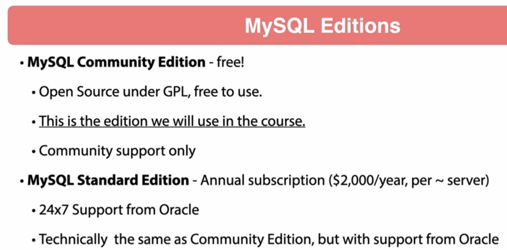

# 11 - MySQL with Spring Boot

## 001 Introduction

## 002 Overview of MySQL





## 004 Create MySQL Schema and User Accounts
```sql
# SET GLOBAL authentication_policy = 'ONLY_MYSQL_NATIVE_PASSWORD';
DROP DATABASE IF EXISTS restdb;
DROP USER IF EXISTS `restadmin`@`%`;
CREATE DATABASE IF NOT EXISTS restdb CHARACTER SET utf8mb4 COLLATE utf8mb4_unicode_ci;
# CREATE USER IF NOT EXISTS `restadmin`@`%` IDENTIFIED WITH mysql_native_password BY 'password';
CREATE USER IF NOT EXISTS `restadmin`@`%` IDENTIFIED BY 'password';
GRANT SELECT, INSERT, UPDATE, DELETE, CREATE, DROP, REFERENCES, INDEX, ALTER, EXECUTE, CREATE VIEW, SHOW VIEW,
    CREATE ROUTINE, ALTER ROUTINE, EVENT, TRIGGER ON `restdb`.* TO `restadmin`@`%`;

```

The SQL script you've provided is a series of commands that are typically executed in a MySQL database to manage a database and a user with specific privileges. Below is an explanation of each part of the script:

### 1. `SET GLOBAL authentication_policy = 'ONLY_MYSQL_NATIVE_PASSWORD';`

- **Explanation**: This line, which is commented out (`#`), would set the global authentication policy for the MySQL server. The policy `ONLY_MYSQL_NATIVE_PASSWORD` would restrict user authentication to the `mysql_native_password` plugin only. However, in newer versions of MySQL, `caching_sha2_password` is the default, and the `authentication_policy` variable controls the allowed authentication methods. This line ensures that only the older `mysql_native_password` authentication method is allowed, enhancing compatibility with older applications.

### 2. `DROP DATABASE IF EXISTS restdb;`

- **Explanation**: This command deletes the database named `restdb` if it already exists. The `IF EXISTS` clause prevents an error if the database doesn't exist. This is typically used to reset the database before re-creating it.

### 3. `DROP USER IF EXISTS 'restadmin'@'%';`

- **Explanation**: This command deletes the user `restadmin` that can connect from any host (`'%'`). The `IF EXISTS` clause prevents an error if the user doesn't exist. This is usually done to remove any existing user account before creating a fresh one.

### 4. `CREATE DATABASE IF NOT EXISTS restdb CHARACTER SET utf8mb4 COLLATE utf8mb4_unicode_ci;`

- **Explanation**: This command creates a new database named `restdb` if it does not already exist. The `CHARACTER SET utf8mb4` specifies the character encoding for the database, which supports a wide range of characters, including emojis. The `COLLATE utf8mb4_unicode_ci` specifies the collation, which determines how text is sorted and compared in the database, using Unicode rules.

### 5. `CREATE USER IF NOT EXISTS 'restadmin'@'%' IDENTIFIED BY 'password';`

- **Explanation**: This command creates a new user named `restadmin` with the password `'password'` who can connect from any host (`'%'`). The `IF NOT EXISTS` clause prevents an error if the user already exists. The `IDENTIFIED BY` clause sets the user's password.

   - **Note**: The comment above this command (`# CREATE USER IF NOT EXISTS 'restadmin'@'%' IDENTIFIED WITH mysql_native_password BY 'password';`) suggests an alternative method for creating the user using the `mysql_native_password` plugin, which is older and less secure than the newer `caching_sha2_password` plugin.

### 6. `GRANT SELECT, INSERT, UPDATE, DELETE, CREATE, DROP, REFERENCES, INDEX, ALTER, EXECUTE, CREATE VIEW, SHOW VIEW, CREATE ROUTINE, ALTER ROUTINE, EVENT, TRIGGER ON restdb.* TO 'restadmin'@'%';`

- **Explanation**: This command grants the `restadmin` user a comprehensive set of privileges on all tables within the `restdb` database. The privileges include the ability to select, insert, update, and delete data, create and drop tables, manage indexes, create and alter routines, manage events and triggers, and more.

### Summary

This script is typically used during the setup of a MySQL database environment, especially when you want to ensure a clean state by dropping any existing database and user before recreating them with specific privileges. The script sets up a `restdb` database and a `restadmin` user, granting them full control over the `restdb` database. The inclusion of the `mysql_native_password` option, though commented out, suggests a consideration for backward compatibility with older clients or systems that may not support the newer `caching_sha2_password` plugin.
## 005 Adding MySQL Dependencies

```xml
        <dependency>
            <groupId>com.mysql</groupId>
            <artifactId>mysql-connector-j</artifactId>
        </dependency>

```
## 006 Spring Boot MySQL Profile
```properties
spring.datasource.username=root
spring.datasource.password=root
spring.datasource.url=jdbc:mysql://127.0.0.1:3306/restdb?unicode=true&characterEncoding=utf8&serverTimezone=UTC
spring.jpa.database=mysql
spring.datasource.driver-class-name=com.mysql.cj.jdbc.Driver
spring.jpa.properties.hibernate.dialect=org.hibernate.dialect.MySQLDialect

```
## 007 Console Logging of SQL Statements
```properties
spring.datasource.username=root
spring.datasource.password=root
spring.datasource.url=jdbc:mysql://127.0.0.1:3306/restdb?unicode=true&characterEncoding=utf8&serverTimezone=UTC
spring.jpa.database=mysql
spring.datasource.driver-class-name=com.mysql.cj.jdbc.Driver
spring.jpa.properties.hibernate.dialect=org.hibernate.dialect.MySQLDialect
spring.jpa.hibernate.ddl-auto=update
# show sql
spring.jpa.show-sql=true
# format sql
spring.jpa.properties.hibernate.format_sql=true
```
## 008 JPA Updates for MySQL
```properties
spring.datasource.username=root
spring.datasource.password=root
spring.datasource.url=jdbc:mysql://127.0.0.1:3306/restdb?unicode=true&characterEncoding=utf8&serverTimezone=UTC
spring.jpa.database=mysql
spring.datasource.driver-class-name=com.mysql.cj.jdbc.Driver
spring.jpa.properties.hibernate.dialect=org.hibernate.dialect.MySQLDialect
spring.jpa.hibernate.ddl-auto=update
# show sql
spring.jpa.show-sql=true
# format sql
spring.jpa.properties.hibernate.format_sql=true
# show binding parameters
# this is useful for debugging not recommended for production
logging.level.org.hibernate.orm.jdbc.bind=trace
```

```java
package com.wchamara.spring6restmvc.entities;

import com.wchamara.spring6restmvc.model.BeerStyle;
import jakarta.persistence.*;
import jakarta.validation.constraints.NotBlank;
import jakarta.validation.constraints.NotNull;
import jakarta.validation.constraints.Size;
import lombok.*;
import org.hibernate.annotations.JdbcTypeCode;
import org.hibernate.annotations.UuidGenerator;
import org.hibernate.type.SqlTypes;

import java.math.BigDecimal;
import java.time.LocalDateTime;
import java.util.UUID;

@Entity
@AllArgsConstructor
@NoArgsConstructor
@Getter
@Setter
@Builder
public class Beer {

    @Id
    @GeneratedValue
    @UuidGenerator
    @JdbcTypeCode(SqlTypes.CHAR)
    @Column(length = 36, columnDefinition = "varchar(36)", updatable = false, nullable = false)
    private UUID id;
    @Version
    private Integer version;

}
```
```java
package com.wchamara.spring6restmvc.entities;

import jakarta.persistence.*;
import lombok.*;
import org.hibernate.annotations.JdbcTypeCode;
import org.hibernate.annotations.UuidGenerator;
import org.hibernate.type.SqlTypes;

import java.time.LocalDateTime;
import java.util.UUID;

@Entity
@AllArgsConstructor
@NoArgsConstructor
@Getter
@Setter
@Builder
public class Customer {
    @Id
    @GeneratedValue
    @UuidGenerator
    @JdbcTypeCode(SqlTypes.CHAR)
    @Column(length = 36, columnDefinition = "varchar(36)", updatable = false, nullable = false)
    private UUID id;
    @Version
    private Integer version;
    private String name;
    private LocalDateTime createdDate;
    private LocalDateTime updateDate;
}

```
## 009 Hikari Datasource Pool
```properties
# The username for the database connection
spring.datasource.username=root
# The password for the database connection
spring.datasource.password=root
# The JDBC URL for the database connection
spring.datasource.url=jdbc:mysql://127.0.0.1:3306/restdb?unicode=true&characterEncoding=utf8&serverTimezone=UTC
# The type of database being used
spring.jpa.database=mysql
# The fully qualified name of the JDBC driver class
spring.datasource.driver-class-name=com.mysql.cj.jdbc.Driver
# The Hibernate dialect to use for MySQL
spring.jpa.properties.hibernate.dialect=org.hibernate.dialect.MySQLDialect
# The strategy for schema generation
spring.jpa.hibernate.ddl-auto=update
# The name of the HikariCP connection pool
spring.datasource.hikari.pool-name=RestDB-Pool
# The maximum number of connections in the HikariCP pool
spring.datasource.hikari.maximum-pool-size=5
# Enable caching of prepared statements
spring.datasource.hikari.data-source-properties.cachePrepStmts=true
# The maximum number of cached prepared statements
spring.datasource.hikari.data-source-properties.prepStmtCacheSize=250
# The maximum length of SQL statements that can be cached
spring.datasource.hikari.data-source-properties.prepStmtCacheSqlLimit=2048
# Use server-side prepared statements
spring.datasource.hikari.data-source-properties.useServerPrepStmts=true
# Use local session state
spring.datasource.hikari.data-source-properties.useLocalSessionState=true
# Rewrite batched statements
spring.datasource.hikari.data-source-properties.rewriteBatchedStatements=true
# Cache result set metadata
spring.datasource.hikari.data-source-properties.cacheResultSetMetadata=true
# Cache server configuration
spring.datasource.hikari.data-source-properties.cacheServerConfiguration=true
# Elide set auto-commits
spring.datasource.hikari.data-source-properties.elideSetAutoCommits=true
# Maintain time statistics
spring.datasource.hikari.data-source-properties.maintainTimeStats=false
# show sql
spring.jpa.show-sql=true
# format sql
spring.jpa.properties.hibernate.format_sql=true
# show binding parameters
# this is useful for debugging not recommended for production
logging.level.org.hibernate.orm.jdbc.bind=trace

```

Below is a detailed explanation of the Spring Boot configuration settings provided:

### 1. **spring.datasource.username=root**
   - **Explanation**: This property sets the username for connecting to the database. In this case, `root` is the username. The `root` user is typically the default administrative user in MySQL databases.

### 2. **spring.datasource.password=root**
   - **Explanation**: This property sets the password for the database connection. Here, the password is also set to `root`. This is not recommended for production environments due to security concerns, but it is commonly used in local or development environments for simplicity.

### 3. **spring.datasource.url=jdbc:mysql://127.0.0.1:3306/restdb?unicode=true&characterEncoding=utf8&serverTimezone=UTC**
   - **Explanation**: This specifies the JDBC URL that Spring Boot uses to connect to the MySQL database. It includes several components:
     - **`127.0.0.1:3306`**: The IP address `127.0.0.1` refers to the local machine, and `3306` is the default port for MySQL.
     - **`restdb`**: The name of the database to connect to.
     - **`unicode=true&characterEncoding=utf8&serverTimezone=UTC`**: These are connection parameters:
       - **`unicode=true`**: Ensures that Unicode encoding is used.
       - **`characterEncoding=utf8`**: Specifies that UTF-8 encoding should be used for character data.
       - **`serverTimezone=UTC`**: Sets the server's time zone to UTC, avoiding potential time zone issues between the database and the application.

### 4. **spring.jpa.database=mysql**
   - **Explanation**: This setting explicitly tells Spring that the underlying database is MySQL. While this can often be inferred from the JDBC URL, setting it explicitly can help avoid ambiguity.

### 5. **spring.datasource.driver-class-name=com.mysql.cj.jdbc.Driver**
   - **Explanation**: Specifies the fully qualified name of the JDBC driver class. The `com.mysql.cj.jdbc.Driver` class is the official MySQL driver for connecting Java applications to MySQL databases. The `cj` part indicates it is the Connector/J driver.

### 6. **spring.jpa.properties.hibernate.dialect=org.hibernate.dialect.MySQLDialect**
   - **Explanation**: Hibernate uses dialects to understand the specific SQL variant used by different databases. `MySQLDialect` tells Hibernate to generate SQL optimized for MySQL. This setting is crucial for leveraging MySQL-specific optimizations and behaviors.

### 7. **spring.jpa.hibernate.ddl-auto=update**
   - **Explanation**: This setting controls the automatic schema generation and update strategy for the database:
     - **`update`**: Hibernate will update the database schema based on the current model without deleting data. It is useful during development but is not recommended for production environments due to potential risks of data loss.

### 8. **spring.datasource.hikari.pool-name=RestDB-Pool**
   - **Explanation**: Names the HikariCP connection pool. HikariCP is a high-performance JDBC connection pool used by Spring Boot by default. Naming the pool can help in identifying it in logs and monitoring tools.

### 9. **spring.datasource.hikari.maximum-pool-size=5**
   - **Explanation**: Sets the maximum number of connections that can be maintained in the HikariCP connection pool. Setting it to `5` means only 5 database connections will be opened simultaneously. The pool size should be tuned based on the expected load and available resources.

### 10. **spring.datasource.hikari.data-source-properties.cachePrepStmts=true**
   - **Explanation**: Enables caching of prepared statements. Prepared statements are precompiled SQL statements that can improve performance by reducing the overhead of repeated SQL execution.

### 11. **spring.datasource.hikari.data-source-properties.prepStmtCacheSize=250**
   - **Explanation**: Specifies the number of prepared statements that can be cached. A cache size of `250` means up to 250 prepared statements will be cached in memory, improving performance for frequently executed queries.

### 12. **spring.datasource.hikari.data-source-properties.prepStmtCacheSqlLimit=2048**
   - **Explanation**: Defines the maximum length of SQL statements that can be cached. SQL statements longer than `2048` characters will not be cached. This setting optimizes memory usage by preventing large queries from overwhelming the cache.

### 13. **spring.datasource.hikari.data-source-properties.useServerPrepStmts=true**
   - **Explanation**: Enables the use of server-side prepared statements, which are prepared and cached on the MySQL server rather than on the client side. This can lead to better performance in some cases.

### 14. **spring.datasource.hikari.data-source-properties.useLocalSessionState=true**
   - **Explanation**: Ensures that session state is maintained locally on the client side rather than relying on the server. This can reduce the need for server-to-client round trips and improve performance.

### 15. **spring.datasource.hikari.data-source-properties.rewriteBatchedStatements=true**
   - **Explanation**: Enables the rewriting of batched statements into a single SQL statement, which can significantly improve performance when executing large batches of insert or update operations.

### 16. **spring.datasource.hikari.data-source-properties.cacheResultSetMetadata=true**
   - **Explanation**: Enables caching of metadata for result sets, reducing the overhead of repeatedly fetching metadata for similar queries.

### 17. **spring.datasource.hikari.data-source-properties.cacheServerConfiguration=true**
   - **Explanation**: Caches the MySQL server's configuration to avoid repeated round-trips to the server for configuration details, further improving performance.

### 18. **spring.datasource.hikari.data-source-properties.elideSetAutoCommits=true**
   - **Explanation**: Optimizes performance by skipping the unnecessary calls to `setAutoCommit` on the JDBC connection if it is already set to the desired value.

### 19. **spring.datasource.hikari.data-source-properties.maintainTimeStats=false**
   - **Explanation**: Disables the collection of time statistics by HikariCP. This can reduce overhead and improve performance, especially in high-throughput systems where detailed time statistics are not required.

### 20. **spring.jpa.show-sql=true**
   - **Explanation**: Enables logging of the SQL statements generated by Hibernate to the console. This is useful for debugging and understanding the queries being executed by the application.

### 21. **spring.jpa.properties.hibernate.format_sql=true**
   - **Explanation**: Formats the SQL output for readability. Instead of outputting SQL as a single line, it will be formatted with line breaks and indentation, making it easier to read in the logs.

### 22. **logging.level.org.hibernate.orm.jdbc.bind=trace**
   - **Explanation**: Configures the logging level for binding parameters in Hibernate to `trace`. This setting is useful for debugging as it logs the actual values of parameters that are bound to SQL queries. However, it can generate a lot of output and is generally not recommended for production environments.

### Summary
These settings configure various aspects of how Spring Boot interacts with a MySQL database, from connection details and pooling to Hibernate's behavior and SQL logging. Together, they ensure that the application can connect to the database efficiently, manage connections effectively, and provide useful debugging information during development.
## 010 Schema Script Generation
```properties
spring.jpa.properties.jakarta.persistence.schema-generation.scripts.action=drop-and-create
spring.jpa.properties.jakarta.persistence.schema-generation.scripts.create-source=metadata
spring.jpa.properties.jakarta.persistence.schema-generation.scripts.create-target=src/main/resources/schema.sql
spring.jpa.properties.jakarta.persistence.schema-generation.scripts.drop-target=src/main/resources/schema.sql
```

```sql

    drop table if exists beer;

    drop table if exists customer;

    create table beer (
        beer_style tinyint not null check (beer_style between 0 and 9),
        price decimal(38,2) not null,
        quantity_on_hand integer,
        version integer,
        created_date datetime(6),
        updated_date datetime(6),
        id varchar(36) not null,
        beer_name varchar(50) not null,
        upc varchar(255) not null,
        primary key (id)
    ) engine=InnoDB;

    create table customer (
        version integer,
        created_date datetime(6),
        update_date datetime(6),
        id varchar(36) not null,
        name varchar(255),
        primary key (id)
    ) engine=InnoDB;

```

## 011 Spring Boot Database Initialization

