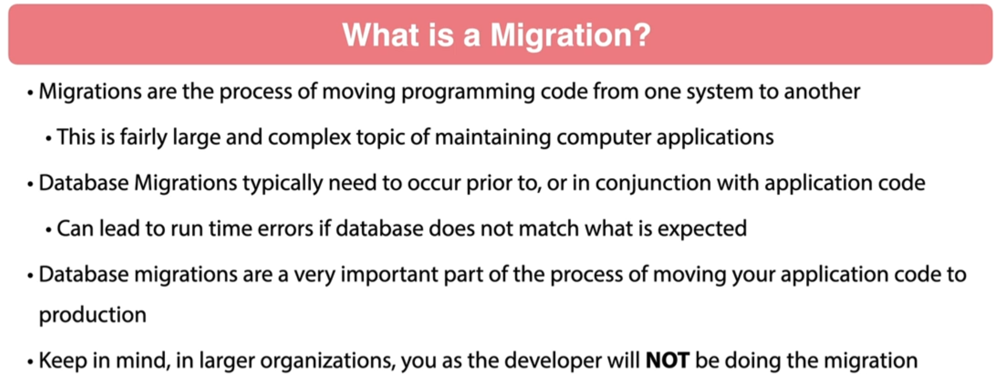
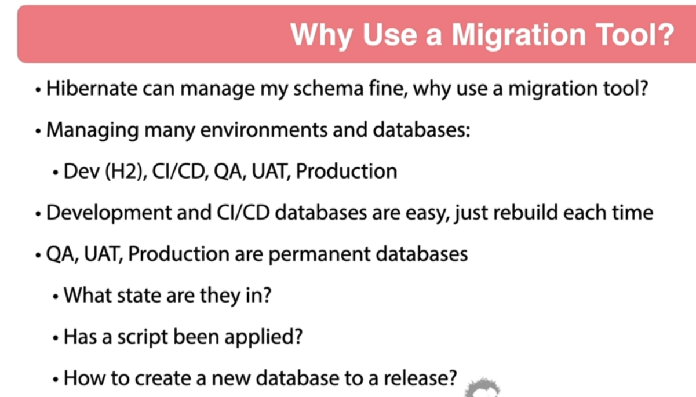
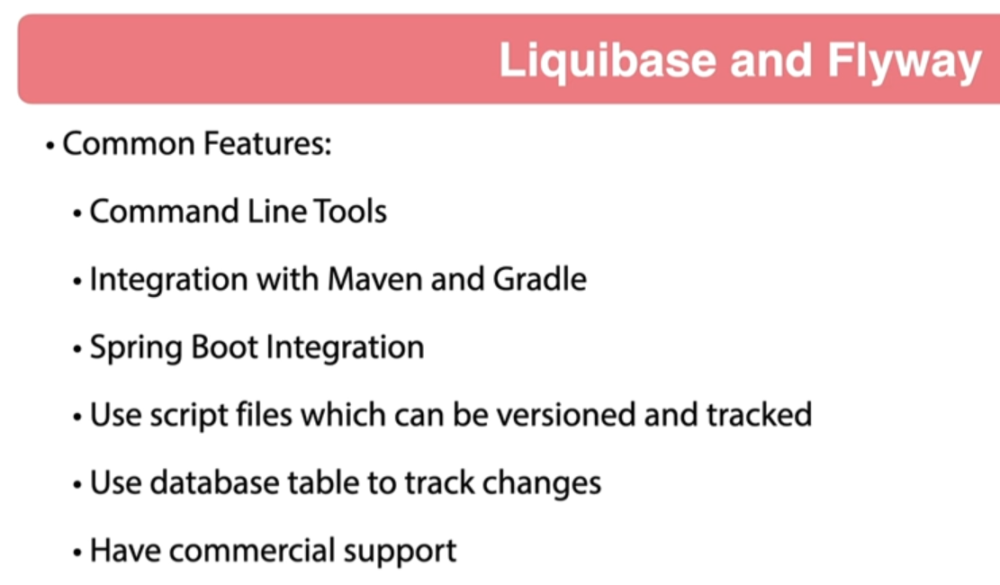
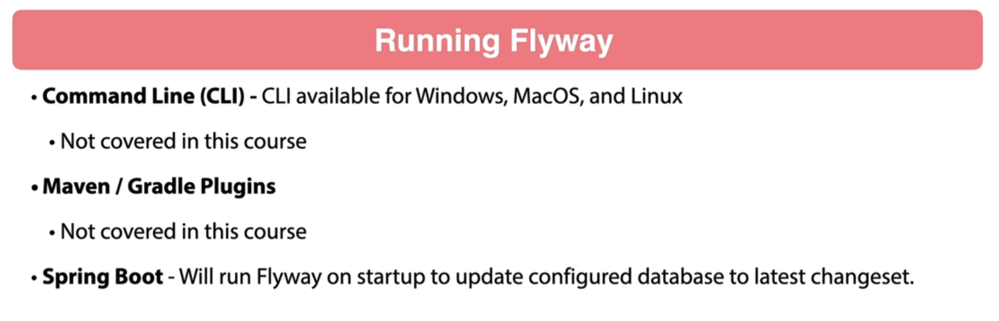
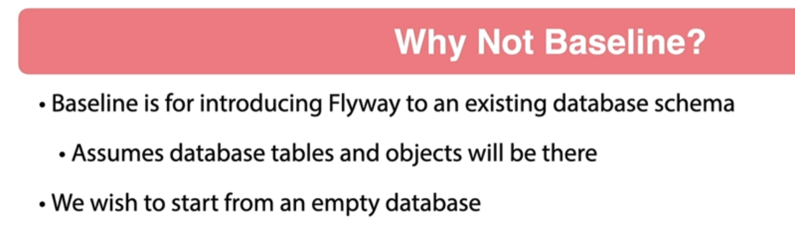

# 12 - Flyway Migrations

## 001 Introduction

## 002 Overview of Flyway










## 003 Flyway Dependencies
```xml
<dependency>
    <groupId>org.flywaydb</groupId>
    <artifactId>flyway-mysql</artifactId>
</dependency>
```
## 004 Flyway Migration Script Configuration
```properties
spring.jpa.hibernate.ddl-auto=validate
```

```sql
drop table if exists beer;

drop table if exists customer;

create table beer
(
    beer_style       tinyint        not null check (beer_style between 0 and 9),
    price            decimal(38, 2) not null,
    quantity_on_hand integer,
    version          integer,
    created_date     datetime(6),
    updated_date     datetime(6),
    id               varchar(36)    not null,
    beer_name        varchar(50)    not null,
    upc              varchar(255)   not null,
    primary key (id)
) engine = InnoDB;

create table customer
(
    version      integer,
    created_date datetime(6),
    update_date  datetime(6),
    id           varchar(36) not null,
    name         varchar(255),
    primary key (id)
) engine = InnoDB;

```


## 005 Add Database Column
## 006 Flyway Advanced Spring Boot Configuration
## 007 Fixing Integration Tests using H2
