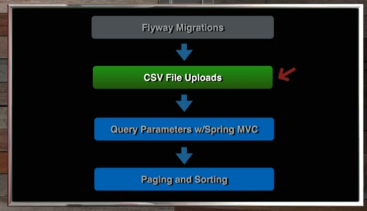
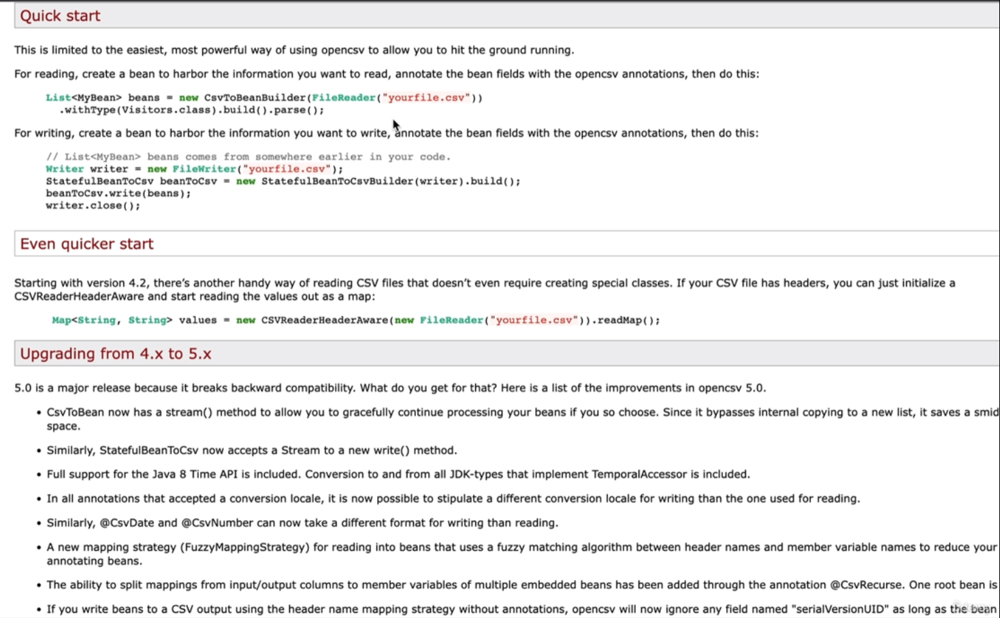

# 13 - CSV File Uploads

## 001 Introduction



## 002 Beer CSV Data

[csv file](../../spring-6-rest-mvc/src/main/resources/csvdata/beers.scv)

## 003 Beer CSV POJO

```java
package guru.springframework.spring6restmvc.model;

import lombok.AllArgsConstructor;
import lombok.Data;
import lombok.NoArgsConstructor;

/**
 * Created by jt, Spring Framework Guru.
 */
@Data
@NoArgsConstructor
@AllArgsConstructor
public class BeerCSVRecord {
    private Integer row;
    private Integer count;
    private String abv;
    private String ibu;
    private Integer id;
    private String beer;
    private String style;
    private Integer breweryId;
    private Float ounces;
    private String style2;
    private String count_y;
    private String city;
    private String state;
    private String label;

}
```

## 004 Mapping with OpenCSV




```xml
        <dependency>
            <groupId>com.opencsv</groupId>
            <artifactId>opencsv</artifactId>
            <version>5.9</version>
        </dependency>
```
```java
package com.wchamara.spring6restmvc.model;

import com.opencsv.bean.CsvBindByName;
import lombok.AllArgsConstructor;
import lombok.Data;
import lombok.NoArgsConstructor;

@Data
@NoArgsConstructor
@AllArgsConstructor
public class BeerCSVRecord {

    @CsvBindByName
    private Integer row;

    @CsvBindByName(column = "count.x")
    private Integer count;

    @CsvBindByName
    private String abv;

    @CsvBindByName
    private String ibu;

    @CsvBindByName
    private Integer id;

    @CsvBindByName
    private String beer;

    @CsvBindByName
    private String style;

    @CsvBindByName(column = "brewery_id")
    private Integer breweryId;

    @CsvBindByName
    private Float ounces;

    @CsvBindByName
    private String style2;

    @CsvBindByName(column = "count.y")
    private String count_y;

    @CsvBindByName
    private String city;

    @CsvBindByName
    private String state;

    @CsvBindByName
    private String label;

}
```

## 005 CSV Parse Service

```java
package com.wchamara.spring6restmvc.service;

import com.wchamara.spring6restmvc.model.BeerCSVRecord;

import java.io.File;
import java.util.List;

public interface BeerCsvService {
    List<BeerCSVRecord> convertCsv(File file);
}

```
```java
package com.wchamara.spring6restmvc.service;

import com.opencsv.bean.CsvToBeanBuilder;
import com.wchamara.spring6restmvc.model.BeerCSVRecord;

import java.io.File;
import java.io.FileNotFoundException;
import java.io.FileReader;
import java.util.List;

public class BeerCsvServiceImpl implements BeerCsvService {
    @Override
    public List<BeerCSVRecord> convertCsv(File file) {
        try {
            return new CsvToBeanBuilder<BeerCSVRecord>(new FileReader(file))
                    .withType(BeerCSVRecord.class)
                    .build()
                    .parse();
        } catch (FileNotFoundException e) {
            throw new RuntimeException(e);
        }

    }
}

```
```java
package com.wchamara.spring6restmvc.service;

import com.wchamara.spring6restmvc.model.BeerCSVRecord;
import org.junit.jupiter.api.Test;
import org.springframework.util.ResourceUtils;

import java.io.File;
import java.io.FileNotFoundException;
import java.util.List;

import static org.assertj.core.api.AssertionsForClassTypes.assertThat;


public class BeerCsvServiceImpTest {

    BeerCsvService beerCsvService = new BeerCsvServiceImpl();

    @Test
    void convertCsv() throws FileNotFoundException {
        File file = ResourceUtils.getFile("classpath:csvdata/beers.scv");

        List<BeerCSVRecord> recs = beerCsvService.convertCsv(file);

        System.out.println(recs.size());

        assertThat(recs.size()).isGreaterThan(0);
    }
}

```


## 006 Save CSV Data to Database

```java
package com.wchamara.spring6restmvc.bootstrap;

import com.wchamara.spring6restmvc.entities.Beer;
import com.wchamara.spring6restmvc.entities.Customer;
import com.wchamara.spring6restmvc.model.BeerCSVRecord;
import com.wchamara.spring6restmvc.model.BeerStyle;
import com.wchamara.spring6restmvc.repositories.BeerRepository;
import com.wchamara.spring6restmvc.repositories.CustomerRepository;
import com.wchamara.spring6restmvc.service.BeerCsvService;
import jakarta.transaction.Transactional;
import lombok.RequiredArgsConstructor;
import org.apache.commons.lang3.StringUtils;
import org.springframework.boot.CommandLineRunner;
import org.springframework.stereotype.Component;
import org.springframework.util.ResourceUtils;

import java.io.File;
import java.io.FileNotFoundException;
import java.math.BigDecimal;
import java.time.LocalDateTime;
import java.util.Arrays;
import java.util.List;
import java.util.UUID;

@Component
@RequiredArgsConstructor
public class InitData implements CommandLineRunner {


    private final BeerRepository beerRepository;
    private final CustomerRepository customerRepository;
    private final BeerCsvService beerCsvService;

    @Transactional
    @Override
    public void run(String... args) throws Exception {
        loadBeerData();
        loadCsvData();
        loadCustomerData();
    }

    private void loadCsvData() throws FileNotFoundException {
        if (beerRepository.count() < 10) {
            File file = ResourceUtils.getFile("classpath:csvdata/beers.csv");
            List<BeerCSVRecord> recs = beerCsvService.convertCsv(file);

            recs.forEach(beerCSVRecord -> {
                BeerStyle beerStyle = switch (beerCSVRecord.getStyle()) {
                    case "American Pale Lager" -> BeerStyle.LAGER;
                    case "American Pale Ale (APA)", "American Black Ale", "Belgian Dark Ale", "American Blonde Ale" ->
                            BeerStyle.ALE;
                    case "American IPA", "American Double / Imperial IPA", "Belgian IPA" -> BeerStyle.IPA;
                    case "American Porter" -> BeerStyle.PORTER;
                    case "Oatmeal Stout", "American Stout" -> BeerStyle.STOUT;
                    case "Saison / Farmhouse Ale" -> BeerStyle.SAISON;
                    case "Fruit / Vegetable Beer", "Winter Warmer", "Berliner Weissbier" -> BeerStyle.WHEAT;
                    case "English Pale Ale" -> BeerStyle.PALE_ALE;
                    default -> BeerStyle.PILSNER;
                };

                beerRepository.save(Beer.builder()
                        .beerName(StringUtils.abbreviate(beerCSVRecord.getBeer(), 50))
                        .beerStyle(beerStyle)
                        .price(BigDecimal.TEN)
                        .upc(beerCSVRecord.getRow().toString())
                        .quantityOnHand(beerCSVRecord.getCount())
                        .build());
            });
        }
    }

    private void loadBeerData() {
        if (beerRepository.count() == 0) {
            Beer beer1 = Beer.builder()
                    .beerName("Galaxy Cat")
                    .beerStyle(BeerStyle.PALE_ALE)
                    .upc("12356")
                    .price(new BigDecimal("12.99"))
                    .quantityOnHand(122)
                    .createdDate(LocalDateTime.now())
                    .updatedDate(LocalDateTime.now())
                    .build();

            Beer beer2 = Beer.builder()
                    .beerName("Crank")
                    .beerStyle(BeerStyle.PALE_ALE)
                    .upc("12356222")
                    .price(new BigDecimal("11.99"))
                    .quantityOnHand(392)
                    .createdDate(LocalDateTime.now())
                    .updatedDate(LocalDateTime.now())
                    .build();

            Beer beer3 = Beer.builder()
                    .beerName("Sunshine City")
                    .beerStyle(BeerStyle.IPA)
                    .upc("12356")
                    .price(new BigDecimal("13.99"))
                    .quantityOnHand(144)
                    .createdDate(LocalDateTime.now())
                    .updatedDate(LocalDateTime.now())
                    .build();

            beerRepository.save(beer1);
            beerRepository.save(beer2);
            beerRepository.save(beer3);
        }

    }

    private void loadCustomerData() {

        if (customerRepository.count() == 0) {
            Customer customer1 = Customer.builder()
                    .id(UUID.randomUUID())
                    .name("Customer 1")
                    .version(1)
                    .createdDate(LocalDateTime.now())
                    .updateDate(LocalDateTime.now())
                    .build();

            Customer customer2 = Customer.builder()
                    .id(UUID.randomUUID())
                    .name("Customer 2")
                    .version(1)
                    .createdDate(LocalDateTime.now())
                    .updateDate(LocalDateTime.now())
                    .build();

            Customer customer3 = Customer.builder()
                    .id(UUID.randomUUID())
                    .name("Customer 3")
                    .version(1)
                    .createdDate(LocalDateTime.now())
                    .updateDate(LocalDateTime.now())
                    .build();

            customerRepository.saveAll(Arrays.asList(customer1, customer2, customer3));
        }

    }

}

```


## 007 Hibernate Create and Update Timestamp

```java
package com.wchamara.spring6restmvc.entities;

import com.wchamara.spring6restmvc.model.BeerStyle;
import jakarta.persistence.*;
import jakarta.validation.constraints.NotBlank;
import jakarta.validation.constraints.NotNull;
import jakarta.validation.constraints.Size;
import lombok.*;
import org.hibernate.annotations.CreationTimestamp;
import org.hibernate.annotations.JdbcTypeCode;
import org.hibernate.annotations.UpdateTimestamp;
import org.hibernate.annotations.UuidGenerator;
import org.hibernate.type.SqlTypes;

import java.math.BigDecimal;
import java.time.LocalDateTime;
import java.util.UUID;

@Entity
@AllArgsConstructor
@NoArgsConstructor
@Getter
@Setter
@Builder
public class Beer {

    @Id
    @GeneratedValue
    @UuidGenerator
    @JdbcTypeCode(SqlTypes.CHAR)
    @Column(length = 36, columnDefinition = "varchar(36)", updatable = false, nullable = false)
    private UUID id;
    @Version
    private Integer version;

    @NotNull
    @NotBlank
    @Size(max = 50)
    @Column(length = 50)
    private String beerName;

    @NotNull
    private BeerStyle beerStyle;

    @NotNull
    @NotBlank
    @Size(max = 255)
    private String upc;
    private Integer quantityOnHand;

    @NotNull
    private BigDecimal price;

    @CreationTimestamp
    private LocalDateTime createdDate;

    @UpdateTimestamp
    private LocalDateTime updatedDate;
}

```

```java
package com.wchamara.spring6restmvc.entities;

import jakarta.persistence.*;
import lombok.*;
import org.hibernate.annotations.CreationTimestamp;
import org.hibernate.annotations.JdbcTypeCode;
import org.hibernate.annotations.UpdateTimestamp;
import org.hibernate.annotations.UuidGenerator;
import org.hibernate.type.SqlTypes;

import java.time.LocalDateTime;
import java.util.UUID;

@Entity
@AllArgsConstructor
@NoArgsConstructor
@Getter
@Setter
@Builder
public class Customer {
    @Id
    @GeneratedValue
    @UuidGenerator
    @JdbcTypeCode(SqlTypes.CHAR)
    @Column(length = 36, columnDefinition = "varchar(36)", updatable = false, nullable = false)
    private UUID id;

    @Column(length = 255)
    private String email;

    @Version
    private Integer version;
    private String name;

    @CreationTimestamp
    private LocalDateTime createdDate;

    @UpdateTimestamp
    private LocalDateTime updateDate;
}

```

## 008 Fix Integration Tests
```java
package com.wchamara.spring6restmvc.bootstrap;

import com.wchamara.spring6restmvc.repositories.BeerRepository;
import com.wchamara.spring6restmvc.repositories.CustomerRepository;
import com.wchamara.spring6restmvc.service.BeerCsvService;
import com.wchamara.spring6restmvc.service.BeerCsvServiceImpl;
import org.junit.jupiter.api.BeforeEach;
import org.junit.jupiter.api.Test;
import org.springframework.beans.factory.annotation.Autowired;
import org.springframework.boot.test.autoconfigure.orm.jpa.DataJpaTest;
import org.springframework.context.annotation.Import;

import static org.assertj.core.api.AssertionsForClassTypes.assertThat;

@DataJpaTest
@Import(BeerCsvServiceImpl.class)
class InitDataTest {
    @Autowired
    BeerRepository beerRepository;

    @Autowired
    CustomerRepository customerRepository;

    @Autowired
    BeerCsvService csvService;

    InitData bootstrapData;

    @BeforeEach
    void setUp() {
        bootstrapData = new InitData(beerRepository, customerRepository, csvService);
    }

    @Test
    void Testrun() throws Exception {
        bootstrapData.run(null);

        assertThat(beerRepository.count()).isEqualTo(2413);
        assertThat(customerRepository.count()).isEqualTo(3);
    }
}
```