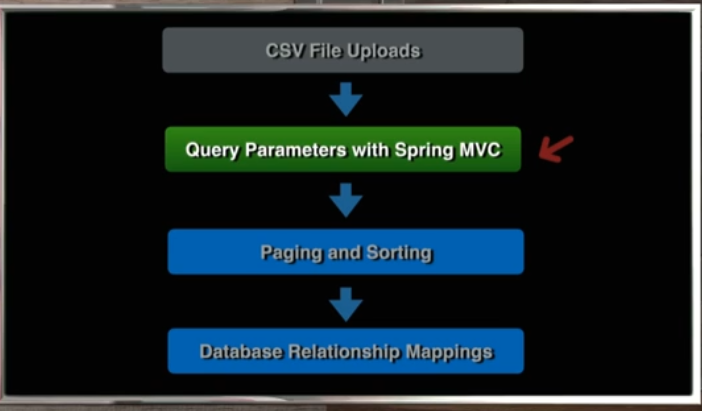

# 14 - Query Parameters with Spring MVC

## 001 Introduction

## 002 Overview of Query Parameters
**Query Parameters** are key-value pairs that appear in the URL after a question mark (`?`). They are used to pass data to a web application through the URL. In Spring MVC, query parameters are typically used in `GET` requests to filter or refine the results of a request.

### Example of Query Parameters in Spring MVC

#### 1. **Basic Example with a Single Query Parameter**
Suppose you want to create an endpoint that returns a list of users filtered by their status:

**URL:**
```
http://localhost:8080/users?status=active
```

**Controller:**
```java
import org.springframework.web.bind.annotation.GetMapping;
import org.springframework.web.bind.annotation.RequestParam;
import org.springframework.web.bind.annotation.RestController;

import java.util.List;

@RestController
public class UserController {

    @GetMapping("/users")
    public List<User> getUsersByStatus(@RequestParam String status) {
        // Logic to retrieve users based on the status parameter
        return userService.getUsersByStatus(status);
    }
}
```
In this example:
- The `@RequestParam` annotation is used to bind the value of the query parameter `status` to the `status` method parameter.
- If `status=active` is passed in the URL, the method will filter and return users with an "active" status.

#### 2. **Multiple Query Parameters**

You can also use multiple query parameters to refine your search further.

**URL:**
```
http://localhost:8080/users?status=active&age=25
```

**Controller:**
```java
@GetMapping("/users")
public List<User> getUsersByStatusAndAge(@RequestParam String status, @RequestParam int age) {
    // Logic to retrieve users based on status and age
    return userService.getUsersByStatusAndAge(status, age);
}
```
In this case:
- Two query parameters `status` and `age` are used.
- The method will filter users who are "active" and 25 years old.

#### 3. **Optional Query Parameters**

You can also make query parameters optional by providing a default value or making the parameter nullable.

**URL:**
```
http://localhost:8080/users?status=active
```

**Controller:**
```java
@GetMapping("/users")
public List<User> getUsers(@RequestParam(required = false, defaultValue = "all") String status, 
                           @RequestParam(required = false) Integer age) {
    // Logic to retrieve users based on status and optionally age
    return userService.getUsers(status, age);
}
```
In this example:
- `status` has a default value of `"all"` if not provided.
- `age` is optional and can be `null`.

#### 4. **Mapping Query Parameters to an Object**

For more complex scenarios, you can map multiple query parameters to a custom object.

**URL:**
```
http://localhost:8080/users?status=active&age=25&city=NewYork
```

**Custom Object:**
```java
public class UserFilter {
    private String status;
    private Integer age;
    private String city;

    // Getters and Setters
}
```

**Controller:**
```java
@GetMapping("/users")
public List<User> getUsers(UserFilter filter) {
    // Logic to retrieve users based on the filter object
    return userService.getUsers(filter);
}
```
In this example:
- Spring will automatically bind the query parameters `status`, `age`, and `city` to the fields of the `UserFilter` object.

### Summary
Query parameters in Spring MVC allow you to pass data to your controller methods through the URL. You can handle single or multiple parameters, make them optional, or map them to a custom object for more complex scenarios.
## 003 List Beers Spring MVC Test
```java
    @Test
    void getBeerByName() throws Exception {
//        let's check the size of the list
        mockMvc.perform(get(BeerController.BEER_PATH).queryParam("beerName", "IPA"))
                .andExpect(status().isOk())
                .andExpect(jsonPath("$.size()").value(2));
//                .andExpect(result -> {
//                    String content = result.getResponse().getContentAsString();
//                    List<BeerDTO> beerDTOS = objectMapper.readValue(content, List.class);
//                    assertThat(beerDTOS.size()).isEqualTo(2);
//                });

    }
```
## 004 Capture Query Parameters with Spring MVC

```java
   @GetMapping(BEER_PATH)
    public List<BeerDTO> listAllBeers(@RequestParam(required = false) String beerName) {
        log.debug("listAllBeers() called in BeerController");
        return beerService.listAllBeers();
    }
```

```java
    @Test
    void getBeerByName() throws Exception {
//        let's check the size of the list
        mockMvc.perform(get(BeerController.BEER_PATH).queryParam("beerName", "IPA"))
                .andExpect(status().isOk())
                .andExpect(jsonPath("$.size()").value(211));
//                .andExpect(result -> {
//                    String content = result.getResponse().getContentAsString();
//                    List<BeerDTO> beerDTOS = objectMapper.readValue(content, List.class);
//                    assertThat(beerDTOS.size()).isEqualTo(2);
//                });

    }

```

## 005 Update Service to Accept Query Parameter
```java
    @GetMapping(BEER_PATH)
    public List<BeerDTO> listAllBeers(@RequestParam(required = false) String beerName) {
        log.debug("listAllBeers() called in BeerController");
        return beerService.listAllBeers(beerName);
    }
```
```java
package com.wchamara.spring6restmvc.service;

import com.wchamara.spring6restmvc.model.BeerDTO;

import java.util.List;
import java.util.Optional;
import java.util.UUID;

public interface BeerService {
    Optional<BeerDTO> getBeerById(UUID id);

    List<BeerDTO> listAllBeers(String beerName);

    BeerDTO saveNewBeer(BeerDTO beerDTO);

    Optional<BeerDTO> updateBeer(UUID id, BeerDTO beerDTO);

    void deleteBeer(UUID id);

    Optional<BeerDTO> patchBeer(UUID id, BeerDTO beerDTO);
}

```
```java
package com.wchamara.spring6restmvc.service;

import com.wchamara.spring6restmvc.model.BeerDTO;
import com.wchamara.spring6restmvc.model.BeerStyle;
import org.springframework.stereotype.Service;

import java.math.BigDecimal;
import java.time.LocalDateTime;
import java.util.*;

@Service
public class BeerServiceImpl implements BeerService {

    private Map<UUID, BeerDTO> beerMap = new HashMap<>();

    public BeerServiceImpl() {
        BeerDTO beerDTO1 = BeerDTO.builder()
                .id(UUID.fromString("60501fcd-487e-4d83-8c67-3001482e35a2"))
                .version(1)
                .beerName("Galaxy Cat")
                .beerStyle(BeerStyle.PALE_ALE)
                .upc("123456")
                .price(BigDecimal.valueOf(12.95))
                .quantityOnHand(200)
                .createdDate(LocalDateTime.now())
                .updatedDate(LocalDateTime.now())
                .build();

        BeerDTO beerDTO2 = BeerDTO.builder()
                .id(UUID.randomUUID())
                .version(1)
                .beerName("Galaxy Dog")
                .beerStyle(BeerStyle.PALE_ALE)
                .upc("123457")
                .price(BigDecimal.valueOf(12.95))
                .quantityOnHand(200)
                .createdDate(LocalDateTime.now())
                .updatedDate(LocalDateTime.now())
                .build();

        BeerDTO beerDTO3 = BeerDTO.builder()
                .id(UUID.randomUUID())
                .version(1)
                .beerName("Galaxy Fish")
                .beerStyle(BeerStyle.PALE_ALE)
                .upc("123458")
                .price(BigDecimal.valueOf(12.95))
                .quantityOnHand(200)
                .createdDate(LocalDateTime.now())
                .updatedDate(LocalDateTime.now())
                .build();

        beerMap.put(beerDTO1.getId(), beerDTO1);
        beerMap.put(beerDTO2.getId(), beerDTO2);
        beerMap.put(beerDTO3.getId(), beerDTO3);


    }


    @Override
    public List<BeerDTO> listAllBeers(String beerName) {
        return new ArrayList<>(beerMap.values());
    }

}

```
```java
package com.wchamara.spring6restmvc.service;

import com.wchamara.spring6restmvc.entities.Beer;
import com.wchamara.spring6restmvc.mapper.BeerMapper;
import com.wchamara.spring6restmvc.model.BeerDTO;
import com.wchamara.spring6restmvc.repositories.BeerRepository;
import lombok.RequiredArgsConstructor;
import org.springframework.context.annotation.Primary;
import org.springframework.stereotype.Service;
import org.springframework.util.StringUtils;

import java.util.List;
import java.util.Optional;
import java.util.UUID;
import java.util.concurrent.atomic.AtomicReference;

@Service
@Primary
@RequiredArgsConstructor
public class BeerServiceImplJPA implements BeerService {

    private final BeerRepository beerRepository;

    private final BeerMapper beerMapper;

    @Override
    public List<BeerDTO> listAllBeers(String beerName) {
        return beerRepository.findAll().stream().map(beerMapper::beerToBeerDto).toList();
    }

}

```
```java

    @Test
    void getBeerByIdReturnsBeer() throws Exception {
        BeerDTO beerDTO = beerServiceImpl.listAllBeers(null).get(0);
        given(beerService.getBeerById(any(UUID.class))).willReturn(Optional.of(beerDTO));


        mockMvc.perform(get(BeerController.BEER_PATH_ID, beerDTO.getId()).accept(MediaType.APPLICATION_JSON))
                .andExpect(status().isOk())
                .andExpect(content().contentType(MediaType.APPLICATION_JSON))
                .andExpect(jsonPath("$.id").value(beerDTO.getId().toString()))
                .andExpect(jsonPath("$.beerName").value(beerDTO.getBeerName()))
                .andExpect(jsonPath("$.beerStyle").value(beerDTO.getBeerStyle().toString()))
                .andExpect(jsonPath("$.upc").value(beerDTO.getUpc()))
                .andExpect(jsonPath("$.quantityOnHand").value(beerDTO.getQuantityOnHand()))
                .andExpect(jsonPath("$.price").value(beerDTO.getPrice().toString()))
                .andExpect(jsonPath("$.createdDate").exists())
                .andExpect(jsonPath("$.updatedDate").exists());
        ;
    }
```
```java
    @Test
    void saveNewBeerReturnsCreated() throws Exception {
        BeerDTO beerDTO = beerServiceImpl.listAllBeers(null).get(0);
        beerDTO.setId(null);
        beerDTO.setVersion(null);

        given(beerService.saveNewBeer(any())).willReturn(beerServiceImpl.listAllBeers(null).get(1));

        mockMvc.perform(
                        post(BeerController.BEER_PATH)
                                .accept(MediaType.APPLICATION_JSON)
                                .contentType(MediaType.APPLICATION_JSON)
                                .content(objectMapper.writeValueAsString(beerDTO))
                )
                .andExpect(status().isCreated())
                .andExpect(header().exists("Location"));

    }
```
```java
    @Test
    void testCreateNewBeerNullBeerName() throws Exception {
        BeerDTO beerDTO = BeerDTO.builder().build();


        given(beerService.saveNewBeer(any())).willReturn(beerServiceImpl.listAllBeers(null).get(1));

        ResultActions resultActions = mockMvc.perform(
                        post(BeerController.BEER_PATH)
                                .accept(MediaType.APPLICATION_JSON)
                                .contentType(MediaType.APPLICATION_JSON)
                                .content(objectMapper.writeValueAsString(beerDTO))
                )
                .andExpect(status().isBadRequest());

        System.out.println(resultActions.andReturn().getResponse().getContentAsString());

    }
```
```java
    @Test
    void updateBeerReturnsNoContent() throws Exception {
        BeerDTO beerDTO = beerServiceImpl.listAllBeers(null).get(0);
        given(beerService.updateBeer(any(), any())).willReturn(Optional.of(beerDTO));


        mockMvc.perform(
                        put(BeerController.BEER_PATH_ID, beerDTO.getId())
                                .accept(MediaType.APPLICATION_JSON)
                                .contentType(MediaType.APPLICATION_JSON)
                                .content(objectMapper.writeValueAsString(beerDTO))
                )
                .andExpect(status().isNoContent());
        verify(beerService).updateBeer(any(UUID.class), any(BeerDTO.class));
    }
```
```java

    @Test
    void deleteBeerReturnsNoContent() throws Exception {
        BeerDTO beerDTO = beerServiceImpl.listAllBeers(null).get(0);
        given(beerService.getBeerById(any(UUID.class))).willReturn(Optional.of(beerDTO));

        mockMvc.perform(delete(BeerController.BEER_PATH_ID, beerDTO.getId()))
                .andExpect(status().isNoContent());

        verify(beerService).deleteBeer(uuidArgumentCaptor.capture());

        assertThat(uuidArgumentCaptor.getValue()).isEqualTo(beerDTO.getId());
    }
```
```java
    @Test
    void patchBeerReturnsNoContent() throws Exception {
        BeerDTO beerDTO = beerServiceImpl.listAllBeers(null).get(0);

        Map<String, Object> beerMap = new HashMap<>();

        beerMap.put("beerName", "New Beer Name");

        mockMvc.perform(
                        patch(BeerController.BEER_PATH_ID, beerDTO.getId())
                                .accept(MediaType.APPLICATION_JSON)
                                .contentType(MediaType.APPLICATION_JSON)
                                .content(objectMapper.writeValueAsString(beerMap))
                )
                .andExpect(status().isNotFound());

//        verify(beerService).patchBeer(uuidArgumentCaptor.capture(), beerArgumentCaptor.capture());
//        assertThat(uuidArgumentCaptor.getValue()).isEqualTo(beerDTO.getId());
//        assertThat(beerArgumentCaptor.getValue().getBeerName()).isEqualTo("New Beer Name");

    }
```
## 006 Refactor Service with Conditional Logic
```java
    @Override
    public List<BeerDTO> listAllBeers(String beerName) {
        List<Beer> beerList;

        if (StringUtils.hasText(beerName)) {
            beerList = listBeersByName(beerName);
        } else {
            beerList = beerRepository.findAll();
        }

        return beerList.stream().map(beerMapper::beerToBeerDto).toList();
    }

    private List<Beer> listBeersByName(String beerName) {
        return new ArrayList<>();
    }
```
## 007 Find By Name with Spring Data JPA
```java
package com.wchamara.spring6restmvc.repositories;

import com.wchamara.spring6restmvc.entities.Beer;
import org.springframework.data.jpa.repository.JpaRepository;

import java.util.List;
import java.util.UUID;

public interface BeerRepository extends JpaRepository<Beer, UUID> {

    List<Beer> findAllByBeerNameIsLikeIgnoreCase(String beerName);
}
```

```java

import com.wchamara.spring6restmvc.bootstrap.InitData;
import com.wchamara.spring6restmvc.entities.Beer;
import com.wchamara.spring6restmvc.model.BeerStyle;
import com.wchamara.spring6restmvc.service.BeerCsvServiceImpl;
import jakarta.validation.ConstraintViolationException;
import org.junit.jupiter.api.Test;
import org.springframework.beans.factory.annotation.Autowired;
import org.springframework.boot.test.autoconfigure.orm.jpa.DataJpaTest;
import org.springframework.context.annotation.Import;

import java.math.BigDecimal;
import java.util.List;

import static org.assertj.core.api.AssertionsForClassTypes.assertThat;
import static org.junit.jupiter.api.Assertions.assertThrows;

@DataJpaTest
@Import({InitData.class, BeerCsvServiceImpl.class})
class BeerRepositoryTest {

    @Autowired
    BeerRepository beerRepository;

    @Test
    void getBeerByBeerName() {
        List<Beer> allByBeerNameIsLikeIgnoreCase = beerRepository.findAllByBeerNameIsLikeIgnoreCase("%IPA%");

        assertThat(allByBeerNameIsLikeIgnoreCase.size()).isEqualTo(336);
    }
}
```
## 008 Complete Implementation  
```java
   private List<Beer> listBeersByName(String beerName) {
        return beerRepository.findAllByBeerNameIsLikeIgnoreCase("%" + beerName + "%");
    }
```
## 009 Complete Search Functionality

```java 

    @GetMapping(BEER_PATH)
    public List<BeerDTO> listAllBeers(@RequestParam(required = false) String beerName, @RequestParam(required = false) boolean showInventory, @RequestParam(required = false) BeerStyle beerStyle) {
        log.debug("listAllBeers() called in BeerController");
        return beerService.listAllBeers(beerName, showInventory, beerStyle);
    }
```
```java 

package com.wchamara.spring6restmvc.repositories;

import com.wchamara.spring6restmvc.entities.Beer;
import com.wchamara.spring6restmvc.model.BeerStyle;
import org.springframework.data.jpa.repository.JpaRepository;

import java.util.List;
import java.util.UUID;

public interface BeerRepository extends JpaRepository<Beer, UUID> {

    List<Beer> findAllByBeerNameIsLikeIgnoreCase(String beerName);

    List<Beer> findAllByBeerNameIsLikeIgnoreCaseAndBeerStyle(String beerName, BeerStyle beerStyle);

    List<Beer> findAllByBeerStyle(BeerStyle beerStyle);
}

```
```java 
package com.wchamara.spring6restmvc.service;

import com.wchamara.spring6restmvc.model.BeerDTO;
import com.wchamara.spring6restmvc.model.BeerStyle;

import java.util.List;
import java.util.Optional;
import java.util.UUID;

public interface BeerService {
    Optional<BeerDTO> getBeerById(UUID id);

    List<BeerDTO> listAllBeers(String beerName, Boolean showInventory, BeerStyle beerStyle);

    BeerDTO saveNewBeer(BeerDTO beerDTO);

    Optional<BeerDTO> updateBeer(UUID id, BeerDTO beerDTO);

    void deleteBeer(UUID id);

    Optional<BeerDTO> patchBeer(UUID id, BeerDTO beerDTO);
}


```
```java 
package com.wchamara.spring6restmvc.service;

import com.wchamara.spring6restmvc.model.BeerDTO;
import com.wchamara.spring6restmvc.model.BeerStyle;
import org.springframework.stereotype.Service;

import java.math.BigDecimal;
import java.time.LocalDateTime;
import java.util.*;

@Service
public class BeerServiceImpl implements BeerService {

    private Map<UUID, BeerDTO> beerMap = new HashMap<>();

    @Override
    public List<BeerDTO> listAllBeers(String beerName, Boolean showInventoryOnHand, BeerStyle beerStyle) {
        return new ArrayList<>(beerMap.values());
    }
}

```
```java 

package com.wchamara.spring6restmvc.service;

import com.wchamara.spring6restmvc.entities.Beer;
import com.wchamara.spring6restmvc.mapper.BeerMapper;
import com.wchamara.spring6restmvc.model.BeerDTO;
import com.wchamara.spring6restmvc.model.BeerStyle;
import com.wchamara.spring6restmvc.repositories.BeerRepository;
import lombok.RequiredArgsConstructor;
import org.springframework.context.annotation.Primary;
import org.springframework.stereotype.Service;
import org.springframework.util.StringUtils;

import java.util.List;
import java.util.Optional;
import java.util.UUID;
import java.util.concurrent.atomic.AtomicReference;

@Service
@Primary
@RequiredArgsConstructor
public class BeerServiceImplJPA implements BeerService {

    private final BeerRepository beerRepository;

    private final BeerMapper beerMapper;

    @Override
    public Optional<BeerDTO> getBeerById(UUID id) {
        return Optional.ofNullable(beerMapper.beerToBeerDto(beerRepository.findById(id).orElse(null)));
    }

    @Override
    public List<BeerDTO> listAllBeers(String beerName, Boolean showInventory, BeerStyle beerStyle) {
        List<Beer> beerList;

        if (StringUtils.hasText(beerName) && beerStyle == null) {
            beerList = listBeersByName(beerName);
        } else if (StringUtils.hasText(beerName) && beerStyle != null) {
            beerList = listBeerNameAndStyle(beerName, beerStyle);
        } else if (!StringUtils.hasText(beerName) && beerStyle != null) {
            beerList = getAllByBeerStyle(beerStyle);
        } else {
            beerList = beerRepository.findAll();
        }

        if (showInventory != null && !showInventory) {
            beerList.forEach(beer -> beer.setQuantityOnHand(null));
        }

        return beerList.stream().map(beerMapper::beerToBeerDto).toList();
    }

    private List<Beer> getAllByBeerStyle(BeerStyle beerStyle) {
        return beerRepository.findAllByBeerStyle(beerStyle);
    }

    private List<Beer> listBeerNameAndStyle(String beerName, BeerStyle beerStyle) {
        return beerRepository.findAllByBeerNameIsLikeIgnoreCaseAndBeerStyle("%" + beerName + "%", beerStyle);
    }

    private List<Beer> listBeersByName(String beerName) {
        return beerRepository.findAllByBeerNameIsLikeIgnoreCase("%" + beerName + "%");
    }

}
```
```java 


    @Test
    void getBeerByNameQueryParameter() throws Exception {
//        let's check the size of the list
        mockMvc.perform(
                        get(BeerController.BEER_PATH)
                                .queryParam("beerName", "IPA")
                                .queryParam("beerStyle", BeerStyle.IPA.name())
                                .queryParam("showInventory", "TRUE")
                )
                .andExpect(status().isOk())
                .andExpect(jsonPath("$.size()").value(310))
                .andExpect(jsonPath("$[0].quantityOnHand").isNotEmpty())
        ;


    }

    @Test
    void getBeerByNameQueryParameterAndShowInventoryFalse() throws Exception {
//        let's check the size of the list
        mockMvc.perform(
                        get(BeerController.BEER_PATH)
                                .queryParam("beerName", "IPA")
                                .queryParam("beerStyle", BeerStyle.IPA.name())
                                .queryParam("showInventory", "FALSE")
                )
                .andExpect(status().isOk())
                .andExpect(jsonPath("$.size()").value(310))
                .andExpect(jsonPath("$[0].quantityOnHand").isEmpty())
        ;


    }

```
```java 
package com.wchamara.spring6restmvc.controller;

import com.fasterxml.jackson.databind.ObjectMapper;
import com.wchamara.spring6restmvc.model.BeerDTO;
import com.wchamara.spring6restmvc.model.BeerStyle;
import com.wchamara.spring6restmvc.service.BeerService;
import com.wchamara.spring6restmvc.service.BeerServiceImpl;
import org.junit.jupiter.api.Test;
import org.mockito.ArgumentCaptor;
import org.mockito.Captor;
import org.springframework.beans.factory.annotation.Autowired;
import org.springframework.boot.test.autoconfigure.web.servlet.WebMvcTest;
import org.springframework.boot.test.mock.mockito.MockBean;
import org.springframework.http.MediaType;
import org.springframework.test.web.servlet.MockMvc;
import org.springframework.test.web.servlet.ResultActions;

import java.util.HashMap;
import java.util.Map;
import java.util.Optional;
import java.util.UUID;

import static org.assertj.core.api.AssertionsForClassTypes.assertThat;
import static org.mockito.ArgumentMatchers.any;
import static org.mockito.BDDMockito.given;
import static org.mockito.Mockito.verify;
import static org.springframework.test.web.servlet.request.MockMvcRequestBuilders.*;
import static org.springframework.test.web.servlet.result.MockMvcResultMatchers.*;

//@SpringBootTest
@WebMvcTest(BeerController.class)
class BeerControllerTest {
    @Autowired
    MockMvc mockMvc;

    @MockBean
    BeerService beerService;

    @Captor
    ArgumentCaptor<UUID> uuidArgumentCaptor;

    @Captor
    ArgumentCaptor<BeerDTO> beerArgumentCaptor;

    @Autowired
    ObjectMapper objectMapper;

    BeerServiceImpl beerServiceImpl = new BeerServiceImpl();

    @Test
    void getBeerByIdReturnsBeer() throws Exception {
        BeerDTO beerDTO = beerServiceImpl.listAllBeers(null, false, BeerStyle.ALE).get(0);
        given(beerService.getBeerById(any(UUID.class))).willReturn(Optional.of(beerDTO));


        mockMvc.perform(get(BeerController.BEER_PATH_ID, beerDTO.getId()).accept(MediaType.APPLICATION_JSON))
                .andExpect(status().isOk())
                .andExpect(content().contentType(MediaType.APPLICATION_JSON))
                .andExpect(jsonPath("$.id").value(beerDTO.getId().toString()))
                .andExpect(jsonPath("$.beerName").value(beerDTO.getBeerName()))
                .andExpect(jsonPath("$.beerStyle").value(beerDTO.getBeerStyle().toString()))
                .andExpect(jsonPath("$.upc").value(beerDTO.getUpc()))
                .andExpect(jsonPath("$.quantityOnHand").value(beerDTO.getQuantityOnHand()))
                .andExpect(jsonPath("$.price").value(beerDTO.getPrice().toString()))
                .andExpect(jsonPath("$.createdDate").exists())
                .andExpect(jsonPath("$.updatedDate").exists());
        ;
    }


    @Test
    void getBeerByIdWillReturnNotFoundException() throws Exception {

        given(beerService.getBeerById(any(UUID.class))).willReturn(Optional.empty());


        mockMvc.perform(get(BeerController.BEER_PATH_ID, UUID.randomUUID()).accept(MediaType.APPLICATION_JSON))
                .andExpect(status().isNotFound());
    }


    @Test
    void listAllBeersReturnsListOfBeers() throws Exception {
        given(beerService.listAllBeers(any(), any(), any())).willReturn(beerServiceImpl.listAllBeers(null, false, BeerStyle.ALE));

        mockMvc.perform(get(BeerController.BEER_PATH).accept(MediaType.APPLICATION_JSON))
                .andExpect(status().isOk())
                .andExpect(content().contentType(MediaType.APPLICATION_JSON))
                .andExpect(jsonPath("$[0].id").exists())
                .andExpect(jsonPath("$[0].beerName").exists())
                .andExpect(jsonPath("$[0].beerStyle").exists())
                .andExpect(jsonPath("$[0].upc").exists())
                .andExpect(jsonPath("$[0].quantityOnHand").exists())
                .andExpect(jsonPath("$[0].price").exists())
                .andExpect(jsonPath("$[0].createdDate").exists())
                .andExpect(jsonPath("$[0].updatedDate").exists());
    }

    @Test
    void saveNewBeerReturnsCreated() throws Exception {
        BeerDTO beerDTO = beerServiceImpl.listAllBeers(null, false, BeerStyle.ALE).get(0);
        beerDTO.setId(null);
        beerDTO.setVersion(null);

        given(beerService.saveNewBeer(any())).willReturn(beerServiceImpl.listAllBeers(null, false, BeerStyle.ALE).get(1));

        mockMvc.perform(
                        post(BeerController.BEER_PATH)
                                .accept(MediaType.APPLICATION_JSON)
                                .contentType(MediaType.APPLICATION_JSON)
                                .content(objectMapper.writeValueAsString(beerDTO))
                )
                .andExpect(status().isCreated())
                .andExpect(header().exists("Location"));

    }

    @Test
    void testCreateNewBeerNullBeerName() throws Exception {
        BeerDTO beerDTO = BeerDTO.builder().build();


        given(beerService.saveNewBeer(any())).willReturn(beerServiceImpl.listAllBeers(null, false, BeerStyle.ALE).get(1));

        ResultActions resultActions = mockMvc.perform(
                        post(BeerController.BEER_PATH)
                                .accept(MediaType.APPLICATION_JSON)
                                .contentType(MediaType.APPLICATION_JSON)
                                .content(objectMapper.writeValueAsString(beerDTO))
                )
                .andExpect(status().isBadRequest());

        System.out.println(resultActions.andReturn().getResponse().getContentAsString());

    }

    @Test
    void updateBeerReturnsNoContent() throws Exception {
        BeerDTO beerDTO = beerServiceImpl.listAllBeers(null, false, BeerStyle.ALE).get(0);
        given(beerService.updateBeer(any(), any())).willReturn(Optional.of(beerDTO));


        mockMvc.perform(
                        put(BeerController.BEER_PATH_ID, beerDTO.getId())
                                .accept(MediaType.APPLICATION_JSON)
                                .contentType(MediaType.APPLICATION_JSON)
                                .content(objectMapper.writeValueAsString(beerDTO))
                )
                .andExpect(status().isNoContent());
        verify(beerService).updateBeer(any(UUID.class), any(BeerDTO.class));
    }

    @Test
    void deleteBeerReturnsNoContent() throws Exception {
        BeerDTO beerDTO = beerServiceImpl.listAllBeers(null, false, BeerStyle.ALE).get(0);
        given(beerService.getBeerById(any(UUID.class))).willReturn(Optional.of(beerDTO));

        mockMvc.perform(delete(BeerController.BEER_PATH_ID, beerDTO.getId()))
                .andExpect(status().isNoContent());

        verify(beerService).deleteBeer(uuidArgumentCaptor.capture());

        assertThat(uuidArgumentCaptor.getValue()).isEqualTo(beerDTO.getId());
    }

    @Test
    void patchBeerReturnsNoContent() throws Exception {
        BeerDTO beerDTO = beerServiceImpl.listAllBeers(null, false, BeerStyle.ALE).get(0);

        Map<String, Object> beerMap = new HashMap<>();

        beerMap.put("beerName", "New Beer Name");

        mockMvc.perform(
                        patch(BeerController.BEER_PATH_ID, beerDTO.getId())
                                .accept(MediaType.APPLICATION_JSON)
                                .contentType(MediaType.APPLICATION_JSON)
                                .content(objectMapper.writeValueAsString(beerMap))
                )
                .andExpect(status().isNotFound());

//        verify(beerService).patchBeer(uuidArgumentCaptor.capture(), beerArgumentCaptor.capture());
//        assertThat(uuidArgumentCaptor.getValue()).isEqualTo(beerDTO.getId());
//        assertThat(beerArgumentCaptor.getValue().getBeerName()).isEqualTo("New Beer Name");

    }
}

```
