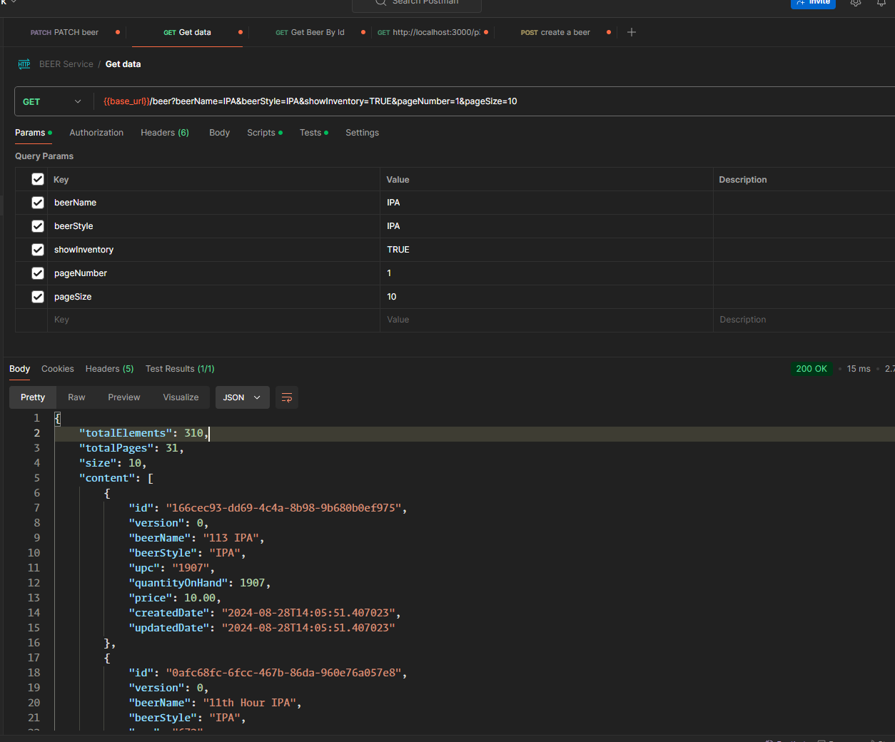

#

## 001 Introduction


## 002 What is Paging and Sorting


## 003 Paging and Sorting with Spring


## 004 Add Paging Parameters
```java
    @GetMapping(BEER_PATH)
    public List<BeerDTO> listAllBeers(
            @RequestParam(required = false) String beerName,
            @RequestParam(required = false) boolean showInventory,
            @RequestParam(required = false) BeerStyle beerStyle,
            @RequestParam(required = false) Integer pageSize,
            @RequestParam(required = false) Integer pageNumber
    ) {
        log.debug("listAllBeers() called in BeerController");
        return beerService.listAllBeers(beerName, showInventory, beerStyle, pageSize, pageNumber);
    }
```


```java
package com.wchamara.spring6restmvc.service;

import com.wchamara.spring6restmvc.model.BeerDTO;
import com.wchamara.spring6restmvc.model.BeerStyle;

import java.util.List;
import java.util.Optional;
import java.util.UUID;

public interface BeerService {
    Optional<BeerDTO> getBeerById(UUID id);

    List<BeerDTO> listAllBeers(String beerName, Boolean showInventory, BeerStyle beerStyle, Integer pageNumber, Integer pageSize);

    BeerDTO saveNewBeer(BeerDTO beerDTO);

    Optional<BeerDTO> updateBeer(UUID id, BeerDTO beerDTO);

    void deleteBeer(UUID id);

    Optional<BeerDTO> patchBeer(UUID id, BeerDTO beerDTO);
}

```
## 005 Create Page Request Object

```java
package com.wchamara.spring6restmvc.service;

import com.wchamara.spring6restmvc.entities.Beer;
import com.wchamara.spring6restmvc.mapper.BeerMapper;
import com.wchamara.spring6restmvc.model.BeerDTO;
import com.wchamara.spring6restmvc.model.BeerStyle;
import com.wchamara.spring6restmvc.repositories.BeerRepository;
import lombok.RequiredArgsConstructor;
import org.springframework.context.annotation.Primary;
import org.springframework.data.domain.PageRequest;
import org.springframework.stereotype.Service;
import org.springframework.util.StringUtils;

import java.util.List;
import java.util.Optional;
import java.util.UUID;
import java.util.concurrent.atomic.AtomicReference;

@Service
@Primary
@RequiredArgsConstructor
public class BeerServiceImplJPA implements BeerService {

    private final static Integer DEFAULT_PAGE_NUMBER = 1;
    private final static Integer DEFAULT_PAGE_SIZE = 25;

    private final BeerRepository beerRepository;

    private final BeerMapper beerMapper;

    public PageRequest buildPageRequest(Integer pageNumber, Integer pageSize) {

        int queryPageNumber;
        int queryPageSize;

        if (pageNumber != null && pageNumber > 0) {
            queryPageNumber = pageNumber - 1;
        } else {
            queryPageNumber = DEFAULT_PAGE_NUMBER;
        }

        if (pageSize != null && pageSize > 0) {
            if (pageSize > 100) {
                queryPageSize = 100;
            } else {
                queryPageSize = pageSize;
            }
        } else {
            queryPageSize = DEFAULT_PAGE_SIZE;
        }
        return PageRequest.of(queryPageNumber, queryPageSize);

    }

    @Override
    public Optional<BeerDTO> getBeerById(UUID id) {
        return Optional.ofNullable(beerMapper.beerToBeerDto(beerRepository.findById(id).orElse(null)));
    }

    @Override
    public List<BeerDTO> listAllBeers(String beerName, Boolean showInventory, BeerStyle beerStyle, Integer pageNumber, Integer pageSize) {
        List<Beer> beerList;

        PageRequest pageRequest = buildPageRequest(pageNumber, pageSize);

        if (StringUtils.hasText(beerName) && beerStyle == null) {
            beerList = listBeersByName(beerName);
        } else if (StringUtils.hasText(beerName) && beerStyle != null) {
            beerList = listBeerNameAndStyle(beerName, beerStyle);
        } else if (!StringUtils.hasText(beerName) && beerStyle != null) {
            beerList = getAllByBeerStyle(beerStyle);
        } else {
            beerList = beerRepository.findAll();
        }

        if (showInventory != null && !showInventory) {
            beerList.forEach(beer -> beer.setQuantityOnHand(null));
        }

        return beerList.stream().map(beerMapper::beerToBeerDto).toList();
    }
```


## 006 Refactor Spring Data JPA Repositories

```java
package com.wchamara.spring6restmvc.repositories;

import com.wchamara.spring6restmvc.entities.Beer;
import com.wchamara.spring6restmvc.model.BeerStyle;
import org.springframework.data.domain.Page;
import org.springframework.data.domain.Pageable;
import org.springframework.data.jpa.repository.JpaRepository;

import java.util.UUID;

public interface BeerRepository extends JpaRepository<Beer, UUID> {

    Page<Beer> findAllByBeerNameIsLikeIgnoreCase(String beerName, Pageable pageable);

    Page<Beer> findAllByBeerNameIsLikeIgnoreCaseAndBeerStyle(String beerName, BeerStyle beerStyle, Pageable pageable);

    Page<Beer> findAllByBeerStyle(BeerStyle beerStyle, Pageable pageable);
}

```
```java
package com.wchamara.spring6restmvc.service;

import com.wchamara.spring6restmvc.model.BeerDTO;
import com.wchamara.spring6restmvc.model.BeerStyle;
import org.springframework.data.domain.Page;

import java.util.Optional;
import java.util.UUID;

public interface BeerService {
    Optional<BeerDTO> getBeerById(UUID id);

    Page<BeerDTO> listAllBeers(String beerName, Boolean showInventory, BeerStyle beerStyle, Integer pageNumber, Integer pageSize);

    BeerDTO saveNewBeer(BeerDTO beerDTO);

    Optional<BeerDTO> updateBeer(UUID id, BeerDTO beerDTO);

    void deleteBeer(UUID id);

    Optional<BeerDTO> patchBeer(UUID id, BeerDTO beerDTO);
}

```
```java
    @Override
    public Page<BeerDTO> listAllBeers(String beerName, Boolean showInventory, BeerStyle beerStyle, Integer pageNumber, Integer pageSize) {
        Page<Beer> beerPage;

        PageRequest pageRequest = buildPageRequest(pageNumber, pageSize);

        if (StringUtils.hasText(beerName) && beerStyle == null) {
            beerPage = listBeersByName(beerName, pageRequest);
        } else if (StringUtils.hasText(beerName) && beerStyle != null) {
            beerPage = listBeerNameAndStyle(beerName, beerStyle, pageRequest);
        } else if (!StringUtils.hasText(beerName) && beerStyle != null) {
            beerPage = getAllByBeerStyle(beerStyle, pageRequest);
        } else {
            beerPage = beerRepository.findAll(pageRequest);
        }

        if (showInventory != null && !showInventory) {
            beerPage.forEach(beer -> beer.setQuantityOnHand(null));
        }

        return beerPage.map(beerMapper::beerToBeerDto);
    }

    private Page<Beer> getAllByBeerStyle(BeerStyle beerStyle, PageRequest pageRequest) {
        return beerRepository.findAllByBeerStyle(beerStyle, pageRequest);
    }

    private Page<Beer> listBeerNameAndStyle(String beerName, BeerStyle beerStyle, PageRequest pageRequest) {
        return beerRepository.findAllByBeerNameIsLikeIgnoreCaseAndBeerStyle("%" + beerName + "%", beerStyle, pageRequest);
    }

    private Page<Beer> listBeersByName(String beerName, PageRequest pageRequest) {
        return beerRepository.findAllByBeerNameIsLikeIgnoreCase("%" + beerName + "%", pageRequest);
    }

```
[github full change details](https://github.com/ccweerasinghe1994/SpringFramework6BeginnertoGuru/commit/94ca49ef613ad31b864af6e12abc4b1b242c1a03)

## 007 Add Sort Parameter

```java
        <dependency>
            <groupId>org.springframework.boot</groupId>
            <artifactId>spring-boot-docker-compose</artifactId>
            <scope>runtime</scope>
        </dependency>
```
```java
package com.wchamara.spring6restmvc.service;

import com.wchamara.spring6restmvc.entities.Beer;
import com.wchamara.spring6restmvc.mapper.BeerMapper;
import com.wchamara.spring6restmvc.model.BeerDTO;
import com.wchamara.spring6restmvc.model.BeerStyle;
import com.wchamara.spring6restmvc.repositories.BeerRepository;
import lombok.RequiredArgsConstructor;
import org.springframework.context.annotation.Primary;
import org.springframework.data.domain.Page;
import org.springframework.data.domain.PageRequest;
import org.springframework.data.domain.Sort;
import org.springframework.stereotype.Service;
import org.springframework.util.StringUtils;

import java.util.Optional;
import java.util.UUID;
import java.util.concurrent.atomic.AtomicReference;

@Service
@Primary
@RequiredArgsConstructor
public class BeerServiceImplJPA implements BeerService {

    private final static Integer DEFAULT_PAGE_NUMBER = 1;
    private final static Integer DEFAULT_PAGE_SIZE = 25;

    private final BeerRepository beerRepository;

    private final BeerMapper beerMapper;

    public PageRequest buildPageRequest(Integer pageNumber, Integer pageSize) {

        int queryPageNumber;
        int queryPageSize;

        if (pageNumber != null && pageNumber > 0) {
            queryPageNumber = pageNumber - 1;
        } else {
            queryPageNumber = DEFAULT_PAGE_NUMBER;
        }

        if (pageSize != null && pageSize > 0) {
            if (pageSize > 100) {
                queryPageSize = 100;
            } else {
                queryPageSize = pageSize;
            }
        } else {
            queryPageSize = DEFAULT_PAGE_SIZE;
        }

        Sort sort = Sort.by("beerName").ascending();

        return PageRequest.of(queryPageNumber, queryPageSize, sort);

    }
}
```


```json
{
    "totalElements": 310,
    "totalPages": 31,
    "size": 10,
    "content": [
        {
            "id": "166cec93-dd69-4c4a-8b98-9b680b0ef975",
            "version": 0,
            "beerName": "113 IPA",
            "beerStyle": "IPA",
            "upc": "1907",
            "quantityOnHand": 1907,
            "price": 10.00,
            "createdDate": "2024-08-28T14:05:51.407023",
            "updatedDate": "2024-08-28T14:05:51.407023"
        },
        {
            "id": "0afc68fc-6fcc-467b-86da-960e76a057e8",
            "version": 0,
            "beerName": "11th Hour IPA",
            "beerStyle": "IPA",
            "upc": "672",
            "quantityOnHand": 672,
            "price": 10.00,
            "createdDate": "2024-08-28T14:05:50.429581",
            "updatedDate": "2024-08-28T14:05:50.429581"
        }
    ],
    "number": 0,
    "sort": {
        "empty": false,
        "sorted": true,
        "unsorted": false
    },
    "numberOfElements": 10,
    "first": true,
    "last": false,
    "pageable": {
        "pageNumber": 0,
        "pageSize": 10,
        "sort": {
            "empty": false,
            "sorted": true,
            "unsorted": false
        },
        "offset": 0,
        "paged": true,
        "unpaged": false
    },
    "empty": false
}
```

```sql
select
        b1_0.id,
        b1_0.beer_name,
        b1_0.beer_style,
        b1_0.created_date,
        b1_0.price,
        b1_0.quantity_on_hand,
        b1_0.upc,
        b1_0.updated_date,
        b1_0.version 
    from
        beer b1_0 
    where
        upper(b1_0.beer_name) like upper(?) escape '\\' 
        and b1_0.beer_style=? 
    order by
        b1_0.beer_name 
    limit
        ?, ?
```

This SQL query is selecting data from a `beer` table. Here's a breakdown of what the query does:

1. **Columns Selected**:
   - `b1_0.id`: The unique identifier for each beer.
   - `b1_0.beer_name`: The name of the beer.
   - `b1_0.beer_style`: The style of the beer (e.g., Lager, IPA).
   - `b1_0.created_date`: The date when the beer record was created.
   - `b1_0.price`: The price of the beer.
   - `b1_0.quantity_on_hand`: The current quantity of the beer in stock.
   - `b1_0.upc`: The Universal Product Code (UPC) of the beer.
   - `b1_0.updated_date`: The date when the beer record was last updated.
   - `b1_0.version`: A version number, possibly used for optimistic locking or to track changes to the beer record.

2. **Table**:
   - The data is being selected from the `beer` table, which is aliased as `b1_0`.

3. **WHERE Clause**:
   - The query filters rows where the `beer_name` matches a specific pattern (case-insensitively). The `upper(?)` placeholder is likely being replaced with a user-specified search term, and the `escape '\\'` part indicates that backslashes in the pattern should be treated as escape characters.
   - It also filters by `beer_style`, which is exactly equal to a specific value (the second placeholder `?`).

4. **ORDER BY**:
   - The results are ordered alphabetically by `beer_name`.

5. **LIMIT**:
   - The results are limited by a specific range, defined by the third and fourth placeholders `?, ?`, likely used for pagination.

