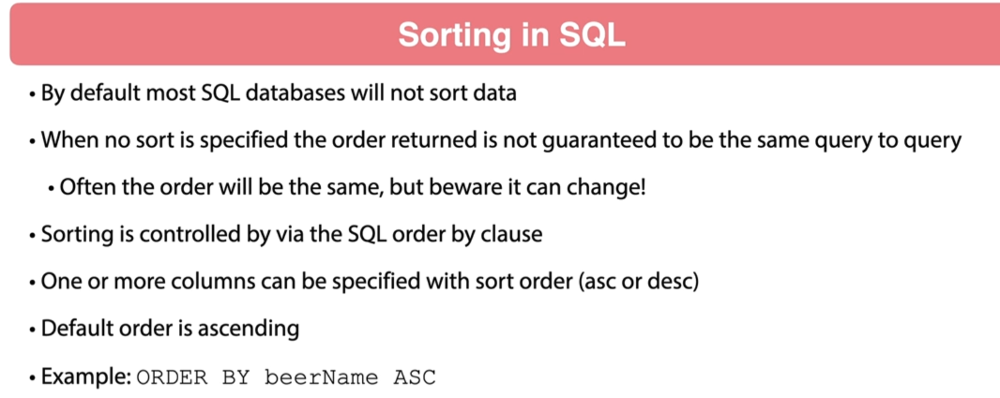

#

## 001 Introduction


## 002 What is Paging and Sorting





## 003 Paging and Sorting with Spring


## 004 Add Paging Parameters
```java
    @GetMapping(BEER_PATH)
    public List<BeerDTO> listAllBeers(
            @RequestParam(required = false) String beerName,
            @RequestParam(required = false) boolean showInventory,
            @RequestParam(required = false) BeerStyle beerStyle,
            @RequestParam(required = false) Integer pageSize,
            @RequestParam(required = false) Integer pageNumber
    ) {
        log.debug("listAllBeers() called in BeerController");
        return beerService.listAllBeers(beerName, showInventory, beerStyle, 1, 25);
    }
```


```java
package com.wchamara.spring6restmvc.service;

import com.wchamara.spring6restmvc.model.BeerDTO;
import com.wchamara.spring6restmvc.model.BeerStyle;

import java.util.List;
import java.util.Optional;
import java.util.UUID;

public interface BeerService {
    Optional<BeerDTO> getBeerById(UUID id);

    List<BeerDTO> listAllBeers(String beerName, Boolean showInventory, BeerStyle beerStyle, Integer pageNumber, Integer pageSize);

    BeerDTO saveNewBeer(BeerDTO beerDTO);

    Optional<BeerDTO> updateBeer(UUID id, BeerDTO beerDTO);

    void deleteBeer(UUID id);

    Optional<BeerDTO> patchBeer(UUID id, BeerDTO beerDTO);
}

```
## 005 Create Page Request Object

```java

```

```java

```

## 006 Refactor Spring Data JPA Repositories

```java

```

## 007 Add Sort Parameter

```java

```
