# 16 - Database Relationship Mappings

## 001 Introduction
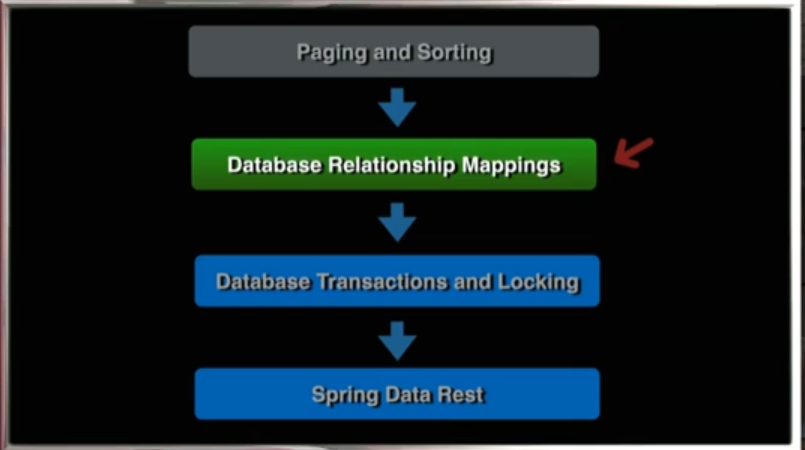
## 002 Overview of Database Relationships
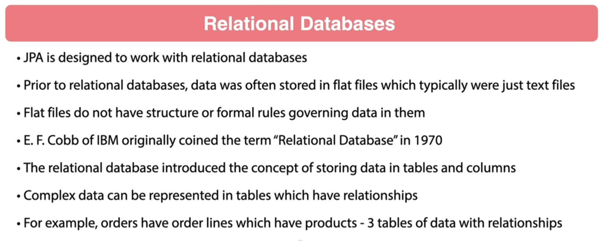

Relational databases are a type of database that stores and provides access to data points that are related to one another. The data in a relational database is organized into tables, which are structured into rows and columns. Each table typically represents an entity or concept, such as customers, products, or orders, and each row in a table represents a specific instance of that entity.

### Key Concepts of Relational Databases:

1. **Tables**: 
   - Also known as relations, tables are the fundamental building blocks of a relational database. A table consists of rows (also called records or tuples) and columns (also called fields or attributes).
   - Each table usually has a primary key, a unique identifier for the rows in the table.

2. **Rows and Columns**:
   - **Rows**: Each row in a table represents a single record or data point. For example, in a table of customers, each row might represent one customer.
   - **Columns**: Each column in a table represents a specific attribute of the entity. For example, in a table of customers, columns might include `CustomerID`, `Name`, `Email`, and `PhoneNumber`.

3. **Primary Key**:
   - A primary key is a unique identifier for each row in a table. It ensures that each record can be uniquely identified. For example, a `CustomerID` might be a primary key in a customer table.

4. **Foreign Key**:
   - A foreign key is a field in one table that uniquely identifies a row in another table. It establishes a relationship between two tables. For example, an `Order` table might have a `CustomerID` that links each order to a customer in the `Customers` table.

5. **Relationships**:
   - **One-to-One**: A relationship where a row in one table is linked to a single row in another table.
   - **One-to-Many**: A relationship where a row in one table can be linked to multiple rows in another table. For example, one customer might have multiple orders.
   - **Many-to-Many**: A relationship where rows in one table can be linked to multiple rows in another table, and vice versa. This is often managed through a junction table.

6. **SQL (Structured Query Language)**:
   - SQL is the standard language used to interact with relational databases. SQL commands can be used to create, read, update, and delete data in a relational database (often abbreviated as CRUD operations).
   - Examples of SQL commands include `SELECT` (to retrieve data), `INSERT` (to add data), `UPDATE` (to modify data), and `DELETE` (to remove data).

### Advantages of Relational Databases:

- **Data Integrity**: Enforces rules through constraints like primary keys, foreign keys, and unique constraints, ensuring data accuracy and consistency.
- **Flexibility**: Tables can be easily modified or extended, and complex queries can be executed to retrieve specific data.
- **Security**: Access to data can be controlled at various levels, allowing for detailed permissions and roles.
- **Scalability**: Relational databases can handle large amounts of data and can scale horizontally or vertically.

### Popular Relational Database Management Systems (RDBMS):

- **MySQL**: An open-source relational database system, widely used for web applications.
- **PostgreSQL**: An open-source database known for its advanced features and standards compliance.
- **Oracle Database**: A commercial database known for its scalability and enterprise features.
- **Microsoft SQL Server**: A commercial database developed by Microsoft, widely used in enterprise environments.
- **SQLite**: A lightweight, embedded relational database often used in mobile applications and small-scale projects.

Relational databases are a fundamental technology in software development, data management, and many enterprise applications. They provide a structured and efficient way to store and retrieve related data.


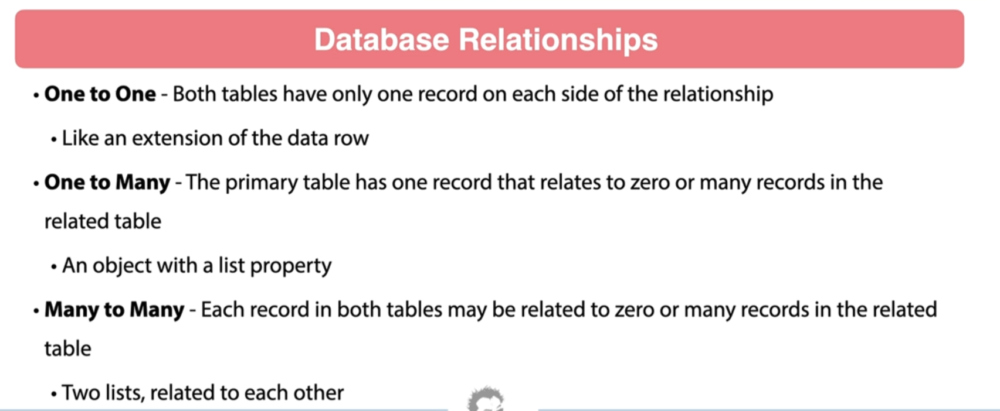
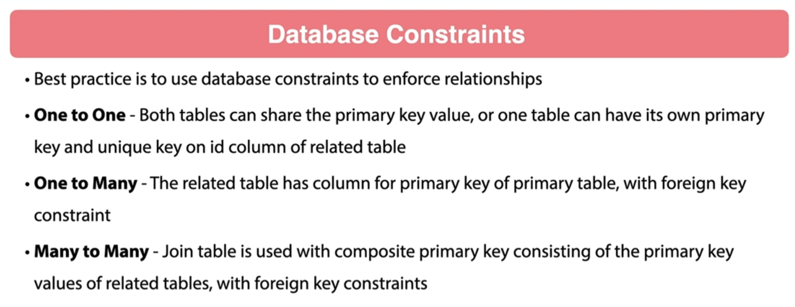
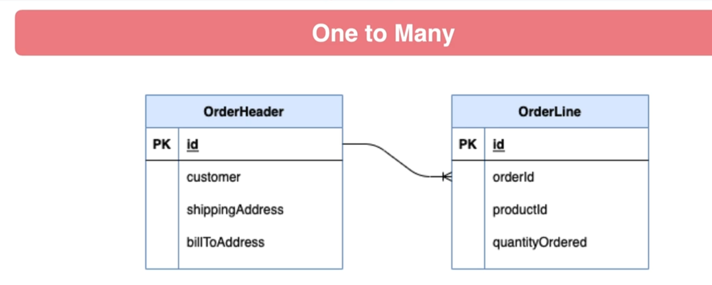
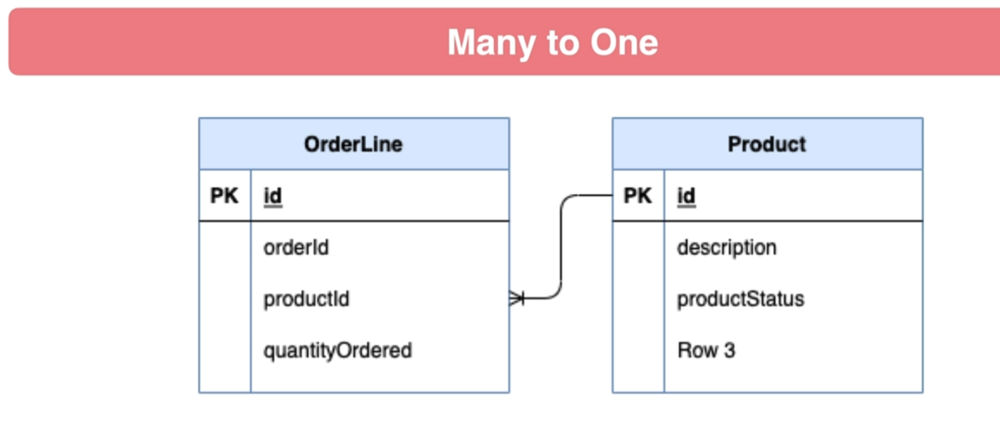
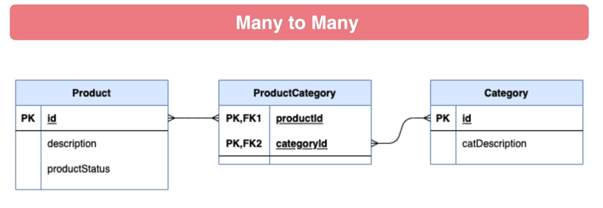
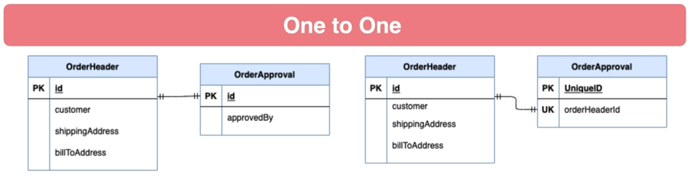
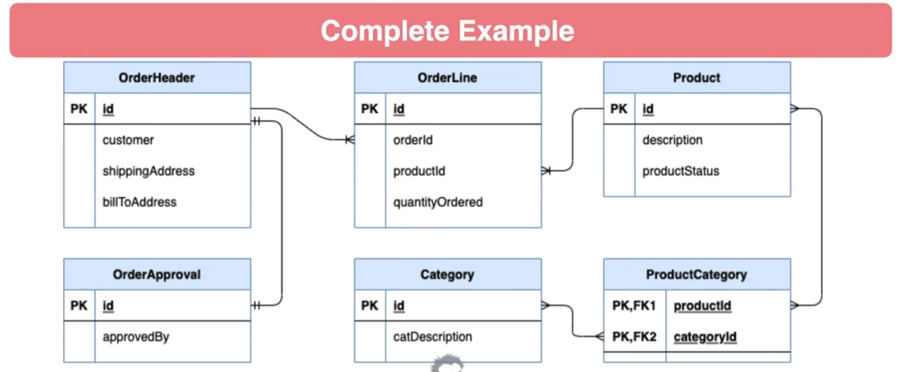
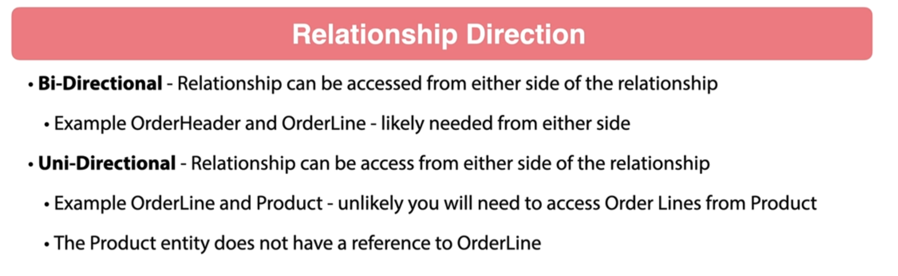
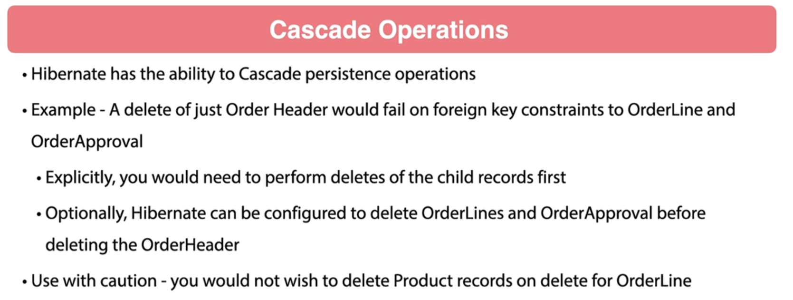
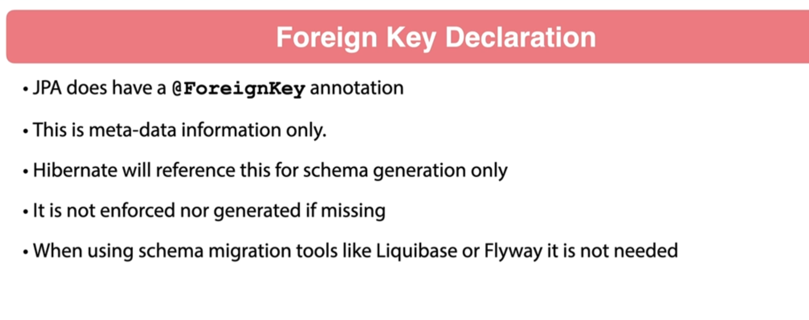
## 003 Review of Database Changes
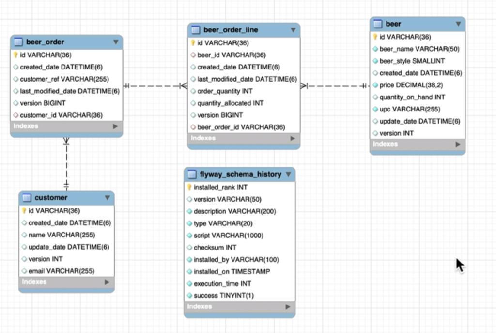

current database schema

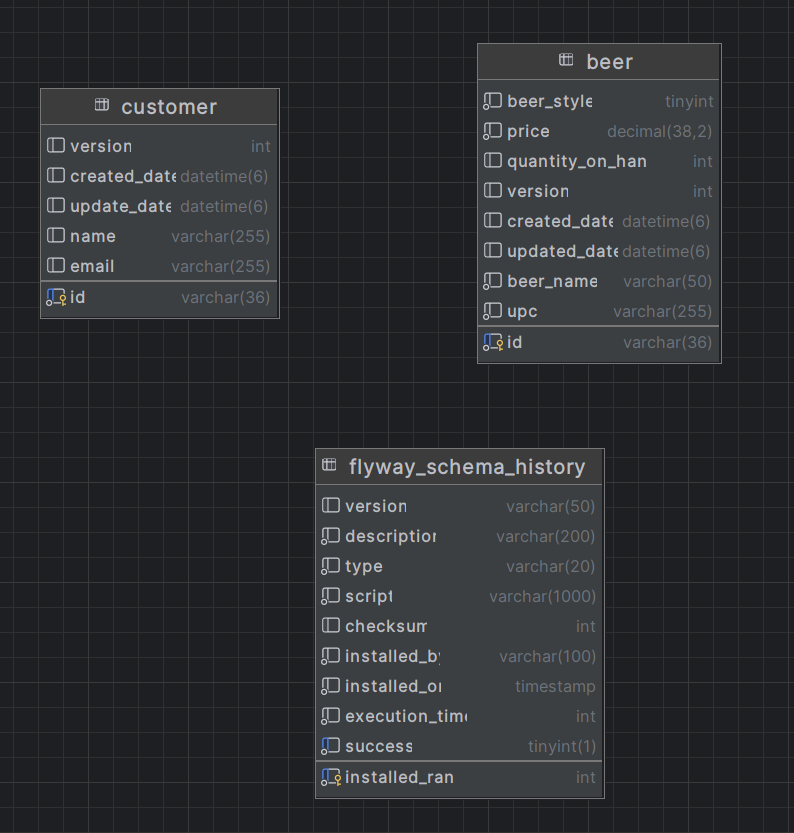

```sql
create table beer
(
    beer_style       tinyint        not null,
    price            decimal(38, 2) not null,
    quantity_on_hand int            null,
    version          int            null,
    created_date     datetime(6)    null,
    updated_date     datetime(6)    null,
    id               varchar(36)    not null
        primary key,
    beer_name        varchar(50)    not null,
    upc              varchar(255)   not null,
    check (`beer_style` between 0 and 9)
);

create table customer
(
    version      int          null,
    created_date datetime(6)  null,
    update_date  datetime(6)  null,
    id           varchar(36)  not null
        primary key,
    name         varchar(255) null,
    email        varchar(255) null
);

create table flyway_schema_history
(
    installed_rank int                                 not null
        primary key,
    version        varchar(50)                         null,
    description    varchar(200)                        not null,
    type           varchar(20)                         not null,
    script         varchar(1000)                       not null,
    checksum       int                                 null,
    installed_by   varchar(100)                        not null,
    installed_on   timestamp default CURRENT_TIMESTAMP not null,
    execution_time int                                 not null,
    success        tinyint(1)                          not null
);

create index flyway_schema_history_s_idx
    on flyway_schema_history (success);


```
This SQL script creates three tables (`beer`, `customer`, `flyway_schema_history`) and an index on the `flyway_schema_history` table. Here's an explanation of each part of the code:

### 1. **`beer` Table**:
   - **Columns**:
     - `beer_style`: A `TINYINT` (a small integer) that cannot be null. The value must be between 0 and 9, as enforced by a `CHECK` constraint.
     - `price`: A `DECIMAL(38, 2)` value representing the price of the beer, which cannot be null.
     - `quantity_on_hand`: An `INT` representing the stock quantity of the beer, which can be null.
     - `version`: An `INT` used for tracking changes or optimistic locking, which can be null.
     - `created_date` & `updated_date`: `DATETIME(6)` values for storing timestamps, allowing up to microseconds precision, which can be null.
     - `id`: A `VARCHAR(36)` representing the unique identifier for each beer, which is the primary key and cannot be null.
     - `beer_name`: A `VARCHAR(50)` for storing the name of the beer, which cannot be null.
     - `upc`: A `VARCHAR(255)` for the Universal Product Code, which cannot be null.
   - **Constraints**:
     - `CHECK (beer_style between 0 and 9)`: Ensures that the `beer_style` value is between 0 and 9.

### 2. **`customer` Table**:
   - **Columns**:
     - `version`: An `INT` that can be null, possibly for versioning.
     - `created_date` & `update_date`: `DATETIME(6)` columns for tracking creation and update times, which can be null.
     - `id`: A `VARCHAR(36)` that serves as the primary key and cannot be null.
     - `name`: A `VARCHAR(255)` for the customer's name, which can be null.
     - `email`: A `VARCHAR(255)` for the customer's email, which can be null.

### 3. **`flyway_schema_history` Table**:
   - **Columns**:
     - `installed_rank`: An `INT` that serves as the primary key.
     - `version`: A `VARCHAR(50)` for the version of the migration script, which can be null.
     - `description`: A `VARCHAR(200)` for a brief description of the migration, which cannot be null.
     - `type`: A `VARCHAR(20)` for the type of migration, which cannot be null.
     - `script`: A `VARCHAR(1000)` for the script name, which cannot be null.
     - `checksum`: An `INT` for storing a checksum, which can be null.
     - `installed_by`: A `VARCHAR(100)` for tracking who installed the migration, which cannot be null.
     - `installed_on`: A `TIMESTAMP` column that defaults to the current timestamp when a record is inserted, which cannot be null.
     - `execution_time`: An `INT` for the execution time of the migration, which cannot be null.
     - `success`: A `TINYINT(1)` for indicating whether the migration was successful, which cannot be null.
   - **Index**:
     - `flyway_schema_history_s_idx`: An index on the `success` column to improve query performance when filtering by `success`.

## 004 One to Many Bidirectional

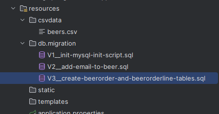

```sql
drop table if exists beer_order;
drop table if exists beer_order_line;


create table `beer_order`
(
    id                 varchar(36) NOT NULL,
    version            bigint       DEFAULT NULL,
    created_date       datetime(6)  DEFAULT NULL,
    last_modified_date datetime(6)  DEFAULT NULL,
    customer_ref       varchar(255) DEFAULT NULL,
    customer_id        varchar(36)  DEFAULT NULL,
    primary key (id),
    CONSTRAINT FOREIGN KEY (customer_id) REFERENCES customer (id)
) engine = InnoDB;


create table `beer_order_line`
(
    id                 varchar(36) NOT NULL,
    beer_id            varchar(36) DEFAULT NULL,
    created_date       datetime(6) DEFAULT NULL,
    last_modified_date datetime(6) DEFAULT NULL,
    order_quantity     int         DEFAULT NULL,
    quantity_allocated int         DEFAULT NULL,
    version            bigint      DEFAULT NULL,
    beer_order_id      varchar(36) DEFAULT NULL,
    PRIMARY KEY (id),
    CONSTRAINT FOREIGN KEY (beer_order_id) REFERENCES beer_order (id),
    CONSTRAINT FOREIGN KEY (beer_id) REFERENCES beer (id)
) engine = InnoDB;

```


This SQL script drops two tables (`beer_order` and `beer_order_line`) if they exist, then creates them with specific columns, primary keys, and foreign key constraints. Let's break down each part of the script:

### 1. **Dropping Tables**
```sql
DROP TABLE IF EXISTS beer_order;
DROP TABLE IF EXISTS beer_order_line;
```
- These commands ensure that if the `beer_order` and `beer_order_line` tables already exist in the database, they will be deleted before creating new ones. This is useful for avoiding errors when running the script multiple times.

### 2. **Creating the `beer_order` Table**
```sql
CREATE TABLE `beer_order`
(
    id                 varchar(36) NOT NULL,
    version            bigint       DEFAULT NULL,
    created_date       datetime(6)  DEFAULT NULL,
    last_modified_date datetime(6)  DEFAULT NULL,
    customer_ref       varchar(255) DEFAULT NULL,
    customer_id        varchar(36)  DEFAULT NULL,
    PRIMARY KEY (id),
    CONSTRAINT FOREIGN KEY (customer_id) REFERENCES customer (id)
) ENGINE = InnoDB;
```
- **`id`**: A `VARCHAR(36)` column that serves as the primary key for the table. The size `36` is typically used for storing UUIDs, and `NOT NULL` ensures that this field cannot be left empty.
- **`version`**: A `BIGINT` column that might be used for versioning (optimistic locking) to manage concurrency.
- **`created_date` & `last_modified_date`**: `DATETIME(6)` columns that store timestamps with up to six decimal places of precision (microseconds). These fields can be used to track when the order was created and last modified.
- **`customer_ref`**: A `VARCHAR(255)` column that stores a reference or identifier for the customer, which might be used for business purposes.
- **`customer_id`**: A `VARCHAR(36)` column that holds the ID of the customer associated with the order.
- **`PRIMARY KEY (id)`**: This constraint ensures that the `id` field uniquely identifies each record in the table.
- **`FOREIGN KEY (customer_id) REFERENCES customer (id)`**: This constraint establishes a relationship between the `beer_order` table and the `customer` table, linking the `customer_id` in `beer_order` to the `id` in `customer`. This ensures referential integrity, meaning that any `customer_id` in the `beer_order` table must exist in the `customer` table.

- **`ENGINE = InnoDB`**: Specifies that the table should use the InnoDB storage engine, which supports transactions, foreign keys, and row-level locking.

### 3. **Creating the `beer_order_line` Table**
```sql
CREATE TABLE `beer_order_line`
(
    id                 varchar(36) NOT NULL,
    beer_id            varchar(36) DEFAULT NULL,
    created_date       datetime(6) DEFAULT NULL,
    last_modified_date datetime(6) DEFAULT NULL,
    order_quantity     int         DEFAULT NULL,
    quantity_allocated int         DEFAULT NULL,
    version            bigint      DEFAULT NULL,
    beer_order_id      varchar(36) DEFAULT NULL,
    PRIMARY KEY (id),
    CONSTRAINT FOREIGN KEY (beer_order_id) REFERENCES beer_order (id),
    CONSTRAINT FOREIGN KEY (beer_id) REFERENCES beer (id)
) ENGINE = InnoDB;
```
- **`id`**: A `VARCHAR(36)` column that serves as the primary key for the table, similar to the `beer_order` table.
- **`beer_id`**: A `VARCHAR(36)` column that stores the ID of the beer associated with this order line.
- **`created_date` & `last_modified_date`**: `DATETIME(6)` columns for tracking when the order line was created and last modified, similar to the `beer_order` table.
- **`order_quantity`**: An `INT` column that records the quantity of beer ordered.
- **`quantity_allocated`**: An `INT` column that records the quantity of beer that has been allocated for the order. This could be used to track inventory levels.
- **`version`**: A `BIGINT` column, potentially used for versioning.
- **`beer_order_id`**: A `VARCHAR(36)` column that links each order line to a specific order in the `beer_order` table.
- **`PRIMARY KEY (id)`**: Ensures that each `id` in the `beer_order_line` table is unique.
- **`FOREIGN KEY (beer_order_id) REFERENCES beer_order (id)`**: Establishes a relationship between `beer_order_line` and `beer_order`, linking `beer_order_id` in `beer_order_line` to `id` in `beer_order`.
- **`FOREIGN KEY (beer_id) REFERENCES beer (id)`**: Establishes a relationship between `beer_order_line` and `beer`, linking `beer_id` in `beer_order_line` to `id` in `beer`.
- **`ENGINE = InnoDB`**: Specifies the use of the InnoDB storage engine for the `beer_order_line` table, as with `beer_order`.

### Summary
- **`beer_order`**: Represents a customer's order, with references to the customer.
- **`beer_order_line`**: Represents individual items within an order, with references to the beer and the order it belongs to.

These tables are structured to maintain data integrity and relationships between orders, customers, and beers, using foreign key constraints and the InnoDB engine for support of ACID-compliant transactions.

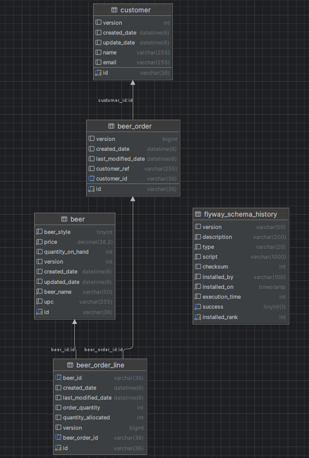

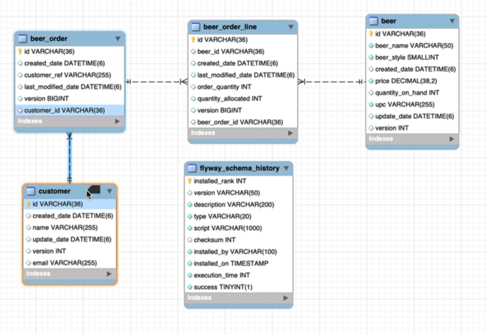


```java
package com.wchamara.spring6restmvc.entities;

import jakarta.persistence.*;
import lombok.*;
import org.hibernate.annotations.CreationTimestamp;
import org.hibernate.annotations.JdbcTypeCode;
import org.hibernate.annotations.UpdateTimestamp;
import org.hibernate.annotations.UuidGenerator;
import org.hibernate.type.SqlTypes;

import java.sql.Timestamp;
import java.util.UUID;

@Getter
@Setter
@Entity
@NoArgsConstructor
@AllArgsConstructor
@Builder
public class BeerOrder {

    @Id
    @GeneratedValue
    @UuidGenerator
    @JdbcTypeCode(SqlTypes.CHAR)
    @Column(length = 36, columnDefinition = "varchar(36)", updatable = false, nullable = false)
    private UUID id;

    @Version
    private Long version;

    @CreationTimestamp
    @Column(updatable = false)
    private Timestamp createdDate;

    @UpdateTimestamp
    private Timestamp lastModifiedDate;

    private String customerRef;

    @ManyToOne
    private Customer customer;

    public boolean isNew() {
        return this.id == null;
    }
}

```

```java
package com.wchamara.spring6restmvc.entities;

import jakarta.persistence.Column;
import jakarta.persistence.Entity;
import jakarta.persistence.GeneratedValue;
import jakarta.persistence.Id;
import lombok.*;
import org.hibernate.annotations.JdbcTypeCode;
import org.hibernate.annotations.UuidGenerator;
import org.hibernate.type.SqlTypes;

import java.util.UUID;

@Getter
@Setter
@NoArgsConstructor
@AllArgsConstructor
@Entity
@Builder
public class BeerOrderLine {

    @Id
    @GeneratedValue
    @UuidGenerator
    @JdbcTypeCode(SqlTypes.CHAR)
    @Column(length = 36, columnDefinition = "varchar(36)", updatable = false, nullable = false)
    private UUID id;


}

```
```java
package com.wchamara.spring6restmvc.entities;

import jakarta.persistence.*;
import lombok.*;
import org.hibernate.annotations.CreationTimestamp;
import org.hibernate.annotations.JdbcTypeCode;
import org.hibernate.annotations.UpdateTimestamp;
import org.hibernate.annotations.UuidGenerator;
import org.hibernate.type.SqlTypes;

import java.time.LocalDateTime;
import java.util.Set;
import java.util.UUID;

@Entity
@AllArgsConstructor
@NoArgsConstructor
@Getter
@Setter
@Builder
public class Customer {
    @Id
    @GeneratedValue
    @UuidGenerator
    @JdbcTypeCode(SqlTypes.CHAR)
    @Column(length = 36, columnDefinition = "varchar(36)", updatable = false, nullable = false)
    private UUID id;

    @Column(length = 255)
    private String email;

    @Version
    private Integer version;
    private String name;

    @CreationTimestamp
    private LocalDateTime createdDate;

    @UpdateTimestamp
    private LocalDateTime updateDate;

    @OneToMany(mappedBy = "customer")
    private Set<BeerOrder> beerOrders;
}

```


The section `@OneToMany(mappedBy = "customer") private Set<BeerOrder> beerOrders;` in the `Customer` class represents a one-to-many relationship between the `Customer` entity and the `BeerOrder` entity. Let's break down what each part of this annotation and field means:

### 1. **`@OneToMany` Annotation:**
   - The `@OneToMany` annotation is used to define a one-to-many relationship between two entities.
   - In a one-to-many relationship, one entity (the "one" side) can be associated with multiple instances of another entity (the "many" side).
   - In this case, the `Customer` entity is on the "one" side of the relationship, and the `BeerOrder` entity is on the "many" side.

### 2. **`mappedBy = "customer"`:**
   - The `mappedBy` attribute specifies the field in the `BeerOrder` entity that owns the relationship.
   - The value `"customer"` refers to the `customer` field in the `BeerOrder` entity. This tells JPA that the `BeerOrder` entity has a `customer` field that refers to the `Customer` entity.
   - Essentially, it means that the `Customer` entity does not own the relationship; instead, the `BeerOrder` entity does. The `mappedBy` attribute is used to tell JPA that the mapping is already defined on the other side (in the `BeerOrder` class), and it should not create an additional foreign key column in the `Customer` table.

### 3. **`private Set<BeerOrder> beerOrders;`:**
   - This field represents a collection of `BeerOrder` objects associated with a `Customer`.
   - The `Set<BeerOrder>` is a Java `Set` collection that will contain all the `BeerOrder` instances related to the specific `Customer`. The `Set` ensures that there are no duplicate `BeerOrder` instances associated with the same `Customer`.
   - This collection is automatically populated by JPA/Hibernate when you load a `Customer` from the database, and it contains all the beer orders associated with that customer.

### Summary of this Relationship:
- **Customer** is the parent entity, and it can have multiple associated **BeerOrders**.
- The `BeerOrder` entity has a field called `customer` that references the `Customer` entity.
- The `beerOrders` field in the `Customer` class represents all the beer orders associated with that particular customer.
- The `mappedBy = "customer"` tells JPA/Hibernate that the `BeerOrder` entity is responsible for maintaining the relationship and that the `Customer` entity should not try to manage a separate foreign key column.

This setup allows you to navigate from a `Customer` to all their associated `BeerOrder` instances, making it easy to retrieve and manage the orders for a specific customer in your application.


## 005 Create Beer Order Repository

```java
package com.wchamara.spring6restmvc.repositories;

import com.wchamara.spring6restmvc.entities.BeerOrder;
import org.springframework.data.jpa.repository.JpaRepository;

import java.util.UUID;

public interface BeerOrderRepository extends JpaRepository<BeerOrder, UUID> {
}

```

```java
package com.wchamara.spring6restmvc.repositories;

import com.wchamara.spring6restmvc.entities.Beer;
import com.wchamara.spring6restmvc.entities.Customer;
import org.junit.jupiter.api.BeforeEach;
import org.junit.jupiter.api.Test;
import org.springframework.beans.factory.annotation.Autowired;
import org.springframework.boot.test.context.SpringBootTest;

@SpringBootTest
class BeerOrderRepositoryTest {


    @Autowired
    BeerOrderRepository beerOrderRepository;

    @Autowired
    CustomerRepository customerRepository;

    @Autowired
    BeerRepository beerRepository;

    Customer testCustomer;
    Beer testBeer;

    @BeforeEach
    void setUp() {
        testCustomer = customerRepository.findAll().get(0);
        testBeer = beerRepository.findAll().get(0);
    }

    @Test
    void name() {
        System.out.println("testCustomer = " + testCustomer.toString());
        System.out.println("testBeer = " + testBeer.toString());

    }
}
```


## 006 Persisting Beer Order Relationships
```java
package com.wchamara.spring6restmvc.repositories;

import com.wchamara.spring6restmvc.entities.Beer;
import com.wchamara.spring6restmvc.entities.BeerOrder;
import com.wchamara.spring6restmvc.entities.Customer;
import jakarta.transaction.Transactional;
import org.junit.jupiter.api.BeforeEach;
import org.junit.jupiter.api.Test;
import org.springframework.beans.factory.annotation.Autowired;
import org.springframework.boot.test.context.SpringBootTest;

@SpringBootTest
class BeerOrderRepositoryTest {


    @Autowired
    BeerOrderRepository beerOrderRepository;

    @Autowired
    CustomerRepository customerRepository;

    @Autowired
    BeerRepository beerRepository;

    Customer testCustomer;
    Beer testBeer;

    @BeforeEach
    void setUp() {
        testCustomer = customerRepository.findAll().get(0);
        testBeer = beerRepository.findAll().get(0);
    }

    @Test
    @Transactional
    void name() {
        BeerOrder beerOrder = BeerOrder.builder()
                .customer(testCustomer)
                .customerRef("Test Customer Ref")
                .build();

        BeerOrder savedBeerOrder = beerOrderRepository.saveAndFlush(beerOrder);

        System.out.println(savedBeerOrder.getCustomerRef());

    }
}
```
## 007 Association Helper Methods

The selected code `@Builder.Default` is an annotation provided by the Lombok library, which is used in the context of the `Customer` entity class. Lombok is a popular Java library that helps reduce boilerplate code by generating common methods and annotations at compile time.

In the `Customer` class, the `@Builder.Default` annotation is applied to the `beerOrders` field. This field is a `Set` of `BeerOrder` objects, which represents the orders associated with a customer. The `@Builder.Default` annotation ensures that when the `Customer` class is instantiated using the Lombok-generated builder pattern, the `beerOrders` field is initialized with a default value if no value is provided during the building process.

Here is the relevant code snippet:
```java
@Builder.Default
@OneToMany(mappedBy = "customer")
private Set<BeerOrder> beerOrders = new HashSet<>();
```

Without the `@Builder.Default` annotation, the `beerOrders` field would be `null` if not explicitly set during the building process. By using this annotation, the field is initialized to an empty `HashSet`, ensuring that it is never `null` and avoiding potential `NullPointerException` issues when accessing or modifying the `beerOrders` set.

In summary, the `@Builder.Default` annotation in the `Customer` class ensures that the `beerOrders` field is initialized with a default value of an empty `HashSet` when using the builder pattern provided by Lombok. This helps maintain the integrity of the `Customer` object and prevents null-related issues.

```java
package com.wchamara.spring6restmvc.entities;

import jakarta.persistence.*;
import lombok.*;
import org.hibernate.annotations.CreationTimestamp;
import org.hibernate.annotations.JdbcTypeCode;
import org.hibernate.annotations.UpdateTimestamp;
import org.hibernate.annotations.UuidGenerator;
import org.hibernate.type.SqlTypes;

import java.time.LocalDateTime;
import java.util.HashSet;
import java.util.Set;
import java.util.UUID;

@Entity
@AllArgsConstructor
@NoArgsConstructor
@Getter
@Setter
@Builder
public class Customer {
    
    @Id
    @GeneratedValue
    @UuidGenerator
    @JdbcTypeCode(SqlTypes.CHAR)
    @Column(length = 36, columnDefinition = "varchar(36)", updatable = false, nullable = false)
    private UUID id;

    @Column(length = 255)
    private String email;

    @Version
    private Integer version;
    private String name;

    @CreationTimestamp
    private LocalDateTime createdDate;

    @UpdateTimestamp
    private LocalDateTime updateDate;

    @Builder.Default
    @OneToMany(mappedBy = "customer")
    private Set<BeerOrder> beerOrders = new HashSet<>();
}

```
```java
package com.wchamara.spring6restmvc.entities;

import jakarta.persistence.*;
import lombok.*;
import org.hibernate.annotations.CreationTimestamp;
import org.hibernate.annotations.JdbcTypeCode;
import org.hibernate.annotations.UpdateTimestamp;
import org.hibernate.annotations.UuidGenerator;
import org.hibernate.type.SqlTypes;

import java.time.LocalDateTime;
import java.util.HashSet;
import java.util.Set;
import java.util.UUID;

@Entity
@AllArgsConstructor
@NoArgsConstructor
@Getter
@Setter
@Builder
public class Customer {
    @Id
    @GeneratedValue
    @UuidGenerator
    @JdbcTypeCode(SqlTypes.CHAR)
    @Column(length = 36, columnDefinition = "varchar(36)", updatable = false, nullable = false)
    private UUID id;

    @Column(length = 255)
    private String email;

    @Version
    private Integer version;
    private String name;

    @CreationTimestamp
    private LocalDateTime createdDate;

    @UpdateTimestamp
    private LocalDateTime updateDate;

    @Builder.Default
    @OneToMany(mappedBy = "customer")
    private Set<BeerOrder> beerOrders = new HashSet<>();
}

```
```java
package com.wchamara.spring6restmvc.repositories;

import com.wchamara.spring6restmvc.entities.Beer;
import com.wchamara.spring6restmvc.entities.BeerOrder;
import com.wchamara.spring6restmvc.entities.Customer;
import jakarta.transaction.Transactional;
import org.junit.jupiter.api.BeforeEach;
import org.junit.jupiter.api.Test;
import org.springframework.beans.factory.annotation.Autowired;
import org.springframework.boot.test.context.SpringBootTest;

@SpringBootTest
class BeerOrderRepositoryTest {


    @Autowired
    BeerOrderRepository beerOrderRepository;

    @Autowired
    CustomerRepository customerRepository;

    @Autowired
    BeerRepository beerRepository;

    Customer testCustomer;
    Beer testBeer;

    @BeforeEach
    void setUp() {
        testCustomer = customerRepository.findAll().get(0);
        testBeer = beerRepository.findAll().get(0);
    }

    @Test
    @Transactional
    void name() {
        BeerOrder beerOrder = BeerOrder.builder()
                .customer(testCustomer)
                .customerRef("Test Customer Ref")
                .build();

        BeerOrder savedBeerOrder = beerOrderRepository.save(beerOrder);

        System.out.println(savedBeerOrder.getCustomerRef());

    }
}
```

Let's break down the code you provided, focusing on the `@ManyToOne` annotation and the related methods in the `BeerOrder` class.

### 1. **`@ManyToOne private Customer customer;`**

- **`@ManyToOne` Annotation**:
  - This annotation defines a many-to-one relationship between the `BeerOrder` entity and the `Customer` entity.
  - In a many-to-one relationship, many instances of one entity (`BeerOrder`) are associated with one instance of another entity (`Customer`).
  - For example, multiple beer orders can be associated with a single customer, but each beer order is associated with only one customer.

- **Field `private Customer customer;`**:
  - This field represents the `Customer` entity that is associated with the `BeerOrder`. 
  - In the database, this relationship is typically represented by a foreign key column in the `BeerOrder` table that points to the primary key of the `Customer` table.

### 2. **`BeerOrder` Constructor**

```java
public BeerOrder(UUID id, Long version, Timestamp createdDate, Timestamp lastModifiedDate, String customerRef, Customer customer) {
    this.id = id;
    this.version = version;
    this.createdDate = createdDate;
    this.lastModifiedDate = lastModifiedDate;
    this.customerRef = customerRef;
    this.setCustomer(customer);
}
```

- **Purpose of the Constructor**:
  - This constructor is used to create an instance of `BeerOrder` with specific values for all its fields, including the `Customer` entity it is associated with.
  - When a new `BeerOrder` object is created using this constructor, it sets all the provided fields, including setting the associated `Customer` using the `setCustomer` method.

- **Using `setCustomer(customer)`**:
  - Instead of directly assigning the `customer` field, the constructor uses the `setCustomer` method. This ensures that any additional logic encapsulated in the `setCustomer` method is executed when a `BeerOrder` is created.

### 3. **`setCustomer(Customer customer)` Method**

```java
public void setCustomer(Customer customer) {
    this.customer = customer;
    customer.getBeerOrders().add(this);
}
```

- **Purpose**:
  - This method sets the `Customer` field for the `BeerOrder` object.
  - It also updates the `Customer` object by adding this `BeerOrder` to the `Customer`'s set of beer orders.

- **Why It’s Important**:
  - **Bidirectional Relationship Management**: By calling `customer.getBeerOrders().add(this);`, the `BeerOrder` ensures that the `Customer` object also recognizes this `BeerOrder`. This maintains consistency in a bidirectional relationship.
  - **Avoiding Inconsistency**: If you only set the `customer` field without updating the `Customer`'s list of orders, you could end up with inconsistent data. The `Customer` might not know about the `BeerOrder`, leading to potential issues when navigating the relationship in your application.

### Summary

- **`@ManyToOne` Annotation**: Defines the many-to-one relationship between `BeerOrder` and `Customer`, indicating that many beer orders can belong to a single customer.
- **Constructor**: Initializes a `BeerOrder` with provided values and ensures the relationship with the `Customer` is properly set using the `setCustomer` method.
- **`setCustomer` Method**: Not only sets the `Customer` field in `BeerOrder`, but also updates the `Customer`'s collection of beer orders to include the current `BeerOrder`. This ensures bidirectional consistency and maintains the integrity of the relationship.

This pattern is essential in ensuring that the relationships between entities are consistently managed in both directions, which is crucial when working with object-relational mapping (ORM) frameworks like JPA/Hibernate.

## 008 Many to Many
## 009 Many to Many Persistence
## 010 One to One Bi-Directional
## 011 Cascade on Persist
## 012 Hibernate Cascade Types
