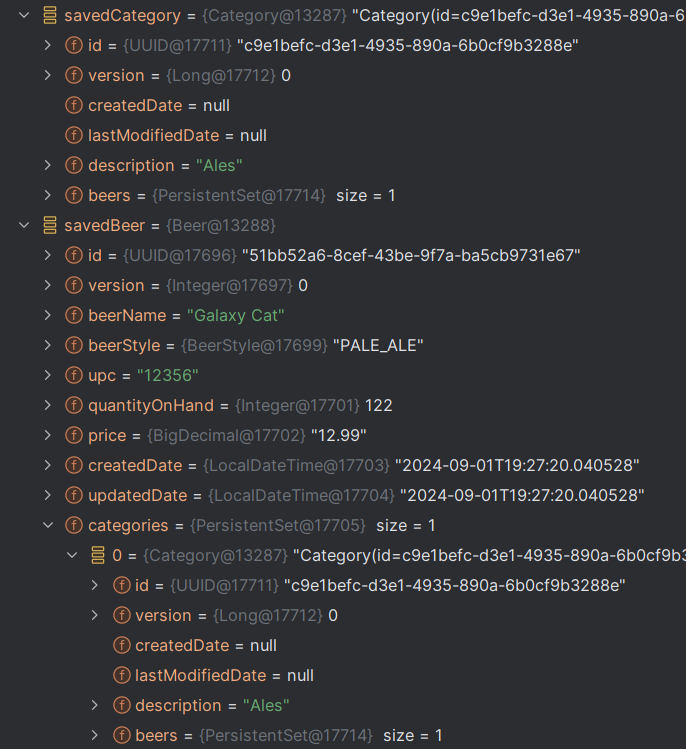
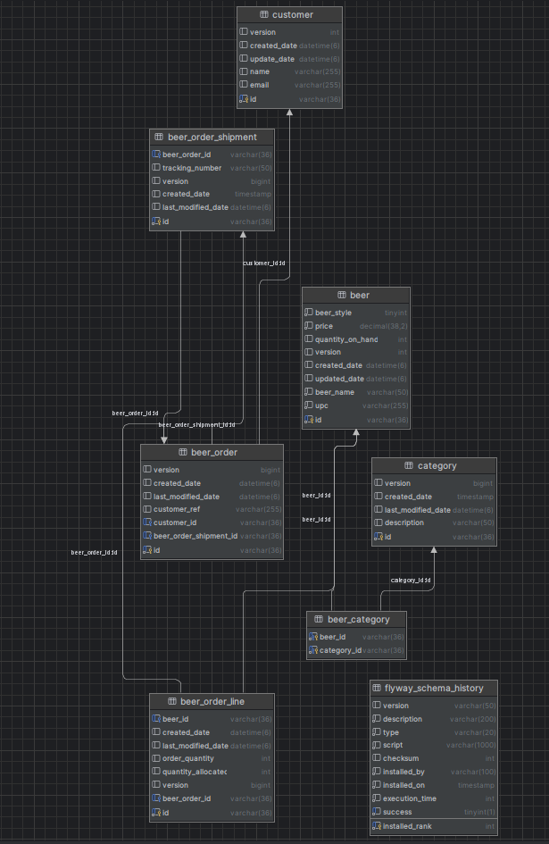
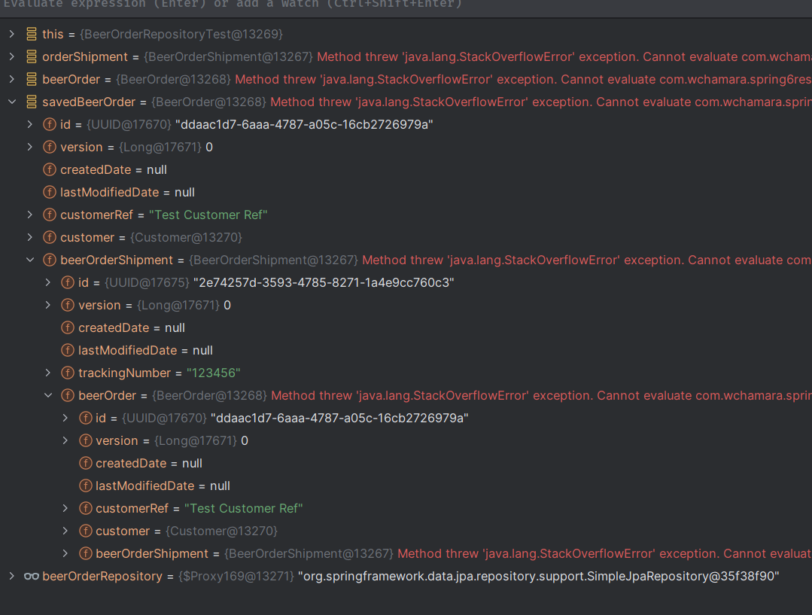
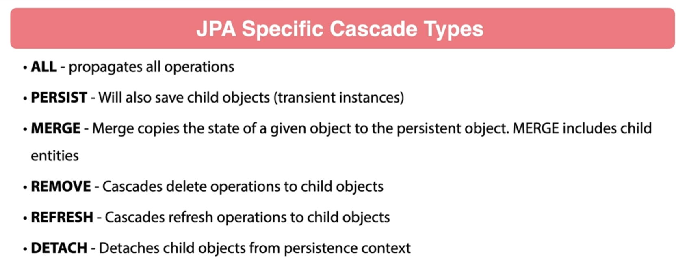
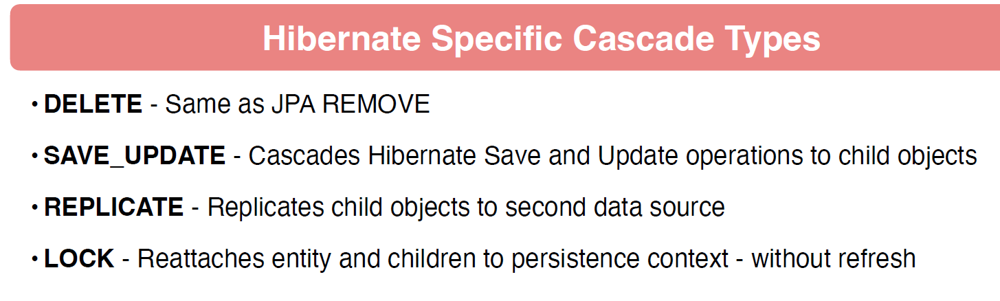

# 16 - Database Relationship Mappings

## 001 Introduction

## 002 Overview of Database Relationships


Relational databases are a type of database that stores and provides access to data points that are related to one another. The data in a relational database is organized into tables, which are structured into rows and columns. Each table typically represents an entity or concept, such as customers, products, or orders, and each row in a table represents a specific instance of that entity.

### Key Concepts of Relational Databases:

1. **Tables**: 
   - Also known as relations, tables are the fundamental building blocks of a relational database. A table consists of rows (also called records or tuples) and columns (also called fields or attributes).
   - Each table usually has a primary key, a unique identifier for the rows in the table.

2. **Rows and Columns**:
   - **Rows**: Each row in a table represents a single record or data point. For example, in a table of customers, each row might represent one customer.
   - **Columns**: Each column in a table represents a specific attribute of the entity. For example, in a table of customers, columns might include `CustomerID`, `Name`, `Email`, and `PhoneNumber`.

3. **Primary Key**:
   - A primary key is a unique identifier for each row in a table. It ensures that each record can be uniquely identified. For example, a `CustomerID` might be a primary key in a customer table.

4. **Foreign Key**:
   - A foreign key is a field in one table that uniquely identifies a row in another table. It establishes a relationship between two tables. For example, an `Order` table might have a `CustomerID` that links each order to a customer in the `Customers` table.

5. **Relationships**:
   - **One-to-One**: A relationship where a row in one table is linked to a single row in another table.
   - **One-to-Many**: A relationship where a row in one table can be linked to multiple rows in another table. For example, one customer might have multiple orders.
   - **Many-to-Many**: A relationship where rows in one table can be linked to multiple rows in another table, and vice versa. This is often managed through a junction table.

6. **SQL (Structured Query Language)**:
   - SQL is the standard language used to interact with relational databases. SQL commands can be used to create, read, update, and delete data in a relational database (often abbreviated as CRUD operations).
   - Examples of SQL commands include `SELECT` (to retrieve data), `INSERT` (to add data), `UPDATE` (to modify data), and `DELETE` (to remove data).

### Advantages of Relational Databases:

- **Data Integrity**: Enforces rules through constraints like primary keys, foreign keys, and unique constraints, ensuring data accuracy and consistency.
- **Flexibility**: Tables can be easily modified or extended, and complex queries can be executed to retrieve specific data.
- **Security**: Access to data can be controlled at various levels, allowing for detailed permissions and roles.
- **Scalability**: Relational databases can handle large amounts of data and can scale horizontally or vertically.

### Popular Relational Database Management Systems (RDBMS):

- **MySQL**: An open-source relational database system, widely used for web applications.
- **PostgreSQL**: An open-source database known for its advanced features and standards compliance.
- **Oracle Database**: A commercial database known for its scalability and enterprise features.
- **Microsoft SQL Server**: A commercial database developed by Microsoft, widely used in enterprise environments.
- **SQLite**: A lightweight, embedded relational database often used in mobile applications and small-scale projects.

Relational databases are a fundamental technology in software development, data management, and many enterprise applications. They provide a structured and efficient way to store and retrieve related data.


## 003 Review of Database Changes


current database schema


```sql
create table beer
(
    beer_style       tinyint        not null,
    price            decimal(38, 2) not null,
    quantity_on_hand int            null,
    version          int            null,
    created_date     datetime(6)    null,
    updated_date     datetime(6)    null,
    id               varchar(36)    not null
        primary key,
    beer_name        varchar(50)    not null,
    upc              varchar(255)   not null,
    check (`beer_style` between 0 and 9)
);

create table customer
(
    version      int          null,
    created_date datetime(6)  null,
    update_date  datetime(6)  null,
    id           varchar(36)  not null
        primary key,
    name         varchar(255) null,
    email        varchar(255) null
);

create table flyway_schema_history
(
    installed_rank int                                 not null
        primary key,
    version        varchar(50)                         null,
    description    varchar(200)                        not null,
    type           varchar(20)                         not null,
    script         varchar(1000)                       not null,
    checksum       int                                 null,
    installed_by   varchar(100)                        not null,
    installed_on   timestamp default CURRENT_TIMESTAMP not null,
    execution_time int                                 not null,
    success        tinyint(1)                          not null
);

create index flyway_schema_history_s_idx
    on flyway_schema_history (success);


```
This SQL script creates three tables (`beer`, `customer`, `flyway_schema_history`) and an index on the `flyway_schema_history` table. Here's an explanation of each part of the code:

### 1. **`beer` Table**:
   - **Columns**:
     - `beer_style`: A `TINYINT` (a small integer) that cannot be null. The value must be between 0 and 9, as enforced by a `CHECK` constraint.
     - `price`: A `DECIMAL(38, 2)` value representing the price of the beer, which cannot be null.
     - `quantity_on_hand`: An `INT` representing the stock quantity of the beer, which can be null.
     - `version`: An `INT` used for tracking changes or optimistic locking, which can be null.
     - `created_date` & `updated_date`: `DATETIME(6)` values for storing timestamps, allowing up to microseconds precision, which can be null.
     - `id`: A `VARCHAR(36)` representing the unique identifier for each beer, which is the primary key and cannot be null.
     - `beer_name`: A `VARCHAR(50)` for storing the name of the beer, which cannot be null.
     - `upc`: A `VARCHAR(255)` for the Universal Product Code, which cannot be null.
   - **Constraints**:
     - `CHECK (beer_style between 0 and 9)`: Ensures that the `beer_style` value is between 0 and 9.

### 2. **`customer` Table**:
   - **Columns**:
     - `version`: An `INT` that can be null, possibly for versioning.
     - `created_date` & `update_date`: `DATETIME(6)` columns for tracking creation and update times, which can be null.
     - `id`: A `VARCHAR(36)` that serves as the primary key and cannot be null.
     - `name`: A `VARCHAR(255)` for the customer's name, which can be null.
     - `email`: A `VARCHAR(255)` for the customer's email, which can be null.

### 3. **`flyway_schema_history` Table**:
   - **Columns**:
     - `installed_rank`: An `INT` that serves as the primary key.
     - `version`: A `VARCHAR(50)` for the version of the migration script, which can be null.
     - `description`: A `VARCHAR(200)` for a brief description of the migration, which cannot be null.
     - `type`: A `VARCHAR(20)` for the type of migration, which cannot be null.
     - `script`: A `VARCHAR(1000)` for the script name, which cannot be null.
     - `checksum`: An `INT` for storing a checksum, which can be null.
     - `installed_by`: A `VARCHAR(100)` for tracking who installed the migration, which cannot be null.
     - `installed_on`: A `TIMESTAMP` column that defaults to the current timestamp when a record is inserted, which cannot be null.
     - `execution_time`: An `INT` for the execution time of the migration, which cannot be null.
     - `success`: A `TINYINT(1)` for indicating whether the migration was successful, which cannot be null.
   - **Index**:
     - `flyway_schema_history_s_idx`: An index on the `success` column to improve query performance when filtering by `success`.

## 004 One to Many Bidirectional


```sql
drop table if exists beer_order;
drop table if exists beer_order_line;


create table `beer_order`
(
    id                 varchar(36) NOT NULL,
    version            bigint       DEFAULT NULL,
    created_date       datetime(6)  DEFAULT NULL,
    last_modified_date datetime(6)  DEFAULT NULL,
    customer_ref       varchar(255) DEFAULT NULL,
    customer_id        varchar(36)  DEFAULT NULL,
    primary key (id),
    CONSTRAINT FOREIGN KEY (customer_id) REFERENCES customer (id)
) engine = InnoDB;


create table `beer_order_line`
(
    id                 varchar(36) NOT NULL,
    beer_id            varchar(36) DEFAULT NULL,
    created_date       datetime(6) DEFAULT NULL,
    last_modified_date datetime(6) DEFAULT NULL,
    order_quantity     int         DEFAULT NULL,
    quantity_allocated int         DEFAULT NULL,
    version            bigint      DEFAULT NULL,
    beer_order_id      varchar(36) DEFAULT NULL,
    PRIMARY KEY (id),
    CONSTRAINT FOREIGN KEY (beer_order_id) REFERENCES beer_order (id),
    CONSTRAINT FOREIGN KEY (beer_id) REFERENCES beer (id)
) engine = InnoDB;

```


This SQL script drops two tables (`beer_order` and `beer_order_line`) if they exist, then creates them with specific columns, primary keys, and foreign key constraints. Let's break down each part of the script:

### 1. **Dropping Tables**
```sql
DROP TABLE IF EXISTS beer_order;
DROP TABLE IF EXISTS beer_order_line;
```
- These commands ensure that if the `beer_order` and `beer_order_line` tables already exist in the database, they will be deleted before creating new ones. This is useful for avoiding errors when running the script multiple times.

### 2. **Creating the `beer_order` Table**
```sql
CREATE TABLE `beer_order`
(
    id                 varchar(36) NOT NULL,
    version            bigint       DEFAULT NULL,
    created_date       datetime(6)  DEFAULT NULL,
    last_modified_date datetime(6)  DEFAULT NULL,
    customer_ref       varchar(255) DEFAULT NULL,
    customer_id        varchar(36)  DEFAULT NULL,
    PRIMARY KEY (id),
    CONSTRAINT FOREIGN KEY (customer_id) REFERENCES customer (id)
) ENGINE = InnoDB;
```
- **`id`**: A `VARCHAR(36)` column that serves as the primary key for the table. The size `36` is typically used for storing UUIDs, and `NOT NULL` ensures that this field cannot be left empty.
- **`version`**: A `BIGINT` column that might be used for versioning (optimistic locking) to manage concurrency.
- **`created_date` & `last_modified_date`**: `DATETIME(6)` columns that store timestamps with up to six decimal places of precision (microseconds). These fields can be used to track when the order was created and last modified.
- **`customer_ref`**: A `VARCHAR(255)` column that stores a reference or identifier for the customer, which might be used for business purposes.
- **`customer_id`**: A `VARCHAR(36)` column that holds the ID of the customer associated with the order.
- **`PRIMARY KEY (id)`**: This constraint ensures that the `id` field uniquely identifies each record in the table.
- **`FOREIGN KEY (customer_id) REFERENCES customer (id)`**: This constraint establishes a relationship between the `beer_order` table and the `customer` table, linking the `customer_id` in `beer_order` to the `id` in `customer`. This ensures referential integrity, meaning that any `customer_id` in the `beer_order` table must exist in the `customer` table.

- **`ENGINE = InnoDB`**: Specifies that the table should use the InnoDB storage engine, which supports transactions, foreign keys, and row-level locking.

### 3. **Creating the `beer_order_line` Table**
```sql
CREATE TABLE `beer_order_line`
(
    id                 varchar(36) NOT NULL,
    beer_id            varchar(36) DEFAULT NULL,
    created_date       datetime(6) DEFAULT NULL,
    last_modified_date datetime(6) DEFAULT NULL,
    order_quantity     int         DEFAULT NULL,
    quantity_allocated int         DEFAULT NULL,
    version            bigint      DEFAULT NULL,
    beer_order_id      varchar(36) DEFAULT NULL,
    PRIMARY KEY (id),
    CONSTRAINT FOREIGN KEY (beer_order_id) REFERENCES beer_order (id),
    CONSTRAINT FOREIGN KEY (beer_id) REFERENCES beer (id)
) ENGINE = InnoDB;
```
- **`id`**: A `VARCHAR(36)` column that serves as the primary key for the table, similar to the `beer_order` table.
- **`beer_id`**: A `VARCHAR(36)` column that stores the ID of the beer associated with this order line.
- **`created_date` & `last_modified_date`**: `DATETIME(6)` columns for tracking when the order line was created and last modified, similar to the `beer_order` table.
- **`order_quantity`**: An `INT` column that records the quantity of beer ordered.
- **`quantity_allocated`**: An `INT` column that records the quantity of beer that has been allocated for the order. This could be used to track inventory levels.
- **`version`**: A `BIGINT` column, potentially used for versioning.
- **`beer_order_id`**: A `VARCHAR(36)` column that links each order line to a specific order in the `beer_order` table.
- **`PRIMARY KEY (id)`**: Ensures that each `id` in the `beer_order_line` table is unique.
- **`FOREIGN KEY (beer_order_id) REFERENCES beer_order (id)`**: Establishes a relationship between `beer_order_line` and `beer_order`, linking `beer_order_id` in `beer_order_line` to `id` in `beer_order`.
- **`FOREIGN KEY (beer_id) REFERENCES beer (id)`**: Establishes a relationship between `beer_order_line` and `beer`, linking `beer_id` in `beer_order_line` to `id` in `beer`.
- **`ENGINE = InnoDB`**: Specifies the use of the InnoDB storage engine for the `beer_order_line` table, as with `beer_order`.

### Summary
- **`beer_order`**: Represents a customer's order, with references to the customer.
- **`beer_order_line`**: Represents individual items within an order, with references to the beer and the order it belongs to.

These tables are structured to maintain data integrity and relationships between orders, customers, and beers, using foreign key constraints and the InnoDB engine for support of ACID-compliant transactions.


```java
package com.wchamara.spring6restmvc.entities;

import jakarta.persistence.*;
import lombok.*;
import org.hibernate.annotations.CreationTimestamp;
import org.hibernate.annotations.JdbcTypeCode;
import org.hibernate.annotations.UpdateTimestamp;
import org.hibernate.annotations.UuidGenerator;
import org.hibernate.type.SqlTypes;

import java.sql.Timestamp;
import java.util.UUID;

@Getter
@Setter
@Entity
@NoArgsConstructor
@AllArgsConstructor
@Builder
public class BeerOrder {

    @Id
    @GeneratedValue
    @UuidGenerator
    @JdbcTypeCode(SqlTypes.CHAR)
    @Column(length = 36, columnDefinition = "varchar(36)", updatable = false, nullable = false)
    private UUID id;

    @Version
    private Long version;

    @CreationTimestamp
    @Column(updatable = false)
    private Timestamp createdDate;

    @UpdateTimestamp
    private Timestamp lastModifiedDate;

    private String customerRef;

    @ManyToOne
    private Customer customer;

    public boolean isNew() {
        return this.id == null;
    }
}

```

```java
package com.wchamara.spring6restmvc.entities;

import jakarta.persistence.Column;
import jakarta.persistence.Entity;
import jakarta.persistence.GeneratedValue;
import jakarta.persistence.Id;
import lombok.*;
import org.hibernate.annotations.JdbcTypeCode;
import org.hibernate.annotations.UuidGenerator;
import org.hibernate.type.SqlTypes;

import java.util.UUID;

@Getter
@Setter
@NoArgsConstructor
@AllArgsConstructor
@Entity
@Builder
public class BeerOrderLine {

    @Id
    @GeneratedValue
    @UuidGenerator
    @JdbcTypeCode(SqlTypes.CHAR)
    @Column(length = 36, columnDefinition = "varchar(36)", updatable = false, nullable = false)
    private UUID id;


}

```
```java
package com.wchamara.spring6restmvc.entities;

import jakarta.persistence.*;
import lombok.*;
import org.hibernate.annotations.CreationTimestamp;
import org.hibernate.annotations.JdbcTypeCode;
import org.hibernate.annotations.UpdateTimestamp;
import org.hibernate.annotations.UuidGenerator;
import org.hibernate.type.SqlTypes;

import java.time.LocalDateTime;
import java.util.Set;
import java.util.UUID;

@Entity
@AllArgsConstructor
@NoArgsConstructor
@Getter
@Setter
@Builder
public class Customer {
    @Id
    @GeneratedValue
    @UuidGenerator
    @JdbcTypeCode(SqlTypes.CHAR)
    @Column(length = 36, columnDefinition = "varchar(36)", updatable = false, nullable = false)
    private UUID id;

    @Column(length = 255)
    private String email;

    @Version
    private Integer version;
    private String name;

    @CreationTimestamp
    private LocalDateTime createdDate;

    @UpdateTimestamp
    private LocalDateTime updateDate;

    @OneToMany(mappedBy = "customer")
    private Set<BeerOrder> beerOrders;
}

```


The section `@OneToMany(mappedBy = "customer") private Set<BeerOrder> beerOrders;` in the `Customer` class represents a one-to-many relationship between the `Customer` entity and the `BeerOrder` entity. Let's break down what each part of this annotation and field means:

### 1. **`@OneToMany` Annotation:**
   - The `@OneToMany` annotation is used to define a one-to-many relationship between two entities.
   - In a one-to-many relationship, one entity (the "one" side) can be associated with multiple instances of another entity (the "many" side).
   - In this case, the `Customer` entity is on the "one" side of the relationship, and the `BeerOrder` entity is on the "many" side.

### 2. **`mappedBy = "customer"`:**
   - The `mappedBy` attribute specifies the field in the `BeerOrder` entity that owns the relationship.
   - The value `"customer"` refers to the `customer` field in the `BeerOrder` entity. This tells JPA that the `BeerOrder` entity has a `customer` field that refers to the `Customer` entity.
   - Essentially, it means that the `Customer` entity does not own the relationship; instead, the `BeerOrder` entity does. The `mappedBy` attribute is used to tell JPA that the mapping is already defined on the other side (in the `BeerOrder` class), and it should not create an additional foreign key column in the `Customer` table.

### 3. **`private Set<BeerOrder> beerOrders;`:**
   - This field represents a collection of `BeerOrder` objects associated with a `Customer`.
   - The `Set<BeerOrder>` is a Java `Set` collection that will contain all the `BeerOrder` instances related to the specific `Customer`. The `Set` ensures that there are no duplicate `BeerOrder` instances associated with the same `Customer`.
   - This collection is automatically populated by JPA/Hibernate when you load a `Customer` from the database, and it contains all the beer orders associated with that customer.

### Summary of this Relationship:
- **Customer** is the parent entity, and it can have multiple associated **BeerOrders**.
- The `BeerOrder` entity has a field called `customer` that references the `Customer` entity.
- The `beerOrders` field in the `Customer` class represents all the beer orders associated with that particular customer.
- The `mappedBy = "customer"` tells JPA/Hibernate that the `BeerOrder` entity is responsible for maintaining the relationship and that the `Customer` entity should not try to manage a separate foreign key column.

This setup allows you to navigate from a `Customer` to all their associated `BeerOrder` instances, making it easy to retrieve and manage the orders for a specific customer in your application.


## 005 Create Beer Order Repository

```java
package com.wchamara.spring6restmvc.repositories;

import com.wchamara.spring6restmvc.entities.BeerOrder;
import org.springframework.data.jpa.repository.JpaRepository;

import java.util.UUID;

public interface BeerOrderRepository extends JpaRepository<BeerOrder, UUID> {
}

```

```java
package com.wchamara.spring6restmvc.repositories;

import com.wchamara.spring6restmvc.entities.Beer;
import com.wchamara.spring6restmvc.entities.Customer;
import org.junit.jupiter.api.BeforeEach;
import org.junit.jupiter.api.Test;
import org.springframework.beans.factory.annotation.Autowired;
import org.springframework.boot.test.context.SpringBootTest;

@SpringBootTest
class BeerOrderRepositoryTest {


    @Autowired
    BeerOrderRepository beerOrderRepository;

    @Autowired
    CustomerRepository customerRepository;

    @Autowired
    BeerRepository beerRepository;

    Customer testCustomer;
    Beer testBeer;

    @BeforeEach
    void setUp() {
        testCustomer = customerRepository.findAll().get(0);
        testBeer = beerRepository.findAll().get(0);
    }

    @Test
    void name() {
        System.out.println("testCustomer = " + testCustomer.toString());
        System.out.println("testBeer = " + testBeer.toString());

    }
}
```


## 006 Persisting Beer Order Relationships
```java
package com.wchamara.spring6restmvc.repositories;

import com.wchamara.spring6restmvc.entities.Beer;
import com.wchamara.spring6restmvc.entities.BeerOrder;
import com.wchamara.spring6restmvc.entities.Customer;
import jakarta.transaction.Transactional;
import org.junit.jupiter.api.BeforeEach;
import org.junit.jupiter.api.Test;
import org.springframework.beans.factory.annotation.Autowired;
import org.springframework.boot.test.context.SpringBootTest;

@SpringBootTest
class BeerOrderRepositoryTest {


    @Autowired
    BeerOrderRepository beerOrderRepository;

    @Autowired
    CustomerRepository customerRepository;

    @Autowired
    BeerRepository beerRepository;

    Customer testCustomer;
    Beer testBeer;

    @BeforeEach
    void setUp() {
        testCustomer = customerRepository.findAll().get(0);
        testBeer = beerRepository.findAll().get(0);
    }

    @Test
    @Transactional
    void name() {
        BeerOrder beerOrder = BeerOrder.builder()
                .customer(testCustomer)
                .customerRef("Test Customer Ref")
                .build();

        BeerOrder savedBeerOrder = beerOrderRepository.saveAndFlush(beerOrder);

        System.out.println(savedBeerOrder.getCustomerRef());

    }
}
```
## 007 Association Helper Methods

The selected code `@Builder.Default` is an annotation provided by the Lombok library, which is used in the context of the `Customer` entity class. Lombok is a popular Java library that helps reduce boilerplate code by generating common methods and annotations at compile time.

In the `Customer` class, the `@Builder.Default` annotation is applied to the `beerOrders` field. This field is a `Set` of `BeerOrder` objects, which represents the orders associated with a customer. The `@Builder.Default` annotation ensures that when the `Customer` class is instantiated using the Lombok-generated builder pattern, the `beerOrders` field is initialized with a default value if no value is provided during the building process.

Here is the relevant code snippet:
```java
@Builder.Default
@OneToMany(mappedBy = "customer")
private Set<BeerOrder> beerOrders = new HashSet<>();
```

Without the `@Builder.Default` annotation, the `beerOrders` field would be `null` if not explicitly set during the building process. By using this annotation, the field is initialized to an empty `HashSet`, ensuring that it is never `null` and avoiding potential `NullPointerException` issues when accessing or modifying the `beerOrders` set.

In summary, the `@Builder.Default` annotation in the `Customer` class ensures that the `beerOrders` field is initialized with a default value of an empty `HashSet` when using the builder pattern provided by Lombok. This helps maintain the integrity of the `Customer` object and prevents null-related issues.

```java
package com.wchamara.spring6restmvc.entities;

import jakarta.persistence.*;
import lombok.*;
import org.hibernate.annotations.CreationTimestamp;
import org.hibernate.annotations.JdbcTypeCode;
import org.hibernate.annotations.UpdateTimestamp;
import org.hibernate.annotations.UuidGenerator;
import org.hibernate.type.SqlTypes;

import java.time.LocalDateTime;
import java.util.HashSet;
import java.util.Set;
import java.util.UUID;

@Entity
@AllArgsConstructor
@NoArgsConstructor
@Getter
@Setter
@Builder
public class Customer {
    
    @Id
    @GeneratedValue
    @UuidGenerator
    @JdbcTypeCode(SqlTypes.CHAR)
    @Column(length = 36, columnDefinition = "varchar(36)", updatable = false, nullable = false)
    private UUID id;

    @Column(length = 255)
    private String email;

    @Version
    private Integer version;
    private String name;

    @CreationTimestamp
    private LocalDateTime createdDate;

    @UpdateTimestamp
    private LocalDateTime updateDate;

    @Builder.Default
    @OneToMany(mappedBy = "customer")
    private Set<BeerOrder> beerOrders = new HashSet<>();
}

```
```java
package com.wchamara.spring6restmvc.entities;

import jakarta.persistence.*;
import lombok.*;
import org.hibernate.annotations.CreationTimestamp;
import org.hibernate.annotations.JdbcTypeCode;
import org.hibernate.annotations.UpdateTimestamp;
import org.hibernate.annotations.UuidGenerator;
import org.hibernate.type.SqlTypes;

import java.time.LocalDateTime;
import java.util.HashSet;
import java.util.Set;
import java.util.UUID;

@Entity
@AllArgsConstructor
@NoArgsConstructor
@Getter
@Setter
@Builder
public class Customer {
    @Id
    @GeneratedValue
    @UuidGenerator
    @JdbcTypeCode(SqlTypes.CHAR)
    @Column(length = 36, columnDefinition = "varchar(36)", updatable = false, nullable = false)
    private UUID id;

    @Column(length = 255)
    private String email;

    @Version
    private Integer version;
    private String name;

    @CreationTimestamp
    private LocalDateTime createdDate;

    @UpdateTimestamp
    private LocalDateTime updateDate;

    @Builder.Default
    @OneToMany(mappedBy = "customer")
    private Set<BeerOrder> beerOrders = new HashSet<>();
}

```
```java
package com.wchamara.spring6restmvc.repositories;

import com.wchamara.spring6restmvc.entities.Beer;
import com.wchamara.spring6restmvc.entities.BeerOrder;
import com.wchamara.spring6restmvc.entities.Customer;
import jakarta.transaction.Transactional;
import org.junit.jupiter.api.BeforeEach;
import org.junit.jupiter.api.Test;
import org.springframework.beans.factory.annotation.Autowired;
import org.springframework.boot.test.context.SpringBootTest;

@SpringBootTest
class BeerOrderRepositoryTest {


    @Autowired
    BeerOrderRepository beerOrderRepository;

    @Autowired
    CustomerRepository customerRepository;

    @Autowired
    BeerRepository beerRepository;

    Customer testCustomer;
    Beer testBeer;

    @BeforeEach
    void setUp() {
        testCustomer = customerRepository.findAll().get(0);
        testBeer = beerRepository.findAll().get(0);
    }

    @Test
    @Transactional
    void name() {
        BeerOrder beerOrder = BeerOrder.builder()
                .customer(testCustomer)
                .customerRef("Test Customer Ref")
                .build();

        BeerOrder savedBeerOrder = beerOrderRepository.save(beerOrder);

        System.out.println(savedBeerOrder.getCustomerRef());

    }
}
```

Let's break down the code you provided, focusing on the `@ManyToOne` annotation and the related methods in the `BeerOrder` class.

### 1. **`@ManyToOne private Customer customer;`**

- **`@ManyToOne` Annotation**:
  - This annotation defines a many-to-one relationship between the `BeerOrder` entity and the `Customer` entity.
  - In a many-to-one relationship, many instances of one entity (`BeerOrder`) are associated with one instance of another entity (`Customer`).
  - For example, multiple beer orders can be associated with a single customer, but each beer order is associated with only one customer.

- **Field `private Customer customer;`**:
  - This field represents the `Customer` entity that is associated with the `BeerOrder`. 
  - In the database, this relationship is typically represented by a foreign key column in the `BeerOrder` table that points to the primary key of the `Customer` table.

### 2. **`BeerOrder` Constructor**

```java
public BeerOrder(UUID id, Long version, Timestamp createdDate, Timestamp lastModifiedDate, String customerRef, Customer customer) {
    this.id = id;
    this.version = version;
    this.createdDate = createdDate;
    this.lastModifiedDate = lastModifiedDate;
    this.customerRef = customerRef;
    this.setCustomer(customer);
}
```

- **Purpose of the Constructor**:
  - This constructor is used to create an instance of `BeerOrder` with specific values for all its fields, including the `Customer` entity it is associated with.
  - When a new `BeerOrder` object is created using this constructor, it sets all the provided fields, including setting the associated `Customer` using the `setCustomer` method.

- **Using `setCustomer(customer)`**:
  - Instead of directly assigning the `customer` field, the constructor uses the `setCustomer` method. This ensures that any additional logic encapsulated in the `setCustomer` method is executed when a `BeerOrder` is created.

### 3. **`setCustomer(Customer customer)` Method**

```java
public void setCustomer(Customer customer) {
    this.customer = customer;
    customer.getBeerOrders().add(this);
}
```

- **Purpose**:
  - This method sets the `Customer` field for the `BeerOrder` object.
  - It also updates the `Customer` object by adding this `BeerOrder` to the `Customer`'s set of beer orders.

- **Why It’s Important**:
  - **Bidirectional Relationship Management**: By calling `customer.getBeerOrders().add(this);`, the `BeerOrder` ensures that the `Customer` object also recognizes this `BeerOrder`. This maintains consistency in a bidirectional relationship.
  - **Avoiding Inconsistency**: If you only set the `customer` field without updating the `Customer`'s list of orders, you could end up with inconsistent data. The `Customer` might not know about the `BeerOrder`, leading to potential issues when navigating the relationship in your application.

### Summary

- **`@ManyToOne` Annotation**: Defines the many-to-one relationship between `BeerOrder` and `Customer`, indicating that many beer orders can belong to a single customer.
- **Constructor**: Initializes a `BeerOrder` with provided values and ensures the relationship with the `Customer` is properly set using the `setCustomer` method.
- **`setCustomer` Method**: Not only sets the `Customer` field in `BeerOrder`, but also updates the `Customer`'s collection of beer orders to include the current `BeerOrder`. This ensures bidirectional consistency and maintains the integrity of the relationship.

This pattern is essential in ensuring that the relationships between entities are consistently managed in both directions, which is crucial when working with object-relational mapping (ORM) frameworks like JPA/Hibernate.

## 008 Many to Many

```sql
drop table if exists category;
drop table if exists beer_category;

create table category
(
    id                 varchar(36) not null primary key,
    version            bigint      default null,
    created_date       timestamp,
    last_modified_date datetime(6) default null,
    description        varchar(50)

) engine = InnoDB;


create table beer_category
(
    beer_id     varchar(36) not null,
    category_id varchar(36) not null,
    primary key (beer_id, category_id),
    constraint pc_beer_id_fk foreign key (beer_id) references beer (id),
    constraint pc_category_id_fk foreign key (category_id) references category (id)
) engine = InnoDB;


```

This SQL script creates two tables (`category` and `beer_category`) in a relational database using the InnoDB storage engine. Let's break down each part of the script to understand what it does:

### 1. **Dropping Existing Tables**
```sql
DROP TABLE IF EXISTS category;
DROP TABLE IF EXISTS beer_category;
```
- These commands ensure that the `category` and `beer_category` tables are dropped if they already exist. This is done to avoid conflicts or errors when creating new versions of these tables.

### 2. **Creating the `category` Table**
```sql
CREATE TABLE category
(
    id                 VARCHAR(36) NOT NULL PRIMARY KEY,
    version            BIGINT      DEFAULT NULL,
    created_date       TIMESTAMP,
    last_modified_date DATETIME(6) DEFAULT NULL,
    description        VARCHAR(50)
) ENGINE = InnoDB;
```
- **Columns**:
  - `id`: A `VARCHAR(36)` column that serves as the primary key for the table. The size `36` is typical for storing UUIDs, ensuring that each category has a unique identifier.
  - `version`: A `BIGINT` column that might be used for versioning, allowing the tracking of changes to each category (e.g., optimistic locking).
  - `created_date`: A `TIMESTAMP` column that records the date and time when the category was created.
  - `last_modified_date`: A `DATETIME(6)` column that records the date and time when the category was last modified, with precision up to microseconds.
  - `description`: A `VARCHAR(50)` column that stores a short description of the category (e.g., "Lager", "Ale", etc.).

- **Primary Key**:
  - `PRIMARY KEY (id)`: The `id` column is designated as the primary key, ensuring that each category has a unique identifier.

- **Engine**:
  - `ENGINE = InnoDB`: Specifies that the table uses the InnoDB storage engine, which supports transactions, foreign keys, and row-level locking.

### 3. **Creating the `beer_category` Table**
```sql
CREATE TABLE beer_category
(
    beer_id     VARCHAR(36) NOT NULL,
    category_id VARCHAR(36) NOT NULL,
    PRIMARY KEY (beer_id, category_id),
    CONSTRAINT pc_beer_id_fk FOREIGN KEY (beer_id) REFERENCES beer (id),
    CONSTRAINT pc_category_id_fk FOREIGN KEY (category_id) REFERENCES category (id)
) ENGINE = InnoDB;
```
- **Purpose**: 
  - The `beer_category` table is a **junction table** (also known as a join table or associative entity) that implements a many-to-many relationship between the `beer` and `category` tables. Each record in this table links one beer to one category.

- **Columns**:
  - `beer_id`: A `VARCHAR(36)` column that stores the ID of a beer. This is a foreign key that references the `id` column in the `beer` table.
  - `category_id`: A `VARCHAR(36)` column that stores the ID of a category. This is a foreign key that references the `id` column in the `category` table.

- **Primary Key**:
  - `PRIMARY KEY (beer_id, category_id)`: The combination of `beer_id` and `category_id` forms the primary key, ensuring that each beer-category pair is unique. This means a specific beer can only be linked to a specific category once.

- **Foreign Key Constraints**:
  - `CONSTRAINT pc_beer_id_fk FOREIGN KEY (beer_id) REFERENCES beer (id)`: Establishes a foreign key relationship between the `beer_id` column in `beer_category` and the `id` column in the `beer` table. This ensures referential integrity, meaning each `beer_id` in `beer_category` must exist in the `beer` table.
  - `CONSTRAINT pc_category_id_fk FOREIGN KEY (category_id) REFERENCES category (id)`: Establishes a foreign key relationship between the `category_id` column in `beer_category` and the `id` column in the `category` table. This ensures referential integrity, meaning each `category_id` in `beer_category` must exist in the `category` table.

- **Engine**:
  - `ENGINE = InnoDB`: Like the `category` table, this table also uses the InnoDB storage engine for transaction support and foreign key constraints.

### Summary
- **`category` Table**: This table stores categories (like beer styles) with a unique ID, versioning, timestamps, and a description.
- **`beer_category` Table**: This junction table links beers to categories, allowing a beer to belong to multiple categories and a category to include multiple beers. It enforces this many-to-many relationship through a composite primary key and foreign key constraints.

By using a junction table (`beer_category`), the design effectively handles many-to-many relationships between beers and categories, ensuring data consistency and integrity across these related entities.


```java
package com.wchamara.spring6restmvc.entities;

import jakarta.persistence.*;
import lombok.AllArgsConstructor;
import lombok.Builder;
import lombok.Data;
import lombok.NoArgsConstructor;
import org.hibernate.annotations.CreationTimestamp;
import org.hibernate.annotations.JdbcTypeCode;
import org.hibernate.annotations.UpdateTimestamp;
import org.hibernate.annotations.UuidGenerator;
import org.hibernate.type.SqlTypes;

import java.time.LocalDateTime;
import java.util.Set;
import java.util.UUID;


@NoArgsConstructor
@Data
@Builder
@AllArgsConstructor
@Entity
public class Category {

    @Id
    @GeneratedValue
    @UuidGenerator
    @JdbcTypeCode(SqlTypes.CHAR)
    @Column(length = 36, columnDefinition = "varchar(36)", updatable = false, nullable = false)
    private UUID id;

    @Version
    private Long version;

    @CreationTimestamp
    @Column(updatable = false)
    private LocalDateTime createdDate;

    @UpdateTimestamp
    private LocalDateTime lastModifiedDate;

    @Column(length = 50)
    private String description;

    @ManyToMany
    @JoinTable(name = "beer_category", joinColumns = @JoinColumn(name = "category_id"), inverseJoinColumns = @JoinColumn(name = "beer_id"))
    private Set<Beer> beers;

}

```

add this to the `Beer` class

```java

    @ManyToMany
    @JoinTable(name = "beer_category", joinColumns = @JoinColumn(name = "beer_id"), inverseJoinColumns = @JoinColumn(name = "category_id"))
    private Set<Category> categories;
```

## 009 Many to Many Persistence

let's initialize the beers to a empty hashset to avoid null pointer exceptions
and use @Builder.Default to initialize the categories to a empty hashset
```java
    @Builder.Default
    @ManyToMany
    @JoinTable(name = "beer_category", joinColumns = @JoinColumn(name = "category_id"), inverseJoinColumns = @JoinColumn(name = "beer_id"))
    private Set<Beer> beers = new HashSet<>();
```
```java
package com.wchamara.spring6restmvc.entities;

import com.wchamara.spring6restmvc.model.BeerStyle;
import jakarta.persistence.*;
import jakarta.validation.constraints.NotBlank;
import jakarta.validation.constraints.NotNull;
import jakarta.validation.constraints.Size;
import lombok.*;
import org.hibernate.annotations.CreationTimestamp;
import org.hibernate.annotations.JdbcTypeCode;
import org.hibernate.annotations.UpdateTimestamp;
import org.hibernate.annotations.UuidGenerator;
import org.hibernate.type.SqlTypes;

import java.math.BigDecimal;
import java.time.LocalDateTime;
import java.util.HashSet;
import java.util.Set;
import java.util.UUID;

@Entity
@AllArgsConstructor
@NoArgsConstructor
@Getter
@Setter
@Builder
public class Beer {

    @Id
    @GeneratedValue
    @UuidGenerator
    @JdbcTypeCode(SqlTypes.CHAR)
    @Column(length = 36, columnDefinition = "varchar(36)", updatable = false, nullable = false)
    private UUID id;
    @Version
    private Integer version;

    @NotNull
    @NotBlank
    @Size(max = 50)
    @Column(length = 50)
    private String beerName;

    @NotNull
    private BeerStyle beerStyle;

    @NotNull
    @NotBlank
    @Size(max = 255)
    private String upc;
    private Integer quantityOnHand;

    @NotNull
    private BigDecimal price;

    @CreationTimestamp
    private LocalDateTime createdDate;

    @UpdateTimestamp
    private LocalDateTime updatedDate;

    @Builder.Default
    @ManyToMany
    @JoinTable(name = "beer_category", joinColumns = @JoinColumn(name = "beer_id"), inverseJoinColumns = @JoinColumn(name = "category_id"))
    private Set<Category> categories = new HashSet<>();


    public void addCategory(Category category) {
        this.categories.add(category);
        category.getBeers().add(this);
    }

    public void removeCategory(Category category) {
        this.categories.remove(category);
        category.getBeers().remove(category);
    }

}

```
Let's break down and explain the annotations and methods related to the `categories` field in your `Beer` entity class.

### 1. **`@Builder.Default`** Annotation**

- **Purpose**:
  - When using the Lombok `@Builder` annotation, all fields are initialized to their default values. However, if you want a specific default value to be used in the generated builder, you need to use `@Builder.Default`.
  - In this case, `@Builder.Default` ensures that when a `Beer` object is built using the builder pattern, the `categories` field is initialized with an empty `HashSet<Category>()` by default, unless explicitly set otherwise.
  - Without `@Builder.Default`, the builder would set `categories` to `null` unless you provided a value.

### 2. **`@ManyToMany` Annotation**

- **Purpose**:
  - The `@ManyToMany` annotation is used to define a many-to-many relationship between two entities.
  - In this context, it means that a `Beer` can belong to many `Category` entities, and a `Category` can have many `Beer` entities associated with it.

### 3. **`@JoinTable` Annotation**

- **Purpose**:
  - The `@JoinTable` annotation is used to specify the details of the join table that manages the many-to-many relationship.
  - **`name = "beer_category"`**: Specifies the name of the join table, which in this case is `beer_category`.
  - **`joinColumns = @JoinColumn(name = "beer_id")`**: Specifies the foreign key column in the join table that refers to the `Beer` entity. This column will be named `beer_id`.
  - **`inverseJoinColumns = @JoinColumn(name = "category_id")`**: Specifies the foreign key column in the join table that refers to the `Category` entity. This column will be named `category_id`.

- **Explanation**:
  - The `beer_category` table will have two columns, `beer_id` and `category_id`, which form a composite primary key. Each row in this table represents a relationship between a specific `Beer` and a specific `Category`.

### 4. **`private Set<Category> categories = new HashSet<>();`**

- **Purpose**:
  - This field holds the `Category` entities associated with a `Beer`.
  - It is initialized as an empty `HashSet`, meaning that when a `Beer` instance is created, it has an empty set of categories by default.

### 5. **`addCategory` and `removeCategory` Methods**

- **Purpose**:
  - These methods manage the bidirectional many-to-many relationship between `Beer` and `Category`.
  
- **`addCategory(Category category)`**:
  - This method adds a `Category` to the `Beer`'s `categories` set.
  - It also ensures that the `Beer` is added to the `Category`'s set of beers, maintaining consistency in the bidirectional relationship.

- **`removeCategory(Category category)`**:
  - This method removes a `Category` from the `Beer`'s `categories` set.
  - It also removes the `Beer` from the `Category`'s set of beers, again ensuring consistency in the bidirectional relationship.

### Summary:

- **`@Builder.Default`** ensures that the `categories` set is initialized to an empty `HashSet` when using the builder pattern, preventing it from being `null`.
- **`@ManyToMany` and `@JoinTable`** together define a many-to-many relationship between `Beer` and `Category`, with the relationship managed by a join table named `beer_category`.
- **`addCategory` and `removeCategory` methods** allow you to add or remove categories from a beer while keeping the relationship consistent in both directions, i.e., the `Beer` is added to or removed from the corresponding `Category` as well.

This setup is essential for correctly handling many-to-many relationships in JPA, ensuring data integrity and maintaining consistent relationships between your entities.
```java
package com.wchamara.spring6restmvc.repositories;

import com.wchamara.spring6restmvc.entities.Category;
import org.springframework.data.jpa.repository.JpaRepository;

import java.util.UUID;

public interface CategoryRepository extends JpaRepository<Category, UUID> {
}

```
```java
package com.wchamara.spring6restmvc.repositories;

import com.wchamara.spring6restmvc.entities.Beer;
import com.wchamara.spring6restmvc.entities.Category;
import jakarta.transaction.Transactional;
import org.junit.jupiter.api.BeforeEach;
import org.junit.jupiter.api.Test;
import org.springframework.beans.factory.annotation.Autowired;
import org.springframework.boot.test.context.SpringBootTest;

@SpringBootTest
class CategoryRepositoryTest {

    @Autowired
    BeerRepository beerRepository;

    @Autowired
    CategoryRepository categoryRepository;

    Beer testBeer;

    @BeforeEach
    void setUp() {
        testBeer = beerRepository.findAll().get(0);
    }

    @Test
    @Transactional
    void testAddCategory() {

        Category testCategory = Category.builder().description("Ales").build();
        Category savedCategory = categoryRepository.save(testCategory);

        testBeer.addCategory(savedCategory);

        Beer savedBeer = beerRepository.save(testBeer);

        System.out.println(savedBeer.getCategories().size());
    }
}
```



## 010 One to One Bi-Directional

```sql
drop table if exists beer_order_shipment;

create table beer_order_shipment
(
    id                 VARCHAR(36) NOT NULL PRIMARY KEY,
    beer_order_id      VARCHAR(36) UNIQUE,
    tracking_number    VARCHAR(50),
    version            BIGINT      DEFAULT NULL,
    created_date       TIMESTAMP,
    last_modified_date DATETIME(6) DEFAULT NULL,
    CONSTRAINT bos_pk FOREIGN KEY (beer_order_id) REFERENCES beer_order (id)

) ENGINE = InnoDB;

ALTER TABLE beer_order
    ADD COLUMN beer_order_shipment_id VARCHAR(36);

ALTER TABLE beer_order
    ADD CONSTRAINT bos_shipment_fk FOREIGN KEY (beer_order_shipment_id) REFERENCES beer_order_shipment (id);
```

The SQL script provided is used to create a table and establish relationships between two tables in a database. Here’s a simple explanation:

1. **Drop Table (if it exists):**
   - `drop table if exists beer_order_shipment;`  
     This line ensures that if the `beer_order_shipment` table already exists, it is deleted before creating a new one. This prevents errors due to duplicate table names.

2. **Create Table (beer_order_shipment):**
   - The `beer_order_shipment` table is being created with several columns:
     - `id`: A unique identifier for each shipment, defined as a string (VARCHAR) with a length of 36 characters. It’s also the primary key of the table, meaning each `id` must be unique.
     - `beer_order_id`: A reference to the `beer_order` table, ensuring that each shipment is associated with a specific beer order. It is marked as unique, meaning each shipment can only be linked to one beer order.
     - `tracking_number`: A string (up to 50 characters) for storing the shipment’s tracking number.
     - `version`: A numeric value that can be used to track the version of the record.
     - `created_date`: A timestamp to record when the shipment record was created.
     - `last_modified_date`: A timestamp with microsecond precision for the last time the record was modified.
   - The `beer_order_id` column is also set up as a foreign key, meaning it must match an `id` from the `beer_order` table.

3. **Modify the `beer_order` Table:**
   - Two changes are made to the `beer_order` table:
     - A new column, `beer_order_shipment_id`, is added to the `beer_order` table. This column will store the `id` of the corresponding shipment from the `beer_order_shipment` table.
     - A foreign key constraint is added to the `beer_order_shipment_id` column, ensuring that the value in this column must match an `id` in the `beer_order_shipment` table.

**In summary:** This script creates a new table for managing beer order shipments and establishes a relationship between the `beer_order` and `beer_order_shipment` tables. It ensures that each beer order can be linked to a shipment and vice versa.

In MySQL, the `CONSTRAINT` command is used to define rules (constraints) on data in a table. Constraints enforce certain rules on the data, ensuring the integrity, accuracy, and reliability of the data in the database. Here’s an explanation of different types of constraints that can be applied using the `CONSTRAINT` command:

### 1. **Primary Key Constraint (`PRIMARY KEY`)**
   - **Purpose:** Uniquely identifies each record in a table.
   - **Syntax:**
     ```sql
     CONSTRAINT constraint_name PRIMARY KEY (column_name)
     ```
   - **Example:** 
     ```sql
     CONSTRAINT pk_beer_order PRIMARY KEY (id)
     ```
   - **Explanation:** Ensures that the `id` column in the table contains unique values and no two rows have the same `id`. The primary key cannot contain `NULL` values.

### 2. **Foreign Key Constraint (`FOREIGN KEY`)**
   - **Purpose:** Ensures that a value in one table corresponds to a value in another table. It establishes a relationship between two tables.
   - **Syntax:**
     ```sql
     CONSTRAINT constraint_name FOREIGN KEY (column_name) REFERENCES other_table_name (other_column_name)
     ```
   - **Example:**
     ```sql
     CONSTRAINT fk_beer_order FOREIGN KEY (beer_order_id) REFERENCES beer_order (id)
     ```
   - **Explanation:** Ensures that the value in the `beer_order_id` column of the `beer_order_shipment` table matches an `id` in the `beer_order` table. This maintains referential integrity between the two tables.

### 3. **Unique Constraint (`UNIQUE`)**
   - **Purpose:** Ensures that all the values in a column are unique.
   - **Syntax:**
     ```sql
     CONSTRAINT constraint_name UNIQUE (column_name)
     ```
   - **Example:**
     ```sql
     CONSTRAINT uq_tracking_number UNIQUE (tracking_number)
     ```
   - **Explanation:** Ensures that no two rows in the table can have the same value in the `tracking_number` column.

### 4. **Check Constraint (`CHECK`)**
   - **Purpose:** Ensures that all values in a column satisfy a specific condition.
   - **Syntax:**
     ```sql
     CONSTRAINT constraint_name CHECK (condition)
     ```
   - **Example:**
     ```sql
     CONSTRAINT chk_version CHECK (version > 0)
     ```
   - **Explanation:** Ensures that the value in the `version` column is always greater than 0.

### 5. **Default Constraint (`DEFAULT`)**
   - **Purpose:** Sets a default value for a column if no value is specified when a row is inserted.
   - **Syntax:**
     ```sql
     CONSTRAINT constraint_name DEFAULT (default_value) FOR column_name
     ```
   - **Example:**
     ```sql
     CONSTRAINT df_last_modified_date DEFAULT CURRENT_TIMESTAMP FOR last_modified_date
     ```
   - **Explanation:** Ensures that if no value is provided for `last_modified_date`, it will automatically be set to the current timestamp.

### **Naming Constraints**
   - **Purpose:** Naming constraints help to easily identify and manage them, especially when you need to modify or drop them later.
   - **Example:**
     ```sql
     CONSTRAINT bos_pk PRIMARY KEY (id)
     ```
   - **Explanation:** The constraint is named `bos_pk` and it enforces a primary key on the `id` column.

### **Usage in Table Definitions**
   - Constraints are usually defined at the time of creating the table or can be added later using the `ALTER TABLE` statement.
   - Example in a table creation:
     ```sql
     CREATE TABLE beer_order_shipment (
         id VARCHAR(36) NOT NULL,
         beer_order_id VARCHAR(36),
         CONSTRAINT bos_pk PRIMARY KEY (id),
         CONSTRAINT bos_fk FOREIGN KEY (beer_order_id) REFERENCES beer_order(id)
     );
     ```

### **Summary:**
The `CONSTRAINT` command in MySQL is a powerful tool to enforce data integrity by specifying rules that data in your tables must follow. Constraints can ensure uniqueness, establish relationships between tables, enforce specific data conditions, and much more, thereby helping maintain the accuracy and reliability of your database.



```java
package com.wchamara.spring6restmvc.entities;

import jakarta.persistence.*;
import lombok.AllArgsConstructor;
import lombok.Builder;
import lombok.Data;
import lombok.NoArgsConstructor;
import org.hibernate.annotations.CreationTimestamp;
import org.hibernate.annotations.JdbcTypeCode;
import org.hibernate.annotations.UpdateTimestamp;
import org.hibernate.annotations.UuidGenerator;
import org.hibernate.type.SqlTypes;

import java.time.LocalDateTime;
import java.util.UUID;

@Entity
@Data
@NoArgsConstructor
@AllArgsConstructor
@Builder
public class BeerOrderShipment {

    @Id
    @GeneratedValue
    @UuidGenerator
    @JdbcTypeCode(SqlTypes.CHAR)
    @Column(length = 36, columnDefinition = "varchar(36)", updatable = false, nullable = false)
    private UUID id;

    @Version
    private Long version;

    @CreationTimestamp
    @Column(updatable = false)
    private LocalDateTime createdDate;

    @UpdateTimestamp
    private LocalDateTime lastModifiedDate;

    private String trackingNumber;

    @OneToOne
    private BeerOrder beerOrder;


}

```

This Java class defines an entity named `BeerOrderShipment` that maps to a table in a relational database. The class is part of a Spring Boot application using JPA (Java Persistence API) with Hibernate as the ORM (Object-Relational Mapping) provider. Below is a breakdown of each part of the code and what it does:

### 1. **Annotations at the Class Level**
   - `@Entity`: This annotation marks the class as a JPA entity, meaning it will be mapped to a table in the database.
   - `@Data`: This Lombok annotation automatically generates getters, setters, `toString()`, `equals()`, and `hashCode()` methods for the class.
   - `@NoArgsConstructor`: Generates a no-argument constructor for the class.
   - `@AllArgsConstructor`: Generates a constructor with arguments for all fields in the class.
   - `@Builder`: This Lombok annotation allows you to create objects of the class using the builder pattern, making object construction easier and more readable.

### 2. **Fields and Annotations**
   - `@Id`: Marks the `id` field as the primary key of the entity.
   - `@GeneratedValue`: Specifies that the value of the `id` should be generated automatically.
   - `@UuidGenerator`: This is a Hibernate annotation that automatically generates UUID values for the `id` field.
   - `@JdbcTypeCode(SqlTypes.CHAR)`: Specifies the SQL type used for storing the UUID in the database. Here, it’s stored as a `CHAR` with a length of 36 characters.
   - `@Column`: Provides additional specifications for the column in the database. For the `id` field:
     - `length = 36`: Sets the length of the column to 36 characters.
     - `columnDefinition = "varchar(36)"`: Specifies the column type as `varchar(36)`.
     - `updatable = false`: The `id` cannot be updated once it’s set.
     - `nullable = false`: The `id` field cannot be `NULL`.
   - `private UUID id;`: The primary key field of type `UUID`.
   
   - `@Version`: This annotation marks the `version` field for optimistic locking, which is used to handle concurrent updates to the entity. It helps in preventing conflicts when multiple transactions try to update the same entity simultaneously.
   - `private Long version;`: Field for versioning the entity.

   - `@CreationTimestamp`: Automatically populates the `createdDate` field with the current timestamp when the entity is first persisted.
   - `@Column(updatable = false)`: The `createdDate` field cannot be updated once it’s set.
   - `private LocalDateTime createdDate;`: Field to store when the entity was created.

   - `@UpdateTimestamp`: Automatically updates the `lastModifiedDate` field with the current timestamp whenever the entity is updated.
   - `private LocalDateTime lastModifiedDate;`: Field to store when the entity was last modified.

   - `private String trackingNumber;`: Field to store the shipment's tracking number.

   - `@OneToOne`: Specifies a one-to-one relationship between `BeerOrderShipment` and `BeerOrder`. This means each shipment is associated with exactly one beer order.
   - `private BeerOrder beerOrder;`: Field that references the associated `BeerOrder` entity.

### 3. **How This Maps to a Database Table**
   - The `BeerOrderShipment` class is mapped to a table with columns corresponding to the fields in the class.
   - The `id` column is the primary key and is automatically generated as a UUID.
   - The `createdDate` and `lastModifiedDate` fields are automatically managed timestamps.
   - The `beerOrder` field is a foreign key reference to another table (likely named `beer_order`) that contains beer orders.

### **Summary:**
The `BeerOrderShipment` class is an entity representing a shipment of a beer order. It includes fields for a unique ID (`UUID`), versioning for concurrency control, timestamps for tracking when the record was created and last modified, a tracking number, and a reference to a beer order. The class is designed to be used within a Spring Boot application with JPA and Hibernate to persist data to a relational database.

```java
package com.wchamara.spring6restmvc.entities;

import jakarta.persistence.*;
import lombok.*;
import org.hibernate.annotations.CreationTimestamp;
import org.hibernate.annotations.JdbcTypeCode;
import org.hibernate.annotations.UpdateTimestamp;
import org.hibernate.annotations.UuidGenerator;
import org.hibernate.type.SqlTypes;

import java.sql.Timestamp;
import java.util.UUID;

@Getter
@Setter
@Entity
@NoArgsConstructor
@Data
@Builder
public class BeerOrder {

    @Id
    @GeneratedValue
    @UuidGenerator
    @JdbcTypeCode(SqlTypes.CHAR)
    @Column(length = 36, columnDefinition = "varchar(36)", updatable = false, nullable = false)
    private UUID id;

    @Version
    private Long version;

    @CreationTimestamp
    @Column(updatable = false)
    private Timestamp createdDate;

    @UpdateTimestamp
    private Timestamp lastModifiedDate;
    private String customerRef;

    @ManyToOne
    private Customer customer;

    @OneToOne
    private BeerOrderShipment beerOrderShipment;

    public BeerOrder(UUID id, Long version, Timestamp createdDate, Timestamp lastModifiedDate, String customerRef, Customer customer, BeerOrderShipment beerOrderShipment) {
        this.id = id;
        this.version = version;
        this.createdDate = createdDate;
        this.lastModifiedDate = lastModifiedDate;
        this.customerRef = customerRef;
        this.setCustomer(customer);
        this.beerOrderShipment = beerOrderShipment;
    }

    public void setCustomer(Customer customer) {
        this.customer = customer;
        customer.getBeerOrders().add(this);
    }

    public boolean isNew() {
        return this.id == null;
    }
}

```

This Java class defines an entity named `BeerOrder` that maps to a table in a relational database. The class is part of a Spring Boot application using JPA (Java Persistence API) with Hibernate as the ORM (Object-Relational Mapping) provider. Here’s a breakdown of each part of the code and what it does:

### 1. **Annotations at the Class Level**
   - `@Entity`: This annotation marks the class as a JPA entity, meaning it will be mapped to a table in the database.
   - `@Getter` and `@Setter`: Lombok annotations that automatically generate getter and setter methods for all fields in the class.
   - `@NoArgsConstructor`: Lombok annotation that generates a no-argument constructor for the class.
   - `@Data`: This Lombok annotation includes `@Getter`, `@Setter`, and additional methods like `toString()`, `equals()`, and `hashCode()`.
   - `@Builder`: Lombok annotation that allows you to create instances of this class using the builder pattern, making object construction easier and more readable.

### 2. **Fields and Annotations**
   - `@Id`: Marks the `id` field as the primary key of the entity.
   - `@GeneratedValue`: Specifies that the value of the `id` should be generated automatically.
   - `@UuidGenerator`: Hibernate annotation that automatically generates UUID values for the `id` field.
   - `@JdbcTypeCode(SqlTypes.CHAR)`: Specifies that the UUID should be stored as a `CHAR` type in the database, with a length of 36 characters.
   - `@Column(length = 36, columnDefinition = "varchar(36)", updatable = false, nullable = false)`: Provides additional specifications for the column in the database:
     - `length = 36`: Sets the length of the column to 36 characters.
     - `columnDefinition = "varchar(36)"`: Specifies the column type as `varchar(36)`.
     - `updatable = false`: The `id` cannot be updated once it’s set.
     - `nullable = false`: The `id` field cannot be `NULL`.
   - `private UUID id;`: The primary key field of type `UUID`.

   - `@Version`: This annotation marks the `version` field for optimistic locking, which is used to handle concurrent updates to the entity. It helps in preventing conflicts when multiple transactions try to update the same entity simultaneously.
   - `private Long version;`: Field for versioning the entity.

   - `@CreationTimestamp`: Automatically populates the `createdDate` field with the current timestamp when the entity is first persisted.
   - `@Column(updatable = false)`: The `createdDate` field cannot be updated once it’s set.
   - `private Timestamp createdDate;`: Field to store when the entity was created.

   - `@UpdateTimestamp`: Automatically updates the `lastModifiedDate` field with the current timestamp whenever the entity is updated.
   - `private Timestamp lastModifiedDate;`: Field to store when the entity was last modified.

   - `private String customerRef;`: Field to store a reference related to the customer.

   - `@ManyToOne`: Specifies a many-to-one relationship between `BeerOrder` and `Customer`. This means many beer orders can be associated with a single customer.
   - `private Customer customer;`: Field that references the associated `Customer` entity.

   - `@OneToOne`: Specifies a one-to-one relationship between `BeerOrder` and `BeerOrderShipment`. This means each beer order can have exactly one associated shipment.
   - `private BeerOrderShipment beerOrderShipment;`: Field that references the associated `BeerOrderShipment` entity.

### 3. **Constructor with Parameters**
   - This constructor initializes all fields of the `BeerOrder` class. It’s not generated by Lombok because it includes custom logic (specifically in the `setCustomer` method).
   - The `setCustomer` method is called within the constructor to not only set the `customer` field but also to ensure that the `BeerOrder` is added to the customer's list of beer orders.

### 4. **Custom Methods**
   - `public void setCustomer(Customer customer)`: This method sets the `customer` field and adds the current `BeerOrder` to the customer's list of beer orders. This helps maintain the bidirectional relationship between `BeerOrder` and `Customer`.
   - `public boolean isNew()`: This method checks if the `BeerOrder` is new (i.e., it hasn't been persisted yet) by checking if the `id` is `null`.

### **How This Maps to a Database Table**
   - The `BeerOrder` class is mapped to a table with columns corresponding to the fields in the class.
   - The `id` column is the primary key and is automatically generated as a UUID.
   - The `createdDate` and `lastModifiedDate` fields are automatically managed timestamps.
   - The `customer` field establishes a many-to-one relationship with the `Customer` table.
   - The `beerOrderShipment` field establishes a one-to-one relationship with the `BeerOrderShipment` table.

### **Summary:**
The `BeerOrder` class is an entity representing an order for beer. It includes fields for a unique ID (`UUID`), versioning for concurrency control, timestamps for tracking when the order was created and last modified, a reference for the customer, and relationships to the `Customer` and `BeerOrderShipment` entities. The class is designed to be used within a Spring Boot application with JPA and Hibernate to persist data to a relational database. The `isNew()` method is a helper to check if the order is new and hasn’t been saved to the database yet. The `setCustomer` method ensures that the relationship between `BeerOrder` and `Customer` is maintained correctly.


## 011 Cascade on Persist


```java
package com.wchamara.spring6restmvc.entities;

import jakarta.persistence.*;
import lombok.*;
import org.hibernate.annotations.CreationTimestamp;
import org.hibernate.annotations.JdbcTypeCode;
import org.hibernate.annotations.UpdateTimestamp;
import org.hibernate.annotations.UuidGenerator;
import org.hibernate.type.SqlTypes;

import java.sql.Timestamp;
import java.util.UUID;

@Getter
@Setter
@Entity
@NoArgsConstructor
@Data
@Builder
public class BeerOrder {

    @Id
    @GeneratedValue
    @UuidGenerator
    @JdbcTypeCode(SqlTypes.CHAR)
    @Column(length = 36, columnDefinition = "varchar(36)", updatable = false, nullable = false)
    private UUID id;

    @Version
    private Long version;

    @CreationTimestamp
    @Column(updatable = false)
    private Timestamp createdDate;

    @UpdateTimestamp
    private Timestamp lastModifiedDate;
    private String customerRef;

    @ManyToOne
    private Customer customer;

    @OneToOne(cascade = CascadeType.PERSIST)
    private BeerOrderShipment beerOrderShipment;

    public BeerOrder(UUID id, Long version, Timestamp createdDate, Timestamp lastModifiedDate, String customerRef, Customer customer, BeerOrderShipment beerOrderShipment) {
        this.id = id;
        this.version = version;
        this.createdDate = createdDate;
        this.lastModifiedDate = lastModifiedDate;
        this.customerRef = customerRef;
        this.setCustomer(customer);
        this.setBeerOrderShipment(beerOrderShipment);
    }

    public void setCustomer(Customer customer) {
        this.customer = customer;
        customer.getBeerOrders().add(this);
    }

    public void setBeerOrderShipment(BeerOrderShipment beerOrderShipment) {
        this.beerOrderShipment = beerOrderShipment;
        this.beerOrderShipment.setBeerOrder(this);
    }

    public boolean isNew() {
        return this.id == null;
    }
}

```

This updated `BeerOrder` class includes the same functionality as before but adds a few key enhancements, particularly in how it manages its relationships with the `Customer` and `BeerOrderShipment` entities. Here’s an explanation of the updated code:

### 1. **Class-Level Annotations**
   - `@Entity`: Marks the class as a JPA entity, meaning it will be mapped to a table in the database.
   - `@Getter` and `@Setter`: Lombok annotations that automatically generate getter and setter methods for all fields in the class.
   - `@NoArgsConstructor`: Lombok annotation that generates a no-argument constructor for the class.
   - `@Data`: Combines several Lombok features, including getters, setters, `toString()`, `equals()`, and `hashCode()`.
   - `@Builder`: Lombok annotation that provides a builder pattern for creating instances of the `BeerOrder` class.

### 2. **Fields and Annotations**
   - **Primary Key:**
     - `@Id`: Marks the `id` field as the primary key of the entity.
     - `@GeneratedValue`: Specifies that the value of the `id` should be generated automatically.
     - `@UuidGenerator`: Automatically generates a UUID value for the `id` field.
     - `@JdbcTypeCode(SqlTypes.CHAR)`: Specifies that the UUID should be stored as a `CHAR` type in the database, with a length of 36 characters.
     - `@Column(length = 36, columnDefinition = "varchar(36)", updatable = false, nullable = false)`: Configures the column in the database with specific characteristics:
       - `length = 36`: Specifies the column length as 36 characters.
       - `columnDefinition = "varchar(36)"`: Defines the column as `varchar(36)` in the database.
       - `updatable = false`: The column value cannot be updated once it is set.
       - `nullable = false`: The column value cannot be `NULL`.
     - `private UUID id;`: This is the primary key field.

   - **Versioning:**
     - `@Version`: Marks the `version` field for optimistic locking to prevent conflicts during concurrent updates.
     - `private Long version;`: This field is used for versioning the entity.

   - **Timestamps:**
     - `@CreationTimestamp`: Automatically populates the `createdDate` field with the current timestamp when the entity is first persisted.
     - `@Column(updatable = false)`: Ensures that the `createdDate` field cannot be updated once it’s set.
     - `private Timestamp createdDate;`: Stores when the entity was created.
     - `@UpdateTimestamp`: Automatically updates the `lastModifiedDate` field with the current timestamp whenever the entity is updated.
     - `private Timestamp lastModifiedDate;`: Stores when the entity was last modified.

   - **Customer Reference:**
     - `private String customerRef;`: A reference field for identifying or relating the order to a customer in the application.

   - **Customer Relationship:**
     - `@ManyToOne`: Specifies a many-to-one relationship between `BeerOrder` and `Customer`. Multiple beer orders can be associated with one customer.
     - `private Customer customer;`: The associated `Customer` entity.

   - **Shipment Relationship:**
     - `@OneToOne(cascade = CascadeType.PERSIST)`: Specifies a one-to-one relationship between `BeerOrder` and `BeerOrderShipment`. The `CascadeType.PERSIST` means that when a `BeerOrder` is saved, its associated `BeerOrderShipment` is also saved automatically.
     - `private BeerOrderShipment beerOrderShipment;`: The associated `BeerOrderShipment` entity.

### 3. **Custom Methods**
   - **Parameterized Constructor:**
     - The constructor initializes all fields, including relationships with `Customer` and `BeerOrderShipment`. The relationships are set using the `setCustomer` and `setBeerOrderShipment` methods.
     - `public BeerOrder(UUID id, Long version, Timestamp createdDate, Timestamp lastModifiedDate, String customerRef, Customer customer, BeerOrderShipment beerOrderShipment)`: Initializes the `BeerOrder` object with specified values.

   - **setCustomer Method:**
     - `public void setCustomer(Customer customer)`: Sets the `customer` field and adds the current `BeerOrder` to the customer's list of beer orders. This ensures that the relationship is maintained in both directions.
     - `customer.getBeerOrders().add(this);`: Adds the current `BeerOrder` to the customer's list of orders, ensuring the bidirectional relationship is properly managed.

   - **setBeerOrderShipment Method:**
     - `public void setBeerOrderShipment(BeerOrderShipment beerOrderShipment)`: Sets the `beerOrderShipment` field and associates the `BeerOrder` with the `BeerOrderShipment`. 
     - `this.beerOrderShipment.setBeerOrder(this);`: Ensures the `BeerOrder` is properly linked to the `BeerOrderShipment`, maintaining the bidirectional relationship.

   - **isNew Method:**
     - `public boolean isNew()`: Returns `true` if the `BeerOrder` is new (i.e., it hasn't been persisted yet) by checking if the `id` is `null`.

### **Summary:**
The `BeerOrder` class represents an order for beer in a relational database. It includes fields for a unique identifier (`UUID`), versioning for optimistic locking, timestamps for creation and last modification, a reference to the customer, and relationships to the `Customer` and `BeerOrderShipment` entities. The class manages its relationships with `Customer` and `BeerOrderShipment` in a way that ensures the integrity and consistency of the data. The cascade behavior on the `beerOrderShipment` relationship ensures that when a `BeerOrder` is saved, the associated `BeerOrderShipment` is automatically saved as well.

```java
package com.wchamara.spring6restmvc.repositories;

import com.wchamara.spring6restmvc.entities.Beer;
import com.wchamara.spring6restmvc.entities.BeerOrder;
import com.wchamara.spring6restmvc.entities.BeerOrderShipment;
import com.wchamara.spring6restmvc.entities.Customer;
import jakarta.transaction.Transactional;
import org.junit.jupiter.api.BeforeEach;
import org.junit.jupiter.api.Test;
import org.springframework.beans.factory.annotation.Autowired;
import org.springframework.boot.test.context.SpringBootTest;

@SpringBootTest
class BeerOrderRepositoryTest {


    @Autowired
    BeerOrderRepository beerOrderRepository;

    @Autowired
    CustomerRepository customerRepository;

    @Autowired
    BeerRepository beerRepository;

    Customer testCustomer;
    Beer testBeer;

    @BeforeEach
    void setUp() {
        testCustomer = customerRepository.findAll().get(0);
        testBeer = beerRepository.findAll().get(0);
    }

    @Test
    @Transactional
    void name() {
        BeerOrderShipment orderShipment = BeerOrderShipment.builder().trackingNumber("123456").build();
        BeerOrder beerOrder = BeerOrder.builder()
                .customer(testCustomer)
                .customerRef("Test Customer Ref")
                .beerOrderShipment(orderShipment)
                .build();

        BeerOrder savedBeerOrder = beerOrderRepository.save(beerOrder);

        System.out.println(savedBeerOrder.getCustomerRef());

    }
}
```


## 012 Hibernate Cascade Types


In JPA (Java Persistence API), cascade types define how the persistence operations (like persist, merge, remove, etc.) are propagated from a parent entity to its associated child entities. This ensures that operations on the parent entity also affect its related entities, according to the specified cascade types. Here’s a detailed explanation of each cascade type in JPA, along with examples in the context of a Spring Boot application.

### 1. **CascadeType.PERSIST**
   - **Purpose:** When you save (persist) the parent entity, the related child entities are also saved.
   - **Example:**
     Suppose you have two entities, `Order` and `OrderItem`, where an `Order` contains multiple `OrderItem` objects.

     ```java
     @Entity
     public class Order {
         @Id
         @GeneratedValue(strategy = GenerationType.IDENTITY)
         private Long id;

         @OneToMany(mappedBy = "order", cascade = CascadeType.PERSIST)
         private List<OrderItem> items = new ArrayList<>();

         // Getters and Setters
     }

     @Entity
     public class OrderItem {
         @Id
         @GeneratedValue(strategy = GenerationType.IDENTITY)
         private Long id;

         @ManyToOne
         @JoinColumn(name = "order_id")
         private Order order;

         // Getters and Setters
     }
     ```

     **Usage:**
     ```java
     Order order = new Order();
     OrderItem item1 = new OrderItem();
     item1.setOrder(order);
     order.getItems().add(item1);

     orderRepository.save(order); // Automatically persists `item1` due to CascadeType.PERSIST
     ```

### 2. **CascadeType.MERGE**
   - **Purpose:** When you merge (update) the parent entity, the related child entities are also merged.
   - **Example:**
     Continuing with the `Order` and `OrderItem` example:

     ```java
     @OneToMany(mappedBy = "order", cascade = CascadeType.MERGE)
     private List<OrderItem> items = new ArrayList<>();
     ```

     **Usage:**
     ```java
     Order order = orderRepository.findById(1L).get();
     OrderItem item1 = order.getItems().get(0);
     item1.setPrice(new BigDecimal("19.99")); // Modify item1

     orderRepository.save(order); // Automatically merges `item1` due to CascadeType.MERGE
     ```

### 3. **CascadeType.REMOVE**
   - **Purpose:** When you delete (remove) the parent entity, the related child entities are also deleted.
   - **Example:**
     ```java
     @OneToMany(mappedBy = "order", cascade = CascadeType.REMOVE)
     private List<OrderItem> items = new ArrayList<>();
     ```

     **Usage:**
     ```java
     Order order = orderRepository.findById(1L).get();
     orderRepository.delete(order); // Automatically deletes `items` due to CascadeType.REMOVE
     ```

### 4. **CascadeType.REFRESH**
   - **Purpose:** When you refresh the parent entity, the state of the related child entities is also refreshed.
   - **Example:**
     ```java
     @OneToMany(mappedBy = "order", cascade = CascadeType.REFRESH)
     private List<OrderItem> items = new ArrayList<>();
     ```

     **Usage:**
     ```java
     Order order = orderRepository.findById(1L).get();
     entityManager.refresh(order); // Automatically refreshes `items` due to CascadeType.REFRESH
     ```

### 5. **CascadeType.DETACH**
   - **Purpose:** When you detach the parent entity, the related child entities are also detached, meaning they are no longer managed by the persistence context.
   - **Example:**
     ```java
     @OneToMany(mappedBy = "order", cascade = CascadeType.DETACH)
     private List<OrderItem> items = new ArrayList<>();
     ```

     **Usage:**
     ```java
     Order order = orderRepository.findById(1L).get();
     entityManager.detach(order); // Automatically detaches `items` due to CascadeType.DETACH
     ```

### 6. **CascadeType.ALL**
   - **Purpose:** This is a shorthand for applying all the above cascade types (`PERSIST`, `MERGE`, `REMOVE`, `REFRESH`, and `DETACH`) to the relationship.
   - **Example:**
     ```java
     @OneToMany(mappedBy = "order", cascade = CascadeType.ALL)
     private List<OrderItem> items = new ArrayList<>();
     ```

     **Usage:**
     ```java
     Order order = new Order();
     OrderItem item1 = new OrderItem();
     item1.setOrder(order);
     order.getItems().add(item1);

     orderRepository.save(order); // PERSIST
     
     order.setCustomerName("Updated Customer");
     orderRepository.save(order); // MERGE

     entityManager.detach(order); // DETACH

     entityManager.refresh(order); // REFRESH

     orderRepository.delete(order); // REMOVE
     ```

### **Summary:**
Cascade types in JPA provide a way to propagate operations from a parent entity to its related child entities automatically. By applying cascade types like `PERSIST`, `MERGE`, `REMOVE`, `REFRESH`, `DETACH`, and `ALL`, you ensure that your operations on the parent entity are seamlessly reflected in the associated entities, maintaining data integrity and reducing boilerplate code. Each cascade type is useful for different scenarios depending on the lifecycle and interaction of the related entities.



Hibernate, which is a popular ORM (Object-Relational Mapping) tool in the Java ecosystem, provides additional cascade types that go beyond the standard JPA cascade types. These Hibernate-specific cascade types give you more control over the entity relationships and their lifecycle events. Here's an explanation of Hibernate-specific cascade types, along with examples in the context of a Spring Boot application.

### Hibernate-Specific Cascade Types

1. **CascadeType.SAVE_UPDATE**
   - **Purpose:** This is a Hibernate-specific cascade type that cascades both save and update operations. If the parent entity is saved or updated, the child entities are also saved or updated.
   - **Example:**
     Consider an `Order` entity that contains multiple `OrderItem` entities.

     ```java
     @Entity
     public class Order {
         @Id
         @GeneratedValue(strategy = GenerationType.IDENTITY)
         private Long id;

         @OneToMany(mappedBy = "order", cascade = org.hibernate.annotations.CascadeType.SAVE_UPDATE)
         private List<OrderItem> items = new ArrayList<>();

         // Getters and Setters
     }

     @Entity
     public class OrderItem {
         @Id
         @GeneratedValue(strategy = GenerationType.IDENTITY)
         private Long id;

         @ManyToOne
         @JoinColumn(name = "order_id")
         private Order order;

         // Getters and Setters
     }
     ```

     **Usage:**
     ```java
     Order order = new Order();
     OrderItem item1 = new OrderItem();
     item1.setOrder(order);
     order.getItems().add(item1);

     orderRepository.save(order); // Automatically saves `item1` due to SAVE_UPDATE
     
     item1.setPrice(new BigDecimal("19.99")); // Update item1
     orderRepository.save(order); // Automatically updates `item1` due to SAVE_UPDATE
     ```

2. **CascadeType.LOCK**
   - **Purpose:** This cascade type is specific to Hibernate and is used to propagate a lock operation to the associated entities. When a parent entity is locked, the associated entities are also locked.
   - **Example:**
     ```java
     @OneToMany(mappedBy = "order", cascade = org.hibernate.annotations.CascadeType.LOCK)
     private List<OrderItem> items = new ArrayList<>();
     ```

     **Usage:**
     ```java
     Order order = orderRepository.findById(1L).get();
     entityManager.lock(order, LockModeType.PESSIMISTIC_WRITE); // Automatically locks `items` due to LOCK
     ```

3. **CascadeType.REPLICATE**
   - **Purpose:** This cascade type is used to replicate the state of the parent entity and its associated entities to another database. It is useful in scenarios involving data replication across multiple databases.
   - **Example:**
     ```java
     @OneToMany(mappedBy = "order", cascade = org.hibernate.annotations.CascadeType.REPLICATE)
     private List<OrderItem> items = new ArrayList<>();
     ```

     **Usage:**
     ```java
     Order order = orderRepository.findById(1L).get();
     entityManager.replicate(order, ReplicationMode.LATEST_VERSION); // Automatically replicates `items` due to REPLICATE
     ```

4. **CascadeType.SAVE_UPDATE (Alternative to JPA's PERSIST and MERGE)**
   - **Purpose:** This Hibernate-specific cascade type serves as an alternative to using both `PERSIST` and `MERGE` together in JPA. It ensures that associated entities are saved or updated as necessary when the parent entity is saved or updated.
   - **Example:**
     ```java
     @OneToMany(mappedBy = "order", cascade = org.hibernate.annotations.CascadeType.SAVE_UPDATE)
     private List<OrderItem> items = new ArrayList<>();
     ```

     **Usage:**
     ```java
     Order order = new Order();
     OrderItem item1 = new OrderItem();
     item1.setOrder(order);
     order.getItems().add(item1);

     orderRepository.save(order); // Automatically saves or updates `item1` due to SAVE_UPDATE
     ```

5. **CascadeType.DELETE**
   - **Purpose:** In Hibernate, `CascadeType.DELETE` is similar to JPA's `CascadeType.REMOVE`. It cascades the delete operation from the parent entity to the associated child entities.
   - **Example:**
     ```java
     @OneToMany(mappedBy = "order", cascade = org.hibernate.annotations.CascadeType.DELETE)
     private List<OrderItem> items = new ArrayList<>();
     ```

     **Usage:**
     ```java
     Order order = orderRepository.findById(1L).get();
     orderRepository.delete(order); // Automatically deletes `items` due to DELETE
     ```

6. **CascadeType.DELETE_ORPHAN**
   - **Purpose:** This Hibernate-specific cascade type ensures that when a parent entity is deleted, any associated child entities that are "orphaned" (i.e., no longer associated with any parent) are also deleted. This is a special case of cascading deletes.
   - **Example:**
     ```java
     @OneToMany(mappedBy = "order", cascade = {org.hibernate.annotations.CascadeType.DELETE_ORPHAN, org.hibernate.annotations.CascadeType.SAVE_UPDATE})
     private List<OrderItem> items = new ArrayList<>();
     ```

     **Usage:**
     ```java
     Order order = orderRepository.findById(1L).get();
     order.getItems().remove(0); // Remove an item from the order

     orderRepository.save(order); // The removed item is automatically deleted due to DELETE_ORPHAN
     ```

7. **CascadeType.ALL**
   - **Purpose:** This is a Hibernate-specific shortcut that includes all the above cascade types (`SAVE_UPDATE`, `DELETE`, `DELETE_ORPHAN`, `LOCK`, and `REPLICATE`). It is similar to JPA's `CascadeType.ALL`, but includes Hibernate's additional cascade types.
   - **Example:**
     ```java
     @OneToMany(mappedBy = "order", cascade = org.hibernate.annotations.CascadeType.ALL)
     private List<OrderItem> items = new ArrayList<>();
     ```

     **Usage:**
     ```java
     Order order = new Order();
     OrderItem item1 = new OrderItem();
     item1.setOrder(order);
     order.getItems().add(item1);

     orderRepository.save(order); // Automatically saves, updates, deletes, or locks `items` as needed
     ```

### **Summary:**
Hibernate-specific cascade types provide more granular control over the persistence lifecycle of entities in a Spring Boot application. These cascade types extend the capabilities offered by standard JPA cascade types, enabling more complex and fine-tuned operations, such as entity replication, locking, and orphan deletion. Understanding and using these Hibernate-specific cascade types allows you to manage entity relationships more effectively within the context of your application's data persistence layer.