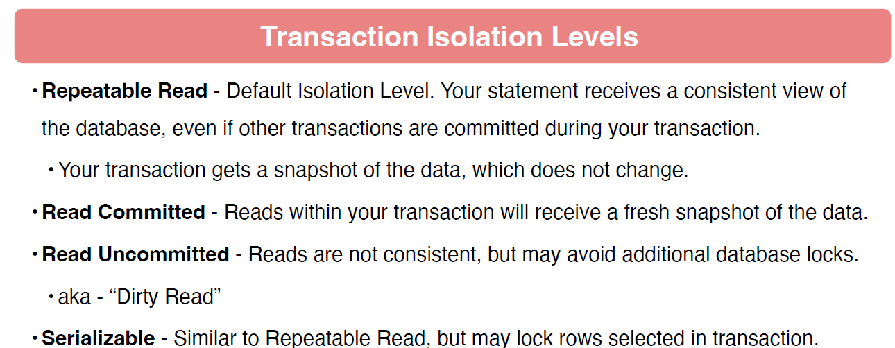
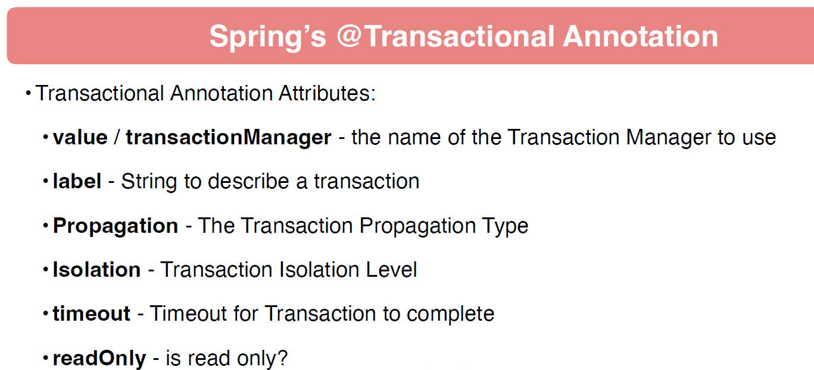
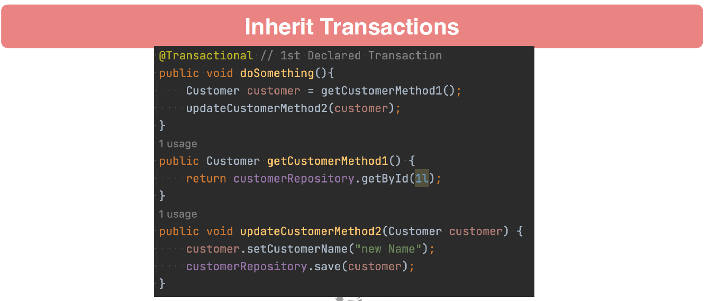

# 17 - Database Transactions & Locking

## 001 Introduction

## 002 Overview of Database Transactions
A **database transaction** is a unit of work that is performed against a database. It is a sequence of operations (such as read, write, delete, or update) that are treated as a single logical action. A transaction ensures that the database remains consistent, even in cases of system failures or errors.

Database transactions follow the **ACID** properties:

1. **Atomicity**: Ensures that all operations within the transaction are completed successfully. If any operation fails, the entire transaction is rolled back, meaning no changes are made to the database.
   
2. **Consistency**: Ensures that a transaction takes the database from one valid state to another, maintaining database integrity.

3. **Isolation**: Ensures that transactions are executed independently, without interference from other concurrent transactions. The changes made by one transaction are not visible to other transactions until the transaction is completed.

4. **Durability**: Ensures that once a transaction is successfully completed, its changes are permanently recorded in the database, even in the event of a system crash.

In practice, a transaction typically follows these steps:

- **Begin**: Start a new transaction.
- **Perform operations**: Execute a series of read/write operations.
- **Commit**: Apply the changes permanently if everything is successful.
- **Rollback**: Undo all changes if any error occurs during the transaction.


Transactions are crucial for ensuring data integrity and reliability in multi-user database environments.


In the context of **Spring Data**, the **ACID** principles work similarly as they would in any other database management context, but they're often managed at a higher abstraction level through Spring's transaction management. Here's how each of the ACID properties works, with examples specific to Spring Data:

### 1. **Atomicity**
In Spring Data, the **atomicity** of a transaction ensures that all database operations within a transaction either succeed or fail together. If any part of the transaction fails, the entire transaction is rolled back, and the database is returned to its previous state.

**Example**: Suppose you have a service method annotated with `@Transactional`:

```java
@Transactional
public void transferMoney(String fromAccount, String toAccount, BigDecimal amount) {
    accountRepository.debit(fromAccount, amount);  // Deduct from one account
    accountRepository.credit(toAccount, amount);   // Add to another account
}
```

If, for example, the debit operation succeeds but the credit operation fails (perhaps due to a network issue), the entire transaction will be rolled back, and the money will not be debited from the `fromAccount`. This ensures that the database does not end up in an inconsistent state where money has been deducted but not credited.

### 2. **Consistency**
**Consistency** ensures that the database moves from one valid state to another, and that constraints such as foreign keys, unique keys, and other business rules are not violated.

**Example**: Imagine you have a constraint that requires an account balance to never be negative:

```java
@Transactional
public void withdrawMoney(String account, BigDecimal amount) {
    BigDecimal currentBalance = accountRepository.getBalance(account);
    if (currentBalance.compareTo(amount) >= 0) {
        accountRepository.debit(account, amount);
    } else {
        throw new InsufficientFundsException("Insufficient balance");
    }
}
```

In this example, before debiting an account, the balance is checked to ensure the withdrawal will not result in a negative balance. If it would, the transaction is aborted, ensuring the database remains in a consistent state where no account can have a negative balance.

### 3. **Isolation**
**Isolation** ensures that concurrent transactions do not interfere with each other, and the outcome of one transaction does not affect others until it is completed (committed).

In Spring Data, isolation levels can be controlled using `@Transactional(isolation = Isolation.SERIALIZABLE)` or other isolation levels like `READ_COMMITTED`, `READ_UNCOMMITTED`, etc.

**Example**: Consider two concurrent transactions that try to update the stock of a product:

- **Transaction A**: Reads the product's stock and tries to reduce it by 10 units.
- **Transaction B**: Reads the same product's stock and tries to reduce it by 5 units.

Without isolation, both transactions could read the same stock level, leading to incorrect results. Isolation ensures that while **Transaction A** is in progress, **Transaction B** cannot access the stock value until **Transaction A** is either committed or rolled back.

```java
@Transactional(isolation = Isolation.SERIALIZABLE)
public void updateProductStock(String productId, int quantity) {
    Product product = productRepository.findById(productId);
    product.setStock(product.getStock() - quantity);
    productRepository.save(product);
}
```

In this case, **Transaction B** must wait for **Transaction A** to complete before it can access the stock of the product, ensuring isolation between the two transactions.

### 4. **Durability**
**Durability** ensures that once a transaction is committed, the changes are permanent and will not be lost even in case of a system crash or failure.

In a Spring Data context, when a transaction is committed, the changes are persisted to the database. These changes are written to disk, and they will survive any system failure or restart.

**Example**: When you commit a transaction that updates user information, such as changing their email address:

```java
@Transactional
public void updateUserEmail(Long userId, String newEmail) {
    User user = userRepository.findById(userId);
    user.setEmail(newEmail);
    userRepository.save(user);  // Persist to the database
}
```

Once the `@Transactional` method commits successfully, the new email address is permanently stored in the database. Even if the application crashes or the system restarts, the updated email will remain.

---

### Conclusion:
In Spring Data, **ACID** properties are handled through transaction management. Spring's `@Transactional` annotation ensures that operations are atomic, consistent, isolated, and durable by providing an abstraction over the underlying database transaction management system. You can control transaction behavior, including isolation levels and rollback policies, using annotations and Spring’s transaction management framework.


### Importtsant Terminology

### **Database Transactions: A Deeper Dive**

A **transaction** is a fundamental concept in databases, representing a single unit of work consisting of one or more SQL operations. These operations, typically **Data Manipulation Language (DML)** statements (such as `INSERT`, `UPDATE`, and `DELETE`), modify the data in a database and are grouped into a transaction to ensure they are executed together as an atomic unit.

### Key Concepts:
1. **Transaction**: 
   A transaction consists of one or more SQL operations. It ensures that all of the operations within it are executed successfully or none of them are applied to the database. In other words, a transaction adheres to the **all-or-nothing** rule. Transactions usually consist of **DML** statements, which alter the data but not the structure of the database. **DDL** (Data Definition Language) statements, like `CREATE` or `ALTER`, usually operate outside of transactional control.

   **Example**: 
   - Suppose you want to transfer $500 from Account A to Account B. This involves two operations:
     1. Deduct $500 from Account A.
     2. Add $500 to Account B.
   - Both of these operations must succeed or fail together. If only one of them succeeds, the database will end up in an inconsistent state.
   
   ```sql
   BEGIN TRANSACTION;
   UPDATE accounts SET balance = balance - 500 WHERE account_id = 'A'; -- Deduct
   UPDATE accounts SET balance = balance + 500 WHERE account_id = 'B'; -- Add
   COMMIT; -- Save both changes
   ```

2. **Commit**:
   A **commit** finalizes the transaction, making all the changes permanent. When a transaction is committed, the database ensures that the operations are saved and that they survive any system failures (thanks to the **durability** property in ACID).

   **Example**: 
   - After transferring money between two accounts, you would issue a `COMMIT` to persist the changes:
   
   ```sql
   COMMIT;
   ```
   
   - This tells the database that all changes made by the transaction should be saved and made visible to other transactions.

3. **Efficiency of Multiple Operations**:
   It’s often more efficient to group multiple SQL operations into a single transaction rather than issuing multiple individual transactions. Each transaction has an overhead, and committing frequently adds extra "cost" (in terms of time and system resources) because each commit involves writing data to disk and updating logs.

   **Example**:
   - Consider inserting 1000 rows into a table. Without transactions, the database would commit after each insert, which is inefficient:
   
   ```sql
   INSERT INTO orders VALUES (...);  -- Commits automatically
   INSERT INTO orders VALUES (...);  -- Commits automatically
   -- 1000 more insert statements, each committing individually
   ```

   - With transactions, you can insert all 1000 rows and commit only once:
   
   ```sql
   BEGIN TRANSACTION;
   INSERT INTO orders VALUES (...);  -- No commit yet
   INSERT INTO orders VALUES (...);  -- No commit yet
   -- 1000 more inserts
   COMMIT;  -- Single commit after all inserts
   ```

   This reduces overhead and improves performance by reducing the number of I/O operations.

4. **Rollback**:
   A **rollback** undoes all the changes made during a transaction. If something goes wrong during the transaction (such as a constraint violation or an error), the database can roll back to its previous state as if the transaction never occurred.

   **Example**:
   - Let’s say you try to transfer money between two accounts, but halfway through the transaction (after deducting from Account A), you realize Account B doesn’t exist. You can **rollback** to undo the changes:
   
   ```sql
   BEGIN TRANSACTION;
   UPDATE accounts SET balance = balance - 500 WHERE account_id = 'A'; -- Deduct
   -- Now, an error occurs: Account B doesn't exist
   ROLLBACK;  -- Undo the deduction from Account A
   ```

   This ensures the database remains consistent even in the case of an error.

5. **Savepoint**:
   A **savepoint** allows you to set a point within a transaction to which you can roll back without undoing the entire transaction. This is useful when you want to undo part of a transaction but keep the rest.

   **Example**:
   - Suppose you are transferring money between three accounts, and you want to have the option to undo just the second operation if something goes wrong:
   
   ```sql
   BEGIN TRANSACTION;
   UPDATE accounts SET balance = balance - 500 WHERE account_id = 'A'; -- Deduct from A
   SAVEPOINT transfer_to_B;  -- Create a savepoint after deducting from A
   UPDATE accounts SET balance = balance + 500 WHERE account_id = 'B'; -- Add to B
   
   -- Now something goes wrong with Account C
   ROLLBACK TO transfer_to_B;  -- Roll back to the savepoint, undoing the change to B but keeping the deduction from A
   COMMIT;  -- Commit the remaining part of the transaction
   ```

   Here, the `ROLLBACK TO transfer_to_B` command undoes the changes to Account B but leaves the deduction from Account A intact. This allows finer control over transaction management.

---

### Real-World Example in Spring Data:

Using Spring Data and its transactional capabilities, you can manage transactions efficiently.

1. **Transaction Example in Spring**:
   ```java
   @Transactional
   public void performTransaction() {
       // Operation 1: Deduct from account A
       accountRepository.debit("A", 500);
       // Operation 2: Add to account B
       accountRepository.credit("B", 500);
       
       // Commit happens automatically after method execution
   }
   ```

   In the above example, if the debit operation from Account A succeeds but the credit operation to Account B fails, the entire transaction will be rolled back, and no changes will be made to either account.

2. **Rollback Example**:
   ```java
   @Transactional
   public void performTransaction() {
       accountRepository.debit("A", 500);
       
       // Simulate an error
       if (someConditionFails) {
           throw new RuntimeException("Transaction failed");
       }
       
       accountRepository.credit("B", 500);
   }
   ```

   If an exception is thrown (simulating an error), Spring automatically triggers a **rollback**, reverting the deduction from Account A.

3. **Savepoint Example**:
   ```java
   @Transactional
   public void performTransactionWithSavepoint() {
       accountRepository.debit("A", 500);
       
       Object savepoint = TransactionAspectSupport.currentTransactionStatus().createSavepoint();
       
       try {
           accountRepository.credit("B", 500);
       } catch (Exception e) {
           TransactionAspectSupport.currentTransactionStatus().rollbackToSavepoint(savepoint);
       }
       
       // Continue with the transaction
       accountRepository.credit("C", 300);
   }
   ```

   Here, a **savepoint** is created after the deduction from Account A. If there’s an error when crediting Account B, the transaction rolls back to that savepoint, but the transaction continues with the subsequent operation (crediting Account C).

---

### Conclusion:
In database transaction management, the use of transactions, commits, rollbacks, and savepoints provides powerful mechanisms to ensure data integrity, consistency, and performance. These tools allow you to group related SQL operations together, make sure they all succeed or fail together, and handle errors or partial rollbacks when needed. In the Spring Data context, these transaction management features are abstracted and made easier to use, allowing for robust and scalable application design.


### **Database Locks: A Detailed Explanation**

Database locks are mechanisms used to ensure data integrity during concurrent access to the same data. In multi-user environments, database locks prevent multiple transactions from modifying the same data simultaneously, which could result in inconsistent or incorrect data. Locks are critical for enforcing **ACID** (Atomicity, Consistency, Isolation, Durability) properties, especially **Isolation**, where the effects of one transaction should not interfere with another until the transaction is complete.

### **Key Concepts of Database Locks**

1. **Locking Records**:
   When a transaction involves a data modification operation like `SELECT FOR UPDATE`, `UPDATE`, or `DELETE`, the database locks the records (or sometimes entire tables) affected by that operation. This lock prevents other transactions from reading or modifying the same records until the first transaction releases the lock.

   **Example**:
   - **Transaction A** starts and updates a row in the `accounts` table:
   
     ```sql
     BEGIN TRANSACTION;
     UPDATE accounts SET balance = balance - 500 WHERE account_id = 'A';  -- Locks account A
     ```

   - While **Transaction A** is still running, if **Transaction B** tries to update the same row (i.e., account A's balance), it will wait until **Transaction A** releases the lock:
   
     ```sql
     BEGIN TRANSACTION;
     UPDATE accounts SET balance = balance + 100 WHERE account_id = 'A';  -- Waits for lock
     ```

   In this scenario, **Transaction B** will not be able to modify the balance of account A until **Transaction A** either commits or rolls back, releasing the lock.

2. **ACID Compliance and Locks**:
   Database locks are essential to ensuring **ACID** compliance, particularly the **Isolation** aspect of a transaction. Isolation ensures that concurrent transactions do not interfere with each other, and locks are the mechanism used to achieve this.

   For example, if two transactions are attempting to update the same data at the same time, locks prevent the data from being modified by both transactions simultaneously, ensuring that each transaction is treated as if it were running independently.

3. **Lock Types**:
   - **Row-level locks**: Lock only the specific rows affected by a `SELECT FOR UPDATE`, `UPDATE`, or `DELETE` statement.
   - **Table-level locks**: Lock the entire table, preventing any other transaction from reading or writing to the table.
   - **Shared locks (read locks)**: Allow multiple transactions to read the same data but prevent any transaction from modifying it until the shared lock is released.
   - **Exclusive locks (write locks)**: Prevent other transactions from reading or writing to the locked data until the lock is released.

4. **DML Operations That Lock Records**:
   - **`SELECT FOR UPDATE`**: This type of `SELECT` statement locks the selected rows, preventing them from being modified by other transactions until the current transaction is completed.
   - **`UPDATE`**: This statement locks the rows that are being updated.
   - **`DELETE`**: This locks the rows that are being deleted to ensure that no other transaction modifies the rows before they are removed.

   **Example**:
   ```sql
   BEGIN TRANSACTION;
   SELECT * FROM accounts WHERE account_id = 'A' FOR UPDATE;  -- Locks account A's row
   ```

   This locks the row with `account_id = 'A'`, preventing any other transaction from updating or deleting this row until the lock is released by a `COMMIT` or `ROLLBACK`.

5. **Waiting for Locks**:
   When a transaction attempts to modify a locked record, it will wait until the lock is released. If the lock is held for an extended period, the transaction trying to modify the locked data may appear to "hang." In reality, the transaction is waiting for the lock to be released.

   **Example**:
   - **Transaction A** locks the `accounts` table:
     ```sql
     BEGIN TRANSACTION;
     UPDATE accounts SET balance = balance - 500 WHERE account_id = 'A';  -- Locks account A
     ```

   - **Transaction B** tries to update the same row while **Transaction A** is still running:
     ```sql
     BEGIN TRANSACTION;
     UPDATE accounts SET balance = balance + 100 WHERE account_id = 'A';  -- Waits for lock
     ```

   In this case, **Transaction B** will wait for **Transaction A** to release the lock (either by committing or rolling back).

6. **Deadlock**:
   A **deadlock** occurs when two or more transactions are waiting for each other to release locks, creating a situation where neither transaction can proceed. Both transactions become stuck, and the system detects the deadlock and resolves it by rolling back one or more of the transactions.

   **Example**:
   - **Transaction A** locks row 1 in the `accounts` table and then tries to lock row 2:
     ```sql
     BEGIN TRANSACTION;
     UPDATE accounts SET balance = balance - 500 WHERE account_id = 'A';  -- Locks account A
     UPDATE accounts SET balance = balance + 500 WHERE account_id = 'B';  -- Tries to lock account B
     ```

   - **Transaction B** locks row 2 and then tries to lock row 1:
     ```sql
     BEGIN TRANSACTION;
     UPDATE accounts SET balance = balance - 200 WHERE account_id = 'B';  -- Locks account B
     UPDATE accounts SET balance = balance + 200 WHERE account_id = 'A';  -- Tries to lock account A
     ```

   In this case, **Transaction A** is waiting for **Transaction B** to release the lock on row 2, and **Transaction B** is waiting for **Transaction A** to release the lock on row 1. Neither transaction can proceed, resulting in a **deadlock**. The database detects this situation and rolls back one of the transactions, allowing the other to complete.

   **Deadlock resolution**:
   When a deadlock is detected, the database will choose one transaction to roll back (usually the one that holds the least number of locks or has done the least amount of work). This allows the other transaction to complete and prevents the system from becoming stuck.

   **Example of Deadlock Error Handling in Spring Data**:
   In Spring, if a deadlock occurs, it can be caught and handled using transaction management mechanisms like the `@Transactional` annotation:

   ```java
   @Transactional
   public void transferFunds(String fromAccount, String toAccount, BigDecimal amount) {
       try {
           accountRepository.debit(fromAccount, amount);
           accountRepository.credit(toAccount, amount);
       } catch (DeadlockLoserDataAccessException ex) {
           // Handle the deadlock, possibly retry the transaction
           throw new RuntimeException("Transaction failed due to deadlock. Please retry.");
       }
   }
   ```

### **Examples of Locking Scenarios**

1. **Scenario 1: Locking Rows with `SELECT FOR UPDATE`**:
   You want to retrieve a row from the `accounts` table and lock it to ensure no other transaction can modify it while you're working with it.
   
   ```sql
   BEGIN TRANSACTION;
   SELECT * FROM accounts WHERE account_id = 'A' FOR UPDATE;
   -- Perform some logic
   COMMIT;
   ```

   Other transactions attempting to update or delete `account_id = 'A'` will have to wait until this transaction commits.

2. **Scenario 2: Handling Deadlocks**:
   You have two transactions, one updating `account A` and then `account B`, and another one doing the reverse. A deadlock can occur, and you need to handle it.

   **Transaction 1**:
   ```sql
   BEGIN TRANSACTION;
   UPDATE accounts SET balance = balance - 500 WHERE account_id = 'A';  -- Locks account A
   UPDATE accounts SET balance = balance + 500 WHERE account_id = 'B';  -- Tries to lock account B
   ```

   **Transaction 2**:
   ```sql
   BEGIN TRANSACTION;
   UPDATE accounts SET balance = balance - 500 WHERE account_id = 'B';  -- Locks account B
   UPDATE accounts SET balance = balance + 500 WHERE account_id = 'A';  -- Tries to lock account A
   ```

   When the database detects this deadlock, one transaction will be rolled back, allowing the other to complete.

---

### **Conclusion**

Database locks are essential to maintaining data integrity and isolation in multi-user environments. They ensure that only one transaction can modify a piece of data at a time, preventing race conditions and inconsistencies. However, locks also come with challenges like deadlocks, where two transactions lock each other out, requiring special handling by the database system. By understanding how locks work and how to manage them effectively, you can design systems that handle concurrent transactions efficiently and safely.

### **Transaction Isolation Levels: A Detailed Explanation**

In database management, **transaction isolation levels** control how transactions interact with each other, particularly when they access and modify the same data simultaneously. Different isolation levels determine the visibility of changes made by one transaction to other concurrent transactions. These isolation levels help to strike a balance between consistency, concurrency, and performance, allowing applications to choose the appropriate behavior for their use case.

The four primary isolation levels are:

1. **Repeatable Read** (default in many databases)
2. **Read Committed**
3. **Read Uncommitted**
4. **Serializable**

Each isolation level has specific behaviors regarding how data is read and modified during a transaction, which can prevent or allow certain phenomena like **dirty reads**, **non-repeatable reads**, and **phantom reads**.

### **1. Repeatable Read**
**Repeatable Read** is the default isolation level in many databases (e.g., MySQL with InnoDB). It guarantees that if a transaction reads data once, it can read that same data again during the transaction, and it will always see the same value—even if another transaction modifies the data after the initial read. The transaction essentially gets a consistent "snapshot" of the data at the time the transaction begins.

#### **Key Characteristics**:
- **Prevents non-repeatable reads**: You will not see different results for the same query in the same transaction.
- **Prevents dirty reads**: You will not see uncommitted changes from other transactions.
- **Allows phantom reads**: New rows can appear if another transaction inserts them during your transaction.

#### **Example**:
Suppose two transactions are running concurrently, **Transaction A** and **Transaction B**. Consider the following operations:

- **Transaction A** reads the balance of account 1:
  ```sql
  BEGIN TRANSACTION;
  SELECT balance FROM accounts WHERE account_id = 1;  -- Reads $100
  ```

- While **Transaction A** is still running, **Transaction B** modifies the balance of account 1 and commits the change:
  ```sql
  BEGIN TRANSACTION;
  UPDATE accounts SET balance = balance + 50 WHERE account_id = 1;  -- Updates to $150
  COMMIT;
  ```

- **Transaction A** attempts to read the balance again:
  ```sql
  SELECT balance FROM accounts WHERE account_id = 1;  -- Still reads $100 (consistent view)
  COMMIT;
  ```

Despite **Transaction B** committing a change, **Transaction A** always sees the balance as $100 during its execution. This behavior ensures **repeatable reads** within the transaction.

---

### **2. Read Committed**
In the **Read Committed** isolation level, every query within a transaction sees the most recent committed data. Unlike **Repeatable Read**, where a snapshot is held for the entire transaction, **Read Committed** allows the transaction to see updated data after each query. However, it still prevents **dirty reads**, meaning no transaction can see uncommitted changes from another transaction.

#### **Key Characteristics**:
- **Prevents dirty reads**: You won’t see uncommitted data from other transactions.
- **Allows non-repeatable reads**: If another transaction commits changes, subsequent reads in your transaction may see different data.
- **Prevents phantom reads**: Insertions of new rows can still happen, but these won't affect your current read queries.

#### **Example**:
Suppose **Transaction A** and **Transaction B** are running concurrently, and **Transaction A** reads data multiple times:

- **Transaction A** reads the balance of account 1:
  ```sql
  BEGIN TRANSACTION;
  SELECT balance FROM accounts WHERE account_id = 1;  -- Reads $100
  ```

- **Transaction B** updates the balance of account 1 and commits:
  ```sql
  BEGIN TRANSACTION;
  UPDATE accounts SET balance = balance + 50 WHERE account_id = 1;  -- Updates to $150
  COMMIT;
  ```

- **Transaction A** reads the balance of account 1 again:
  ```sql
  SELECT balance FROM accounts WHERE account_id = 1;  -- Now reads $150
  COMMIT;
  ```

With **Read Committed**, each read sees the most recent committed data. In this case, after **Transaction B** commits, **Transaction A** sees the updated balance ($150) when it reads again.

---

### **3. Read Uncommitted (Dirty Read)**
In the **Read Uncommitted** isolation level, transactions can read uncommitted changes from other transactions. This is known as a **dirty read** because the data may not be final and can be rolled back, resulting in inconsistent reads. This level allows the highest concurrency but sacrifices consistency, making it the least safe isolation level.

#### **Key Characteristics**:
- **Allows dirty reads**: Transactions can see uncommitted changes from other transactions.
- **Allows non-repeatable reads**: The same query can return different results within the same transaction.
- **Allows phantom reads**: New rows inserted by other transactions may appear.
- **No locks are held on the read data**.

#### **Example**:
Suppose **Transaction A** reads data while **Transaction B** is still working on it but hasn't committed:

- **Transaction B** starts and updates the balance of account 1:
  ```sql
  BEGIN TRANSACTION;
  UPDATE accounts SET balance = balance + 50 WHERE account_id = 1;  -- Uncommitted change: $150
  ```

- **Transaction A** reads the balance of account 1:
  ```sql
  BEGIN TRANSACTION;
  SELECT balance FROM accounts WHERE account_id = 1;  -- Reads $150 (dirty read)
  ```

- **Transaction B** rolls back the update:
  ```sql
  ROLLBACK;
  ```

Now, **Transaction A** has read uncommitted, inconsistent data ($150), which was later rolled back by **Transaction B**. This can lead to erroneous decisions in the application, as **Transaction A** read a value that never actually existed in a committed state.

---

### **4. Serializable**
The **Serializable** isolation level is the strictest and most consistent but also the most restrictive in terms of concurrency. It guarantees complete isolation between transactions by preventing other transactions from reading or writing to any rows being accessed by the current transaction. This behavior is achieved by locking rows or tables, ensuring that transactions are executed as if they were running serially (one after the other) rather than concurrently.

#### **Key Characteristics**:
- **Prevents dirty reads**: No uncommitted changes from other transactions are visible.
- **Prevents non-repeatable reads**: The same query will always return the same results.
- **Prevents phantom reads**: New rows inserted by other transactions will not affect your transaction.
- **Uses row-level or table-level locking** to ensure complete isolation.

#### **Example**:
Suppose **Transaction A** is running and wants to read data in a way that no other transaction can modify it during its execution:

- **Transaction A** reads the balance of account 1:
  ```sql
  BEGIN TRANSACTION;
  SELECT balance FROM accounts WHERE account_id = 1;  -- Reads $100
  ```

- **Transaction B** tries to update the balance of account 1 while **Transaction A** is still active:
  ```sql
  BEGIN TRANSACTION;
  UPDATE accounts SET balance = balance + 50 WHERE account_id = 1;  -- Blocks and waits
  ```

In the **Serializable** isolation level, **Transaction B** will be blocked until **Transaction A** completes and releases its locks. This strict isolation ensures that **Transaction B** cannot modify or even read the rows involved in **Transaction A** until **Transaction A** finishes.

---

### **Summary of Isolation Levels**

| **Isolation Level**       | **Dirty Reads** | **Non-Repeatable Reads** | **Phantom Reads** | **Description**                                                                                                                                                               |
|---------------------------|-----------------|--------------------------|-------------------|-------------------------------------------------------------------------------------------------------------------------------------------------------------------------------|
| **Read Uncommitted**       | Allowed         | Allowed                   | Allowed            | Transactions can read uncommitted changes. High concurrency, but least safe.                                                                                                   |
| **Read Committed**         | Not Allowed     | Allowed                   | Allowed            | Only committed changes are visible, but a transaction may see different values on subsequent reads.                                                                             |
| **Repeatable Read**        | Not Allowed     | Not Allowed               | Allowed            | Transactions see the same data throughout, even if other transactions commit changes. Prevents non-repeatable reads, but phantom reads can still occur.                         |
| **Serializable**           | Not Allowed     | Not Allowed               | Not Allowed        | Transactions are completely isolated, as if they were run serially. Most consistent, but with the highest potential for performance impact due to row or table locking.          |

---

### **Choosing the Right Isolation Level**

- **Read Uncommitted**: Useful when performance and concurrency are critical, and you don’t mind the risk of reading inconsistent data. This is rarely used in scenarios where data accuracy is important.
  
- **Read Committed**: A good balance between consistency and performance for most applications. It prevents dirty reads but allows some concurrency issues like non-repeatable reads.

- **Repeatable Read**: Best for scenarios where you need to ensure that the same data is consistently visible within a transaction, but the performance overhead is still manageable.

- **Serializable**: The strictest level, suitable for applications that require the highest degree of consistency and isolation, even at the cost of reduced concurrency and performance.

By understanding and selecting the appropriate isolation level, you can optimize both the consistency and performance of your database transactions to suit the needs of your application.


### **Pragmatic Concepts to Remember in Transaction Management and ACID Compliance**

When dealing with relational databases and transactions, several important concepts and practices come into play to maintain data consistency and ensure that transactions behave as expected, especially with respect to **ACID** (Atomicity, Consistency, Isolation, Durability) properties. Understanding these concepts can help optimize performance, minimize errors, and ensure data integrity in various database environments, whether you're working with traditional **RDBMS** (Relational Database Management Systems) or modern **NoSQL** databases.

Let’s break down the core pragmatic concepts and explain them in depth with examples.

---

### **1. Transaction Isolation Level and Snapshot Visibility**

By default, most relational databases use **Repeatable Read** or **Read Committed** as their default isolation levels. This means that once your transaction begins, it sees a "snapshot" of the database as it exists at that time, and that view remains consistent throughout the transaction.

#### **Key Concept**:
- Your transaction sees a **consistent snapshot** of the database as it was at the start of the transaction.
- Any changes made in **other sessions** that are committed while your transaction is running will **not be visible** to your transaction.

#### **Example**:
Consider two transactions operating on the same dataset in an **RDBMS** like MySQL using the **Repeatable Read** isolation level.

- **Transaction A** starts and reads the balance of account 1:
  
  ```sql
  BEGIN TRANSACTION;
  SELECT balance FROM accounts WHERE account_id = 1;  -- Reads $500
  ```

- **Transaction B** begins after **Transaction A** and updates the balance of account 1, committing the change:
  
  ```sql
  BEGIN TRANSACTION;
  UPDATE accounts SET balance = balance - 100 WHERE account_id = 1;  -- Changes balance to $400
  COMMIT;
  ```

Even though **Transaction B** commits its changes, **Transaction A** will still see the original balance ($500) because it sees a **snapshot** of the database from when it started.

- If **Transaction A** queries the balance again:

  ```sql
  SELECT balance FROM accounts WHERE account_id = 1;  -- Still reads $500 (snapshot view)
  COMMIT;
  ```

This behavior ensures that the data you’re working with during a transaction remains consistent and prevents confusion or errors due to other concurrent transactions making changes.

---

### **2. Changes are Visible Only After Commit**

Any changes made by your transaction are **not visible** to other transactions until you **commit**. This ensures that uncommitted changes cannot be seen or acted upon by other sessions, maintaining consistency and preventing others from acting on potentially incomplete data.

#### **Example**:
Consider two transactions where one is modifying data and the other is trying to read that data:

- **Transaction A** updates the balance of account 1 but doesn’t commit the change yet:
  
  ```sql
  BEGIN TRANSACTION;
  UPDATE accounts SET balance = balance - 100 WHERE account_id = 1;  -- Sets balance to $400
  ```

- **Transaction B** reads the balance of account 1:

  ```sql
  BEGIN TRANSACTION;
  SELECT balance FROM accounts WHERE account_id = 1;  -- Still reads $500 (unchanged view)
  ```

Even though **Transaction A** has modified the data, **Transaction B** will not see this change until **Transaction A** issues a `COMMIT`. Until then, the change remains invisible to all other sessions. This isolation ensures that other transactions don’t act on uncommitted, possibly incorrect data.

- **Transaction A** commits:
  
  ```sql
  COMMIT;
  ```

After **Transaction A** commits, future reads from other sessions will see the updated balance of $400.

---

### **3. Most Modern RDBMS are ACID-Compliant**

Modern relational database systems like MySQL, PostgreSQL, Oracle, and SQL Server are highly ACID-compliant. They guarantee that transactions are:

- **Atomic**: All operations within the transaction succeed or none do.
- **Consistent**: The database is always in a valid state after the transaction, enforcing constraints and rules.
- **Isolated**: Transactions do not interfere with each other.
- **Durable**: Once committed, changes are permanent and will survive system failures.

These guarantees make RDBMS ideal for mission-critical applications where data accuracy and consistency are paramount.

#### **Example**:
In a banking application, when transferring funds between accounts, the database ensures:

1. Both the debit and credit operations succeed (Atomicity).
2. The transfer follows all business rules, such as not allowing negative balances (Consistency).
3. Other transactions do not see partial updates during the transfer (Isolation).
4. Once committed, the transfer is permanent, even if the system crashes afterward (Durability).

Without ACID properties, such transactions could result in incorrect balances, partial updates, or lost data, which would compromise the integrity of the application.

---

### **4. NoSQL and ACID Compliance**

**NoSQL** databases, which are designed for high scalability and performance, vary widely in their support for ACID properties. Unlike RDBMS, which are inherently designed for ACID compliance, NoSQL databases (like MongoDB, Cassandra, and Couchbase) often prioritize availability and performance over strict consistency. Some NoSQL databases support **BASE** (Basically Available, Soft state, Eventually consistent) instead of ACID, which allows for higher performance at the cost of strict consistency.

#### **Key Differences**:
- **ACID** guarantees consistency at every step, ensuring that no data corruption or anomalies occur even with concurrent transactions.
- **NoSQL** databases often provide **eventual consistency**, meaning data changes propagate over time, but the system doesn’t guarantee that every read will return the latest data immediately.

---

### **5. ACID Compliance in NoSQL Databases is Complex and Costly**

Ensuring ACID compliance in distributed NoSQL databases is complex because of the architecture of these systems. NoSQL databases are typically designed to scale horizontally, meaning they distribute data across multiple servers (nodes). Ensuring **atomic** operations across multiple nodes or maintaining **consistent** views of data during failures can require additional mechanisms like distributed consensus algorithms (e.g., Paxos or Raft), which can introduce performance overhead.

#### **Example**:
In a **Cassandra** cluster, updates to a key-value pair may be written to different nodes. Cassandra achieves **eventual consistency**, meaning that reads might return stale data until the update is propagated to all nodes. For example:

- **Write operation** to node 1 is successful, but the update hasn't yet propagated to node 2.
- A **read operation** from node 2 might return the old value until the change propagates.

This trade-off allows for high performance and availability, but it sacrifices **strong consistency** (a key feature of ACID). To ensure strong consistency in a distributed NoSQL system, the database would need to enforce strict coordination between nodes, which slows down performance and reduces scalability.

#### **NoSQL and ACID Workarounds**:
- Some NoSQL databases like **MongoDB** offer **ACID-compliant transactions** within a single document or even across collections in recent versions, but these come with a performance cost.
  
- **Couchbase** introduced support for ACID transactions at the document level as well. However, scaling these transactions across distributed nodes adds complexity.

Thus, while some NoSQL databases can support ACID properties to a certain extent, the overhead involved in doing so often negates the primary advantages of using NoSQL: **high performance and horizontal scalability**.

---

### **6. Why NoSQL Databases Sacrifice ACID for Performance**

The core advantage of NoSQL databases is their ability to handle massive volumes of data and traffic with high availability and performance. NoSQL databases are optimized for:

- **Scalability**: Distributing data across many servers to handle high read and write traffic.
- **Availability**: Prioritizing uptime by replicating data across nodes, even if it means temporarily showing stale or inconsistent data.

Enforcing strict ACID compliance in such systems would require every transaction to be coordinated across all nodes (for atomicity and consistency), which would severely impact performance and throughput.

---

### **Conclusion: Choosing ACID vs. NoSQL**

When choosing between **ACID-compliant RDBMS** and **NoSQL** databases, it’s important to weigh your priorities:

- Use **RDBMS** for applications where **data consistency**, **reliability**, and **transaction integrity** are critical (e.g., financial systems, order processing, inventory management).
  
- Use **NoSQL** for scenarios where **high availability**, **scalability**, and **performance** are more important than strict consistency (e.g., social media platforms, big data applications).

If your application requires both scalability and ACID compliance, you may need to use a hybrid approach, such as integrating an RDBMS for critical transactions with a NoSQL database for non-critical, high-performance reads and writes.


### **The "Lost" Update Problem: A Deep Explanation**

The **lost update** problem occurs when two or more database sessions (or transactions) read the same data, modify it, and then save the changes back to the database. If the changes are not properly synchronized, one session's update can overwrite another's, leading to incorrect data. This issue arises when the transactions are not isolated from each other properly, and their changes conflict.

#### **Lost Update Scenario**
Let's walk through a detailed example to understand how this problem occurs.

#### **Initial Situation**:
- A **database record** has a **quantity** of 10.
- Two sessions (**Session A** and **Session B**) are concurrently trying to read, modify, and update the same record.

### **Step-by-Step Example of the Lost Update**

#### **Step 1: Session A Reads the Record**

- **Session A** starts a transaction and reads the record (the quantity is 10):
  ```sql
  BEGIN TRANSACTION;
  SELECT quantity FROM inventory WHERE product_id = 100;  -- Reads quantity = 10
  ```

- **Session A** decides to add 5 to the quantity, making it 15:
  ```sql
  UPDATE inventory SET quantity = 15 WHERE product_id = 100;
  ```

- At this point, **Session A** locks the row to prevent other transactions from updating the same record until it commits or rolls back.

#### **Step 2: Session B Reads the Record**

- **Session B** starts a separate transaction and reads the **same record** while **Session A's** transaction is still ongoing:
  ```sql
  BEGIN TRANSACTION;
  SELECT quantity FROM inventory WHERE product_id = 100;  -- Reads quantity = 10
  ```

- Since **Session A** hasn't committed yet, **Session B** reads the original value of 10, not the updated value of 15.

- **Session B** also decides to add 5 to the quantity (based on its read of 10), which would also bring the total to 15:
  ```sql
  UPDATE inventory SET quantity = 15 WHERE product_id = 100;
  ```

- However, **Session B** is **blocked** because **Session A** holds a lock on the row. **Session B** cannot modify the row until **Session A** commits or rolls back.

#### **Step 3: Session A Commits**

- **Session A** completes its transaction by committing the change:
  ```sql
  COMMIT;
  ```

- The database updates the quantity to 15 and releases the lock, allowing other transactions to access and modify the record.

#### **Step 4: Session B is Unblocked**

- Once **Session A** commits and releases the lock, **Session B** is unblocked. However, **Session B** still holds its original logic based on its read of the quantity (which was 10).
  
- **Session B** then applies its update:
  ```sql
  UPDATE inventory SET quantity = 15 WHERE product_id = 100;
  ```

- **Session B** doesn't know that the quantity has already been updated by **Session A** to 15. Since it read 10 and added 5, it still updates the quantity to 15 based on its previous read.

#### **Result: Lost Update**

At this point, the update from **Session A** has been **"lost"**. Even though **Session A** updated the quantity to 15, **Session B** overwrites that value with its own update, based on the old value of 10. As a result, instead of the final quantity being 20 (10 + 5 from **Session A** + 5 from **Session B**), it remains 15, and the update from **Session A** is effectively lost.

---

### **Why Does This Happen?**

This issue occurs because:
1. **Session A and Session B both read the same initial value (10)** and each added 5 based on their read.
2. **Session B's update does not account for the changes made by Session A**, because **Session B** was blocked during the lock and only applied its update after **Session A** committed.
3. **The updates were not synchronized**, leading to the overwriting of **Session A’s** committed changes.

### **Illustrating the Lost Update with a Timeline**

| **Time** | **Session A**                             | **Session B**                             |
|----------|--------------------------------------------|-------------------------------------------|
| T1       | Begins transaction, reads quantity = 10    |                                           |
| T2       | Updates quantity to 15, locks record       |                                           |
| T3       |                                            | Begins transaction, reads quantity = 10   |
| T4       |                                            | Tries to update to 15, blocked by lock    |
| T5       | Commits update (quantity = 15)             |                                           |
| T6       |                                            | Unblocked, updates quantity to 15         |
| **Result** | **Quantity remains 15** (update from Session A is lost) | **Update from Session A is overwritten** |

---

### **Solutions to the Lost Update Problem**

1. **Higher Transaction Isolation Levels**:
   - The **Serializable** isolation level can be used to prevent lost updates by ensuring that transactions are executed in a strictly sequential order. However, this comes with performance costs because it locks more rows for longer periods and reduces concurrency.

   - Example: With the **Serializable** isolation level, **Session B** would not be allowed to proceed after reading the quantity of 10 until **Session A** finishes its transaction. This ensures that **Session B** sees the updated value (15) after **Session A** commits, allowing it to make the correct update (15 + 5 = 20).

   ```sql
   SET TRANSACTION ISOLATION LEVEL SERIALIZABLE;
   BEGIN TRANSACTION;
   -- Any conflicting transaction must wait
   ```

2. **Optimistic Concurrency Control**:
   - In this approach, instead of using locks, the system tracks the version of the data being read. Before committing a change, the system checks whether the data has been modified by another transaction since it was read.
   - If the data has been modified, the transaction is aborted or retried.
   
   **Example**:
   - The `quantity` field could be accompanied by a **version** column in the table. Both **Session A** and **Session B** would read the quantity and its version (e.g., version 1).
   - When **Session A** updates the quantity, it also increments the version to 2.
   - Before **Session B** can commit its change, it checks the version. Since **Session A** already updated the version to 2, **Session B** knows the data has changed since it was read and would either retry or abort.

   ```sql
   UPDATE inventory 
   SET quantity = 15, version = version + 1 
   WHERE product_id = 100 AND version = 1;
   ```

   If the `version` in the database no longer matches what **Session B** originally read, the update will fail.

3. **Pessimistic Locking**:
   - Pessimistic locking explicitly locks the record when it is read to prevent other transactions from reading or modifying it until the lock is released. This prevents **Session B** from even reading the data until **Session A** completes.
   
   - **Example**: Using `SELECT FOR UPDATE`:
     ```sql
     BEGIN TRANSACTION;
     SELECT quantity FROM inventory WHERE product_id = 100 FOR UPDATE;  -- Locks the row
     ```

   - With **pessimistic locking**, **Session B** will be forced to wait until **Session A** commits or rolls back before it can even read the data, thus preventing conflicting updates.

4. **Application-Level Locking**:
   - In some cases, the application itself can manage the concurrency by using a locking mechanism or flag to indicate that a resource (like a database record) is being modified. Other processes must check the flag before proceeding.

---

### **Conclusion**

The **lost update** problem is a classic concurrency issue in database transactions. It happens when multiple sessions read the same data, apply changes, and write the data back to the database without being aware of each other's modifications. Proper transaction isolation levels, optimistic concurrency control, and locking mechanisms can help prevent this problem by ensuring that transactions are aware of changes made by other sessions and do not overwrite them unintentionally.

By using strategies like **optimistic concurrency control** or **pessimistic locking**, developers can avoid the lost update problem, ensuring that all updates are properly applied and no changes are unintentionally overwritten. However, these solutions must be carefully chosen based on the application's performance and concurrency requirements.

### **JDBC Locking Modes: A Deep Explanation**

In the context of **JDBC (Java Database Connectivity)**, **locking modes** determine how database records are locked when they are accessed or modified through a JDBC connection. These locking modes influence how concurrent transactions interact with each other, helping to manage access to shared resources and ensuring consistency.

Though **JDBC drivers** support various locking modes, the choice of locking behavior is highly dependent on the specific database vendor (e.g., MySQL, Oracle, SQL Server), and the configuration can vary significantly. Additionally, while JDBC locking modes provide fine-grained control over transactions and concurrency, they are **rarely used directly** in practice, as more abstract frameworks like **JPA (Java Persistence API)** or **Hibernate** offer better ways to manage transactions and locking in a vendor-independent, declarative manner.

---

### **JDBC Locking Modes Overview**

When using JDBC to interact with databases, locking can be configured at the **connection level**, and it applies to the **entire lifespan** of the connection. The available locking modes typically depend on the **isolation level** of the transaction, which governs how the database handles concurrent access to data. JDBC drivers provide the following isolation levels that indirectly control locking behavior:

1. **TRANSACTION_READ_UNCOMMITTED** (Allows dirty reads)
2. **TRANSACTION_READ_COMMITTED** (Default in most databases, prevents dirty reads)
3. **TRANSACTION_REPEATABLE_READ** (Prevents non-repeatable reads)
4. **TRANSACTION_SERIALIZABLE** (Strictest level, prevents phantom reads)

Different locking behaviors can emerge based on which isolation level you set.

---

### **Vendor-Specific JDBC Locking Modes**

JDBC's handling of locking modes is **vendor-dependent** because different database systems implement isolation levels and locking in distinct ways. Here’s a look at how it can vary:

- **MySQL**: Uses `InnoDB` as the storage engine, which supports row-level locking. Locking behavior is controlled by the transaction isolation level.
- **Oracle**: Uses a mix of row-level and table-level locking, depending on the operation and isolation level.
- **SQL Server**: Supports both optimistic and pessimistic concurrency control and uses lock escalation from row-level to page-level or table-level locking as needed.

---

### **JDBC Locking Mode Example**

To see how JDBC interacts with locking, we can configure the transaction isolation level of a connection, which determines the locking behavior. For example:

#### **Step-by-Step Example Using JDBC**

**Step 1: Setting the Transaction Isolation Level**
In JDBC, the isolation level is set at the connection level. Depending on the isolation level, JDBC will apply different locking modes:

```java
Connection conn = null;
try {
    conn = DriverManager.getConnection("jdbc:mysql://localhost:3306/testdb", "user", "password");

    // Set transaction isolation level to Repeatable Read
    conn.setTransactionIsolation(Connection.TRANSACTION_REPEATABLE_READ);

    conn.setAutoCommit(false);  // Begin the transaction
    Statement stmt = conn.createStatement();

    // Execute a query to read data
    ResultSet rs = stmt.executeQuery("SELECT * FROM inventory WHERE product_id = 100 FOR UPDATE");

    // Process the result set
    while (rs.next()) {
        int quantity = rs.getInt("quantity");
        System.out.println("Quantity: " + quantity);
    }

    // Lock is held on the row being read
    // Other transactions will block if they attempt to modify this row

    // Commit the transaction and release the lock
    conn.commit();

} catch (SQLException e) {
    e.printStackTrace();
} finally {
    if (conn != null) {
        try {
            conn.close();
        } catch (SQLException e) {
            e.printStackTrace();
        }
    }
}
```

In this example:
- The isolation level is set to `TRANSACTION_REPEATABLE_READ`, meaning any data read by this transaction will remain consistent for the duration of the transaction.
- The `SELECT * FOR UPDATE` query locks the row for modification. Any other transaction trying to update or delete this row will be **blocked** until this transaction commits or rolls back.

#### **Vendor-Specific Behavior**:
- In **MySQL**, the **InnoDB** engine will acquire a row-level lock for the selected rows.
- In **Oracle**, `SELECT ... FOR UPDATE` will lock the rows until the transaction completes.

---

### **Why JDBC Locking Modes are Rarely Used in Practice**

Despite the fine control that JDBC locking modes provide, they are **rarely used directly** in modern Java applications. There are several reasons for this:

1. **Manual Management Complexity**: Using JDBC to manage locking and isolation levels manually adds complexity to your code. Developers must be cautious about managing transactions, ensuring proper rollbacks in case of failure, and handling lock contention.
   
2. **Vendor-Specific Behavior**: As mentioned earlier, different database systems handle locking in different ways, meaning that your locking strategy may not be portable across databases. This creates a maintenance burden if you need to switch databases.

3. **Lack of Abstraction**: With JDBC, you work at a low level, managing connections, transactions, and locking manually. This contrasts with higher-level frameworks like **JPA/Hibernate**, which provide abstraction over these details, allowing you to focus more on business logic and less on database management.

4. **JPA/Hibernate is Preferred**: Most modern Java applications use **JPA** or **Hibernate** as an abstraction layer over JDBC. These frameworks handle transaction management, concurrency control, and locking in a **declarative** way, which is easier and more intuitive to manage.

---

### **JPA/Hibernate Locking Mechanisms**

When working with **JPA** or **Hibernate**, locking modes and transaction management are abstracted into higher-level constructs. These frameworks provide support for both **optimistic** and **pessimistic** locking, making it easier to handle concurrency in a more flexible and declarative manner.

#### **Optimistic Locking**:
Optimistic locking assumes that most transactions will not conflict, so it does not lock rows when data is read. Instead, it uses a **versioning** mechanism to detect conflicts when data is updated.

**Example with Optimistic Locking in JPA**:

```java
@Entity
public class Product {

    @Id
    private Long productId;

    @Version
    private Integer version;

    private Integer quantity;

    // Getters and Setters
}
```

In this example, the `@Version` annotation is used for optimistic locking. When you update the entity, JPA checks the version field. If another transaction has modified the entity in the meantime, JPA will throw an `OptimisticLockException`.

```java
// Transaction 1
Product product = entityManager.find(Product.class, productId);
product.setQuantity(product.getQuantity() + 5);
entityManager.merge(product);  // Updates with optimistic lock check

// Transaction 2 (concurrent)
Product product = entityManager.find(Product.class, productId);
product.setQuantity(product.getQuantity() + 10);
entityManager.merge(product);  // Throws OptimisticLockException if version doesn't match
```

#### **Pessimistic Locking**:
Pessimistic locking works similarly to JDBC's `SELECT FOR UPDATE`. It locks the row when the data is read and prevents other transactions from modifying it until the lock is released.

**Example with Pessimistic Locking in JPA**:

```java
// Pessimistic lock mode
Product product = entityManager.find(Product.class, productId, LockModeType.PESSIMISTIC_WRITE);
product.setQuantity(product.getQuantity() + 5);
entityManager.merge(product);
```

In this example, the row is locked with a **pessimistic write lock** when it is read. Other transactions trying to modify this row will be blocked until the transaction commits.

---

### **Comparison: JDBC Locking vs. JPA/Hibernate**

| **Aspect**                  | **JDBC Locking**                                          | **JPA/Hibernate**                                     |
|-----------------------------|-----------------------------------------------------------|-------------------------------------------------------|
| **Level of Abstraction**     | Low-level, requires manual management of connections, transactions, and locking. | High-level abstraction, declarative transaction management, and locking. |
| **Vendor Dependence**        | Vendor-specific behavior, requires configuration for each database. | Database-independent, abstracted from underlying JDBC. |
| **Concurrency Control**      | Manual handling of locks, using isolation levels or specific SQL queries. | Supports optimistic and pessimistic locking with minimal code. |
| **Ease of Use**              | More complex, prone to errors in handling locks and transactions. | Easier, declarative, and reduces the chance of errors in transaction handling. |
| **Locking Flexibility**      | Flexible but requires more code for managing locks and transaction boundaries. | Declarative locking modes with built-in support for versioning and row locks. |
| **Portability**              | Locking behavior can vary widely between vendors.         | Portable across databases, using JPA's standardized locking mechanisms. |

---

### **Conclusion: Why JPA/Hibernate is Favored**

In modern Java development, **JPA** and **Hibernate** are generally preferred over direct JDBC locking modes because they:
- Provide a higher-level, **declarative** approach to managing transactions and locking.
- Offer support for both **optimistic** and **pessimistic** locking without the need for database-specific queries.
- Abstract away the underlying database-specific behavior, making the code more portable and easier to maintain.

While JDBC offers powerful transaction isolation and locking capabilities, its **low-level** nature and **vendor-specific behavior** make it less desirable in large-scale or complex applications, where **JPA** and **Hibernate** provide more robust, flexible,


### **JPA Locking Mechanisms: A Deep Explanation**

In **Java Persistence API (JPA)**, locking mechanisms are essential to manage concurrent access to the same data. Locking ensures that data integrity is maintained when multiple transactions are trying to read or modify the same entity. There are two primary types of locking in JPA: **Pessimistic Locking** and **Optimistic Locking**. Each type of locking is useful in different scenarios, depending on the concurrency model, performance needs, and database capabilities.

Let’s explore both **pessimistic locking** and **optimistic locking** in depth with examples.

---

### **1. Pessimistic Locking**

**Pessimistic locking** assumes that conflicts between transactions are likely to occur and locks the data immediately to prevent other transactions from accessing or modifying it until the lock is released (committed or rolled back). Pessimistic locking is closely tied to database mechanisms and is typically implemented using database-level row locking, such as `SELECT FOR UPDATE`.

#### **How Pessimistic Locking Works**:
- When a transaction reads data, a **lock is placed** on the entity or row to prevent other transactions from modifying it.
- The lock is held until the transaction completes (commits or rolls back).
- Other transactions that try to modify the locked data are **blocked** until the first transaction finishes.

#### **Types of Pessimistic Locking in JPA**:
JPA provides three types of pessimistic locks:
1. **`PESSIMISTIC_READ`**: Acquires a shared lock. Other transactions can read the data, but they cannot modify it until the lock is released.
2. **`PESSIMISTIC_WRITE`**: Acquires an exclusive lock. Other transactions are blocked from both reading and writing until the lock is released.
3. **`PESSIMISTIC_FORCE_INCREMENT`**: Acquires a write lock and increments the entity's version number (used with optimistic locking).

#### **Example of Pessimistic Locking in JPA**:

```java
// EntityManager is used to interact with the persistence context
EntityManager entityManager = ...;

// Begin a transaction
entityManager.getTransaction().begin();

// Find an entity and lock it using PESSIMISTIC_WRITE
Product product = entityManager.find(Product.class, productId, LockModeType.PESSIMISTIC_WRITE);

// Update the product
product.setQuantity(product.getQuantity() + 10);

// Commit the transaction, releasing the lock
entityManager.getTransaction().commit();
```

In this example:
- The `PESSIMISTIC_WRITE` lock prevents any other transaction from reading or modifying the `Product` entity while this transaction is running.
- The lock is held until the transaction commits or rolls back.

#### **Database-Specific Behavior**:
Pessimistic locking relies on the underlying **database’s locking mechanism**, and its behavior can vary based on the database system:
- **MySQL**: Uses row-level locking for `SELECT FOR UPDATE`.
- **Oracle**: Also supports `SELECT FOR UPDATE` but may use table-level locks depending on the query.
- **PostgreSQL**: Provides fine-grained row-level locks using `SELECT FOR UPDATE`.

For example, in **MySQL**:
```sql
SELECT * FROM Product WHERE product_id = 1 FOR UPDATE;
```
This SQL query locks the row with `product_id = 1` for exclusive updates until the transaction commits.

#### **When to Use Pessimistic Locking**:
- **When data contention is high**: If you expect multiple transactions to frequently modify the same data, pessimistic locking ensures consistency by locking data early.
- **When you can tolerate blocking**: Pessimistic locking blocks other transactions, which can reduce concurrency and performance. It’s useful when data consistency is more important than performance.

---

### **2. Optimistic Locking**

**Optimistic locking** assumes that conflicts are rare, and instead of locking the data at the time of reading, it allows transactions to proceed concurrently. At the time of committing the transaction, **optimistic locking checks** if another transaction has modified the data in the meantime. This is done by using a **version attribute** in the entity.

If the entity’s version has changed since it was last read, the transaction fails, and an `OptimisticLockException` is thrown. This mechanism avoids the overhead of locking and blocking, allowing higher concurrency.

#### **How Optimistic Locking Works**:
- Optimistic locking uses a **version column** to track changes to an entity.
- When an entity is updated, the version number is incremented.
- If two transactions attempt to update the same entity, the version number ensures that only one transaction can successfully commit.

#### **Example of Optimistic Locking in JPA**:

First, define the entity with a **version attribute**:
```java
@Entity
public class Product {

    @Id
    @GeneratedValue(strategy = GenerationType.IDENTITY)
    private Long id;

    private String name;
    
    private Integer quantity;

    // Version field for optimistic locking
    @Version
    private Integer version;

    // Getters and setters
}
```

The `@Version` annotation tells JPA to manage this column for optimistic locking. Every time the entity is updated, JPA will automatically check and increment the version.

Next, implement optimistic locking in code:

```java
// Begin a transaction
entityManager.getTransaction().begin();

// Find the product entity (includes the version)
Product product = entityManager.find(Product.class, productId);

// Simulate another transaction modifying the product
// (this can be done in another session or concurrently)
Product otherProduct = entityManager.find(Product.class, productId);
otherProduct.setQuantity(otherProduct.getQuantity() - 10);
entityManager.merge(otherProduct);
entityManager.getTransaction().commit();

// Back to the original transaction
// Attempt to update the product in the original transaction
product.setQuantity(product.getQuantity() + 5);

// Try to commit - but if the version has changed, an OptimisticLockException is thrown
entityManager.merge(product);
entityManager.getTransaction().commit();
```

In this example:
- The `Product` entity has a version field that is used to track changes.
- If another transaction modifies the same entity and increments the version, when the original transaction attempts to commit, JPA will check the version number and throw an `OptimisticLockException` if there’s a conflict.

#### **OptimisticLockException Handling**:
You can handle the exception by retrying the transaction or informing the user that the entity has been updated by another process.

```java
try {
    entityManager.getTransaction().begin();

    Product product = entityManager.find(Product.class, productId);
    product.setQuantity(product.getQuantity() + 10);
    
    entityManager.merge(product);
    entityManager.getTransaction().commit();
} catch (OptimisticLockException e) {
    // Handle the exception (e.g., log, retry, notify user)
    System.out.println("Optimistic locking failure: " + e.getMessage());
}
```

#### **When to Use Optimistic Locking**:
- **When data contention is low**: Optimistic locking is suitable when conflicts between transactions are rare, such as in systems with many read operations but few concurrent updates.
- **When you need higher concurrency**: Since optimistic locking doesn’t block transactions at read time, it allows greater concurrency and better performance than pessimistic locking.
- **In web applications**: Optimistic locking is often used in web applications where transactions are short-lived and do not hold locks across HTTP requests.

---

### **Pessimistic vs. Optimistic Locking: A Comparison**

| **Aspect**                 | **Pessimistic Locking**                               | **Optimistic Locking**                                |
|----------------------------|------------------------------------------------------|-------------------------------------------------------|
| **Locking Mechanism**       | Locks the entity at read time (prevents concurrent changes). | Uses a version attribute to detect conflicts at commit time. |
| **Concurrency**             | Lower concurrency (transactions are blocked if data is locked). | Higher concurrency (transactions proceed without blocking). |
| **Conflict Detection**      | Detects conflicts by locking the data during a transaction. | Detects conflicts by checking the version attribute during commit. |
| **Use Cases**               | High contention, where data integrity is more important than performance. | Low contention, where performance and concurrency are important. |
| **Risk of Blocking**        | High (other transactions are blocked until the lock is released). | No blocking (but throws `OptimisticLockException` if conflict occurs). |
| **Performance**             | Can impact performance due to blocking.              | Better performance due to lack of locking, but conflict resolution is required. |

---

### **Choosing Between Pessimistic and Optimistic Locking**

When deciding which locking strategy to use, consider the following factors:

- **Data Contention**: If you expect frequent concurrent updates to the same data, **pessimistic locking** may be necessary to prevent conflicts. However, if updates are rare, **optimistic locking** provides better performance and scalability.
  
- **Concurrency Requirements**: **Optimistic locking** allows higher concurrency since it doesn’t block other transactions. This makes it ideal for web applications or systems with many users accessing the same data simultaneously.
  
- **Application Performance**: Pessimistic locking can degrade performance due to locking and blocking, especially in highly concurrent systems. Optimistic locking avoids blocking but requires handling potential conflicts, which can be complex.

---

### **Conclusion**

Both **pessimistic** and **optimistic locking** are valuable strategies for managing concurrent access to data in JPA. Pessimistic locking is more rigid and can prevent conflicts by locking the data early but at the cost of performance and concurrency. Optimistic locking, on the other hand, allows more flexibility and higher concurrency but requires careful


### **JPA Locking: Which Locking Strategy to Use?**

When deciding between **pessimistic locking** and **optimistic locking** in JPA, you must evaluate your application's specific requirements, such as how frequently data is updated, how likely concurrent updates are, and what kind of performance trade-offs are acceptable. Understanding whether you need locking, and which type, will help you ensure data integrity while optimizing performance.

Let’s go over the decision-making process in detail with examples to clarify when and why to choose **pessimistic locking** or **optimistic locking**.

---

### **Do You Need Locking?**

The first question to ask is **whether your application needs locking at all**. Locking mechanisms are essential when you have **concurrent updates** to the same records. Without proper locking, multiple users or processes could simultaneously update the same entity, potentially leading to **lost updates**, **data inconsistencies**, or even system errors.

#### **Key Questions**:
- **Will multiple transactions update the same data concurrently?**
  - If **yes**, then locking is needed to maintain data integrity.
  - If **no**, and updates are isolated or infrequent, you may not need locking mechanisms.

#### **Example**:
- In an **e-commerce application**, multiple users could attempt to update the same product inventory. If two users buy the last item at the same time, locking mechanisms are necessary to prevent both transactions from decrementing the quantity independently.

- In contrast, for a **reporting application** where data is read much more often than it is updated, you might not need locking as read consistency is typically handled through transaction isolation levels.

---

### **Pessimistic Locking: When to Use It?**

**Pessimistic locking** is useful when your application frequently updates the same data and there is a high likelihood of **concurrent updates**. Pessimistic locking prevents conflicts by locking the data as soon as it is read, blocking other transactions from accessing or modifying the locked rows until the transaction completes.

#### **When to Use Pessimistic Locking**:
- **Frequent updates**: If your application modifies the same set of data often, especially in critical systems where integrity is paramount.
- **Concurrent updates**: If there are many concurrent users or processes that may try to update the same record simultaneously, leading to conflicts.
- **Risk of lost updates**: If there's a significant risk of two transactions updating the same record and overwriting each other’s changes, pessimistic locking is a better option.

#### **Example Scenario**: Banking Application
In a **banking system**, multiple users might be updating the same bank account concurrently. For example, one user might be depositing funds while another is transferring money from the same account. Without locking, concurrent updates could cause serious data issues, such as incorrect balances.

**Code Example with Pessimistic Locking**:

```java
// Pessimistic write lock to prevent other transactions from modifying the same record
EntityManager em = entityManagerFactory.createEntityManager();
em.getTransaction().begin();

Account account = em.find(Account.class, accountId, LockModeType.PESSIMISTIC_WRITE);

// Modify account balance
account.setBalance(account.getBalance() + 100);

// Commit transaction and release the lock
em.getTransaction().commit();
```

In this example:
- The account record is **locked** as soon as it is read using `PESSIMISTIC_WRITE`. This prevents any other transaction from reading or updating the same account until the current transaction finishes.
- If another transaction tries to access the same account during the update, it will **block** until the lock is released.

#### **Considerations for Pessimistic Locking**:
- **Performance cost**: Pessimistic locking introduces a performance overhead because it blocks other transactions, which can lead to decreased concurrency and responsiveness in your application.
- **Deadlocks**: If multiple transactions lock different rows and attempt to access each other’s locked data, deadlocks can occur. Deadlock detection and handling become critical in systems using pessimistic locking.

#### **When Not to Use Pessimistic Locking**:
- If the data is **not frequently updated** or if concurrent updates are **rare**, pessimistic locking may introduce unnecessary blocking, which can degrade performance and user experience.

---

### **Optimistic Locking: When to Use It?**

**Optimistic locking** is a more flexible and **less intrusive** strategy, ideal when conflicts are expected to be rare. Instead of locking the data at read time, optimistic locking allows transactions to proceed without locking, and **conflicts are detected** only at the time of committing the transaction. It works by using a **version attribute** in the entity to detect if another transaction has modified the data since it was last read.

#### **When to Use Optimistic Locking**:
- **Data is read more frequently than updated**: If the data in your application is mostly read, and updates are relatively rare, optimistic locking allows for higher concurrency without the overhead of locking.
- **Low contention**: If concurrent updates are rare, optimistic locking is ideal as it doesn’t block other transactions and offers better performance.
- **Web applications**: Optimistic locking is well-suited for web applications where multiple users may read data concurrently, but updates are infrequent.

#### **Example Scenario**: E-Commerce Product Management
In an **e-commerce application**, product data might be viewed frequently by users (e.g., browsing products), but only occasionally updated by an administrator (e.g., adjusting product inventory). In this case, optimistic locking ensures that two administrators don't inadvertently overwrite each other’s changes.

**Code Example with Optimistic Locking**:

```java
@Entity
public class Product {

    @Id
    private Long id;
    
    private String name;

    private Integer quantity;

    // Version attribute for optimistic locking
    @Version
    private Integer version;

    // Getters and setters
}

// Usage in a transaction
EntityManager em = entityManagerFactory.createEntityManager();
em.getTransaction().begin();

// Find product with optimistic locking
Product product = em.find(Product.class, productId);

// Modify product quantity
product.setQuantity(product.getQuantity() + 5);

// Try to commit the transaction
em.merge(product);
em.getTransaction().commit();
```

In this example:
- The `@Version` attribute is used for **optimistic locking**. When the transaction is committed, JPA checks if the version attribute has changed.
- If another transaction has modified the entity, the version number will have changed, and JPA will throw an `OptimisticLockException`, signaling a conflict.

#### **Conflict Handling in Optimistic Locking**:
When an optimistic locking conflict occurs, it can be handled by retrying the transaction or notifying the user that the data has changed.

**Example Conflict Handling**:

```java
try {
    // Perform the transaction
    entityManager.getTransaction().begin();

    Product product = entityManager.find(Product.class, productId);
    product.setQuantity(product.getQuantity() + 10);

    entityManager.merge(product);
    entityManager.getTransaction().commit();

} catch (OptimisticLockException e) {
    // Handle conflict (e.g., retry the transaction or notify the user)
    System.out.println("Data has been modified by another user.");
}
```

#### **When to Use Optimistic Locking**:
- **Low-contention systems**: When concurrent modifications are rare and most operations are reads.
- **High-concurrency environments**: Optimistic locking allows for better performance and scalability in systems where blocking transactions would hinder throughput.
- **Data integrity with minimal locking**: Optimistic locking guarantees data consistency without locking resources for the duration of the transaction, offering a middle ground between performance and data safety.

---

### **Which Locking Strategy is Right for You?**

#### **Use Pessimistic Locking if**:
- **Frequent updates**: Your application frequently modifies the same data.
- **Concurrent updates**: Multiple transactions are likely to update the same record simultaneously.
- **Data integrity is critical**: You cannot afford any lost updates, and data integrity is more important than system performance.
  
#### **Use Optimistic Locking if**:
- **Frequent reads, rare updates**: The data is read much more often than it is updated.
- **Low contention**: You expect few concurrent updates on the same records, making conflicts rare.
- **Scalability is important**: You need higher concurrency and better performance, especially in distributed web applications.

---

### **Performance Considerations**

- **Pessimistic Locking**: Offers stronger guarantees but can degrade performance due to blocking. It’s ideal in systems where data consistency is critical and the risk of concurrent updates is high. Be mindful of the **cost of locking** as it can reduce concurrency and increase the likelihood of **deadlocks**.
  
- **Optimistic Locking**: Provides better performance and scalability by avoiding locks, making it suitable for systems where **contention is low** and **reads dominate over writes**. It’s a lightweight approach that works well for **highly concurrent environments**.

---

### **Conclusion**

The decision between **pessimistic locking** and **optimistic locking** depends on the nature of your application:
- If **concurrent updates** are frequent and the data is **critical** (such as in banking or financial systems), **pessimistic locking** is likely the better choice despite its performance cost.
- If your application is primarily **read-heavy** with occasional updates (such as web-based e-commerce or content management systems), **optimistic locking** is generally preferred as it offers higher concurrency and better performance.

By choosing the right locking strategy, you can ensure that your application maintains **data integrity** while also optimizing **performance** and **scalability**.

### **Multi-Request Conversations: A Deep Explanation**

In modern web applications, a **multi-request conversation** refers to scenarios where a user interacts with a system through multiple web requests over time, typically using forms or RESTful APIs. Unlike traditional single-request updates (where the entire process occurs within one request), multi-request conversations can leave a **larger window of time** where concurrent updates might occur, increasing the chances of data inconsistencies. 

In such cases, concurrency control mechanisms like **pessimistic locking** and **optimistic locking** are critical to ensure data integrity, especially when updates are performed across several HTTP requests.

Let’s delve deeper into how these two locking strategies—**pessimistic** and **optimistic locking**—function in multi-request conversations, with examples to illustrate how they handle **concurrent access**, **stale data detection**, and **conflict resolution**.

---

### **Multi-Request Conversation: The Challenge**

In a **multi-request conversation**, data might be retrieved and manipulated across **multiple web requests**. This introduces a larger time window where other users or systems could also be modifying the same data, increasing the risk of conflicting updates and **stale data** issues.

#### **Example of Multi-Request Conversation**:

1. **User A** begins to edit a product's details by fetching the product information via an HTTP request.
   
   ```http
   GET /products/100
   Response: { "id": 100, "name": "Laptop", "quantity": 10, "price": 1000 }
   ```
   
2. **User B** fetches the same product details via another HTTP request and starts to modify it.
   
   ```http
   GET /products/100
   Response: { "id": 100, "name": "Laptop", "quantity": 10, "price": 1000 }
   ```

3. Both users now have the same view of the product in their respective sessions. Let’s say **User A** changes the price and sends an update request.

   ```http
   PUT /products/100
   Payload: { "price": 1200 }
   ```

4. **User B**, unaware of **User A's** changes, also modifies the product’s quantity and sends an update request.

   ```http
   PUT /products/100
   Payload: { "quantity": 5 }
   ```

At this point, there is a **concurrency problem**. Both users have updated the product, but **User B's** change has overwritten **User A's** price update. This is where locking strategies come into play to prevent or detect such conflicts.

---

### **Pessimistic Locking in Multi-Request Conversations**

**Pessimistic locking** is used to prevent conflicts by **locking the data** when it is fetched, preventing any other transactions or users from updating it until the lock is released. In a multi-request conversation, this can ensure that no other user modifies the data while one user is working on it, but it only protects **at write time**.

#### **How Pessimistic Locking Works**:
- As soon as a user or process fetches data, the system places a lock on the record.
- Other users attempting to modify the locked data will be **blocked** until the lock is released (either when the user commits or rolls back the changes).
- This lock is held for the **entire duration of the conversation**.

However, **pessimistic locking** is generally fast, typically in the range of milliseconds, and is ideal for **short-lived transactions** where data is updated frequently and conflicts are expected.

#### **Example of Pessimistic Locking in Multi-Request Conversation**:

1. **User A** starts editing the product by retrieving the product details with a `PESSIMISTIC_WRITE` lock:

   ```http
   GET /products/100?lock=pessimistic_write
   Response: { "id": 100, "name": "Laptop", "quantity": 10, "price": 1000 }
   ```

   - At this point, the product with `id = 100` is **locked** for modifications by **User A**.

2. While **User A** is editing the product, **User B** tries to modify the same product:

   ```http
   GET /products/100?lock=pessimistic_write
   ```

   - **User B** is blocked from modifying the product because the lock is held by **User A**. **User B** will need to wait until **User A** finishes the conversation (i.e., commits or rolls back the changes).

3. **User A** commits the update:

   ```http
   PUT /products/100
   Payload: { "price": 1200 }
   ```

   - After the commit, the lock is released, and **User B** is now able to modify the product.

#### **Advantages and Disadvantages of Pessimistic Locking in Multi-Request Conversations**:
- **Advantage**: It ensures that no conflicting changes occur, as only one user can modify the data at a time.
- **Disadvantage**: It can lead to **blocking**, especially in web-based applications where users might hold locks for a long time (e.g., if a user opens a form but gets distracted). This can negatively impact performance and user experience.

---

### **Optimistic Locking in Multi-Request Conversations**

**Optimistic locking** is ideal for situations where conflicts are rare and data is **read more frequently than updated**. Unlike pessimistic locking, optimistic locking does not lock the data immediately. Instead, it checks for conflicts **when the data is updated** by using a **version attribute** in the entity.

Optimistic locking is better suited for **multi-request conversations** because it allows data to be **read** and **manipulated concurrently** by different users. Only when users try to commit their changes does the system check if the data has changed in the meantime. If a conflict is detected, the transaction fails, and the user can decide how to resolve the issue.

#### **How Optimistic Locking Works**:
- When a user retrieves data, the version number of the data is also fetched.
- When the user updates the data, the version number is checked.
- If another user has modified the data and changed the version number, an `OptimisticLockException` is thrown, indicating a **stale data** conflict.
- The user must then resolve the conflict, usually by refreshing the data and retrying the operation.

#### **Example of Optimistic Locking in Multi-Request Conversation**:

1. **User A** retrieves product details, including the version number:

   ```http
   GET /products/100
   Response: { "id": 100, "name": "Laptop", "quantity": 10, "price": 1000, "version": 1 }
   ```

2. **User B** retrieves the same product details, including the version number:

   ```http
   GET /products/100
   Response: { "id": 100, "name": "Laptop", "quantity": 10, "price": 1000, "version": 1 }
   ```

3. **User A** updates the price:

   ```http
   PUT /products/100
   Payload: { "price": 1200, "version": 1 }
   ```

   - The version is checked, and since it matches, the update succeeds, and the version is incremented to 2.

4. **User B** tries to update the quantity:

   ```http
   PUT /products/100
   Payload: { "quantity": 5, "version": 1 }
   ```

   - Since the version number (1) is **stale** (the current version is now 2), an `OptimisticLockException` is thrown, and **User B** is notified that the data has been modified by another user.

#### **Handling Optimistic Locking Conflicts**:

When a conflict is detected with optimistic locking, the system can notify the user and provide options such as:
- **Reloading the data**: The user can refresh the page to get the latest version of the data.
- **Retrying the update**: The system could automatically retry the update after fetching the most recent data.
- **Merge changes manually**: In some cases, the user might be prompted to manually merge their changes with the updated data.

#### **Advantages and Disadvantages of Optimistic Locking in Multi-Request Conversations**:
- **Advantage**: Optimistic locking allows for **higher concurrency** since it doesn’t lock data until the update is attempted. This is ideal for systems where reads are frequent and updates are less common.
- **Disadvantage**: While it avoids blocking, it can result in **conflicts** that must be resolved by the user or system, potentially leading to **retry loops** or manual conflict resolution.

---

### **Pessimistic vs. Optimistic Locking in Multi-Request Conversations**

| **Aspect**                | **Pessimistic Locking**                                | **Optimistic Locking**                               |
|---------------------------|--------------------------------------------------------|------------------------------------------------------|
| **Locking Behavior**       | Locks data when it is read, preventing other users from modifying it until the lock is released. | No locks are placed. Conflicts are detected at the time of commit based on a version attribute. |
| **Concurrency**            | Lower concurrency due to blocking.                     | Higher concurrency, as multiple users can access the data concurrently. |
| **Conflict Prevention**    | Prevents conflicts by blocking other transactions until the lock is released. | Detects conflicts at commit time. If stale data is found, the update fails. |


### **JPA Pessimistic Locking: A Deep Explanation**

**Pessimistic locking** in JPA ensures that data integrity is maintained in highly concurrent systems by locking the data at the time of access. This prevents other transactions from reading, modifying, or deleting the locked data until the lock is released, typically at the end of the transaction (commit or rollback). In JPA, there are different **pessimistic lock modes** that provide varying levels of locking and conflict prevention. Each mode has specific use cases depending on the concurrency requirements of your application.

Let’s explore the three primary pessimistic lock modes in JPA—**PESSIMISTIC_READ**, **PESSIMISTIC_WRITE**, and **PESSIMISTIC_FORCE_INCREMENT**—with detailed explanations and examples.

---

### **1. PESSIMISTIC_READ**

**PESSIMISTIC_READ** places a **shared lock** on the entity, preventing other transactions from **updating** or **deleting** the data but allowing them to **read** it. This lock mode is used when you want to ensure that the data remains consistent during the transaction, but you do not need to prevent other transactions from reading the same data.

#### **How PESSIMISTIC_READ Works**:
- The **shared lock** allows other transactions to **read** the locked data, but they cannot **modify** (update or delete) it until the lock is released.
- The lock is held for the duration of the transaction.
  
#### **Use Case**:
- You want to ensure that the data you're reading is **consistent** and **cannot be modified** by other transactions while you're processing it, but you don't need to prevent other transactions from reading the data.

#### **Example Scenario**:
Consider an inventory system where multiple users can view product details, but if one user is reviewing the product information for decision-making, you don’t want other transactions to update or delete the product during that review.

**Code Example with PESSIMISTIC_READ**:

```java
// Start a transaction
EntityManager em = entityManagerFactory.createEntityManager();
em.getTransaction().begin();

// Use PESSIMISTIC_READ lock to prevent updates but allow reads
Product product = em.find(Product.class, productId, LockModeType.PESSIMISTIC_READ);

// Perform some logic (e.g., check product details)
System.out.println("Product quantity: " + product.getQuantity());

// Commit the transaction
em.getTransaction().commit();
```

- In this example, other users can still **read** the product details, but no one can **update** or **delete** the product until the transaction completes.
  
---

### **2. PESSIMISTIC_WRITE**

**PESSIMISTIC_WRITE** places an **exclusive lock** on the entity, preventing other transactions from **reading, updating, or deleting** the data (depending on the isolation level). This lock mode is used when you need to modify the data and ensure that no other transaction can access it until your changes are committed.

#### **How PESSIMISTIC_WRITE Works**:
- The **exclusive lock** ensures that no other transaction can **read**, **update**, or **delete** the data until the lock is released.
- The lock is held for the duration of the transaction, and other transactions attempting to access the locked data will be **blocked** until the lock is released.

#### **Use Case**:
- You want to **update** or **delete** data, and you need to ensure that no other transaction can access the data (even for reading) until your transaction is complete. This is the most commonly used pessimistic lock mode because it ensures that the data is not accessible or modifiable by other transactions during the update process.

#### **Example Scenario**:
Consider a banking system where multiple users might try to update an account balance at the same time. You want to ensure that only one user can modify the account at a time, and no other transaction can even read the account details until the update is complete.

**Code Example with PESSIMISTIC_WRITE**:

```java
// Start a transaction
EntityManager em = entityManagerFactory.createEntityManager();
em.getTransaction().begin();

// Use PESSIMISTIC_WRITE lock to prevent any access to the account during the update
Account account = em.find(Account.class, accountId, LockModeType.PESSIMISTIC_WRITE);

// Modify the account balance
account.setBalance(account.getBalance() + 100);

// Commit the transaction, releasing the lock
em.getTransaction().commit();
```

- In this example, while **User A** is modifying the account balance, no other user can **read**, **update**, or **delete** the account data until the transaction commits.
  
---

### **3. PESSIMISTIC_FORCE_INCREMENT**

**PESSIMISTIC_FORCE_INCREMENT** is similar to **PESSIMISTIC_WRITE** in that it places an **exclusive lock** on the entity, but it also **increments the version property** of the entity. This is useful when you want to force a version update in addition to ensuring that the entity is locked for modifications. The version increment ensures that any optimistic locking mechanism will detect changes to the entity.

#### **How PESSIMISTIC_FORCE_INCREMENT Works**:
- The **exclusive lock** prevents other transactions from reading, updating, or deleting the data.
- Additionally, the **version attribute** of the entity is incremented, ensuring that optimistic locking can detect the update.
- Other transactions attempting to update the entity based on the old version will fail due to the version mismatch.

#### **Use Case**:
- You want to force an **increment** of the entity’s version property, typically when optimistic locking is also being used in the application. By forcing a version increment, you ensure that other transactions that rely on optimistic locking will detect changes to the entity.

#### **Example Scenario**:
Consider an e-commerce system where a product’s quantity is being updated by one transaction, and you want to ensure that any other transaction attempting to update the product after this will fail due to a version mismatch (if optimistic locking is also in use).

**Code Example with PESSIMISTIC_FORCE_INCREMENT**:

```java
// Start a transaction
EntityManager em = entityManagerFactory.createEntityManager();
em.getTransaction().begin();

// Use PESSIMISTIC_FORCE_INCREMENT lock to prevent access and increment the version
Product product = em.find(Product.class, productId, LockModeType.PESSIMISTIC_FORCE_INCREMENT);

// Modify the product quantity
product.setQuantity(product.getQuantity() - 10);

// Commit the transaction, which also increments the version
em.getTransaction().commit();
```

- In this example, while **User A** is updating the product quantity, the **version attribute** of the product is incremented. This ensures that any subsequent transaction using optimistic locking will detect the version mismatch if it tries to update the product.

#### **Why Use PESSIMISTIC_FORCE_INCREMENT?**:
- This lock mode is useful in systems that combine **pessimistic and optimistic locking** strategies. It allows you to lock the entity and update its version, ensuring that other transactions relying on the **version attribute** can detect changes when attempting to modify the entity later.

---

### **Pessimistic Locking in JPA: Key Takeaways**

#### **When to Use PESSIMISTIC_READ**:
- Use **PESSIMISTIC_READ** when you want to **prevent modifications** to data while still allowing other transactions to **read** it.
- Example: You’re reviewing product details in an inventory system, and you want to ensure no one modifies the product details while you are processing it.

#### **When to Use PESSIMISTIC_WRITE**:
- Use **PESSIMISTIC_WRITE** when you want to **prevent both reading and writing** by other transactions while your transaction is in progress.
- Example: In a banking system, you want to prevent other transactions from reading or modifying an account’s balance while it’s being updated.

#### **When to Use PESSIMISTIC_FORCE_INCREMENT**:
- Use **PESSIMISTIC_FORCE_INCREMENT** when you want to ensure that a **version attribute** is incremented in addition to locking the entity for exclusive updates.
- Example: In an e-commerce system, you want to ensure that any updates to the product’s quantity increment the version, so optimistic locking will detect changes made by concurrent transactions.

---

### **Performance Considerations for Pessimistic Locking**

While **pessimistic locking** can effectively prevent data inconsistencies and conflicts in highly concurrent systems, it comes with some performance trade-offs:
- **Blocking**: Pessimistic locks prevent other transactions from accessing the locked data, which can lead to **blocking** and reduced concurrency.
- **Deadlocks**: Pessimistic locking increases the risk of **deadlocks**, where two transactions wait for each other to release locks, causing both transactions to fail.
- **Long transactions**: If a transaction holds a pessimistic lock for a long period (e.g., due to user interaction), it can degrade system performance by preventing other users from accessing the data.

For these reasons, **optimistic locking** (where conflicts are detected at commit time) is often favored in systems with low contention or where reads are more frequent than writes. However, in high-contention environments where data integrity is critical, **pessimistic locking** remains a powerful tool.

---

### **Conclusion**

JPA provides several **pessimistic locking modes** to handle different concurrency scenarios:
- **PESSIMISTIC_READ** is useful for situations where you want to ensure consistency by preventing modifications but still allow reads.
- **PESSIMISTIC_WRITE** is the most common option for preventing all access (reads and writes) to data during a transaction.
- **PESSIMISTIC_FORCE_INCREMENT** is used in combination with **version attributes** to ensure that updates are detected by optimistic locking mechanisms.

Choosing the right pessimistic lock mode depends on the specific requirements of your application

### **JPA Optimistic Locking: A Deep Explanation**

**Optimistic locking** in JPA (Java Persistence API) is a concurrency control mechanism designed to handle data integrity in environments where multiple transactions or users access and modify the same data concurrently. Unlike **pessimistic locking**, which locks records immediately and prevents others from accessing them, **optimistic locking** allows transactions to proceed without locking. Instead, it detects conflicts **at commit time** by using a **version property**.

The version property, typically an `Integer` or `Timestamp`, is updated with each change to the entity, and if a conflict is detected (i.e., another transaction has modified the entity), an `OptimisticLockException` is thrown. This mechanism helps maintain **high concurrency** and **performance** while ensuring data integrity.

---

### **How JPA Optimistic Locking Works**

1. **Version Property**:
   - Optimistic locking uses a version property in the entity to track changes. This version is usually of type `int`, `Integer`, `long`, `Long`, `short`, `Short`, or `java.sql.Timestamp`.
   - The most common type used is `Integer`, which is automatically incremented with each update.

2. **How It Works**:
   - When an entity is first read from the database, the version number is fetched along with the other data.
   - When the entity is updated and the transaction commits, JPA checks if the version number in the database is still the same as the version number that was originally read.
   - If the version numbers match, the update proceeds, and the version is incremented.
   - If the version numbers **do not match** (i.e., another transaction has updated the entity in the meantime), JPA throws an `OptimisticLockException`, indicating a conflict.

---

### **Example of JPA Optimistic Locking**

#### **Step-by-Step Example**:

1. **Entity Definition with Version Property**:

```java
@Entity
public class Product {

    @Id
    @GeneratedValue(strategy = GenerationType.IDENTITY)
    private Long id;

    private String name;

    private Integer quantity;

    private Double price;

    // Version field for optimistic locking
    @Version
    private Integer version;

    // Getters and setters
}
```

- In this example, the `@Version` annotation is used on the `version` property. JPA will manage this field automatically by incrementing it whenever the entity is updated.

2. **Transaction 1** Reads and Updates the Entity:

```java
EntityManager em1 = entityManagerFactory.createEntityManager();
em1.getTransaction().begin();

// Transaction 1 reads the product
Product product = em1.find(Product.class, productId);

// Modify the product's price
product.setPrice(product.getPrice() + 100);

// Transaction 1 commits the change
em1.getTransaction().commit();
```

- **Transaction 1** reads the product with a `version` value (e.g., `1`) and updates the product price. JPA will check if the version in the database matches the current version (`1`), and if it does, the update will proceed, and the version will be incremented (e.g., `2`).

3. **Transaction 2** Tries to Update the Same Entity:

```java
EntityManager em2 = entityManagerFactory.createEntityManager();
em2.getTransaction().begin();

// Transaction 2 reads the product (same version = 1)
Product product = em2.find(Product.class, productId);

// Modify the product's quantity
product.setQuantity(product.getQuantity() - 10);

// Transaction 2 commits the change
try {
    em2.getTransaction().commit();
} catch (OptimisticLockException e) {
    System.out.println("Optimistic lock exception: Another transaction has updated the product.");
}
```

- **Transaction 2** also reads the product with the same initial version (`1`). However, because **Transaction 1** has already committed an update and incremented the version to `2`, when **Transaction 2** tries to commit, the version in the database will no longer match (`1` vs. `2`), triggering an `OptimisticLockException`.

---

### **Key Benefits of Optimistic Locking**

1. **Higher Concurrency**:
   - Optimistic locking allows multiple transactions to read the same data concurrently, making it more suitable for systems where **reads** are more common than **writes**.
   - Since no lock is placed on the data, other users or processes can read the same entity, improving performance and scalability.

2. **Conflict Detection**:
   - By checking the **version number** at commit time, optimistic locking detects **stale data** or conflicts, preventing **lost updates** (where one transaction overwrites another’s changes).
   - This ensures that transactions only succeed if they are working with **fresh data**.

---

### **Downsides of Optimistic Locking**

Despite its advantages, there are some downsides to using optimistic locking:

1. **Updates Outside of JPA/Hibernate**:
   - One of the main downsides of optimistic locking is that it relies on the version property to detect conflicts. If updates are made **outside** of JPA/Hibernate (e.g., direct SQL updates or through other systems), the version property will not be updated.
   - This can lead to **data inconsistencies**, as JPA will not be aware of the changes, and optimistic locking will not detect the conflict.

   **Example**:
   - If an admin uses a raw SQL query to update a product’s price, but does not update the version column, JPA will be unaware of the change, and optimistic locking will not work as expected.

   ```sql
   UPDATE Product SET price = 1500 WHERE id = 100;  -- No version update
   ```

2. **Performance Overhead**:
   - Optimistic locking introduces a **performance cost** because it requires JPA to **read the current version** of the entity before every update. This adds an additional read operation for each update.
   - While this is not a significant issue for most applications, in **highly write-intensive** environments, this overhead can affect performance.

   **Example**:
   - In a scenario with frequent updates to the database, JPA will need to perform a read-before-write for every update, which could reduce throughput in systems where **writes** are much more common than **reads**.

---

### **Handling Optimistic Locking Exceptions**

When a **version mismatch** occurs and an `OptimisticLockException` is thrown, the application must decide how to handle the conflict. There are several strategies:

1. **Retry the Transaction**:
   - One strategy is to **retry** the transaction after refreshing the data. This involves re-reading the entity with the latest version and then applying the update again.

   **Code Example**:
   ```java
   try {
       entityManager.getTransaction().begin();

       Product product = entityManager.find(Product.class, productId);
       product.setPrice(product.getPrice() + 100);

       entityManager.getTransaction().commit();
   } catch (OptimisticLockException e) {
       // Retry logic
       entityManager.clear();  // Clear the persistence context
       Product product = entityManager.find(Product.class, productId);  // Re-fetch the latest product
       // Apply the update again with the latest data
   }
   ```

2. **Notify the User**:
   - In a user-facing application, the system can notify the user that their changes could not be applied because the data has been modified by someone else. The user can then review the changes and decide how to proceed.

   **Example**:
   - A web form might display a message like: *“The product you are trying to update has been modified by another user. Please refresh the page to see the latest data.”*

3. **Merge Changes**:
   - In some cases, the system can attempt to **merge** the changes automatically by incorporating the updates from both transactions. This is a more complex approach and requires careful consideration of how the data is combined.

---

### **Optimistic Locking vs. Pessimistic Locking**

| **Aspect**               | **Optimistic Locking**                                | **Pessimistic Locking**                                |
|--------------------------|------------------------------------------------------|-------------------------------------------------------|
| **Locking Behavior**      | No locks during read, conflicts detected at commit.   | Locks data immediately, preventing concurrent access.  |
| **Concurrency**           | Higher concurrency, allows multiple reads.           | Lower concurrency, blocks other transactions.         |
| **Conflict Detection**    | At commit time using the version property.            | Prevents conflicts by locking the data immediately.    |
| **Performance**           | Better for read-heavy workloads, but requires a read before every update. | More costly due to locks and potential blocking.       |
| **Use Case**              | Ideal when conflicts are rare, and reads are frequent. | Useful when updates are frequent and data contention is high. |

---

### **Conclusion**

**Optimistic locking** in JPA is a powerful strategy for managing concurrency in systems where data contention is low, and **reads are more frequent than writes**. By using a **version property**, it ensures that conflicting updates are detected at commit time, preventing **lost updates** and ensuring data integrity.

However, there are some **downsides** to optimistic locking:
- **Updates outside JPA** can break optimistic locking, as external systems may not update the version property.
- It introduces a **performance cost** due to the **read-before-write** behavior, which can impact systems with high write throughput.

For most modern applications, especially **web-based systems** or **distributed systems** where reads dominate, optimistic locking provides the right balance between **concurrency** and **integrity**.

### **JPA Optimistic Lock Modes: A Deep Explanation**

In **JPA (Java Persistence API)**, **optimistic locking** is a strategy for handling concurrent updates without locking the data immediately, allowing multiple transactions to read the same data concurrently. The goal of optimistic locking is to detect conflicts when a transaction tries to update data that has been modified by another transaction during the read-modify-write cycle.

JPA provides several **optimistic lock modes** to offer different levels of conflict detection and resolution. These lock modes control when and how the version attribute is used and modified. The main lock modes related to optimistic locking are:

1. **OPTIMISTIC**
2. **OPTIMISTIC_FORCE_INCREMENT**
3. **READ** (JPA 1.x, equivalent to OPTIMISTIC)
4. **WRITE** (JPA 1.x, equivalent to OPTIMISTIC_FORCE_INCREMENT)

Let's explore these modes in detail, how they work, and when to use each one with examples.

---

### **1. OPTIMISTIC**

**OPTIMISTIC** lock mode is the most commonly used optimistic locking mechanism. When this lock mode is applied, JPA obtains an **optimistic read lock** on the entity, meaning that the entity’s **version attribute** is checked at the time of commit to ensure that the data has not been modified by another transaction since it was first read. If the version does not match, an `OptimisticLockException` is thrown.

#### **How OPTIMISTIC Lock Mode Works**:
- When an entity with a **version attribute** is read, no lock is placed on the entity, and multiple transactions can read it concurrently.
- At commit time, the version is checked to ensure it matches the version at the time the entity was originally read. If the version is different (indicating another transaction updated the entity), an `OptimisticLockException` is thrown, and the transaction must be retried or handled.
  
#### **Use Case**:
- **OPTIMISTIC** lock mode is used when you want to ensure that the data you're updating has not been modified by another transaction, without incrementing the version unless the entity is modified.
- It’s ideal for **read-heavy systems** where updates are rare, but you still want to detect conflicts.

#### **Code Example with OPTIMISTIC Lock Mode**:

```java
// Start a transaction
EntityManager em = entityManagerFactory.createEntityManager();
em.getTransaction().begin();

// Find the product entity with OPTIMISTIC lock mode
Product product = em.find(Product.class, productId, LockModeType.OPTIMISTIC);

// Modify the product's price
product.setPrice(product.getPrice() + 100);

// Commit the transaction
try {
    em.getTransaction().commit();
} catch (OptimisticLockException e) {
    System.out.println("Optimistic lock exception: Another transaction has modified the product.");
}
```

- In this example, when the `Product` entity is read, the **OPTIMISTIC** lock mode ensures that no other transaction has modified the product when the transaction commits. If another transaction modified the product, an `OptimisticLockException` is thrown, and the transaction fails.

#### **Behavior**:
- The **version attribute** is **checked but not incremented** unless the entity is updated.
- If the version in the database does not match the one in memory at commit, the transaction fails.

---

### **2. OPTIMISTIC_FORCE_INCREMENT**

**OPTIMISTIC_FORCE_INCREMENT** is a more advanced version of **OPTIMISTIC**. It behaves similarly to **OPTIMISTIC**, but in addition to checking the version at commit, it **forces the version attribute to be incremented** even if the entity has not been modified. This ensures that any subsequent transactions trying to update the entity will see that the version has changed.

#### **How OPTIMISTIC_FORCE_INCREMENT Works**:
- When you use **OPTIMISTIC_FORCE_INCREMENT**, JPA still allows multiple transactions to read the same entity concurrently.
- However, when the transaction commits, the version attribute is **incremented** even if no changes were made to the entity.
- This is useful when you want to signal that the entity has been accessed and that any further transactions should detect this access.

#### **Use Case**:
- **OPTIMISTIC_FORCE_INCREMENT** is used when you want to signal that an entity has been accessed and its version must be updated, even if no changes were made. This is useful in systems where access to an entity itself is significant, and you want to ensure subsequent transactions detect this.
- It is also useful when you want to **increment the version proactively** to ensure that future transactions see a version change, even if the entity’s fields haven’t been updated.

#### **Code Example with OPTIMISTIC_FORCE_INCREMENT**:

```java
// Start a transaction
EntityManager em = entityManagerFactory.createEntityManager();
em.getTransaction().begin();

// Find the product entity with OPTIMISTIC_FORCE_INCREMENT lock mode
Product product = em.find(Product.class, productId, LockModeType.OPTIMISTIC_FORCE_INCREMENT);

// Read the product details without modifying it
System.out.println("Product price: " + product.getPrice());

// Commit the transaction
em.getTransaction().commit();
```

- In this example, even though **no changes** are made to the product, the **version attribute** of the product is incremented at commit. This ensures that any subsequent transaction trying to update the product will detect the version change and handle it accordingly.

#### **Behavior**:
- The **version attribute** is **always incremented**, even if the entity is not modified.
- This forces other transactions to detect the version change and ensures that any concurrent updates fail unless they are aware of the updated version.

---

### **3. READ (JPA 1.x)**

In JPA 1.x, the **READ** lock mode was used, and it is functionally equivalent to the **OPTIMISTIC** lock mode in JPA 2.x. **READ** obtains an optimistic read lock, ensuring that the entity’s version attribute is checked at commit, but the version is only incremented if the entity is updated.

#### **Behavior**:
- Same as **OPTIMISTIC** in JPA 2.x.
- The version attribute is checked, but it is only incremented if the entity is modified during the transaction.

#### **Code Example with READ Lock Mode** (JPA 1.x):

```java
// Start a transaction
EntityManager em = entityManagerFactory.createEntityManager();
em.getTransaction().begin();

// Find the product entity with READ lock mode (equivalent to OPTIMISTIC)
Product product = em.find(Product.class, productId, LockModeType.READ);

// Modify the product's quantity
product.setQuantity(product.getQuantity() - 5);

// Commit the transaction
em.getTransaction().commit();
```

- This lock mode behaves similarly to **OPTIMISTIC** and checks the version at commit without incrementing it unless the entity is modified.

---

### **4. WRITE (JPA 1.x)**

In JPA 1.x, the **WRITE** lock mode was used, and it is equivalent to the **OPTIMISTIC_FORCE_INCREMENT** lock mode in JPA 2.x. **WRITE** obtains an optimistic write lock, which ensures that the version is checked and **incremented** even if the entity is not modified.

#### **Behavior**:
- Same as **OPTIMISTIC_FORCE_INCREMENT** in JPA 2.x.
- The version attribute is **incremented** at commit, regardless of whether the entity is modified or not.

#### **Code Example with WRITE Lock Mode** (JPA 1.x):

```java
// Start a transaction
EntityManager em = entityManagerFactory.createEntityManager();
em.getTransaction().begin();

// Find the product entity with WRITE lock mode (equivalent to OPTIMISTIC_FORCE_INCREMENT)
Product product = em.find(Product.class, productId, LockModeType.WRITE);

// Read the product details without modifying it
System.out.println("Product name: " + product.getName());

// Commit the transaction, forcing a version increment
em.getTransaction().commit();
```

- Even though no changes are made to the product, the **version attribute** is incremented when the transaction commits.

---

### **When to Use Each Lock Mode**

- **OPTIMISTIC**: Use this when you want to allow **concurrent reads** and detect conflicts only when the data is modified. This is ideal for systems where data contention is **low**, and the primary concern is ensuring that updates do not conflict.
  - Example: In an e-commerce system where product details are frequently viewed and occasionally updated by administrators, use **OPTIMISTIC** to allow multiple users to view products but detect conflicts when updates are made.

- **OPTIMISTIC_FORCE_INCREMENT**: Use this when you want to ensure that the **version attribute** is incremented even if the entity is not modified. This is useful when you want to track access to an entity or signal that an entity has been accessed by incrementing the version.
  - Example: In a collaborative editing system where multiple users are viewing and possibly editing a document, use **OPTIMISTIC_FORCE_INCREMENT** to ensure that each access increments the version, forcing other users to refresh before making changes.

- **READ** (JPA 1.x) / **OPTIMISTIC** (JPA 2.x): Use this in JPA 1.x when you need **optimistic read locking**. It functions the same as **OPTIMISTIC** in JPA 2.x.
  - Example: In older JPA 1.x applications, use **READ** for optimistic locking behavior similar to modern JPA applications using **OPTIMISTIC**.

- **WRITE** (JPA 1.x) / **OPTIMISTIC_FORCE_INCREMENT** (JPA 2.x): Use this in JPA 1.x when you want to **force a version increment** at commit
## 003 Database Locking Demo
### **Database Locking: A Deep Explanation with a Demo Example**

**Database locking** is a mechanism used to control concurrent access to data in a database and ensure consistency and integrity. When multiple transactions try to access the same data simultaneously, locks are used to prevent conflicts such as **dirty reads**, **non-repeatable reads**, **phantom reads**, and **lost updates**. Locks can be applied at various levels (row, page, or table) and can be **shared** or **exclusive**.

In this explanation, we'll dive into how locking works in a relational database, demonstrate a **locking demo** with examples in SQL and Java, and explore how different types of locks behave in concurrent transactions.

---

### **Lock Types and Levels**

#### **1. Shared Lock (S Lock)**:
- Allows multiple transactions to **read** the same data simultaneously.
- Prevents other transactions from **writing** to the data while the lock is held.
- Example: `SELECT ... FOR SHARE`

#### **2. Exclusive Lock (X Lock)**:
- Allows only one transaction to **write** to the data.
- Prevents any other transaction from **reading** or **writing** to the data until the lock is released.
- Example: `SELECT ... FOR UPDATE`, `UPDATE`, `DELETE`

#### **3. Row-Level Lock**:
- Affects only the specific rows being accessed.
- Allows other transactions to access different rows of the same table concurrently.

#### **4. Table-Level Lock**:
- Locks the entire table, preventing other transactions from accessing any data in the table.

---

### **Locking Demo in SQL**

Let's demonstrate database locking using a **banking** scenario, where two users (**Transaction A** and **Transaction B**) are trying to update the same account's balance concurrently. We'll use **MySQL** in this example.

#### **Initial Setup**

We have a table `accounts` with two columns: `account_id` and `balance`.

```sql
CREATE TABLE accounts (
    account_id INT PRIMARY KEY,
    balance DECIMAL(10, 2)
);

-- Insert an initial balance of 1000 for account_id 1
INSERT INTO accounts (account_id, balance) VALUES (1, 1000.00);
```

---

### **1. Shared Lock Example: `SELECT ... FOR SHARE`**

In this example, we'll show how multiple transactions can hold **shared locks** (S Lock) on the same data, allowing them to read the data but preventing any **write** operation.

#### **Transaction A** (User A reads the account balance with a shared lock):

```sql
START TRANSACTION;
SELECT balance FROM accounts WHERE account_id = 1 FOR SHARE;
```

- This query acquires a **shared lock** on the row where `account_id = 1`, meaning other transactions can read the row but cannot update or delete it while **Transaction A** holds the lock.

#### **Transaction B** (User B tries to update the balance):

```sql
START TRANSACTION;
UPDATE accounts SET balance = balance - 100 WHERE account_id = 1;
```

- **Transaction B** is **blocked** because **Transaction A** holds a **shared lock** on the row, preventing any modifications until **Transaction A** completes.

#### **Transaction A commits**:

```sql
COMMIT;
```

- Now that **Transaction A** has committed, the shared lock is released, and **Transaction B** can proceed with its update.

---

### **2. Exclusive Lock Example: `SELECT ... FOR UPDATE`**

In this example, **Transaction A** acquires an **exclusive lock** (X Lock) on the row by using `SELECT ... FOR UPDATE`, meaning no other transaction can read or write to this row until **Transaction A** commits or rolls back.

#### **Transaction A** (User A reads the balance with an exclusive lock):

```sql
START TRANSACTION;
SELECT balance FROM accounts WHERE account_id = 1 FOR UPDATE;
```

- This query locks the row with `account_id = 1` with an **exclusive lock**, preventing any other transaction from reading or writing to the row.

#### **Transaction B** (User B tries to read the balance):

```sql
START TRANSACTION;
SELECT balance FROM accounts WHERE account_id = 1;
```

- **Transaction B** is **blocked** because **Transaction A** holds an **exclusive lock** on the row, preventing any other transaction from even reading the row until **Transaction A** finishes.

#### **Transaction A commits**:

```sql
COMMIT;
```

- Once **Transaction A** commits, the lock is released, and **Transaction B** can proceed with its read.

---

### **3. Pessimistic Locking Example: Preventing Lost Updates**

Let’s consider an example where both **Transaction A** and **Transaction B** are trying to update the balance of the same account concurrently. Without proper locking, one of the updates could be lost.

#### **Transaction A** (User A starts an update):

```sql
START TRANSACTION;
SELECT balance FROM accounts WHERE account_id = 1 FOR UPDATE;
-- Balance is 1000
UPDATE accounts SET balance = balance - 100 WHERE account_id = 1;
-- New balance is 900
```

- **Transaction A** locks the row and decreases the balance by 100. The new balance is 900, but the transaction has not yet committed, so the lock is still held.

#### **Transaction B** (User B tries to update the balance at the same time):

```sql
START TRANSACTION;
SELECT balance FROM accounts WHERE account_id = 1 FOR UPDATE;
```

- **Transaction B** is **blocked** because **Transaction A** holds an exclusive lock on the row. **Transaction B** must wait for **Transaction A** to finish.

#### **Transaction A commits**:

```sql
COMMIT;
```

- Now, **Transaction A** has committed the balance update to 900, and the lock is released. **Transaction B** can now proceed with its update.

#### **Transaction B** (continues after being unblocked):

```sql
-- Now the balance is 900
UPDATE accounts SET balance = balance - 200 WHERE account_id = 1;
-- New balance is 700
COMMIT;
```

- **Transaction B** can now read the new balance (900) and successfully decrease it by 200, resulting in a final balance of 700.

---

### **Locking Demo in Java Using JPA/Hibernate**

In a Java application, locking is typically handled through **JPA** or **Hibernate** using annotations like `@Lock`, or by specifying lock modes in queries. We can demonstrate how locking works in JPA using **pessimistic locking**.

#### **1. Pessimistic Locking Example in JPA (PESSIMISTIC_WRITE)**

In this example, two users are trying to update the balance of the same account. We will use **pessimistic locking** to ensure that the updates occur without conflict.

#### **Account Entity with Versioning**:

```java
@Entity
public class Account {

    @Id
    private Long accountId;

    private Double balance;

    @Version
    private Integer version;

    // Getters and setters
}
```

#### **Transaction A** (User A updates the account):

```java
EntityManager emA = entityManagerFactory.createEntityManager();
emA.getTransaction().begin();

// Lock the account row with PESSIMISTIC_WRITE to prevent concurrent writes
Account account = emA.find(Account.class, 1L, LockModeType.PESSIMISTIC_WRITE);

// Modify the balance
account.setBalance(account.getBalance() - 100);

// Commit the transaction
emA.getTransaction().commit();
```

- **Transaction A** locks the account using `PESSIMISTIC_WRITE`, ensuring that no other transaction can modify the balance until the transaction is complete.

#### **Transaction B** (User B tries to update the same account):

```java
EntityManager emB = entityManagerFactory.createEntityManager();
emB.getTransaction().begin();

// Try to lock the same account with PESSIMISTIC_WRITE
Account account = emB.find(Account.class, 1L, LockModeType.PESSIMISTIC_WRITE);

// Modify the balance
account.setBalance(account.getBalance() - 200);

// Commit the transaction
emB.getTransaction().commit();
```

- **Transaction B** is **blocked** while **Transaction A** holds the lock. Once **Transaction A** commits, **Transaction B** will proceed with its update.

---

### **Locking Modes in JPA/Hibernate**

In JPA, you can specify the locking mode using the `@Lock` annotation or programmatically through `EntityManager.find()` or `EntityManager.lock()`.

#### **Example of Locking Modes in JPA**:

1. **Pessimistic Locking**:
   - Use `PESSIMISTIC_WRITE` to lock the entity for writing, preventing any other transactions from accessing it.

   ```java
   @Lock(LockModeType.PESSIMISTIC_WRITE)
   public Account findAccount(Long accountId) {
       return entityManager.find(Account.class, accountId);
   }
   ```

2. **Optimistic Locking**:
   - Optimistic locking uses a version attribute to detect changes and prevent concurrent updates without locking the row.

   ```java
   @Lock(LockModeType.OPTIMISTIC)
   public Account findAccount(Long accountId) {
       return entityManager.find(Account.class, accountId);
   }
   ```

---

### **Conclusion**

Database locking is a critical mechanism for handling **concurrent transactions** and ensuring **data integrity**. By using shared and exclusive locks at the appropriate time, we can prevent conflicts, data loss, and inconsistencies. The locking mechanisms provided by relational databases, such as **row-level locks**, **table-level locks**, and
## 004 Spring Data JPA Transactions


### **Spring Data JPA Transactions: A Deep Explanation with Examples**

In **Spring Data JPA**, transaction management is a crucial aspect of ensuring **data integrity** and **consistent behavior** in database operations. By default, **Spring Data JPA** supports **implicit transactions**, meaning that for every repository method (e.g., `save()`, `findById()`), Spring will automatically create a transaction if one doesn’t already exist. Depending on the operation (read, write, or delete), Spring will manage the transaction in an appropriate **transactional context**.

Spring's transaction management is built on **Spring’s declarative transaction management** system, typically using the `@Transactional` annotation. There are two types of implicit transactions in **Spring Data JPA**:
1. **Read operations** (read-only transactions)
2. **Write operations** (default transactional context for updates and deletes)

Let’s break down the concepts, their behavior, and best practices for working with Spring Data JPA transactions, using detailed examples.

---

### **Types of Implicit Transactions in Spring Data JPA**

1. **Read Operations (Read-Only Transactions)**
2. **Write Operations (Default Transactional Context)**

---

### **1. Read Operations (Read-Only Transactions)**

In **read-only transactions**, Spring Data JPA ensures that no database modifications are made within the scope of the transaction. It sets the transaction in **read-only mode**, meaning that any **modifications** to entities retrieved during the transaction will not trigger **dirty checking** or be persisted. This can result in improved performance because the JPA provider skips the costly overhead of checking for changes and issuing SQL `UPDATE` statements.

#### **Key Characteristics**:
- **Optimized for performance**: Since the persistence context doesn’t monitor entity changes (dirty checking is skipped), it reduces the overhead of tracking modifications.
- **Issues with modifications**: If you attempt to modify and save an entity within a **read-only** transaction, you might encounter exceptions or undefined behavior because JPA assumes no changes should be made.

#### **Example Scenario**:
In a banking system, you have a service method that retrieves account details for display purposes only. Since no updates are being made, a **read-only** transaction is more efficient.

#### **Code Example: Read-Only Transaction**

```java
@Service
public class AccountService {

    @Autowired
    private AccountRepository accountRepository;

    @Transactional(readOnly = true)
    public Account getAccountDetails(Long accountId) {
        // The transaction is read-only, so this operation is optimized for reading.
        return accountRepository.findById(accountId)
                .orElseThrow(() -> new EntityNotFoundException("Account not found"));
    }
}
```

- In this example, the `@Transactional(readOnly = true)` annotation ensures that the transaction is read-only. The persistence context will not monitor changes to the `Account` entity, improving performance.
  
#### **Caution: Modifications in Read-Only Transactions**
If you try to modify and save the entity within a **read-only transaction**, the changes will not be persisted, and you may encounter issues.

```java
@Transactional(readOnly = true)
public void updateAccountBalance(Long accountId, Double amount) {
    Account account = accountRepository.findById(accountId)
            .orElseThrow(() -> new EntityNotFoundException("Account not found"));
    
    // Attempting to modify the account's balance in a read-only transaction.
    account.setBalance(account.getBalance() + amount);

    // This will not work properly because the transaction is read-only.
    accountRepository.save(account);
}
```

- Here, the `save()` method call is within a read-only transaction, which may cause issues because dirty checking is skipped, and changes might not be persisted. Spring may throw an `UnsupportedOperationException` or the entity won't be updated in the database.

#### **When to Use Read-Only Transactions**:
- **Optimized for read-heavy services**: If you have service methods that only retrieve data and do not need to modify it, setting the transaction to **read-only** can significantly improve performance.
- **Example Use Cases**:
  - Fetching account balances for display.
  - Running reports or statistics that only require reading data.

---

### **2. Write Operations (Default Transactional Context)**

By default, **Spring Data JPA** creates a **read-write** transactional context for all **update**, **save**, or **delete** operations. In this context, **dirty checking** is enabled, meaning that the persistence context keeps track of any changes made to entities, and Spring Data JPA will automatically flush these changes to the database at the end of the transaction.

#### **Key Characteristics**:
- **Dirty checking**: Spring Data JPA tracks all entity changes (e.g., updates to fields) and automatically issues SQL `UPDATE` or `DELETE` statements as necessary.
- **Transaction management**: Spring manages the transaction, ensuring that all changes are committed or rolled back if there’s an exception.
- **Flush to database**: At the end of the transaction, Spring automatically flushes all changes made to entities to the database, ensuring that data is persisted.

#### **Example Scenario**:
Consider a banking system where you need to transfer money between two accounts. This operation involves **updating** the balance of two accounts in a transactional context.

#### **Code Example: Write Transaction**

```java
@Service
public class AccountService {

    @Autowired
    private AccountRepository accountRepository;

    @Transactional
    public void transferMoney(Long fromAccountId, Long toAccountId, Double amount) {
        // Find source account
        Account fromAccount = accountRepository.findById(fromAccountId)
                .orElseThrow(() -> new EntityNotFoundException("Source account not found"));

        // Find destination account
        Account toAccount = accountRepository.findById(toAccountId)
                .orElseThrow(() -> new EntityNotFoundException("Destination account not found"));

        // Update balances
        fromAccount.setBalance(fromAccount.getBalance() - amount);
        toAccount.setBalance(toAccount.getBalance() + amount);

        // Save the updated accounts
        accountRepository.save(fromAccount);
        accountRepository.save(toAccount);

        // At the end of the method, Spring will commit the transaction and flush changes.
    }
}
```

- Here, the `@Transactional` annotation ensures that all operations (reading the accounts, updating the balances, and saving the changes) are part of a single transaction. If anything goes wrong, the transaction will be rolled back, preventing partial updates (e.g., money deducted from one account but not added to another).
  
#### **When to Use Default Write Transactions**:
- **For modifications**: Any time you need to update or delete data, you should use the default transactional context.
- **Example Use Cases**:
  - Transferring money between accounts.
  - Updating customer details.
  - Deleting records from the database.

---

### **Best Practices for Using Read-Only Transactions**

1. **Use Read-Only for Non-Transactional Reads**:
   - If a service method is only responsible for **reading data** (e.g., fetching data for display purposes), you should annotate the method with `@Transactional(readOnly = true)` to improve performance. This tells Spring Data JPA that the transaction won’t modify the data, allowing the JPA provider to skip unnecessary checks and optimizations.
  
2. **Avoid Modifying Entities in Read-Only Transactions**:
   - Avoid updating or saving entities within a read-only transaction. Since dirty checking is disabled, the entity won’t be persisted, and you may encounter exceptions or unexpected behavior. If you need to modify data, ensure that the method is annotated with a regular `@Transactional` annotation (not read-only).

3. **Understand the Impact on Caching**:
   - Read-only transactions can sometimes interfere with second-level caching in Hibernate. Be mindful of caching settings when using `@Transactional(readOnly = true)` in conjunction with caching strategies.

4. **Ensure Proper Transactional Boundaries**:
   - Ensure that read-only transactions are only applied to methods where no modifications are required. Using read-only transactions for methods that attempt to modify data can lead to unpredictable behavior.

---

### **Summary of Transaction Types**

| **Transaction Type**      | **Behavior**                                                                                      | **Best For**                                           | **Caution**                                                                                                    |
|---------------------------|--------------------------------------------------------------------------------------------------|--------------------------------------------------------|----------------------------------------------------------------------------------------------------------------|
| **Read-Only Transaction**  | No modifications allowed, dirty checking skipped. Optimized for read performance.                | Fetching/displaying data without modifying it.          | Do not attempt to modify entities; changes won’t be persisted.                                                  |
| **Default Write Transaction** | Modifications allowed. Dirty checking is enabled. JPA tracks changes and commits or rolls back as needed. | Updating or deleting data in a safe, consistent manner. | Use transactions carefully to avoid data inconsistencies in case of partial failures.                           |

---

### **Conclusion**

**Spring Data JPA transactions** are automatically managed by Spring, making it easy for developers to handle database operations without manually managing transaction boundaries. The two types of implicit transactions—**read-only** and **write (default transactional)**—offer flexibility in optimizing performance for read-heavy operations while ensuring data integrity for updates and deletes.

- **Read-only transactions** should be used with caution, ensuring that no modifications are attempted during their scope, as this can lead to issues. They provide performance benefits by skipping dirty checking and database writes.
- **Default write transactions** ensure that data modifications are safely committed or rolled back, with full support for dirty checking and persistence.

By understanding and applying these concepts effectively, developers can optimize their applications for both **performance** and **data integrity** in a transactional environment.


### **Spring Boot Testing Transactions: A Deep Explanation with Examples**

In **Spring Boot**, transaction management plays an essential role during testing. By default, Spring Boot wraps your tests in a **transaction** and **rolls back** the transaction after the test finishes, ensuring that the database remains unchanged after the test is executed. This behavior is especially useful in integration testing where you want to test the interaction between your services and repositories without leaving a lasting effect on the database.

However, **Spring Data JPA’s implicit transactions** are **not** used in the test context. This can lead to differences in behavior between how a method behaves in a test versus how it behaves in a real runtime environment. In particular, you may run into issues such as **detached entity errors** when accessing **lazy-loaded properties** outside the transactional context.

### **Key Concepts to Understand**

1. **Transactional Behavior in Spring Boot Tests**:
   - Spring Boot automatically starts a **transaction** for each test annotated with `@Transactional` (which is applied implicitly in most cases).
   - Once the test finishes, Spring rolls back the transaction, making it easy to perform **database integration testing** without altering the database state permanently.
   
2. **Difference Between Test Context and Runtime**:
   - In the test context, because **Spring Data JPA’s implicit transactions are not used**, behavior may differ compared to real runtime execution.
   - In a test, if you have a method with multiple repository calls, you might encounter errors like **detached entity exceptions** when accessing **lazy-loaded entities** outside the **Hibernate session**.

3. **Lazy Loading and Detached Entity Errors**:
   - **Lazy loading** refers to loading entity relationships (e.g., collections or other associated entities) **on-demand** rather than eagerly loading everything when the entity is first queried.
   - In a test, if the **transaction** has ended (due to the test context), trying to access a **lazy-loaded property** can throw a `LazyInitializationException` because the **Hibernate session** is no longer active.

### **Example Scenario**

Consider an application where you are testing a service method that involves fetching a user from the database and accessing their associated orders. The `User` entity has a **lazy-loaded** `orders` collection.

---

### **Entity Definitions**

```java
@Entity
public class User {

    @Id
    @GeneratedValue(strategy = GenerationType.IDENTITY)
    private Long id;

    private String name;

    @OneToMany(mappedBy = "user", fetch = FetchType.LAZY)
    private List<Order> orders;

    // Getters and setters
}

@Entity
public class Order {

    @Id
    @GeneratedValue(strategy = GenerationType.IDENTITY)
    private Long id;

    private String product;

    @ManyToOne
    @JoinColumn(name = "user_id")
    private User user;

    // Getters and setters
}
```

In this case, the `User` entity has a `List<Order>` collection that is **lazy-loaded** by default.

### **Service Layer**

```java
@Service
public class UserService {

    @Autowired
    private UserRepository userRepository;

    public User getUserWithOrders(Long userId) {
        // Fetch the user by ID
        User user = userRepository.findById(userId)
                .orElseThrow(() -> new EntityNotFoundException("User not found"));

        // Access lazy-loaded orders collection
        System.out.println("Orders size: " + user.getOrders().size());

        return user;
    }
}
```

The `getUserWithOrders()` method fetches the `User` entity and accesses the lazy-loaded `orders` collection.

---

### **Test Class**

#### **1. Default Behavior in Spring Boot Test (Transaction Rollback)**

```java
@SpringBootTest
public class UserServiceTest {

    @Autowired
    private UserService userService;

    @Autowired
    private UserRepository userRepository;

    @Test
    @Transactional // Implicit transaction will be rolled back after the test
    public void testGetUserWithOrders() {
        // Create and save a user with orders
        User user = new User();
        user.setName("John Doe");

        Order order1 = new Order();
        order1.setProduct("Laptop");
        Order order2 = new Order();
        order2.setProduct("Phone");

        user.setOrders(Arrays.asList(order1, order2));
        userRepository.save(user);

        // Now fetch the user and check the orders
        User fetchedUser = userService.getUserWithOrders(user.getId());
        assertEquals(2, fetchedUser.getOrders().size());
    }
}
```

#### **Key Points**:
- **Spring Boot automatically wraps the test in a transaction**, and at the end of the test, the transaction is rolled back.
- During the test, everything works fine because the entire test is running within a transaction, so the **Hibernate session** remains active.
- After the test, the changes are **rolled back**, so the database is not altered.

#### **2. Detached Entity Error (When Lazy Loading Fails)**

Now consider a case where you test a method that fetches a `User` but **does not access the lazy-loaded `orders`** within the transactional context.

```java
@Test
public void testLazyLoadingFailsOutsideTransaction() {
    // Create and save a user with orders
    User user = new User();
    user.setName("John Doe");

    Order order1 = new Order();
    order1.setProduct("Laptop");
    Order order2 = new Order();
    order2.setProduct("Phone");

    user.setOrders(Arrays.asList(order1, order2));
    userRepository.save(user);

    // Fetch the user without accessing the lazy-loaded collection in the transactional context
    User fetchedUser = userService.getUserWithOrders(user.getId());

    // Now outside the transaction, try to access the lazy-loaded orders collection
    assertEquals(2, fetchedUser.getOrders().size()); // This will fail
}
```

#### **Explanation**:
- When the `userService.getUserWithOrders(user.getId())` is called, the `User` entity is fetched, but the **lazy-loaded `orders` collection** is **not initialized** immediately.
- Once the test method completes, the **transaction ends**, and the **Hibernate session is closed**.
- When you try to access the **lazy-loaded collection** (`user.getOrders().size()`), you’ll get a **`LazyInitializationException`** because the **Hibernate session** is no longer active, and the `orders` cannot be loaded.

#### **Fixing the Detached Entity Error**:
- To avoid this issue, you can either initialize the lazy-loaded properties **within the transactional context** or use **fetch joins** to eagerly load the data.

**Solution 1: Access Lazy Properties Within the Transaction**

```java
@Transactional
public void testLazyLoadingWithinTransaction() {
    User fetchedUser = userService.getUserWithOrders(userId);
    // Access lazy-loaded property within the transaction
    assertEquals(2, fetchedUser.getOrders().size());
}
```

**Solution 2: Use Fetch Join in the Query**

You can modify the repository to eagerly load the `orders` using a **fetch join**.

```java
@Query("SELECT u FROM User u JOIN FETCH u.orders WHERE u.id = :userId")
Optional<User> findByIdWithOrders(@Param("userId") Long userId);
```

- This ensures that the `orders` collection is loaded along with the `User` entity, avoiding lazy-loading issues.

---

### **Transactional Context in Tests vs. Runtime**

- In **runtime**, if you don’t explicitly start a transaction (e.g., using `@Transactional`), Spring Data JPA might use **implicit transactions**. However, in **test cases**, Spring Boot automatically wraps your methods in a transaction, and **all changes are rolled back** after the test finishes.
- **Implicit transactions** are **not used in the test context**, which can cause methods that rely on **multiple repository calls** (which create implicit transactions) to behave differently. For example, if you're testing service methods that involve multiple operations (like saving and fetching), the behavior may differ when run outside the test context.

### **Conclusion**

- **Spring Boot’s transactional test management** ensures that tests are wrapped in transactions and rolled back after execution. This is convenient for integration tests but requires caution when dealing with **lazy-loaded entities** and multiple repository method calls.
- The **test context** behavior can differ from **runtime behavior**, particularly when dealing with **lazy-loaded properties** or **multiple repository calls**. Detached entity errors commonly occur when trying to access lazy-loaded properties outside the **Hibernate session**.
- To avoid issues in tests, either **initialize lazy properties** inside the transactional context or use techniques like **fetch joins** to load the required data eagerly.


### **`@Transactional` Annotation in Spring: A Deep Explanation with Examples**

In the **Spring Framework**, the `@Transactional` annotation is a powerful feature used to define the transactional behavior of methods or classes. It allows developers to declaratively manage **transactions** without dealing with boilerplate code for starting, committing, or rolling back transactions manually. The annotation helps ensure **data integrity** and **consistency** by automatically handling transaction management across different layers (service, repository, etc.).

Spring also supports the **`javax.transaction.Transactional`** annotation from **JEE** (Java Enterprise Edition), but it is generally recommended to use the **Spring Framework's `@Transactional`** annotation (`org.springframework.transaction.annotation.Transactional`). The Spring version offers more flexibility and additional features specific to Spring.

---

### **1. Spring Framework’s `@Transactional` vs JEE’s `@Transactional`**

#### **Spring's `@Transactional` (Preferred)**
- Package: `org.springframework.transaction.annotation.Transactional`
- More **versatile** and **Spring-specific**.
- Supports many attributes like **isolation**, **propagation**, **timeout**, **read-only**, and **rollbackFor**, providing granular control over transaction behavior.
- Well-integrated with **Spring’s transaction management**, allowing for more advanced configurations (e.g., support for different transaction managers, declarative transaction demarcation).

#### **JEE’s `@Transactional` (Alternative)**
- Package: `javax.transaction.Transactional`
- Offers **basic transactional support** but lacks the rich features of Spring's `@Transactional`.
- Focuses on core transactional behavior but does not include some Spring-specific attributes like `propagation` and `rollbackFor`.
- Works well in Java EE environments but might not be as flexible in Spring-only projects.

#### **Compatibility**:
- Spring 4.x had some compatibility issues with `javax.transaction.Transactional`, especially in complex configurations. In later versions (Spring 5.x+), compatibility has improved.
- However, it is still recommended to use **Spring’s `@Transactional`** annotation for better integration and feature support.

---

### **Key Concepts in Spring’s `@Transactional`**

1. **Propagation**: Defines how transactions behave when calling methods within other transactions.
2. **Isolation**: Determines how changes made in one transaction are visible to others.
3. **Timeout**: Specifies the maximum duration a transaction can take.
4. **Read-Only**: Marks the transaction as read-only to optimize performance for read-heavy operations.
5. **Rollback Rules**: Specifies which exceptions should trigger a rollback (default behavior is rollback on unchecked exceptions).

---

### **Attributes of `@Transactional` Annotation**

Here’s a breakdown of some commonly used attributes of **Spring’s `@Transactional` annotation**:

1. **`propagation`**: Defines how transactions behave when there is already an existing transaction.
   - `REQUIRED`: Joins an existing transaction if available, otherwise creates a new one (default).
   - `REQUIRES_NEW`: Suspends the current transaction (if exists) and creates a new one.
   - `MANDATORY`: Requires an existing transaction, and throws an exception if none exists.
   - `NESTED`: Executes within a nested transaction if a transaction exists.
   
2. **`isolation`**: Defines how transaction isolation is managed.
   - `READ_COMMITTED`: Prevents dirty reads; ensures reads only see committed changes.
   - `READ_UNCOMMITTED`: Allows dirty reads; least restrictive but fastest.
   - `REPEATABLE_READ`: Prevents dirty and non-repeatable reads.
   - `SERIALIZABLE`: Most restrictive; prevents dirty, non-repeatable reads, and phantom reads.

3. **`timeout`**: Specifies the maximum time (in seconds) the transaction is allowed to run before being rolled back.

4. **`readOnly`**: Marks the transaction as **read-only**, optimizing the transaction for reading data (useful for queries and reporting).

5. **`rollbackFor`**: Specifies one or more exceptions for which the transaction should be rolled back (checked exceptions are not rolled back by default).

---

### **Example 1: Basic Usage of Spring’s `@Transactional`**

Let’s consider a **banking service** where we need to transfer money between two accounts. The transfer operation should be transactional, meaning that either both the debit and credit operations succeed, or none should happen (if an exception occurs).

#### **Service Layer**

```java
@Service
public class BankService {

    @Autowired
    private AccountRepository accountRepository;

    // Annotate the method with @Transactional to manage the transaction
    @Transactional
    public void transferMoney(Long fromAccountId, Long toAccountId, Double amount) {
        // Find the accounts
        Account fromAccount = accountRepository.findById(fromAccountId)
                .orElseThrow(() -> new EntityNotFoundException("Source account not found"));
        Account toAccount = accountRepository.findById(toAccountId)
                .orElseThrow(() -> new EntityNotFoundException("Destination account not found"));

        // Debit and credit the accounts
        fromAccount.setBalance(fromAccount.getBalance() - amount);
        toAccount.setBalance(toAccount.getBalance() + amount);

        // Save the updated accounts
        accountRepository.save(fromAccount);
        accountRepository.save(toAccount);
    }
}
```

In this example:
- The **`@Transactional`** annotation ensures that the entire method is executed within a transaction. If an exception occurs at any point (e.g., insufficient funds), the transaction will be **rolled back**, and no changes will be persisted.
- If both updates succeed, the changes are **committed** to the database.

---

### **Example 2: Propagation and Nested Transactions**

Sometimes, a service method calls another service method, and you need to control how transactions are propagated between them. For instance, if you want to suspend the current transaction and start a new one, you can use the `REQUIRES_NEW` propagation.

#### **User Service**

```java
@Service
public class UserService {

    @Autowired
    private UserRepository userRepository;

    @Transactional(propagation = Propagation.REQUIRED)
    public void updateUser(Long userId, String name) {
        User user = userRepository.findById(userId)
                .orElseThrow(() -> new EntityNotFoundException("User not found"));
        user.setName(name);
        userRepository.save(user);

        // Call the log action, which runs in a new transaction
        logAction(userId, "User updated");
    }

    @Transactional(propagation = Propagation.REQUIRES_NEW)
    public void logAction(Long userId, String action) {
        // Save the log entry in a new transaction
        LogEntry logEntry = new LogEntry();
        logEntry.setUserId(userId);
        logEntry.setAction(action);
        logEntry.setTimestamp(LocalDateTime.now());
        userRepository.save(logEntry);
    }
}
```

In this example:
- The `updateUser` method starts a **new transaction** or joins an existing one (`Propagation.REQUIRED`).
- The `logAction` method starts a **new independent transaction** (`Propagation.REQUIRES_NEW`), ensuring that the log entry is saved even if the update fails.

---

### **Example 3: Isolation and Read-Only Transactions**

In some cases, you might need to control **isolation levels** or set a transaction as **read-only** to optimize performance.

#### **Read-Only Transaction for Reports**

```java
@Service
public class ReportService {

    @Autowired
    private AccountRepository accountRepository;

    // Mark this method as read-only for better performance
    @Transactional(readOnly = true, isolation = Isolation.READ_COMMITTED)
    public List<Account> getAllAccounts() {
        return accountRepository.findAll();
    }
}
```

In this example:
- The `@Transactional(readOnly = true)` annotation optimizes the transaction for **read-heavy operations**, skipping dirty checks, and preventing any modifications.
- The `isolation = Isolation.READ_COMMITTED` ensures that **dirty reads** are prevented, so only committed changes are visible in the report.

---

### **Example 4: Timeout and Rollback Rules**

You can also control how long a transaction can run using the `timeout` attribute, and specify which exceptions should trigger a rollback using the `rollbackFor` attribute.

#### **Custom Transaction Settings**

```java
@Service
public class OrderService {

    @Autowired
    private OrderRepository orderRepository;

    // Set timeout and rollback rules
    @Transactional(timeout = 5, rollbackFor = {CustomException.class})
    public void processOrder(Long orderId) throws CustomException {
        Order order = orderRepository.findById(orderId)
                .orElseThrow(() -> new EntityNotFoundException("Order not found"));

        // Business logic that may take time

        // Throwing a custom exception will trigger a rollback
        if (order.isInvalid()) {
            throw new CustomException("Invalid order");
        }

        // Process the order
        order.setStatus("Processed");
        orderRepository.save(order);
    }
}
```

In this example:
- The transaction is limited to **5 seconds** using `timeout = 5`. If the transaction takes longer, it will be rolled back automatically.
- The transaction will be rolled back if a **`CustomException`** is thrown, as specified in `rollbackFor`.

---

### **Why Use Spring’s `@Transactional` Over JEE’s?**

1. **Granular Control**: Spring’s `@Transactional` annotation offers **finer control** with attributes like `propagation`, `isolation`, `timeout`, `readOnly`, and `rollbackFor`, allowing developers to configure transactions at a detailed level.
2. **Spring Ecosystem Integration**: Spring’s `@Transactional` integrates seamlessly with Spring’s broader transaction management


### **Spring’s `@Transactional` Annotation: A Deep Explanation of Attributes with Examples**

The `@Transactional` annotation in **Spring** is a powerful tool that enables declarative transaction management. It provides a variety of attributes to control the behavior of transactions, such as specifying the **transaction manager**, defining **transaction propagation**, setting **isolation levels**, and more. Understanding how to use these attributes effectively can help in ensuring proper **transaction management**, **data integrity**, and **performance optimization**.

Let’s go through the key attributes of the `@Transactional` annotation in **Spring** and explain each one in detail with examples.

---

### **1. `value` / `transactionManager`**

The `transactionManager` (or `value`) attribute specifies the **transaction manager** to use for the annotated method or class. This is useful when you have multiple transaction managers in the application (e.g., for different databases or different transaction strategies).

#### **Key Points**:
- In most cases, Spring will use the default transaction manager, but if you have more than one, you can explicitly specify which one to use.
- **Default**: Spring uses the default `PlatformTransactionManager` unless specified otherwise.

#### **Example: Specifying a Transaction Manager**

Suppose your application has two transaction managers, one for a **main database** and another for an **audit database**.

```java
@Configuration
public class TransactionManagerConfig {

    @Bean(name = "mainTransactionManager")
    public PlatformTransactionManager mainTransactionManager(EntityManagerFactory entityManagerFactory) {
        return new JpaTransactionManager(entityManagerFactory);
    }

    @Bean(name = "auditTransactionManager")
    public PlatformTransactionManager auditTransactionManager(EntityManagerFactory entityManagerFactory) {
        return new JpaTransactionManager(entityManagerFactory);
    }
}
```

In your service class, you can specify which transaction manager to use:

```java
@Service
public class AuditService {

    @Autowired
    private AuditRepository auditRepository;

    @Transactional(transactionManager = "auditTransactionManager")
    public void logAction(String action) {
        AuditLog log = new AuditLog();
        log.setAction(action);
        log.setTimestamp(LocalDateTime.now());
        auditRepository.save(log);
    }
}
```

- Here, the `@Transactional(transactionManager = "auditTransactionManager")` ensures that the **audit database** is used for logging actions, while the **main transaction manager** is used for other parts of the application.

---

### **2. `label`**

The `label` attribute is a **non-standard** attribute introduced in some custom Spring implementations. This is not a core attribute in Spring Framework but might be used in specific enterprise solutions to provide a **descriptive string** for a transaction (for example, to tag transactions for auditing or logging purposes).

**Note**: Since this is not a widely used attribute in standard Spring Framework, it's more likely to be found in **custom Spring implementations** or **enterprise solutions**. Most commonly, developers use **logging mechanisms** or **transaction events** for tracking and tagging transactions.

---

### **3. `propagation`**

The `propagation` attribute controls how a method interacts with an **existing transaction**. It defines the behavior when a method is called within the context of an ongoing transaction, or when it initiates a new one.

#### **Propagation Types**:
- **`REQUIRED`** (default): Joins the existing transaction if available; otherwise, creates a new one.
- **`REQUIRES_NEW`**: Suspends any existing transaction and starts a new one.
- **`MANDATORY`**: Requires an existing transaction; throws an exception if none exists.
- **`SUPPORTS`**: Runs within a transaction if one exists; otherwise, runs without one.
- **`NOT_SUPPORTED`**: Suspends the current transaction and runs without a transaction.
- **`NEVER`**: Throws an exception if there’s an active transaction.
- **`NESTED`**: Runs within a nested transaction if there’s an existing one; otherwise, behaves like `REQUIRED`.

#### **Example: Propagation `REQUIRES_NEW`**

In this example, you want to **log an action** in a separate transaction, regardless of whether the main transaction succeeds or fails.

```java
@Service
public class UserService {

    @Autowired
    private UserRepository userRepository;

    @Autowired
    private AuditService auditService;

    @Transactional
    public void updateUser(Long userId, String name) {
        User user = userRepository.findById(userId)
                .orElseThrow(() -> new EntityNotFoundException("User not found"));
        user.setName(name);
        userRepository.save(user);

        // Log the action in a new transaction, regardless of whether the update succeeds or fails
        auditService.logAction("User updated");
    }
}

@Service
public class AuditService {

    @Transactional(propagation = Propagation.REQUIRES_NEW)
    public void logAction(String action) {
        AuditLog log = new AuditLog();
        log.setAction(action);
        log.setTimestamp(LocalDateTime.now());
        // This action will be committed in its own transaction
        auditRepository.save(log);
    }
}
```

- Here, the `logAction()` method in `AuditService` is marked with `REQUIRES_NEW`, meaning it will always start a **new transaction**, even if there’s already a running transaction in `updateUser()`. This ensures the audit log is saved even if the `updateUser()` method fails and rolls back.

---

### **4. `isolation`**

The `isolation` attribute controls the **isolation level** of a transaction, determining how visible the changes made by one transaction are to other transactions.

#### **Isolation Levels**:
- **`DEFAULT`**: Use the database’s default isolation level.
- **`READ_UNCOMMITTED`**: Allows **dirty reads** (i.e., reading uncommitted changes from other transactions).
- **`READ_COMMITTED`**: Prevents dirty reads; only committed changes are visible.
- **`REPEATABLE_READ`**: Prevents **non-repeatable reads**, ensuring that data read in a transaction remains consistent.
- **`SERIALIZABLE`**: Most restrictive level; ensures **full isolation** by serializing transactions, preventing dirty reads, non-repeatable reads, and phantom reads.

#### **Example: Isolation `REPEATABLE_READ`**

In this example, you need to ensure that the balance in a bank account doesn’t change during the transaction, even if another transaction modifies it.

```java
@Service
public class BankService {

    @Autowired
    private AccountRepository accountRepository;

    @Transactional(isolation = Isolation.REPEATABLE_READ)
    public void processTransaction(Long accountId, Double amount) {
        Account account = accountRepository.findById(accountId)
                .orElseThrow(() -> new EntityNotFoundException("Account not found"));

        // Ensure the balance remains consistent throughout the transaction
        account.setBalance(account.getBalance() + amount);

        // Save changes
        accountRepository.save(account);
    }
}
```

- The `REPEATABLE_READ` isolation level ensures that the `account.getBalance()` call returns the same value every time during the transaction, even if another transaction modifies the account’s balance concurrently.

---

### **5. `timeout`**

The `timeout` attribute specifies the **maximum time** (in seconds) that a transaction is allowed to run before it’s automatically rolled back. This is useful for preventing long-running transactions from blocking resources.

#### **Example: Setting a Timeout**

In this example, you want to ensure that the transaction completes within **5 seconds**.

```java
@Service
public class PaymentService {

    @Autowired
    private PaymentRepository paymentRepository;

    @Transactional(timeout = 5)
    public void processPayment(Payment payment) {
        // Business logic that must complete within 5 seconds
        paymentRepository.save(payment);

        // If the transaction takes more than 5 seconds, it will be rolled back automatically
    }
}
```

- In this example, the transaction is limited to **5 seconds**. If the `processPayment()` method takes longer than this, the transaction will automatically be rolled back.

---

### **6. `readOnly`**

The `readOnly` attribute specifies whether the transaction is **read-only**. If set to `true`, the transaction is optimized for read-only operations, preventing modifications to the database and improving performance by skipping **dirty checks**.

#### **Use Case**:
- **Read-only transactions** are useful for read-heavy operations such as **fetching reports**, **queries**, or any method where you do not intend to modify the data.

#### **Example: Using a Read-Only Transaction**

```java
@Service
public class ReportService {

    @Autowired
    private AccountRepository accountRepository;

    @Transactional(readOnly = true)
    public List<Account> generateReport() {
        // Fetch data in a read-only transaction
        return accountRepository.findAll();
    }
}
```

- In this example, the `generateReport()` method fetches all accounts in a **read-only transaction**. The transaction is optimized for reading data, skipping unnecessary overhead like dirty checks, since no data will be modified.

#### **Caution**: 
If you try to modify entities within a `readOnly` transaction, the changes will not be persisted, and Spring may throw an exception or ignore the changes.

---

### **Summary of `@Transactional` Attributes**

| **Attribute**        | **Description**                                                                                           | **Example Use Case**                                                             |
|----------------------|-----------------------------------------------------------------------------------------------------------|----------------------------------------------------------------------------------|
| **`value/transactionManager`** | Specifies the transaction manager to use.                                                          | When multiple transaction managers are present, e.g., one for audit, one for main DB. |
| **`label`**


### **Spring’s `@Transactional` Annotation: Rollback and No Rollback Attributes Explained**

In **Spring’s `@Transactional` annotation**, transaction management includes not only starting and committing transactions but also handling **rollbacks**. By default, Spring will **rollback** a transaction if an **unchecked exception** (i.e., `RuntimeException` or its subclasses) is thrown. However, you can customize this behavior using the `rollbackFor` and `noRollbackFor` attributes.

These attributes allow you to **control exactly which exceptions** trigger a rollback and which do not. This flexibility is critical in scenarios where you want to handle certain exceptions without rolling back the transaction or where you need to force a rollback for exceptions that normally wouldn’t cause one.

---

### **1. `rollbackFor` / `rollbackForClassName`**

The `rollbackFor` attribute specifies which **exceptions** should cause the transaction to **rollback**. This is useful when you want to rollback the transaction on **checked exceptions** (i.e., exceptions that are not `RuntimeException` or its subclasses), which by default do **not** cause a rollback.

- **`rollbackFor`**: Specifies the **exception classes** that should trigger a rollback.
- **`rollbackForClassName`**: Specifies the **exception class names** (as `String`s) that should trigger a rollback.

#### **Example Scenario: Force Rollback for Checked Exceptions**

Let’s say you have a **banking service** where you want to rollback the transaction when a custom **checked exception** (e.g., `InsufficientFundsException`) is thrown, even though it’s not a `RuntimeException`.

#### **Service Example**

```java
@Service
public class BankService {

    @Autowired
    private AccountRepository accountRepository;

    @Transactional(rollbackFor = InsufficientFundsException.class)
    public void withdraw(Long accountId, Double amount) throws InsufficientFundsException {
        Account account = accountRepository.findById(accountId)
                .orElseThrow(() -> new EntityNotFoundException("Account not found"));

        // Check if there are enough funds
        if (account.getBalance() < amount) {
            throw new InsufficientFundsException("Not enough balance");
        }

        // Deduct the amount
        account.setBalance(account.getBalance() - amount);
        accountRepository.save(account);
    }
}
```

In this example:
- The `withdraw()` method throws a **checked exception** (`InsufficientFundsException`) when the account doesn’t have enough funds.
- The **`@Transactional(rollbackFor = InsufficientFundsException.class)`** ensures that the transaction is **rolled back** if the `InsufficientFundsException` is thrown, even though it’s a **checked exception**.

#### **Behavior**:
- By default, Spring only rolls back for **unchecked exceptions** (i.e., `RuntimeException`).
- Using `rollbackFor`, you can specify any exception class (including checked exceptions) that should cause a rollback.

---

### **2. `noRollbackFor` / `noRollbackForClassName`**

The `noRollbackFor` attribute specifies which **exceptions** should **not** cause a rollback, even though they would by default. This is useful when you want to **handle specific exceptions** without rolling back the transaction, allowing the operation to complete normally despite the exception.

- **`noRollbackFor`**: Specifies the **exception classes** that should not trigger a rollback.
- **`noRollbackForClassName`**: Specifies the **exception class names** (as `String`s) that should not trigger a rollback.

#### **Example Scenario: Prevent Rollback for Certain Exceptions**

Consider a **payment service** where you log a failure to process a payment but don’t want to rollback the transaction. For example, if a `PaymentFailureException` is thrown, you might want to handle it gracefully without affecting the database updates that have already occurred.

#### **Service Example**

```java
@Service
public class PaymentService {

    @Autowired
    private PaymentRepository paymentRepository;

    @Transactional(noRollbackFor = PaymentFailureException.class)
    public void processPayment(Long orderId, Double amount) throws PaymentFailureException {
        Payment payment = new Payment(orderId, amount);
        paymentRepository.save(payment);

        // Simulate a payment failure
        if (amount > 1000) {
            throw new PaymentFailureException("Payment amount exceeds limit");
        }

        // Proceed with other operations (e.g., notifying user)
    }
}
```

In this example:
- The `processPayment()` method throws a **`PaymentFailureException`** if the payment amount exceeds a certain limit.
- The **`@Transactional(noRollbackFor = PaymentFailureException.class)`** ensures that even if the `PaymentFailureException` is thrown, the transaction is **not rolled back**.
- This allows the payment record to remain in the database despite the failure, so you can later track or log the failure without undoing the transaction.

#### **Behavior**:
- By default, Spring would **rollback** the transaction for `RuntimeException` (which `PaymentFailureException` is assumed to be).
- Using `noRollbackFor`, you can **prevent the rollback** and allow the transaction to commit successfully even in the presence of certain exceptions.

---

### **3. Combining `rollbackFor` and `noRollbackFor`**

You can combine `rollbackFor` and `noRollbackFor` in a single `@Transactional` annotation to handle complex scenarios where different exceptions require different rollback behaviors.

#### **Example Scenario: Combining Rollback and No-Rollback Rules**

Suppose you’re developing a **shopping cart service** where:
- **Checked exceptions** (like `InventoryException`) should trigger a rollback because failing to add items due to low stock requires reverting the entire transaction.
- **Runtime exceptions** (like `NotificationException`) should **not** rollback the transaction, as they are related to non-critical operations (e.g., failing to send a notification to the user).

#### **Service Example**

```java
@Service
public class ShoppingCartService {

    @Autowired
    private CartRepository cartRepository;

    @Autowired
    private NotificationService notificationService;

    @Transactional(rollbackFor = InventoryException.class, noRollbackFor = NotificationException.class)
    public void addItemToCart(Long cartId, Long itemId, int quantity) throws InventoryException {
        // Logic to add item to the cart
        Cart cart = cartRepository.findById(cartId)
                .orElseThrow(() -> new EntityNotFoundException("Cart not found"));

        // Check inventory
        if (quantity > checkInventory(itemId)) {
            throw new InventoryException("Not enough stock");
        }

        // Add item to cart
        cart.addItem(itemId, quantity);
        cartRepository.save(cart);

        // Send notification (failure in notification will NOT cause rollback)
        notificationService.sendNotification(cartId, "Item added to cart");
    }

    private int checkInventory(Long itemId) {
        // Simulate inventory check
        return 5;  // Example value
    }
}
```

In this example:
- **`InventoryException`** is a checked exception and will **rollback** the transaction if thrown. This ensures that if the inventory check fails, the cart update is also reverted.
- **`NotificationException`** is a runtime exception, but it’s explicitly marked to **not cause a rollback**. This allows the cart update to proceed even if the notification service fails.

---

### **4. `rollbackForClassName` and `noRollbackForClassName`**

These attributes work similarly to `rollbackFor` and `noRollbackFor`, but instead of specifying **exception classes**, you specify **exception class names** as strings. This can be useful when you are dealing with exceptions from libraries or frameworks that aren’t available at compile time.

#### **Example**

```java
@Transactional(rollbackForClassName = {"com.example.InventoryException"}, noRollbackForClassName = {"com.example.NotificationException"})
public void addItemToCart(Long cartId, Long itemId, int quantity) throws InventoryException {
    // Logic to add item to the cart
}
```

In this example, we use **class names** (`"com.example.InventoryException"`, `"com.example.NotificationException"`) instead of actual class types to specify rollback behavior.

---

### **Behavior Summary: Rollback and No Rollback**

| **Attribute**         | **Behavior**                                                                                           | **Use Case Example**                                                |
|-----------------------|-------------------------------------------------------------------------------------------------------|---------------------------------------------------------------------|
| **`rollbackFor`**      | Specifies exceptions that will trigger a rollback, including checked exceptions.                       | Rollback for checked exceptions like `InventoryException`.          |
| **`rollbackForClassName`** | Specifies exceptions by class name that will trigger a rollback.                                      | Rollback for an exception class name like `"InventoryException"`.    |
| **`noRollbackFor`**    | Specifies exceptions that will **not** trigger a rollback (even if they are unchecked exceptions).     | Prevent rollback for `NotificationException`.                       |
| **`noRollbackForClassName`** | Specifies exceptions by class name that will **not** trigger a rollback.                            | Prevent rollback for an exception class name like `"NotificationException"`. |

---

### **Conclusion**

The `rollbackFor` and `noRollbackFor` attributes in Spring’s `@Transactional` annotation give you fine-grained control over transaction behavior. You can decide which exceptions will trigger a rollback and which will not, allowing you to manage complex transactional scenarios where certain operations should be committed or rolled back depending on specific errors.

By understanding these attributes, you can:
- **Force rollbacks** for checked exceptions (e.g., `InventoryException`).
- **Prevent rollbacks** for specific runtime exceptions (e.g., `NotificationException`), ensuring that important database changes are not undone due to non-critical failures.


### **`@Transactional` - Transaction Manager in Spring Boot**

Spring Boot simplifies the process of managing transactions by **auto-configuring** an appropriate **transaction manager** based on the dependencies available in your project. At the core of Spring's transaction management system is the `PlatformTransactionManager` interface, which provides a way to handle transactions across different resource types (e.g., databases, messaging systems). Spring Boot automatically detects the environment and sets up the correct transaction manager for you.

Let's dive deeper into how this auto-configuration works, the different types of transaction managers available, and how to customize them in Spring Boot with examples.

---

### **Key Concepts**

- **`PlatformTransactionManager` Interface**: This is the main interface in Spring for managing transactions programmatically or declaratively (via `@Transactional`). Spring Boot provides different implementations based on the data access technology used (JDBC, JPA, JMS, etc.).
- **Auto-Configuration**: Spring Boot automatically configures the appropriate transaction manager based on the dependencies you include in your `pom.xml` or `build.gradle` (such as JPA or JDBC).
- **Default Transaction Manager**: The auto-configured transaction manager is typically named `transactionManager`. Spring Boot handles setting it up for you, so you don't need to configure it manually unless you have special requirements.

---

### **1. Auto-Configuration of Transaction Manager in Spring Boot**

Spring Boot can automatically configure a transaction manager based on the **persistence technology** used in your application. The following are some common auto-configured transaction managers:

- **JPA**: `JpaTransactionManager` (for applications using JPA with Hibernate or other ORM frameworks).
- **JDBC**: `DataSourceTransactionManager` (for applications using plain JDBC).
- **JTA**: `JtaTransactionManager` (for applications using Java EE's JTA for distributed transactions).

#### **Example: Auto-Configuration for JPA**

If your project includes **Spring Data JPA** dependencies (i.e., `spring-boot-starter-data-jpa`), Spring Boot will automatically configure a **`JpaTransactionManager`**.

```xml
<!-- pom.xml -->
<dependency>
    <groupId>org.springframework.boot</groupId>
    <artifactId>spring-boot-starter-data-jpa</artifactId>
</dependency>
<dependency>
    <groupId>com.h2database</groupId>
    <artifactId>h2</artifactId>
    <scope>runtime</scope>
</dependency>
```

With these dependencies, Spring Boot will:

- Auto-configure an instance of `EntityManagerFactory`.
- Auto-configure an instance of `JpaTransactionManager` named **`transactionManager`**.

#### **Service Layer Example Using JPA**

```java
@Service
public class UserService {

    @Autowired
    private UserRepository userRepository;

    @Transactional // Uses the auto-configured JpaTransactionManager
    public void createUser(User user) {
        userRepository.save(user);
    }
}
```

In this example:
- **`@Transactional`** uses the **auto-configured `JpaTransactionManager`**, which handles the transaction lifecycle for JPA-based data access.

---

### **2. Common Implementations of `PlatformTransactionManager`**

#### **2.1. `JpaTransactionManager`**

This transaction manager is used when working with **JPA** (Java Persistence API) and **Hibernate** or other ORM frameworks. It automatically binds transactions to the current `EntityManager`.

- **Auto-configured** when `spring-boot-starter-data-jpa` is on the classpath.
- Can be customized via configuration or programmatically if necessary.

#### **Example: Customizing `JpaTransactionManager`**

In some cases, you might need to **customize** the transaction manager to set properties like **isolation level** or **timeout**.

```java
@Configuration
public class TransactionConfig {

    @Bean
    public JpaTransactionManager transactionManager(EntityManagerFactory entityManagerFactory) {
        JpaTransactionManager transactionManager = new JpaTransactionManager();
        transactionManager.setEntityManagerFactory(entityManagerFactory);
        // Customize transaction settings if necessary
        transactionManager.setDefaultTimeout(30);  // Set default timeout to 30 seconds
        return transactionManager;
    }
}
```

Here, we explicitly define a `JpaTransactionManager` bean and customize its properties. If you're not using auto-configuration, you can manually declare it this way.

---

#### **2.2. `DataSourceTransactionManager`**

This transaction manager is used when working with **plain JDBC**. It binds transactions to a `DataSource` and manages the connection lifecycle.

- **Auto-configured** when `spring-boot-starter-jdbc` is on the classpath.
- Ideal for applications that use **JDBC** for database access without an ORM layer.

#### **Example: Auto-Configuration for JDBC**

```xml
<!-- pom.xml -->
<dependency>
    <groupId>org.springframework.boot</groupId>
    <artifactId>spring-boot-starter-jdbc</artifactId>
</dependency>
<dependency>
    <groupId>com.h2database</groupId>
    <artifactId>h2</artifactId>
    <scope>runtime</scope>
</dependency>
```

Spring Boot will auto-configure a `DataSourceTransactionManager` if it detects a `DataSource` and no JPA provider.

#### **Service Layer Example Using JDBC**

```java
@Service
public class UserService {

    @Autowired
    private JdbcTemplate jdbcTemplate;

    @Transactional // Uses the auto-configured DataSourceTransactionManager
    public void createUser(String name) {
        String sql = "INSERT INTO users (name) VALUES (?)";
        jdbcTemplate.update(sql, name);
    }
}
```

In this example:
- **`@Transactional`** uses the **auto-configured `DataSourceTransactionManager`**, which handles the transaction lifecycle for JDBC-based data access.

#### **Customizing `DataSourceTransactionManager`**

You can manually configure and customize `DataSourceTransactionManager` similarly to the JPA example.

```java
@Configuration
public class TransactionConfig {

    @Bean
    public DataSourceTransactionManager transactionManager(DataSource dataSource) {
        DataSourceTransactionManager transactionManager = new DataSourceTransactionManager();
        transactionManager.setDataSource(dataSource);
        // Additional customization if needed
        return transactionManager;
    }
}
```

---

#### **2.3. `JtaTransactionManager`**

This transaction manager is used when dealing with **distributed transactions** (i.e., transactions across multiple resources, such as multiple databases or messaging systems). `JtaTransactionManager` integrates with **Java EE’s JTA** (Java Transaction API) and is useful in applications requiring **two-phase commit**.

- **Auto-configured** when the `spring-boot-starter-jta` or **JTA dependencies** are present in your classpath.
- Commonly used in **enterprise applications** that require **distributed transaction management**.

#### **Example: Using `JtaTransactionManager`**

```xml
<!-- pom.xml -->
<dependency>
    <groupId>org.springframework.boot</groupId>
    <artifactId>spring-boot-starter-jta-atomikos</artifactId>
</dependency>
```

With this dependency, Spring Boot will auto-configure an **`AtomikosJtaTransactionManager`** for distributed transaction management.

---

### **3. Working with Multiple Transaction Managers**

In some applications, you might need to work with **multiple databases** or **data sources**, each with its own transaction manager. You can configure **multiple `PlatformTransactionManager` beans** and specify which one to use by setting the `transactionManager` attribute in the `@Transactional` annotation.

#### **Example: Multiple Transaction Managers**

Let’s assume you have two data sources, one for your main database and one for an audit database, each requiring its own transaction manager.

```java
@Configuration
public class MultiTransactionManagerConfig {

    @Primary
    @Bean(name = "mainTransactionManager")
    public PlatformTransactionManager mainTransactionManager(EntityManagerFactory entityManagerFactory) {
        return new JpaTransactionManager(entityManagerFactory);
    }

    @Bean(name = "auditTransactionManager")
    public PlatformTransactionManager auditTransactionManager(DataSource dataSource) {
        return new DataSourceTransactionManager(dataSource);
    }
}
```

- **`mainTransactionManager`**: The primary transaction manager for the main database (JPA-based).
- **`auditTransactionManager`**: A separate transaction manager for the audit database (JDBC-based).

#### **Specifying Transaction Manager in `@Transactional`**

```java
@Service
public class AuditService {

    @Autowired
    private AuditRepository auditRepository;

    @Transactional(transactionManager = "auditTransactionManager")
    public void logAuditEvent(String event) {
        AuditLog log = new AuditLog();
        log.setEvent(event);
        log.setTimestamp(LocalDateTime.now());
        auditRepository.save(log);
    }
}
```

- Here, the `@Transactional(transactionManager = "auditTransactionManager")` ensures that the `auditTransactionManager` is used, allowing this method to interact with the audit database, while other methods may use the default `mainTransactionManager`.

---

### **4. Spring Boot Transaction Manager Auto-Configuration**

Spring Boot automatically configures the transaction manager for you. The **transaction manager** is typically named **`transactionManager`** by default, but you can define custom names for multiple transaction managers.

To customize the auto-configured transaction manager (if necessary), you can use properties in `application.properties` or create custom beans in your configuration class.

#### **Example: Setting Transaction Manager Properties**

In `application.properties`, you can customize transaction settings such as timeouts.

```properties
spring.transaction.default-timeout=30  # Set the default timeout for transactions to 30 seconds
```


### **Spring's `@Transactional` - Transaction Propagation: A Deep Explanation with Examples**

In Spring, **transaction propagation** controls how the methods annotated with `@Transactional` behave when they are invoked within the context of an existing transaction or when no transaction is active. The propagation setting determines whether a new transaction should be created, whether the current transaction should be suspended, or how the method should behave when called in different transactional contexts.

Spring offers seven **propagation types**, each defining how a method interacts with a surrounding transaction. Understanding these types is crucial for designing systems that need to manage transactions across multiple methods or services.

---

### **1. `REQUIRED` (Default Propagation)**

- **Behavior**: If a transaction exists, the method will **join the existing transaction**. If no transaction exists, a **new transaction** is created.
- **Default behavior** of Spring's `@Transactional`.

#### **Example**: Propagation `REQUIRED`

```java
@Service
public class UserService {

    @Autowired
    private UserRepository userRepository;

    @Autowired
    private NotificationService notificationService;

    @Transactional
    public void createUser(User user) {
        userRepository.save(user);
        notificationService.sendWelcomeEmail(user); // This method can join the existing transaction.
    }
}
```

In this example:
- The `createUser()` method is transactional. If another method calls `createUser()` in the context of an existing transaction, it will **join** that transaction.
- If no transaction exists, a new one is created for the method.

This default behavior simplifies most scenarios, as you typically want methods to participate in the current transaction or create a new one when none exists.

---

### **2. `SUPPORTS`**

- **Behavior**: If a transaction exists, the method will **participate** in it. If no transaction exists, the method executes **non-transactionally**.
- **Use Case**: Useful when a method **can operate with or without a transaction**.

#### **Example**: Propagation `SUPPORTS`

```java
@Service
public class UserService {

    @Autowired
    private UserRepository userRepository;

    @Transactional(propagation = Propagation.SUPPORTS)
    public User getUser(Long userId) {
        return userRepository.findById(userId)
                             .orElseThrow(() -> new EntityNotFoundException("User not found"));
    }
}
```

In this example:
- The `getUser()` method can participate in an existing transaction if one is present.
- If there is no active transaction (e.g., when the method is called in isolation), it will still execute but **without a transaction**.
- **No rollback** or **transaction management** will occur if no transaction exists.

---

### **3. `MANDATORY`**

- **Behavior**: The method **must** run within an existing transaction. If no transaction exists, an `IllegalTransactionStateException` is thrown.
- **Use Case**: Useful when a method **should never be called outside a transaction**.

#### **Example**: Propagation `MANDATORY`

```java
@Service
public class OrderService {

    @Autowired
    private OrderRepository orderRepository;

    @Transactional(propagation = Propagation.MANDATORY)
    public void processOrder(Long orderId) {
        Order order = orderRepository.findById(orderId)
                                     .orElseThrow(() -> new EntityNotFoundException("Order not found"));

        // Business logic that should only run within a transaction
        order.setStatus("Processed");
        orderRepository.save(order);
    }
}
```

In this example:
- The `processOrder()` method **requires** an existing transaction. If called from a method that isn't transactional, an exception will be thrown.
- This is useful when you want to ensure that this method is always part of a larger transactional context (e.g., when it's called as part of a complex workflow).

---

### **4. `REQUIRES_NEW`**

- **Behavior**: Always **starts a new transaction**, even if an existing transaction is present. The current transaction (if any) is **suspended**.
- **Use Case**: Useful when you need the method to run in a **completely separate transaction**, independent of the caller's transaction.

#### **Example**: Propagation `REQUIRES_NEW`

```java
@Service
public class NotificationService {

    @Autowired
    private NotificationRepository notificationRepository;

    @Transactional(propagation = Propagation.REQUIRES_NEW)
    public void sendNotification(Long userId, String message) {
        Notification notification = new Notification();
        notification.setUserId(userId);
        notification.setMessage(message);

        notificationRepository.save(notification);
        // This operation will be committed independently of the caller's transaction.
    }
}
```

In this example:
- The `sendNotification()` method always starts a **new transaction**, even if it's called within an existing transaction.
- The `Notification` entity will be saved in its own transaction, and any failure in the calling method (e.g., `createUser()` in the previous example) **won’t affect** this new transaction.
- The existing transaction is **suspended** while this method runs, ensuring complete separation.

---

### **5. `NOT_SUPPORTED`**

- **Behavior**: The method **does not support transactions** and will always execute **non-transactionally**. If a transaction exists, it is **suspended** during the execution of the method.
- **Use Case**: Useful when you want to perform operations **outside of a transactional context**, such as for performance reasons (e.g., reporting).

#### **Example**: Propagation `NOT_SUPPORTED`

```java
@Service
public class ReportService {

    @Autowired
    private ReportRepository reportRepository;

    @Transactional(propagation = Propagation.NOT_SUPPORTED)
    public List<Report> generateReport() {
        // This method will run outside of any transaction context.
        return reportRepository.findAll();
    }
}
```

In this example:
- The `generateReport()` method is marked with `NOT_SUPPORTED`, so it will always run **outside of a transaction**, even if called from within a transactional method.
- This can be useful for **read-heavy operations** where the overhead of a transaction is unnecessary.

---

### **6. `NEVER`**

- **Behavior**: The method **must not** be executed within a transaction. If a transaction exists, an `IllegalTransactionStateException` is thrown.
- **Use Case**: Useful when a method should always execute **non-transactionally**, and it would be an error if a transaction were present.

#### **Example**: Propagation `NEVER`

```java
@Service
public class ConfigService {

    @Autowired
    private ConfigRepository configRepository;

    @Transactional(propagation = Propagation.NEVER)
    public Config getConfig(Long configId) {
        // This method must not be called within a transaction.
        return configRepository.findById(configId)
                               .orElseThrow(() -> new EntityNotFoundException("Config not found"));
    }
}
```

In this example:
- The `getConfig()` method is marked with `NEVER`, meaning it will throw an exception if it is called within a transactional context.
- This ensures that certain non-transactional operations (e.g., fetching configuration data) remain **outside the scope of transactions**.

---

### **7. `NESTED`**

- **Behavior**: If a transaction exists, the method runs within a **nested transaction**. If no transaction exists, it behaves like `REQUIRED` (i.e., creates a new transaction). A **nested transaction** can be rolled back independently of the outer transaction.
- **Use Case**: Useful when you want to **partially roll back** an operation without affecting the entire transaction.

#### **Example**: Propagation `NESTED`

```java
@Service
public class OrderService {

    @Autowired
    private OrderRepository orderRepository;

    @Transactional(propagation = Propagation.NESTED)
    public void addOrderItem(Long orderId, OrderItem item) {
        Order order = orderRepository.findById(orderId)
                                     .orElseThrow(() -> new EntityNotFoundException("Order not found"));

        // Add item to order
        order.addItem(item);
        orderRepository.save(order);

        // If this method fails, we can roll back just this nested transaction without affecting the outer transaction.
    }
}
```

In this example:
- The `addOrderItem()` method runs within a **nested transaction** if an existing transaction exists. If an error occurs during this operation, only the nested transaction will be rolled back, leaving the outer transaction intact.
- **Nested transactions** are useful in complex workflows where part of the work can be rolled back without undoing the entire transaction.

---

### **Comparison of Propagation Types**

| **Propagation Type**   | **Description**                                                                                               | **Use Case**                                                                                              |
|------------------------|---------------------------------------------------------------------------------------------------------------|------------------------------------------------------------------------------------------------------------|
| **`REQUIRED`**          | Joins the existing transaction or creates a new one if none exists (default behavior).                         | Most common default behavior for service layer methods.                                                     |
| **`SUPPORTS`**          | Joins the existing transaction if available; runs without a transaction if none exists.                        | Read operations that can be executed both inside and outside transactions.                                  |
| **`MANDATORY`**         | Requires an existing transaction; throws an exception if none exists.                                          | Methods that must always be executed in a transaction (e.g., business-critical operations).                 |
| **`REQUIRES_NEW`**      | Creates a new transaction and suspends the current one (if exists).                                            | Logging, auditing, or notifications that should be done in a separate transaction.                          |
| **`NOT_SUPPORTED`

**     | Runs outside of any transaction, suspends the current transaction if one exists.                               | Reporting, read-only operations, or operations that should never be transactional.                          |
| **`NEVER`**             | Throws an exception if a transaction exists; always runs non-transactionally.                                  | Methods that should never run within a transaction (e.g., fetching configuration data).                     |
| **`NESTED`**            | Runs within a nested transaction, allowing partial rollbacks within an existing transaction.                   | Methods that need **partial rollbacks** while preserving the outer transaction (e.g., order line items).     |

---

### **Conclusion**

**Propagation types** allow you to control how transactions behave in complex scenarios where methods might need to create, join, or suspend transactions. Understanding and applying the correct propagation type is essential for designing **robust and scalable transactional workflows**.

- Use `REQUIRED` for most standard cases where methods should participate in the current transaction.
- Use `REQUIRES_NEW` when you need **independent transactions** (e.g., for auditing or logging).
- Use `NESTED` when **partial rollbacks** are needed within a larger transaction.

Each propagation type addresses specific needs, allowing you to design transactions that are **flexible**, **reliable**, and **consistent**.


### **`@Transactional` - Transaction Isolation Levels in Spring: A Deep Explanation with Examples**

The **transaction isolation level** determines how **transactional operations** in the database interact with each other, especially in terms of visibility and integrity when multiple transactions are executed concurrently. Isolation levels address the problems of **dirty reads**, **non-repeatable reads**, and **phantom reads**, ensuring data integrity and consistency.

Spring's `@Transactional` annotation allows you to specify the **isolation level** for a transactional method, controlling how much one transaction is isolated from others.

### **Key Concepts**

- **Dirty Reads**: A transaction reads uncommitted changes from another transaction.
- **Non-Repeatable Reads**: A transaction reads the same row multiple times but gets different values due to another transaction modifying the data between the reads.
- **Phantom Reads**: A transaction re-executes a query and sees additional rows that weren't visible before due to another transaction inserting rows.

The isolation level can be set using the `isolation` attribute in the `@Transactional` annotation, and Spring provides five different levels of isolation:

1. **DEFAULT**: Use the database's default isolation level.
2. **READ_UNCOMMITTED**: Allows dirty reads.
3. **READ_COMMITTED**: Prevents dirty reads but allows non-repeatable reads and phantom reads.
4. **REPEATABLE_READ**: Prevents dirty reads and non-repeatable reads but may allow phantom reads.
5. **SERIALIZABLE**: The strictest level; it prevents dirty reads, non-repeatable reads, and phantom reads, ensuring full isolation.

---

### **1. `DEFAULT` Isolation Level**

- **Behavior**: The `DEFAULT` isolation level uses the isolation level provided by the underlying **JDBC connection** or **database configuration**. It is typically the **default** isolation level of the database (often `READ_COMMITTED` in most databases like MySQL and PostgreSQL).
- **Use Case**: Use when you don't need to explicitly control the isolation level and are okay with the default settings provided by your database.

#### **Example: Using the `DEFAULT` Isolation Level**

```java
@Service
public class OrderService {

    @Autowired
    private OrderRepository orderRepository;

    @Transactional(isolation = Isolation.DEFAULT)
    public void createOrder(Order order) {
        orderRepository.save(order);
    }
}
```

In this example:
- The `@Transactional(isolation = Isolation.DEFAULT)` annotation will use the database's default isolation level, typically **`READ_COMMITTED`** in most relational databases.
- This is the **default behavior** if you don’t specify any isolation level explicitly.

---

### **2. `READ_UNCOMMITTED` Isolation Level**

- **Behavior**: This is the **least restrictive isolation level**, allowing **dirty reads** (reading uncommitted changes from other transactions). Other transactions can modify data while the current transaction is reading it.
- **Use Case**: This isolation level should be used with **caution** because it allows dirty reads, which can lead to **inconsistent data**. It can be useful in scenarios where performance is critical, and **data integrity** is not a concern.

#### **Example: Propagation `READ_UNCOMMITTED`**

```java
@Service
public class StockService {

    @Autowired
    private StockRepository stockRepository;

    @Transactional(isolation = Isolation.READ_UNCOMMITTED)
    public List<Stock> checkStockLevels() {
        // Read stock levels, even if another transaction has uncommitted changes
        return stockRepository.findAll();
    }
}
```

In this example:
- The `checkStockLevels()` method allows **dirty reads**, meaning it can read stock levels even if another transaction has not committed its changes.
- This is typically not recommended for critical business processes as it can lead to reading **inconsistent or incorrect data**.

#### **Behavior**:
- Allows **dirty reads**: One transaction can see uncommitted changes from another transaction.
- **Non-repeatable reads** and **phantom reads** are also possible.

---

### **3. `READ_COMMITTED` Isolation Level**

- **Behavior**: This is the most commonly used isolation level. It **prevents dirty reads**, meaning a transaction cannot read data that another transaction has modified but not yet committed. However, it still allows **non-repeatable reads** and **phantom reads**.
- **Use Case**: Use when you want to ensure that no transaction can read uncommitted changes from other transactions. This is the **default isolation level** for many databases like **PostgreSQL** and **Oracle**.

#### **Example: Propagation `READ_COMMITTED`**

```java
@Service
public class BankService {

    @Autowired
    private AccountRepository accountRepository;

    @Transactional(isolation = Isolation.READ_COMMITTED)
    public void transferMoney(Long fromAccountId, Long toAccountId, Double amount) {
        Account fromAccount = accountRepository.findById(fromAccountId)
                .orElseThrow(() -> new EntityNotFoundException("Source account not found"));
        Account toAccount = accountRepository.findById(toAccountId)
                .orElseThrow(() -> new EntityNotFoundException("Destination account not found"));

        // Deduct from source account
        fromAccount.setBalance(fromAccount.getBalance() - amount);

        // Add to destination account
        toAccount.setBalance(toAccount.getBalance() + amount);

        accountRepository.save(fromAccount);
        accountRepository.save(toAccount);
    }
}
```

In this example:
- The `transferMoney()` method is transactional and uses the `READ_COMMITTED` isolation level, meaning the account balances will only be read if the changes made by other transactions are committed.
- This prevents **dirty reads**, ensuring that no uncommitted changes from other transactions are visible.

#### **Behavior**:
- **Prevents dirty reads**: A transaction can only read committed data.
- Still allows **non-repeatable reads** (a row can be modified between reads) and **phantom reads** (new rows can be inserted during the transaction).

---

### **4. `REPEATABLE_READ` Isolation Level**

- **Behavior**: This isolation level ensures that if a transaction reads a row, **no other transaction can modify that row** until the current transaction completes. It **prevents dirty reads** and **non-repeatable reads** but still allows **phantom reads** (i.e., new rows might be inserted by other transactions).
- **Use Case**: Use when you need to ensure that **repeated reads** within the same transaction return the same data, even if other transactions are modifying the database.

#### **Example: Propagation `REPEATABLE_READ`**

```java
@Service
public class ProductService {

    @Autowired
    private ProductRepository productRepository;

    @Transactional(isolation = Isolation.REPEATABLE_READ)
    public Product checkProductAvailability(Long productId) {
        // First read
        Product product = productRepository.findById(productId)
                .orElseThrow(() -> new EntityNotFoundException("Product not found"));

        // Do some other work, then read the product again
        Product sameProduct = productRepository.findById(productId)
                .orElseThrow(() -> new EntityNotFoundException("Product not found"));

        // Both reads will return the same data, even if another transaction tries to modify the product in between.
        return sameProduct;
    }
}
```

In this example:
- The `checkProductAvailability()` method uses the `REPEATABLE_READ` isolation level, ensuring that **multiple reads** of the same product during the transaction will always return the same data, even if another transaction modifies the product.
- **Non-repeatable reads** are prevented because any changes made by other transactions to the product during this transaction will not be visible.

#### **Behavior**:
- **Prevents dirty reads** and **non-repeatable reads**.
- Still allows **phantom reads**, meaning new rows could be inserted by other transactions and might be visible on subsequent queries within the same transaction.

---

### **5. `SERIALIZABLE` Isolation Level**

- **Behavior**: This is the **most restrictive** isolation level. It prevents **dirty reads**, **non-repeatable reads**, and **phantom reads** by ensuring complete transaction isolation. Transactions are executed in a way that **serializes** them, effectively running them one after another, preventing any interaction between concurrent transactions.
- **Use Case**: Use this isolation level when you need **maximum data integrity** and **concurrency control**. However, it can cause **performance bottlenecks** because transactions are executed sequentially or locked heavily to prevent any interaction.

#### **Example: Propagation `SERIALIZABLE`**

```java
@Service
public class InventoryService {

    @Autowired
    private InventoryRepository inventoryRepository;

    @Transactional(isolation = Isolation.SERIALIZABLE)
    public void updateInventory(Long productId, int quantity) {
        // First read
        Inventory inventory = inventoryRepository.findByProductId(productId)
                .orElseThrow(() -> new EntityNotFoundException("Product not found"));

        // Update the inventory
        inventory.setQuantity(inventory.getQuantity() + quantity);
        inventoryRepository.save(inventory);
    }
}
```

In this example:
- The `updateInventory()` method is transactional and uses the `SERIALIZABLE` isolation level. It ensures that the **inventory record** for the product cannot be modified by any other transaction until the current transaction completes.
- The `SERIALIZABLE` level ensures that even **phantom reads** are prevented, meaning no new rows can be inserted into the `inventory` table during the transaction.

#### **Behavior**:
- **Prevents dirty reads**, **non-repeatable reads**, and **phantom reads**.
- Transactions are **fully isolated** from one another

### **`@Transactional` - Transaction Timeout: A Deep Explanation with Examples**

In Spring, the `@Transactional` annotation provides an option to specify a **transaction timeout**. The **timeout** defines how long a transaction is allowed to run before being **automatically rolled back** by the transaction manager. This feature is crucial in long-running operations, ensuring that the transaction does not block resources indefinitely and provides a way to handle deadlocks or other issues gracefully.

### **Key Concepts of Transaction Timeout**

- **Default Timeout**: By default, the `timeout` value is **`-1`**, meaning Spring uses the default behavior of the underlying **database platform** or **transaction manager**. Spring Boot does not override this value.
- **Platform-Specific Default**: If not explicitly set, the transaction timeout falls back to the database’s default setting. For example, **MySQL’s default transaction timeout** is **8 hours**.
- **Purpose**: Setting a timeout helps to prevent long-running transactions from holding resources (such as database connections or locks) indefinitely, which could lead to performance issues or deadlocks in the system.

---

### **1. Default Transaction Timeout Behavior (`-1`)**

When you don't specify a timeout value, the transaction will use the default behavior defined by the underlying platform or transaction manager.

- **In Spring**: When `timeout = -1`, it defers the timeout behavior to the underlying database platform or the transaction manager.
- **In MySQL**: The default timeout is **8 hours**, meaning that a transaction will be allowed to run for up to 8 hours unless explicitly terminated.

#### **Example: Default Timeout in a Service Method**

```java
@Service
public class OrderService {

    @Autowired
    private OrderRepository orderRepository;

    @Transactional
    public void processOrder(Order order) {
        // Business logic for processing an order
        orderRepository.save(order);
    }
}
```

In this example:
- No `timeout` value is set, so the transaction will use the platform's default setting.
- In **MySQL**, this transaction could theoretically run for up to **8 hours** before timing out.

While this default behavior might be acceptable in some cases, it's generally advisable to set a reasonable timeout to prevent long-running transactions from impacting the system.

---

### **2. Setting a Custom Transaction Timeout**

To control the duration a transaction is allowed to run, you can set the **timeout** attribute in the `@Transactional` annotation. The timeout value is specified in **seconds**, and after the timeout period, the transaction will be **rolled back** automatically.

#### **Example: Setting a Transaction Timeout of 30 Seconds**

```java
@Service
public class OrderService {

    @Autowired
    private OrderRepository orderRepository;

    @Transactional(timeout = 30) // Set timeout to 30 seconds
    public void processLargeOrder(Order order) {
        // Simulate business logic that may take time, such as external service calls
        orderRepository.save(order);
    }
}
```

In this example:
- The `processLargeOrder()` method has a **timeout of 30 seconds**.
- If the transaction takes longer than **30 seconds**, Spring will automatically **roll it back**.

This approach ensures that if any long-running operation in `processLargeOrder()` (such as calling an external API or processing a large dataset) exceeds 30 seconds, the transaction is safely aborted to avoid resource locking or deadlock issues.

---

### **3. Timeout Handling in Long-Running Operations**

For certain types of long-running operations, such as **batch processing** or **complex reporting**, setting a timeout can prevent the system from becoming unresponsive or slow due to a single transaction running for too long.

#### **Example: Batch Processing with Timeout**

Suppose you have a service method that processes a batch of orders, and you want to ensure that the transaction does not run indefinitely.

```java
@Service
public class BatchOrderService {

    @Autowired
    private OrderRepository orderRepository;

    @Transactional(timeout = 60) // Set timeout to 60 seconds
    public void processBatchOrders(List<Order> orders) {
        for (Order order : orders) {
            // Process each order
            orderRepository.save(order);
        }
    }
}
```

In this example:
- The `processBatchOrders()` method processes a list of orders, and the transaction is set to **timeout after 60 seconds**.
- If the transaction takes longer than 60 seconds to process all the orders, Spring will **roll back** the entire transaction, ensuring that no partial data is committed.

This setup is especially useful in batch operations, where you want to prevent a single batch process from running indefinitely and locking up resources.

---

### **4. Impact of Timeout in a Multi-Transaction Workflow**

In real-world applications, workflows often consist of multiple service methods, each potentially running its own transaction. Setting timeouts in such cases can prevent a transaction from being blocked by long-running operations in other services.

#### **Example: Workflow with Multiple Service Calls and Timeouts**

Suppose you have an order processing workflow that involves multiple service methods, and you want to ensure each service method has its own timeout.

```java
@Service
public class OrderProcessingService {

    @Autowired
    private PaymentService paymentService;

    @Autowired
    private ShippingService shippingService;

    @Transactional(timeout = 20) // Timeout for processing order
    public void processOrder(Order order) {
        // Step 1: Process payment with a timeout of 20 seconds
        paymentService.processPayment(order);

        // Step 2: Arrange shipping with a timeout of 30 seconds
        shippingService.arrangeShipping(order);
    }
}

@Service
public class PaymentService {

    @Transactional(timeout = 20) // Timeout for payment processing
    public void processPayment(Order order) {
        // Business logic for processing payment
    }
}

@Service
public class ShippingService {

    @Transactional(timeout = 30) // Timeout for arranging shipping
    public void arrangeShipping(Order order) {
        // Business logic for arranging shipping
    }
}
```

In this example:
- The `processOrder()` method calls two separate service methods (`processPayment()` and `arrangeShipping()`), each with their own **timeout** values.
- **Payment processing** has a timeout of **20 seconds**, while **shipping arrangement** has a timeout of **30 seconds**.
- If any of the methods take longer than the specified timeout, the transaction is **rolled back**, preventing long-running operations from affecting the overall system performance.

---

### **5. Platform-Specific Timeout Settings**

The transaction timeout behavior can also be influenced by the underlying **database platform** or **JDBC connection**. As mentioned earlier, **MySQL** has a default transaction timeout of **8 hours**.

However, you can configure this at the database level or via the **JDBC connection** settings to provide more granular control.

#### **Example: Configuring MySQL Transaction Timeout at the Database Level**

You can configure the MySQL transaction timeout by setting the **`innodb_lock_wait_timeout`** parameter in MySQL, which controls the timeout for InnoDB transactions waiting for a lock.

```sql
SET GLOBAL innodb_lock_wait_timeout = 120;
```

In this case:
- The **InnoDB lock wait timeout** is set to **120 seconds**, meaning any transaction that waits for more than 120 seconds for a lock will be automatically terminated.
- This is useful for ensuring that long-running transactions don’t block other transactions indefinitely.

---

### **6. Impact of Timeout on Rollback Behavior**

When a transaction times out, Spring will automatically **roll back** the transaction. This rollback is performed by the transaction manager and ensures that no **partial or inconsistent data** is committed to the database.

#### **Example: Handling Timeout Rollbacks**

In the following example, we demonstrate how to handle timeouts and ensure proper rollback.

```java
@Service
public class ProductService {

    @Autowired
    private ProductRepository productRepository;

    @Transactional(timeout = 10) // Timeout after 10 seconds
    public void updateProductStock(Long productId, int quantity) {
        Product product = productRepository.findById(productId)
                .orElseThrow(() -> new EntityNotFoundException("Product not found"));

        // Simulate a long-running operation
        try {
            Thread.sleep(12000); // Simulating long task
        } catch (InterruptedException e) {
            Thread.currentThread().interrupt();
        }

        // Update the stock
        product.setStock(product.getStock() + quantity);
        productRepository.save(product); // This will be rolled back if the timeout occurs
    }
}
```

In this example:
- The `updateProductStock()` method has a **timeout of 10 seconds**.
- The `Thread.sleep(12000)` simulates a **long-running operation** that exceeds the timeout.
- After 10 seconds, the transaction will be **rolled back automatically**, ensuring that the stock update is not committed, as the operation took too long.

---

### **Conclusion**

- **Default Timeout**: If no timeout is specified, Spring Boot uses the platform's default timeout (in **MySQL**, it's **8 hours**). This can be risky for long-running operations and may lead to resource locking.
- **Setting a Custom Timeout**: Setting a **custom timeout** via the `@Transactional(timeout = X)` attribute is a best practice for preventing transactions from running indefinitely. It ensures that long-running operations are terminated after a specified period, maintaining the system's overall performance and responsiveness.
- **Impact on Rollback**: When a transaction exceeds the specified timeout, it is automatically **rolled back** by the transaction manager, ensuring that no partial data is committed.

By configuring transaction timeouts, you can prevent long-running transactions from degrading system performance, ensure efficient resource utilization, and avoid locking issues or deadlocks.


### **`@Transactional` - `readOnly` Attribute: A Deep Explanation with Examples**

In **Spring**, the `@Transactional` annotation allows you to define whether a transaction should be **read-only** by setting the `readOnly` attribute. This informs the underlying **transaction manager** and **persistence provider** (e.g., Hibernate) that the transaction **won’t modify data**, allowing certain **optimizations** to be applied. However, the use of `readOnly = true` comes with specific caveats and should be used carefully in scenarios where **no updates** are expected.

By default, **`readOnly` is set to `false`**, which means the transaction is not optimized for read operations and can include **write** operations. **Spring Data JPA** sets `readOnly = true` for its **implicit transactions** in read methods to allow potential optimizations.

---

### **Key Points**

1. **`readOnly = true`** informs Hibernate and other persistence providers that no changes will be made to the data during the transaction.
2. **Performance Optimizations**: When `readOnly = true` is used, **Hibernate** can make certain optimizations, such as **skipping dirty checking**, **second-level caching**, and **write locks**.
3. **Not Guaranteed**: These optimizations depend on the **persistence provider** and are **not guaranteed**. In some cases, optimizations might not be applied at all.
4. **Caution**: If `readOnly = true` is set and you attempt to **update** or **save** entities, you can run into problems, as the transaction will not be prepared to handle data modifications.

---

### **1. Default Behavior: `readOnly = false`**

By default, the `@Transactional` annotation is set with **`readOnly = false`**, meaning that both **read** and **write** operations are supported within the transaction.

#### **Example: Default `readOnly = false`**

```java
@Service
public class OrderService {

    @Autowired
    private OrderRepository orderRepository;

    @Transactional // Default behavior, readOnly = false
    public Order createOrder(Order order) {
        // Save new order to the database
        return orderRepository.save(order);
    }

    @Transactional // Default behavior, readOnly = false
    public Order getOrder(Long orderId) {
        // Fetch and modify order, allowed since readOnly is false
        Order order = orderRepository.findById(orderId)
                .orElseThrow(() -> new EntityNotFoundException("Order not found"));

        // Modify the fetched order (allowed)
        order.setStatus("Processed");
        return orderRepository.save(order); // Allowed since readOnly = false
    }
}
```

In this example:
- Both `createOrder()` and `getOrder()` use the default transaction settings (**`readOnly = false`**).
- In `getOrder()`, we fetch an order and then modify it. The **modification and save** operations are allowed because `readOnly = false`, meaning the transaction is not optimized for just reads and can handle **writes** as well.

---

### **2. Setting `readOnly = true` for Read-Only Transactions**

Setting **`readOnly = true`** is useful when a method is performing **read-only operations**, like fetching data from the database without making any modifications. This tells Hibernate that the transaction is not going to involve **write operations**, which may lead to performance optimizations.

#### **Example: Read-Only Transaction**

```java
@Service
public class ProductService {

    @Autowired
    private ProductRepository productRepository;

    @Transactional(readOnly = true) // Optimized for reading
    public Product getProduct(Long productId) {
        // Fetch product details from the database
        return productRepository.findById(productId)
                .orElseThrow(() -> new EntityNotFoundException("Product not found"));
    }
}
```

In this example:
- The `getProduct()` method is marked as **`readOnly = true`**. This signals to the persistence provider (e.g., Hibernate) that the transaction will not modify any data, potentially allowing certain **optimizations** like **skipping dirty checking** and **avoiding write locks**.
- **Optimizations**: Hibernate may optimize the transaction by not tracking changes to entities since it knows that no data modifications will occur.

---

### **3. Optimizations Provided by `readOnly = true`**

#### **a. Dirty Checking Optimization**
- **What is Dirty Checking**? In a normal transaction (with `readOnly = false`), Hibernate performs **dirty checking** on managed entities to see if they have been modified. If any changes are detected, Hibernate generates **SQL update** statements to synchronize the entity state with the database.
- **With `readOnly = true`**: Hibernate skips dirty checking because it assumes no changes will be made to the entities, reducing the transaction's overhead.

#### **b. Write Locks Optimization**
- **With `readOnly = true`**, Hibernate avoids acquiring **write locks** on the entities being read, which improves performance by reducing contention on the database.

#### **c. Caching Optimizations**
- **Second-Level Cache**: When `readOnly = true`, Hibernate may optimize cache behavior by assuming that the entities fetched are not going to change, which can make better use of **read caching**.

---

### **4. Caution: Do Not Modify Entities in Read-Only Transactions**

If you attempt to **modify** or **save** an entity within a transaction marked as **`readOnly = true`**, you can run into issues because the transaction is **not prepared for updates**. Changes might be ignored, or exceptions might be thrown depending on the underlying transaction manager or persistence provider.

#### **Example: Incorrect Use of `readOnly = true`**

```java
@Service
public class UserService {

    @Autowired
    private UserRepository userRepository;

    @Transactional(readOnly = true) // This should not allow updates
    public void updateUserEmail(Long userId, String newEmail) {
        // Fetch the user (allowed)
        User user = userRepository.findById(userId)
                .orElseThrow(() -> new EntityNotFoundException("User not found"));

        // Modify user email (not allowed in read-only transaction)
        user.setEmail(newEmail);

        // Attempt to save changes (this will not work with readOnly = true)
        userRepository.save(user); // This can fail or not persist changes
    }
}
```

In this example:
- The `updateUserEmail()` method is marked with `readOnly = true`, but it **attempts to modify** and **save** an entity (the user’s email).
- Since the transaction is read-only, Hibernate will **not track changes**, and the update may be ignored or throw an exception, depending on the underlying provider.
- **Recommendation**: If you expect to modify or save entities, **do not use `readOnly = true`**.

---

### **5. Spring Data JPA and Implicit `readOnly = true` in Repository Methods**

Spring Data JPA automatically sets **`readOnly = true`** for **repository methods** that are inherently **read operations**, such as `findById()`, `findAll()`, or custom queries that do not modify the data. This allows Spring to optimize the transaction for read operations without requiring you to explicitly set `readOnly = true`.

#### **Example: Implicit `readOnly = true` in Repository Methods**

```java
public interface UserRepository extends JpaRepository<User, Long> {

    // Spring Data JPA will automatically set readOnly = true for this method
    Optional<User> findByEmail(String email);
}
```

In this example:
- The `findByEmail()` method is automatically treated as a **read-only** transaction by Spring Data JPA, which allows Hibernate to optimize the transaction by not performing dirty checking or acquiring write locks.
- **No need to explicitly set `@Transactional(readOnly = true)`** for basic read operations in Spring Data JPA repositories, as this is handled automatically.

---

### **6. Custom Query with `readOnly = true` in Spring Data JPA**

If you are writing a custom query using Spring Data JPA and know that the query will only perform **read operations**, you can explicitly mark it as **read-only** to optimize the transaction.

#### **Example: Custom Read-Only Query**

```java
public interface ProductRepository extends JpaRepository<Product, Long> {

    @Query("SELECT p FROM Product p WHERE p.price > :price")
    @Transactional(readOnly = true) // Optimized for reading
    List<Product> findExpensiveProducts(@Param("price") double price);
}
```

In this example:
- The `findExpensiveProducts()` method is marked as `@Transactional(readOnly = true)` to indicate that the transaction is optimized for read operations, ensuring no modifications are expected.
- This informs Hibernate that **no dirty checking** or **write locks** are needed for this query.

---

### **When to Use `readOnly = true`**

- **Read-Heavy Operations**: Use `readOnly = true` when you are fetching data from the database and not modifying it. This allows Hibernate to optimize the transaction by skipping dirty checking and avoiding write locks.
- **Spring Data JPA Repository Methods**: Spring Data JPA automatically optimizes read methods with `readOnly = true`, so there is no need to set it manually unless you are writing custom queries.
- **Do Not Use for Updates**: If you are modifying or saving entities, **do not use** `readOnly = true`, as it can lead to issues where changes are not persisted.

---

### **Summary of Key Points**

| **Attribute**            | **Behavior**                                                                                         |

 **Use Case**                                                                                           |
|--------------------------|-----------------------------------------------------------------------------------------------------|--------------------------------------------------------------------------------------------------------|
| **`readOnly = false`**    | Default behavior. The transaction allows both reads and writes.                                      | Use for methods that perform **create**, **update**, or **delete** operations.                          |
| **`readOnly = true`**     | Optimized for read operations. Skips dirty checking and write locks. Not suitable for updates.       | Use for **read-only methods** where no entity modifications are expected.                              |
| **Spring Data JPA**       | Automatically applies `readOnly = true` for read operations like `findById()` or `findAll()`.        | No need to explicitly set `readOnly = true` for basic repository read methods.                          |
| **Do Not Modify Entities**| Do not attempt to modify or save entities in a `readOnly = true` transaction, as changes may fail.   | If modifying entities, **set `readOnly = false`** or leave it as the default.                          |

---

### **Conclusion**

The `readOnly` attribute in `@Transactional` provides an important optimization for **read-heavy operations** in Spring applications, especially when using **Hibernate**. Setting `readOnly = true` allows Hibernate to skip certain steps like dirty checking and write locking, improving performance for read-only transactions. However, it is crucial to avoid using `readOnly = true` in transactions where you expect to **modify** and **save** entities, as this can lead to issues with data persistence.

### **`@Transactional` - `rollbackFor` and `noRollbackFor`: A Deep Explanation with Examples**

In **Spring’s `@Transactional` annotation**, you can control **transaction rollback behavior** based on the type of exception that occurs. By default, **unchecked exceptions** (i.e., **runtime exceptions**, such as `RuntimeException` and its subclasses) trigger a transaction rollback, while **checked exceptions** (i.e., exceptions that do not extend `RuntimeException`) do not cause a rollback unless explicitly specified.

Spring provides two important attributes to customize this behavior:
1. **`rollbackFor`**: Defines specific exception classes (including **checked exceptions**) for which the transaction should be **rolled back**.
2. **`noRollbackFor`**: Defines specific exception classes for which the transaction **should not be rolled back**, even if they are unchecked exceptions.

These attributes can be particularly useful when you want to have **fine-grained control** over rollback behavior, such as rolling back only part of a transaction or preventing a rollback for specific exceptions.

---

### **Default Rollback Behavior**

By default, Spring will **rollback the transaction** for any **unhandled runtime exception** (subclasses of `RuntimeException`), but it will **not rollback** for **checked exceptions** (subclasses of `Exception`) unless specified explicitly.

#### **Example: Default Rollback for Runtime Exceptions**

```java
@Service
public class OrderService {

    @Autowired
    private OrderRepository orderRepository;

    @Transactional
    public void placeOrder(Order order) {
        orderRepository.save(order);
        if (order.getTotalAmount() > 10000) {
            throw new IllegalArgumentException("Order amount exceeds limit");
        }
        // Transaction will be rolled back if IllegalArgumentException is thrown
    }
}
```

In this example:
- The `placeOrder()` method saves an order, but if the total amount exceeds a limit, it throws an `IllegalArgumentException`, which is a **runtime exception**.
- Because this is a runtime exception, the **transaction will automatically be rolled back** by Spring.

---

### **1. `rollbackFor` Attribute**

The `rollbackFor` attribute allows you to specify which **exceptions** should trigger a rollback, even if they are **checked exceptions**. By default, checked exceptions do not cause a rollback unless explicitly defined using `rollbackFor`.

#### **Example: Rolling Back for a Checked Exception**

Suppose you want the transaction to **rollback** for a **custom checked exception**, such as `InventoryException`, which indicates that there’s an issue with inventory during order placement.

```java
public class InventoryException extends Exception {
    public InventoryException(String message) {
        super(message);
    }
}

@Service
public class OrderService {

    @Autowired
    private OrderRepository orderRepository;

    @Transactional(rollbackFor = InventoryException.class)
    public void placeOrder(Order order) throws InventoryException {
        orderRepository.save(order);
        if (order.getTotalAmount() > 10000) {
            throw new InventoryException("Inventory shortage for high-value order");
        }
        // Transaction will be rolled back if InventoryException is thrown
    }
}
```

In this example:
- The `placeOrder()` method throws a **checked exception** (`InventoryException`).
- By using **`@Transactional(rollbackFor = InventoryException.class)`**, you explicitly tell Spring to **rollback the transaction** if this checked exception is thrown.
- Without the `rollbackFor` attribute, Spring would **not rollback** for checked exceptions by default.

---

### **2. `noRollbackFor` Attribute**

The `noRollbackFor` attribute allows you to specify exceptions for which the transaction should **not be rolled back**, even if they are **runtime exceptions**.

#### **Example: Preventing Rollback for a Specific Runtime Exception**

Let’s assume that during order placement, you may encounter a **runtime exception** (e.g., `NotificationException` when sending an order confirmation email), but you don’t want the transaction to be rolled back in such cases. You want the order placement to succeed, even if the notification fails.

```java
public class NotificationException extends RuntimeException {
    public NotificationException(String message) {
        super(message);
    }
}

@Service
public class OrderService {

    @Autowired
    private OrderRepository orderRepository;

    @Autowired
    private NotificationService notificationService;

    @Transactional(noRollbackFor = NotificationException.class)
    public void placeOrder(Order order) {
        orderRepository.save(order);

        // Try to send notification, but if it fails, don't rollback the transaction
        try {
            notificationService.sendOrderConfirmation(order);
        } catch (NotificationException e) {
            // Log the exception, but don't rollback
            System.out.println("Notification failed: " + e.getMessage());
        }
    }
}
```

In this example:
- The `placeOrder()` method may throw a `NotificationException` if the email notification fails.
- By using **`@Transactional(noRollbackFor = NotificationException.class)`**, the transaction will **not be rolled back** if a `NotificationException` is thrown, ensuring that the order is still placed, even if the notification fails.

---

### **3. Combining `rollbackFor` and `noRollbackFor`**

You can combine both `rollbackFor` and `noRollbackFor` attributes in a single `@Transactional` annotation when you need to define specific rollback behavior for multiple exception types.

#### **Example: Rolling Back for a Checked Exception but Not for a Runtime Exception**

Suppose you want to **rollback** the transaction for an **`InventoryException`** (checked) but **not rollback** for a **`NotificationException`** (runtime), ensuring that inventory-related failures cause a rollback but notification failures do not.

```java
@Service
public class OrderService {

    @Autowired
    private OrderRepository orderRepository;

    @Autowired
    private NotificationService notificationService;

    @Transactional(rollbackFor = InventoryException.class, noRollbackFor = NotificationException.class)
    public void placeOrder(Order order) throws InventoryException {
        orderRepository.save(order);

        // Check inventory
        if (order.getTotalAmount() > 10000) {
            throw new InventoryException("Inventory shortage for high-value order");
        }

        // Try to send notification, but don't rollback if notification fails
        try {
            notificationService.sendOrderConfirmation(order);
        } catch (NotificationException e) {
            // Log notification failure, but allow order to proceed
            System.out.println("Notification failed: " + e.getMessage());
        }
    }
}
```

In this example:
- The transaction will be **rolled back** if an **`InventoryException`** is thrown (checked exception).
- The transaction will **not be rolled back** if a **`NotificationException`** is thrown (runtime exception), allowing the order to proceed despite the notification failure.
- This setup provides **fine-grained control** over which exceptions trigger rollbacks.

---

### **4. Rolling Back Only a Child Transaction**

Sometimes, you may want to **rollback a child transaction** while allowing the **parent transaction** to continue. You can achieve this by using **`REQUIRES_NEW`** propagation for the child transaction, ensuring that it runs in a **separate transaction**. Then, if the child transaction fails, only it will be rolled back, while the parent transaction can proceed.

#### **Example: Rolling Back a Child Transaction (Separate Transaction)**

Let’s say you want to **process an order** and **send a notification** in separate transactions. If the notification fails, only the notification transaction should be rolled back, while the order placement transaction should still succeed.

```java
@Service
public class NotificationService {

    @Transactional(propagation = Propagation.REQUIRES_NEW, rollbackFor = NotificationException.class)
    public void sendOrderConfirmation(Order order) throws NotificationException {
        // Simulate notification sending
        if (order.getTotalAmount() > 5000) {
            throw new NotificationException("Failed to send notification for high-value order");
        }
        System.out.println("Notification sent for order: " + order.getId());
    }
}

@Service
public class OrderService {

    @Autowired
    private OrderRepository orderRepository;

    @Autowired
    private NotificationService notificationService;

    @Transactional
    public void placeOrder(Order order) {
        orderRepository.save(order);

        // Send notification in a new transaction
        try {
            notificationService.sendOrderConfirmation(order);
        } catch (NotificationException e) {
            // Log the failure, but don't rollback the parent transaction
            System.out.println("Notification failed: " + e.getMessage());
        }
    }
}
```

In this example:
- **`sendOrderConfirmation()`** is marked with **`Propagation.REQUIRES_NEW`**, meaning it runs in a **new transaction**.
- If `sendOrderConfirmation()` fails (e.g., a `NotificationException` is thrown), only the **notification transaction** is rolled back, while the **order placement transaction** continues.
- This ensures that **partial rollbacks** can be applied when needed, allowing part of the work to succeed even if one part fails.

---

### **Summary of `rollbackFor` and `noRollbackFor`**

| **Attribute**           | **Behavior**                                                                                         | **Use Case**                                                                                              |
|-------------------------|-----------------------------------------------------------------------------------------------------|-----------------------------------------------------------------------------------------------------------|
| **`rollbackFor`**        | Rollbacks the transaction for specified exception classes (including checked exceptions).            | Rollback for **checked exceptions** like `InventoryException` that wouldn’t normally trigger a rollback.   |
| **`noRollbackFor`**      | Prevents the transaction from being rolled back for specified exception classes (even runtime).      | Prevent rollback for **runtime exceptions** like `NotificationException` where failure shouldn’t abort.   |
| **Default Rollback**     | By

 default, Spring rolls back for **unchecked exceptions** (subclasses of `RuntimeException`).        | Use the default behavior for **common scenarios** where runtime exceptions should trigger a rollback.      |
| **Combining Both**       | You can combine both `rollbackFor` and `noRollbackFor` to handle complex exception rollback logic.   | For example, rollback on `InventoryException` but not on `NotificationException`.                         |
| **Child Transaction Rollback** | Use `Propagation.REQUIRES_NEW` to create a **new transaction** and rollback only the child transaction if necessary. | Rollback part of the workflow (e.g., notifications) without affecting the main transaction (e.g., order placement). |

---

### **Conclusion**

- The **default rollback behavior** in Spring is to rollback for **runtime exceptions**, which is sufficient for most situations.
- The `rollbackFor` and `noRollbackFor` attributes give you **fine-grained control** over the rollback behavior, allowing you to define **specific exceptions** that should or should not trigger a rollback.
- You can handle scenarios where you want to **rollback part of a transaction** (such as a child transaction) using **`Propagation.REQUIRES_NEW`** to ensure that the failure of a child operation does not affect the main transaction.
- These tools allow you to implement **complex workflows** where different parts of the transaction can fail or succeed independently, improving the resilience and flexibility of your application.

### **Using `@Transactional` at the Repository Level in Spring Data JPA**

In **Spring Data JPA**, repositories are interfaces that provide default implementations for common data access methods like `findById()`, `save()`, `delete()`, etc. These methods are typically managed within implicit transactions, but in some cases, you may want to **customize transactional behavior** at the repository level. You can override default methods and annotate them with **`@Transactional`** to fine-tune the transaction handling, including settings like **propagation**, **isolation**, **timeout**, or **read-only** attributes.

This flexibility allows you to apply **transaction management** directly in the repository layer rather than relying solely on service-level transactions.

---

### **Key Points: Customizing `@Transactional` at the Repository Level**

- **Default Transactions**: Spring Data JPA automatically wraps repository methods like `save()`, `findById()`, and `delete()` in transactions, based on the underlying data operations.
- **Customization**: You can override repository methods to add or modify transactional behavior by using the `@Transactional` annotation with custom properties (e.g., `timeout`, `readOnly`, `rollbackFor`, etc.).
- **Fine-Grained Control**: Customizing transactions at the repository level allows more control over how transactions behave for specific queries or data operations.

---

### **1. Default Transactional Behavior in Spring Data JPA Repositories**

By default, **Spring Data JPA** applies implicit transactions to repository methods that perform **write** operations (like `save()`, `delete()`, and `update()`). **Read** operations (like `findById()` and `findAll()`) are usually **read-only** transactions, which are optimized for read performance.

#### **Example: Default Behavior of Spring Data JPA**

```java
public interface ProductRepository extends JpaRepository<Product, Long> {
    // Default Spring Data JPA methods
}
```

In this default setup:
- **Write operations** like `save()` and `delete()` are **wrapped in implicit transactions**.
- **Read operations** like `findById()` are implicitly marked as **read-only transactions**.

---

### **2. Customizing Transactional Behavior by Overriding Repository Methods**

You can override the default methods in your repository and customize the transactional behavior. This is particularly useful when you want to fine-tune how a method behaves in a transaction, such as modifying **propagation**, **isolation levels**, or handling specific exceptions.

#### **Example: Customizing `save()` Method with `@Transactional`**

```java
public interface ProductRepository extends JpaRepository<Product, Long> {

    @Override
    @Transactional(timeout = 10) // Customize the transaction timeout
    Product save(Product product);
}
```

In this example:
- The `save()` method is overridden, and the `@Transactional(timeout = 10)` annotation is added to specify that the transaction should **timeout after 10 seconds**.
- This ensures that the save operation won’t block for too long in case of contention or other long-running processes.

---

### **3. Customizing Read-Only Transactions for Query Methods**

You can also customize **read-only transactions** for query methods to ensure optimal performance, especially when working with large datasets or expensive queries.

#### **Example: Customizing a Read-Only Query Method**

```java
public interface ProductRepository extends JpaRepository<Product, Long> {

    @Transactional(readOnly = true, timeout = 5) // Read-only and timeout set to 5 seconds
    List<Product> findByCategory(String category);
}
```

In this example:
- The `findByCategory()` method is customized with **`@Transactional(readOnly = true)`**, which informs the persistence provider (e.g., Hibernate) that this is a **read-only transaction**.
- **Optimization**: This helps Hibernate optimize the transaction by **skipping dirty checking** and avoiding **write locks**.
- The **timeout is set to 5 seconds**, ensuring the query won’t block the system if it takes too long.

---

### **4. Handling Propagation and Isolation at the Repository Level**

In some cases, you may want to define how transactions should **propagate** or what **isolation level** to use for specific operations at the repository level. This can help manage **concurrency** and **transactional boundaries** for specific data operations.

#### **Example: Customizing Propagation and Isolation**

```java
public interface OrderRepository extends JpaRepository<Order, Long> {

    @Transactional(propagation = Propagation.REQUIRES_NEW, isolation = Isolation.SERIALIZABLE)
    void updateOrderStatus(Long orderId, String status);
}
```

In this example:
- The `updateOrderStatus()` method is customized with **`Propagation.REQUIRES_NEW`**, which means it will **create a new transaction** even if there is an existing one.
- The **`Isolation.SERIALIZABLE`** level ensures that the transaction is fully isolated from other transactions, preventing **dirty reads**, **non-repeatable reads**, and **phantom reads**.
- This customization is useful in scenarios where you need **full isolation** for critical updates, such as updating an order’s status.

---

### **5. Rollback Behavior Customization at the Repository Level**

You can customize rollback behavior directly at the repository level by using the **`rollbackFor`** and **`noRollbackFor`** attributes in `@Transactional`. This allows fine-grained control over how specific exceptions affect the transaction.

#### **Example: Rolling Back for a Checked Exception**

```java
public interface CustomerRepository extends JpaRepository<Customer, Long> {

    @Transactional(rollbackFor = CustomCheckedException.class)
    Customer save(Customer customer) throws CustomCheckedException;
}
```

In this example:
- The `save()` method for `Customer` is customized with **`rollbackFor = CustomCheckedException.class`**, meaning that if a **checked exception** (`CustomCheckedException`) is thrown, the transaction will be **rolled back**.
- By default, Spring does not roll back transactions for checked exceptions, so this customization ensures that checked exceptions trigger a rollback.

---

### **6. Using Custom Methods in Repositories with Transaction Management**

You can also define **custom methods** in your repository and annotate them with `@Transactional` to implement custom transaction management for specific queries or business logic.

#### **Example: Custom Method with Transactional Management**

```java
public interface ProductRepository extends JpaRepository<Product, Long> {

    @Transactional(readOnly = true)
    @Query("SELECT p FROM Product p WHERE p.stock > :minStock")
    List<Product> findProductsInStock(@Param("minStock") int minStock);
}
```

In this example:
- The custom method `findProductsInStock()` is a **read-only query** with **custom transactional behavior**.
- **`@Transactional(readOnly = true)`** ensures that no modifications are made to the entities and allows Hibernate to optimize the transaction for read operations.

---

### **7. Custom Transactions for Bulk Operations**

For **bulk operations** like updating or deleting multiple rows, you may want to define custom transaction boundaries to control how these operations are executed and managed within a transaction.

#### **Example: Bulk Deletion with Custom Transaction**

```java
public interface OrderRepository extends JpaRepository<Order, Long> {

    @Modifying
    @Transactional
    @Query("DELETE FROM Order o WHERE o.status = 'CANCELLED'")
    void deleteCancelledOrders();
}
```

In this example:
- The `deleteCancelledOrders()` method performs a **bulk delete operation** for all orders with the status of **CANCELLED**.
- **`@Transactional`** ensures that this operation is executed within a transaction, allowing it to be rolled back if something goes wrong.
- **`@Modifying`** is used to indicate that this is a **modifying query**, as it deletes rows from the database.

---

### **Best Practices for Using `@Transactional` at the Repository Level**

1. **Use Where Necessary**: Only override and customize transactional behavior at the repository level when needed. For most cases, **Spring Data JPA's implicit transactions** will suffice.
   
2. **Read-Only for Queries**: If a repository method is performing only read operations, use **`@Transactional(readOnly = true)`** to optimize the transaction and improve performance by skipping dirty checks and write locks.

3. **Custom Rollback Behavior**: If a specific exception (checked or unchecked) should trigger a rollback, use **`rollbackFor`** or **`noRollbackFor`** to explicitly define rollback rules.

4. **Bulk Operations**: For bulk operations (e.g., mass updates or deletions), make sure to use **transactional boundaries** with `@Transactional` to ensure data integrity.

5. **Propagation and Isolation**: Define custom propagation and isolation levels at the repository level if the operation needs **strict concurrency control** or must run in a **separate transaction**.

---

### **Conclusion**

Using `@Transactional` at the **repository level** in Spring Data JPA allows you to **customize transactional behavior** for specific methods, giving you fine-grained control over how transactions are managed. While Spring Data JPA provides **implicit transaction management** for most operations, customizing transactions with attributes like **propagation**, **isolation**, **timeout**, and **rollback rules** can help you handle complex business requirements and optimize performance.

By customizing transactional behavior at the repository level, you can ensure that operations are **properly managed** and **optimized** for performance, integrity, and concurrency control.

### **Implicit Transactions in Spring Data JPA: A Deep Explanation with Examples**

In **Spring Data JPA**, **implicit transactions** refer to the automatic transaction management that Spring provides for repository methods without requiring the developer to explicitly define transactions using the `@Transactional` annotation. This feature simplifies transaction handling by automatically wrapping **data access operations** within a transaction, allowing developers to focus on business logic rather than managing transaction boundaries manually.

Implicit transactions are an important part of **Spring’s transaction management** system, especially in the context of **repositories**, where common database operations such as **save**, **delete**, and **find** are automatically handled in transactions.

---

### **Key Concepts of Implicit Transactions**

1. **Automatic Transaction Wrapping**: Spring Data JPA wraps repository methods in transactions by default, ensuring that changes are committed to the database or rolled back in case of exceptions.
2. **Read vs. Write Transactions**: 
   - **Write operations** like `save()`, `delete()`, and `update()` are automatically wrapped in transactions.
   - **Read operations** like `findById()`, `findAll()`, and query methods are often treated as **read-only transactions**.
3. **No Need for `@Transactional`**: In most cases, you do not need to explicitly use `@Transactional` on repository methods because Spring Data JPA handles transactions for you.
4. **Transactional Boundaries**: Implicit transactions start and commit or rollback automatically at the beginning and end of repository methods.

---

### **1. Implicit Transactions for Write Operations**

By default, Spring Data JPA will implicitly manage transactions for **write operations**, such as saving or deleting entities. The transaction begins when the repository method is invoked and is **committed** if the operation completes successfully or **rolled back** if an exception occurs.

#### **Example: Implicit Transaction for a `save()` Operation**

```java
@Service
public class OrderService {

    @Autowired
    private OrderRepository orderRepository;

    public void createOrder(Order order) {
        // No need to explicitly define @Transactional, Spring Data JPA handles the transaction implicitly
        orderRepository.save(order);
    }
}
```

In this example:
- The `createOrder()` method calls the **`save()`** method of `OrderRepository` to persist the `Order` entity to the database.
- Spring Data JPA automatically manages the **transaction** for the `save()` method. If the operation is successful, the transaction is **committed**. If an exception occurs, the transaction is **rolled back**.
- **No need for `@Transactional`**, as Spring manages the transaction boundaries implicitly.

---

### **2. Implicit Transactions for Read Operations**

For **read operations**, such as fetching entities from the database, Spring Data JPA often treats these methods as **read-only transactions**. These transactions are optimized for performance, and Spring ensures that **no changes** are made to the database during the read.

#### **Example: Implicit Transaction for a `findById()` Operation**

```java
public interface OrderRepository extends JpaRepository<Order, Long> {
    // No need to annotate with @Transactional, Spring Data JPA manages transactions implicitly
}
```

```java
@Service
public class OrderService {

    @Autowired
    private OrderRepository orderRepository;

    public Order getOrder(Long orderId) {
        // Implicit read-only transaction for fetching the order
        return orderRepository.findById(orderId)
                .orElseThrow(() -> new EntityNotFoundException("Order not found"));
    }
}
```

In this example:
- The `getOrder()` method fetches an `Order` entity using the **`findById()`** method.
- Spring Data JPA manages the **transaction implicitly**, and it is treated as a **read-only transaction**.
- This helps optimize performance by preventing unnecessary locking and skipping **dirty checking**.

---

### **3. Implicit Transactions in Custom Query Methods**

When using **custom query methods** in Spring Data JPA (defined using JPQL or native SQL), Spring will also manage the transaction implicitly. You can define queries directly in the repository, and Spring handles the transaction boundaries automatically.

#### **Example: Implicit Transactions for Custom Query Methods**

```java
public interface ProductRepository extends JpaRepository<Product, Long> {

    // Custom query method, Spring Data JPA manages transactions implicitly
    @Query("SELECT p FROM Product p WHERE p.stock > :minStock")
    List<Product> findProductsInStock(@Param("minStock") int minStock);
}
```

```java
@Service
public class ProductService {

    @Autowired
    private ProductRepository productRepository;

    public List<Product> getProductsInStock(int minStock) {
        // Implicit transaction for custom query method
        return productRepository.findProductsInStock(minStock);
    }
}
```

In this example:
- The `findProductsInStock()` custom query method is implicitly managed by Spring Data JPA.
- There is no need to explicitly annotate the repository method or the service method with `@Transactional`, as Spring handles the transaction automatically.
- **Read-only optimizations** are applied by Spring since the query only retrieves data.

---

### **4. Implicit Rollback Behavior**

When an exception occurs in a repository method, Spring Data JPA will automatically **rollback the transaction** for **unchecked exceptions** (i.e., runtime exceptions). If the method completes successfully, the transaction is **committed**. If a runtime exception is thrown, the transaction is **rolled back** automatically.

#### **Example: Implicit Rollback on Runtime Exception**

```java
@Service
public class CustomerService {

    @Autowired
    private CustomerRepository customerRepository;

    public void createCustomer(Customer customer) {
        customerRepository.save(customer);
        
        // Simulating an exception that will cause the transaction to rollback
        if (customer.getAge() < 18) {
            throw new IllegalArgumentException("Customer must be at least 18 years old");
        }
    }
}
```

In this example:
- The `createCustomer()` method saves a `Customer` entity, but an **`IllegalArgumentException`** is thrown if the customer is under 18.
- Since `IllegalArgumentException` is a **runtime exception**, Spring Data JPA will **rollback the transaction** automatically, and the customer will not be persisted in the database.
- The **implicit transaction** ensures that no partial changes are committed in case of an exception.

---

### **5. Implicit Transaction Management with Service-Level Methods**

Although repository methods in Spring Data JPA are implicitly transactional, in more complex scenarios, it is often better to manage transactions at the **service layer**. This allows multiple repository calls to be wrapped in a single transaction, ensuring that **all or none** of the operations are committed.

#### **Example: Managing Implicit Transactions Across Multiple Repository Methods**

```java
@Service
public class OrderProcessingService {

    @Autowired
    private OrderRepository orderRepository;

    @Autowired
    private CustomerRepository customerRepository;

    public void processOrder(Order order, Customer customer) {
        // Save the customer
        customerRepository.save(customer);

        // Save the order
        orderRepository.save(order);

        // Implicit transactions are handled for both save operations
    }
}
```

In this example:
- Both `customerRepository.save()` and `orderRepository.save()` are wrapped in **implicit transactions**.
- Each method operates in its own transaction, and Spring manages the transaction boundaries automatically.

---

### **6. Limitations of Implicit Transactions**

While implicit transactions in Spring Data JPA simplify transaction management, they may not always be sufficient in more **complex use cases**. Some limitations of relying solely on implicit transactions include:

1. **Multiple Operations**: If you need to perform multiple operations as part of a single transaction (e.g., saving an order and updating the stock), you might need to explicitly manage the transaction at the **service layer** to ensure all operations succeed or fail together.
2. **Custom Rollback Behavior**: If you need to handle **checked exceptions** or customize rollback behavior, implicit transactions may not be flexible enough. In such cases, you need to use `@Transactional` at the service level.
3. **Nested Transactions**: Implicit transactions do not support **nested transactions**. If you require partial rollbacks or nested transactions, you will need to define custom transaction management with `@Transactional`.

---

### **7. Combining Implicit and Explicit Transactions**

In real-world applications, you might combine both **implicit** and **explicit transactions**. For simpler cases, you can rely on Spring Data JPA’s implicit transaction handling, but for more complex workflows, you can define explicit transactions at the service layer.

#### **Example: Combining Implicit and Explicit Transactions**

```java
@Service
public class OrderProcessingService {

    @Autowired
    private OrderRepository orderRepository;

    @Autowired
    private ProductRepository productRepository;

    @Transactional // Explicit transaction at service level
    public void placeOrder(Order order, Long productId, int quantity) {
        // Adjust product stock
        Product product = productRepository.findById(productId)
                .orElseThrow(() -> new EntityNotFoundException("Product not found"));
        
        product.setStock(product.getStock() - quantity);
        productRepository.save(product); // Implicit transaction for save

        // Save the order
        orderRepository.save(order); // Implicit transaction for save
    }
}
```

In this example:
- The `placeOrder()` method is explicitly marked as `@Transactional` at the service layer to manage both repository operations as a **single transaction**.
- Each individual repository method still benefits from **implicit transactions**, but the overall workflow is controlled by the **explicit transaction** at the service layer.
- If any exception occurs, the **entire transaction** (including both the order and stock update) will be

 rolled back.

---

### **Summary of Implicit Transactions in Spring Data JPA**

| **Aspect**                       | **Behavior**                                                                                         | **Example Use Case**                                                                                         |
|-----------------------------------|-------------------------------------------------------------------------------------------------------|---------------------------------------------------------------------------------------------------------------|
| **Write Operations**              | Implicit transactions automatically wrap methods like `save()`, `delete()`, etc.                      | Saving a new order or customer in a transactional context without needing explicit `@Transactional`.           |
| **Read Operations**               | Implicitly treated as **read-only transactions** for query methods.                                    | Fetching a product or customer record with `findById()` or custom queries.                                     |
| **Rollback on Runtime Exceptions**| Automatically rollbacks transactions if a **runtime exception** occurs during the method execution.    | Rolling back an order creation if an `IllegalArgumentException` or other unchecked exception occurs.           |
| **Custom Query Methods**          | Implicitly transactional, optimized for read or write operations depending on the query’s nature.     | Defining a custom query in a repository using `@Query` with implicit transaction handling.                     |
| **Limitations**                   | Implicit transactions may not be suitable for **complex workflows**, **checked exceptions**, or **nested transactions**. | For workflows that involve multiple operations, using explicit transactions at the service level is preferred. |

---

### **Conclusion**

Implicit transactions in **Spring Data JPA** provide a powerful and easy way to manage database transactions automatically, particularly for repository-level operations. By relying on **Spring’s transaction management**, developers can handle common **CRUD** operations without explicitly declaring transactions, ensuring consistency and integrity in the data layer.

However, for more complex use cases, such as handling **multiple operations**, **custom rollback behavior**, or **checked exceptions**, it may be necessary to explicitly manage transactions at the **service layer** using the `@Transactional` annotation.

### **Don’t Use Private Methods with `@Transactional` in Spring: A Deep Explanation with Examples**

In **Spring**, the `@Transactional` annotation is used to manage transactions declaratively, typically applied at the **service layer** to control the boundaries of a transaction. However, it's important to understand that **private methods** should not be annotated with `@Transactional`, because the way Spring handles transactions relies on **proxy-based** mechanisms that cannot work with private methods.

In Spring, when you annotate a method with `@Transactional`, the framework creates a **proxy** around the bean to manage the transaction. This proxy controls when the transaction starts, commits, or rolls back. However, if the method is private, Spring cannot apply the proxy behavior, and as a result, the transactional logic will not work as expected.

---

### **Key Concepts**

1. **Proxy Mechanism**: Spring uses proxies (either **JDK dynamic proxies** or **CGLIB** proxies) to apply transactional behavior. These proxies work by intercepting method calls and managing the transaction around them.
2. **Method Visibility**: For the proxy to intercept a method call, the method must be **public** or **protected**. If the method is private, it cannot be intercepted by the proxy, and the transaction will not be applied.
3. **Self Invocation**: If a public method within the same class calls a private method that has `@Transactional`, the transaction will not be applied because **self-invocation** (calling a method from within the same class) bypasses the proxy.

---

### **1. Why Spring's Proxy Mechanism Cannot Work with Private Methods**

Spring's **proxy-based mechanism** intercepts method calls to apply cross-cutting concerns, such as transaction management. When you annotate a method with `@Transactional`, Spring wraps the bean with a proxy, and when the method is called, the proxy starts the transaction, commits it, or rolls it back depending on the outcome.

#### **How Proxies Work**:
- **Proxies intercept method calls** made from outside the bean. The method is called on the proxy, which starts and manages the transaction before delegating the call to the actual method.
- **Private methods** are not accessible to proxies because they can only be invoked within the class itself. As a result, the proxy cannot intercept private methods, and transactional behavior will not be applied.

---

### **2. Example of a Private Method Failing with `@Transactional`**

In this example, a service class contains a **public method** and a **private method**. The private method is annotated with `@Transactional`, but it will not work as expected because Spring cannot apply transactional behavior to private methods.

#### **Example: Incorrect Use of `@Transactional` on Private Method**

```java
@Service
public class OrderService {

    @Autowired
    private OrderRepository orderRepository;

    public void processOrder(Order order) {
        // This method calls a private transactional method
        validateOrder(order);
    }

    @Transactional
    private void validateOrder(Order order) {
        if (order.getTotalAmount() > 10000) {
            throw new IllegalArgumentException("Order amount exceeds limit");
        }
        orderRepository.save(order); // This won't be executed in a transaction!
    }
}
```

In this example:
- The `processOrder()` method calls a **private method** (`validateOrder()`), which is annotated with `@Transactional`.
- However, since **`validateOrder()` is private**, the Spring proxy cannot intercept the method call, and the transactional behavior will **not be applied**.
- If an exception occurs in `validateOrder()`, the transaction will not roll back as expected because the transaction was never started.

---

### **3. Self-Invocation and Why It Fails**

A common scenario where developers unintentionally misuse `@Transactional` is **self-invocation**. When a method within the same class calls another method that is marked as `@Transactional`, the call bypasses the proxy and is handled directly by the underlying object, preventing the transactional behavior from being applied.

#### **Example: Self-Invocation Preventing Transactional Behavior**

```java
@Service
public class OrderService {

    @Autowired
    private OrderRepository orderRepository;

    @Transactional
    public void processOrder(Order order) {
        // This method calls another method within the same class
        validateOrder(order); // This call bypasses the proxy
    }

    @Transactional
    public void validateOrder(Order order) {
        if (order.getTotalAmount() > 10000) {
            throw new IllegalArgumentException("Order amount exceeds limit");
        }
        orderRepository.save(order); // Transaction may not be applied!
    }
}
```

In this example:
- The `processOrder()` method calls `validateOrder()`, which is also marked with `@Transactional`.
- Since `validateOrder()` is called from within the same class, **self-invocation occurs**, meaning the call bypasses the Spring proxy.
- As a result, the **transaction is not started**, and the `validateOrder()` method will not execute within a transactional context as expected.

---

### **4. Correct Approach: Using Public Methods for Transactional Behavior**

To ensure that Spring applies transactional behavior, the methods annotated with `@Transactional` should be **public** or at least **protected**. This allows the proxy to intercept the method call and manage the transaction.

#### **Example: Correct Use of `@Transactional`**

```java
@Service
public class OrderService {

    @Autowired
    private OrderRepository orderRepository;

    @Transactional
    public void processOrder(Order order) {
        // Now both methods are public, and the transaction will be applied correctly
        validateOrder(order);
    }

    @Transactional
    public void validateOrder(Order order) {
        if (order.getTotalAmount() > 10000) {
            throw new IllegalArgumentException("Order amount exceeds limit");
        }
        orderRepository.save(order); // Transaction will be applied
    }
}
```

In this corrected example:
- Both `processOrder()` and `validateOrder()` are **public methods**, ensuring that Spring’s proxy can intercept the method calls and apply transactional behavior.
- The transaction starts when `validateOrder()` is called, and if any exception occurs, the transaction will be **rolled back** correctly.

---

### **5. Alternative: Splitting Logic into Separate Services**

Another approach to avoid issues with self-invocation is to split the logic into **separate service classes**. This way, Spring’s proxy will handle the method calls between different beans, and the transactional behavior will be applied correctly.

#### **Example: Splitting Methods into Separate Services**

```java
@Service
public class OrderService {

    @Autowired
    private ValidationService validationService;

    @Transactional
    public void processOrder(Order order) {
        // Delegating validation to another service ensures that the transaction is applied
        validationService.validateOrder(order);
        // Continue with order processing...
    }
}

@Service
public class ValidationService {

    @Autowired
    private OrderRepository orderRepository;

    @Transactional
    public void validateOrder(Order order) {
        if (order.getTotalAmount() > 10000) {
            throw new IllegalArgumentException("Order amount exceeds limit");
        }
        orderRepository.save(order); // Transaction will be applied
    }
}
```

In this example:
- The validation logic is moved to a separate service (`ValidationService`), and the transaction is managed within that service.
- Since `validateOrder()` is now called through a **Spring-managed bean**, the Spring proxy will manage the transaction properly.
- This approach ensures that **transactions** are handled correctly and prevents **self-invocation issues**.

---

### **6. Best Practices for Using `@Transactional`**

1. **Use Public Methods**: Always annotate **public** or **protected** methods with `@Transactional` to ensure that the proxy can intercept the method and apply transactional behavior.
2. **Avoid Self-Invocation**: If you have methods that call each other within the same class, ensure that they are called from an external service or through Spring’s proxy. Otherwise, the transaction will not be applied.
3. **Delegate to Other Services**: For better separation of concerns and to avoid self-invocation issues, consider splitting related logic into separate services.
4. **Use AOP for Cross-Cutting Concerns**: Spring’s proxy-based AOP (Aspect-Oriented Programming) works by applying cross-cutting concerns like transaction management, so ensure that methods are structured in a way that allows the proxy to function.

---

### **Conclusion**

Using **private methods** with `@Transactional` in Spring **won’t work** because Spring relies on **proxy-based mechanisms** to manage transactions. Private methods cannot be intercepted by the proxy, and transactional behavior will not be applied. Similarly, **self-invocation** within the same class bypasses the proxy, preventing transaction management. To ensure proper transaction handling, always use `@Transactional` on **public methods** and consider **splitting logic into separate services** to avoid common pitfalls.

### **Transactional Proxy Scope in Spring: A Deep Explanation with Examples**

In **Spring**, transaction management relies on **proxies** to handle the lifecycle of transactions (begin, commit, rollback) around the methods annotated with `@Transactional`. Understanding the **scope** of these **transactional proxies** is essential for designing effective transaction management strategies.

A **proxy** is a wrapper around your Spring bean that adds **cross-cutting concerns** like transaction management. When you annotate a method with `@Transactional`, Spring creates a proxy that manages the transaction for that method. The proxy controls when the transaction starts, when it commits or rolls back, and how it interacts with other transactions.

The **scope** of the proxy defines where the transaction is applied and how method calls are intercepted. This scope is affected by several factors, such as:
- **Type of proxy** (JDK dynamic proxy vs. CGLIB proxy)
- **Visibility** of the methods
- **Self-invocation** within the same class
- **Transaction boundaries** across services

---

### **Key Concepts of Transactional Proxy Scope**

1. **Proxy Creation**: Spring creates a proxy around the **bean** that contains `@Transactional` methods. This proxy can either be a **JDK dynamic proxy** or a **CGLIB proxy**.
2. **JDK Dynamic Proxy vs. CGLIB Proxy**:
   - **JDK Dynamic Proxy**: Used when the bean implements an interface. The proxy wraps the interface and intercepts method calls made to the interface methods.
   - **CGLIB Proxy**: Used when the bean does not implement an interface. The proxy directly wraps the class and intercepts method calls on the class itself.
3. **Proxy Scope**: The proxy only applies transactional behavior to **methods called from outside** the bean (or outside the proxy). **Self-invocation** (when a method calls another method in the same class) bypasses the proxy, causing transactional behavior to be ignored.
4. **Public Method Visibility**: The proxy can only intercept **public** or **protected** methods, not private methods.
5. **Propagation of Transactions**: When calling methods in other Spring-managed beans, the transactional proxy can manage **nested** or **new transactions**, depending on the **propagation type**.

---

### **1. How Spring Creates Proxies for Transaction Management**

#### **JDK Dynamic Proxy**

Spring uses **JDK dynamic proxies** when your class implements an interface. The proxy wraps the interface, and transactional behavior is applied to methods defined in that interface.

#### **Example: Using JDK Dynamic Proxy**

```java
public interface OrderService {
    void processOrder(Order order);
}

@Service
public class OrderServiceImpl implements OrderService {

    @Autowired
    private OrderRepository orderRepository;

    @Override
    @Transactional
    public void processOrder(Order order) {
        orderRepository.save(order); // Transaction is applied because the method is called on the proxy
    }
}
```

In this example:
- **JDK dynamic proxy** is used because `OrderServiceImpl` implements the `OrderService` interface.
- When a client calls the `processOrder()` method, they are calling it through the proxy that Spring created. The proxy handles the **transaction management** (begin, commit, rollback) for the method.

---

#### **CGLIB Proxy**

If your class does not implement an interface, Spring uses **CGLIB** (Code Generation Library) to create a subclass proxy. The proxy intercepts method calls directly on the class and applies transactional behavior.

#### **Example: Using CGLIB Proxy**

```java
@Service
public class OrderService {

    @Autowired
    private OrderRepository orderRepository;

    @Transactional
    public void processOrder(Order order) {
        orderRepository.save(order); // Transaction is applied because the method is called on the proxy
    }
}
```

In this example:
- Since `OrderService` does not implement an interface, Spring uses **CGLIB proxying** to wrap the class.
- When a client calls `processOrder()`, the method call is intercepted by the **CGLIB proxy**, which manages the transaction.

---

### **2. Transactional Proxy Scope and Self-Invocation**

One of the most common pitfalls with transactional proxies in Spring is **self-invocation**. If a method within a class calls another method annotated with `@Transactional` from within the same class, the proxy is **bypassed**, and the transaction is not applied.

#### **Example: Self-Invocation Bypassing Proxy**

```java
@Service
public class OrderService {

    @Autowired
    private OrderRepository orderRepository;

    public void placeOrder(Order order) {
        validateOrder(order); // Self-invocation, bypasses the proxy
    }

    @Transactional
    public void validateOrder(Order order) {
        if (order.getTotalAmount() > 10000) {
            throw new IllegalArgumentException("Order amount exceeds limit");
        }
        orderRepository.save(order); // Transaction is NOT applied because of self-invocation
    }
}
```

In this example:
- `placeOrder()` calls `validateOrder()` directly from within the same class.
- **Self-invocation** occurs, bypassing the **transactional proxy**.
- As a result, **transactional behavior is not applied** to `validateOrder()`, and the method executes **without a transaction**.

---

### **3. Correcting Self-Invocation with Proper Proxy Scope**

To ensure that the transactional proxy is applied correctly, you can refactor your code to **delegate the method call** to another Spring-managed bean or avoid self-invocation.

#### **Solution 1: Delegating to Another Bean**

By moving the transactional method to another service, the call goes through the proxy, and the transaction is applied correctly.

```java
@Service
public class OrderService {

    @Autowired
    private ValidationService validationService;

    public void placeOrder(Order order) {
        validationService.validateOrder(order); // Call goes through the proxy, transaction is applied
    }
}

@Service
public class ValidationService {

    @Autowired
    private OrderRepository orderRepository;

    @Transactional
    public void validateOrder(Order order) {
        if (order.getTotalAmount() > 10000) {
            throw new IllegalArgumentException("Order amount exceeds limit");
        }
        orderRepository.save(order); // Transaction is applied
    }
}
```

In this example:
- `placeOrder()` delegates the validation logic to **`ValidationService`**, ensuring that the call is intercepted by the **transactional proxy**.
- The transaction is applied to `validateOrder()` because the method is called through the proxy.

---

#### **Solution 2: Using Public Methods**

Ensure that methods annotated with `@Transactional` are **public**, and avoid calling them from within the same class.

```java
@Service
public class OrderService {

    @Autowired
    private OrderRepository orderRepository;

    @Transactional
    public void processOrder(Order order) {
        validateOrder(order); // Proxy applies the transaction
    }

    @Transactional
    public void validateOrder(Order order) {
        if (order.getTotalAmount() > 10000) {
            throw new IllegalArgumentException("Order amount exceeds limit");
        }
        orderRepository.save(order); // Transaction is applied
    }
}
```

In this example:
- Both `processOrder()` and `validateOrder()` are **public**, ensuring that Spring can apply the transactional proxy to both methods.
- The transaction is applied correctly because the proxy can intercept the method calls.

---

### **4. Propagation and Proxy Scope**

The **scope** of a transactional proxy is important when dealing with **transaction propagation**. Transaction propagation defines how methods should behave in the presence of an existing transaction.

#### **Propagation.REQUIRES_NEW**

With **`Propagation.REQUIRES_NEW`**, a new transaction is started even if an existing transaction is already active. The proxy ensures that a separate transaction is created and managed.

#### **Example: Using `REQUIRES_NEW` Propagation**

```java
@Service
public class PaymentService {

    @Autowired
    private PaymentRepository paymentRepository;

    @Transactional(propagation = Propagation.REQUIRES_NEW)
    public void processPayment(Order order) {
        // Starts a new transaction even if one already exists
        Payment payment = new Payment(order);
        paymentRepository.save(payment);
    }
}

@Service
public class OrderService {

    @Autowired
    private PaymentService paymentService;
    
    @Autowired
    private OrderRepository orderRepository;

    @Transactional
    public void placeOrder(Order order) {
        orderRepository.save(order);
        paymentService.processPayment(order); // A new transaction is created here
    }
}
```

In this example:
- **`placeOrder()`** starts a transaction and calls **`processPayment()`** on `PaymentService`, which is annotated with **`Propagation.REQUIRES_NEW`**.
- Even though `placeOrder()` already has a transaction, a **new transaction** is started when `processPayment()` is called, thanks to the proxy managing the transaction.

---

### **5. Proxy Scope and Transaction Boundaries Across Services**

Spring allows you to manage transactional behavior **across services** by calling methods in other beans. The proxy ensures that transaction boundaries are respected, allowing you to create nested or independent transactions as needed.

#### **Example: Managing Transactions Across Services**

```java
@Service
public class OrderService {

    @Autowired
    private OrderRepository orderRepository;

    @Autowired
    private ShippingService shippingService;

    @Transactional
    public void placeOrder(Order order) {
        orderRepository.save(order); // This is part of the current transaction
        shippingService.scheduleShipping(order); // The transaction is propagated to another service
    }
}

@Service
public class ShippingService {

    @Autowired
    private

 ShippingRepository shippingRepository;

    @Transactional(propagation = Propagation.REQUIRED)
    public void scheduleShipping(Order order) {
        // This method runs within the same transaction as placeOrder()
        Shipping shipping = new Shipping(order);
        shippingRepository.save(shipping); // Transaction is propagated
    }
}
```

In this example:
- `placeOrder()` in `OrderService` starts a transaction and calls `scheduleShipping()` in `ShippingService`.
- Since **`Propagation.REQUIRED`** is used, `scheduleShipping()` runs within the **same transaction** as `placeOrder()`, ensuring that all changes are committed or rolled back together.

---

### **Conclusion**

The **scope of transactional proxies** in Spring defines how **transaction management** is applied to methods annotated with `@Transactional`. Spring uses either **JDK dynamic proxies** or **CGLIB proxies** to wrap your beans and intercept method calls to manage transactions. However, there are important considerations to be aware of:
- **Self-invocation** bypasses the proxy, preventing transactional behavior.
- **Private methods** cannot be intercepted by the proxy and should not be annotated with `@Transactional`.
- **Transaction propagation** can be managed across services using proxies to create **nested transactions** or **independent transactions**.
- To ensure that the proxy scope is applied correctly, always use **public methods** and consider splitting logic into separate beans when needed.

By understanding how Spring’s transactional proxy scope works, you can effectively manage **transaction boundaries** and avoid common pitfalls like **self-invocation** and improper method visibility.



### **Inheriting Transactions in Spring: A Deep Explanation with Examples**

In **Spring**, transaction management is highly flexible and allows for **inheritance** of transactional behavior. This means that transactional attributes can be **inherited** from one class or method to another, depending on the structure of your code. Specifically, if a method or class is already marked as transactional, **subclasses** or **overridden methods** can inherit this transactional behavior unless it is explicitly overridden.

Understanding how **transaction inheritance** works helps to manage transaction boundaries effectively across **class hierarchies** and **overridden methods**. It also ensures that **transaction management** remains consistent and predictable, especially in complex applications where multiple layers of services interact.

---

### **Key Concepts of Transaction Inheritance**

1. **Class-Level vs. Method-Level Annotations**: Transactions can be defined at the **class level** or **method level**. A **class-level `@Transactional` annotation** means that all public methods of the class will be transactional by default, unless a method-level annotation overrides it.
2. **Inheritance in Subclasses**: If a **parent class** has methods marked as `@Transactional`, subclasses that **override those methods** will inherit the transactional behavior unless explicitly overridden in the subclass.
3. **Overriding Transactional Behavior**: A subclass or an overriding method can **override** the inherited transactional behavior by specifying its own **`@Transactional`** annotation.
4. **Transaction Propagation and Isolation**: Even when inheriting transactional behavior, you can modify **transactional attributes** such as **propagation**, **isolation**, **read-only**, or **timeout** for specific methods in a subclass or overriding method.

---

### **1. Class-Level `@Transactional` Inheritance**

When you annotate a class with `@Transactional`, all **public methods** within that class inherit the transactional behavior. This applies to the class itself and any **subclasses** unless they override the transactional behavior at the method level.

#### **Example: Class-Level `@Transactional` Inheritance**

```java
// Parent class with class-level @Transactional annotation
@Transactional
public class BaseService {

    @Autowired
    protected OrderRepository orderRepository;

    public void processOrder(Order order) {
        orderRepository.save(order); // Transaction is applied to this method
    }
}
```

```java
// Subclass that inherits the transactional behavior from the parent class
public class OrderService extends BaseService {

    @Override
    public void processOrder(Order order) {
        // Transactional behavior is inherited from BaseService
        super.processOrder(order);
    }
}
```

In this example:
- **`BaseService`** is annotated with **`@Transactional`**, meaning all public methods within `BaseService` will be **transactional by default**.
- **`OrderService`**, which extends `BaseService`, inherits the **transactional behavior** for its **`processOrder()`** method.
- The transaction starts when **`processOrder()`** is called, and it is managed by Spring.

---

### **2. Method-Level Transaction Inheritance**

When a method in a **parent class** is annotated with `@Transactional`, and a **subclass overrides** that method, the subclass **inherits the transactional behavior** unless it explicitly defines its own `@Transactional` annotation.

#### **Example: Method-Level Transaction Inheritance**

```java
public class BaseService {

    @Autowired
    protected OrderRepository orderRepository;

    @Transactional
    public void processOrder(Order order) {
        orderRepository.save(order); // Transaction is applied to this method
    }
}
```

```java
public class OrderService extends BaseService {

    @Override
    public void processOrder(Order order) {
        // Inherits transactional behavior from BaseService
        super.processOrder(order); // Transaction is still applied
    }
}
```

In this example:
- The **`processOrder()`** method in `BaseService` is annotated with **`@Transactional`**, meaning it is transactional when invoked.
- **`OrderService`** overrides `processOrder()` but does **not define its own `@Transactional`** annotation, so it **inherits the transactional behavior** from `BaseService`.

---

### **3. Overriding Transactional Behavior in Subclasses**

You can **override the transactional behavior** in a subclass by providing a new **`@Transactional`** annotation at the method level. This allows you to modify the **propagation**, **isolation**, or other transactional attributes for specific methods.

#### **Example: Overriding Transactional Behavior in Subclass**

```java
public class BaseService {

    @Autowired
    protected OrderRepository orderRepository;

    @Transactional
    public void processOrder(Order order) {
        orderRepository.save(order); // Transaction is applied to this method
    }
}
```

```java
public class OrderService extends BaseService {

    @Override
    @Transactional(propagation = Propagation.REQUIRES_NEW) // Override transactional behavior
    public void processOrder(Order order) {
        // Starts a new transaction
        super.processOrder(order);
    }
}
```

In this example:
- **`BaseService`** defines the `processOrder()` method with **default transactional behavior**.
- **`OrderService`** overrides the `processOrder()` method and specifies **`Propagation.REQUIRES_NEW`**, which means that a **new transaction** will be started whenever `processOrder()` is called in `OrderService`.

---

### **4. Mixing Class-Level and Method-Level `@Transactional` Annotations**

You can mix class-level and method-level `@Transactional` annotations. If a method in the class or subclass has a **method-level `@Transactional` annotation**, it will **override** the class-level annotation.

#### **Example: Mixing Class-Level and Method-Level Annotations**

```java
@Transactional // Class-level transactional annotation
public class BaseService {

    @Autowired
    protected OrderRepository orderRepository;

    public void processOrder(Order order) {
        orderRepository.save(order); // Transaction is applied to this method
    }

    @Transactional(readOnly = true) // Method-level annotation overrides class-level
    public Order getOrder(Long orderId) {
        return orderRepository.findById(orderId).orElseThrow(() -> new EntityNotFoundException("Order not found"));
    }
}
```

```java
public class OrderService extends BaseService {

    @Override
    @Transactional(propagation = Propagation.REQUIRES_NEW) // Override transactional behavior
    public void processOrder(Order order) {
        // Starts a new transaction
        super.processOrder(order);
    }
}
```

In this example:
- **`BaseService`** has a **class-level `@Transactional` annotation**, so all public methods are transactional by default.
- The **`getOrder()`** method in `BaseService` overrides the class-level transaction with a **method-level `@Transactional(readOnly = true)`**, ensuring that **read-only** transactional behavior is applied to this method.
- **`OrderService`** further overrides the `processOrder()` method with **`Propagation.REQUIRES_NEW`**, starting a **new transaction**.

---

### **5. Transactional Behavior in Abstract Classes**

When using **abstract classes** with `@Transactional` annotations, the transactional behavior is also inherited by subclasses that implement or extend the abstract class.

#### **Example: Transactional Inheritance in Abstract Classes**

```java
public abstract class AbstractOrderService {

    @Autowired
    protected OrderRepository orderRepository;

    @Transactional
    public void processOrder(Order order) {
        orderRepository.save(order); // Transaction is applied to this method
    }

    public abstract void validateOrder(Order order);
}
```

```java
public class OrderServiceImpl extends AbstractOrderService {

    @Override
    public void validateOrder(Order order) {
        if (order.getTotalAmount() > 10000) {
            throw new IllegalArgumentException("Order amount exceeds limit");
        }
    }
}
```

In this example:
- The **`AbstractOrderService`** class defines a transactional method (`processOrder()`), and the transactional behavior is inherited by any class that extends the abstract class.
- The **`OrderServiceImpl`** class does not need to explicitly annotate `processOrder()` with `@Transactional` because it **inherits the transactional behavior** from the abstract class.

---

### **6. Transactional Inheritance in Interfaces (Default Methods)**

Java 8 introduced **default methods in interfaces**, allowing you to define `@Transactional` behavior in an interface. If a class implements the interface, it will inherit the transactional behavior from the default method unless it overrides it.

#### **Example: Transactional Inheritance in Interfaces**

```java
public interface OrderService {

    @Transactional
    default void processOrder(Order order) {
        // Default implementation with transactional behavior
        System.out.println("Processing order: " + order);
    }

    void validateOrder(Order order);
}
```

```java
public class OrderServiceImpl implements OrderService {

    @Override
    public void validateOrder(Order order) {
        if (order.getTotalAmount() > 10000) {
            throw new IllegalArgumentException("Order amount exceeds limit");
        }
    }
}
```

In this example:
- The **`OrderService`** interface defines a **default method** (`processOrder()`) with a `@Transactional` annotation.
- Any class that implements **`OrderService`** (like `OrderServiceImpl`) will inherit the **transactional behavior** for the `processOrder()` method unless it overrides it.

---

### **7. Best Practices for Transaction Inheritance**

1. **Use Class-Level `@Transactional` Where Appropriate**: If all methods in a class are supposed to be transactional, it is cleaner to apply `@Transactional` at the **class level**.
2. **

Override Transactional Behavior When Necessary**: When inheriting transactional behavior, use **method-level annotations** to override or fine-tune specific methods that require different **propagation**, **isolation**, or other transactional settings.
3. **Abstract Classes and Interfaces**: Use abstract classes and interfaces with default methods to define **shared transactional behavior**, allowing subclasses and implementations to inherit the behavior.
4. **Avoid Unintentional Transaction Inheritance**: Be mindful of inheriting transactional behavior unintentionally. Always review class hierarchies to ensure that transactional boundaries are defined where appropriate.

---

### **Conclusion**

**Transaction inheritance** in Spring allows for **flexible and consistent transaction management** across **class hierarchies** and **overridden methods**. Spring’s `@Transactional` annotation can be applied at the **class level** or **method level**, and subclasses or overriding methods can inherit or override transactional behavior. This mechanism ensures that **transactions** are managed consistently across your application, and it provides the flexibility to **fine-tune** transactional attributes where needed.

## 005 Optimistic Locking Demo