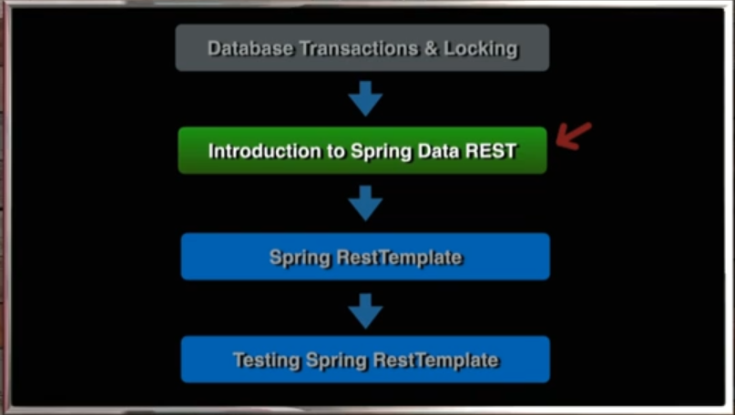
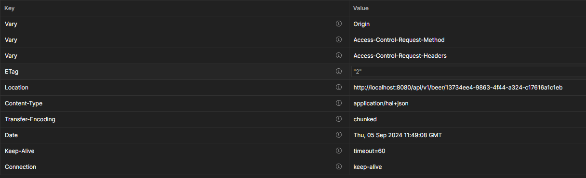
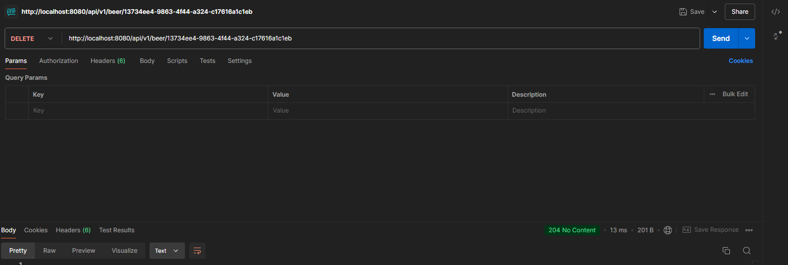
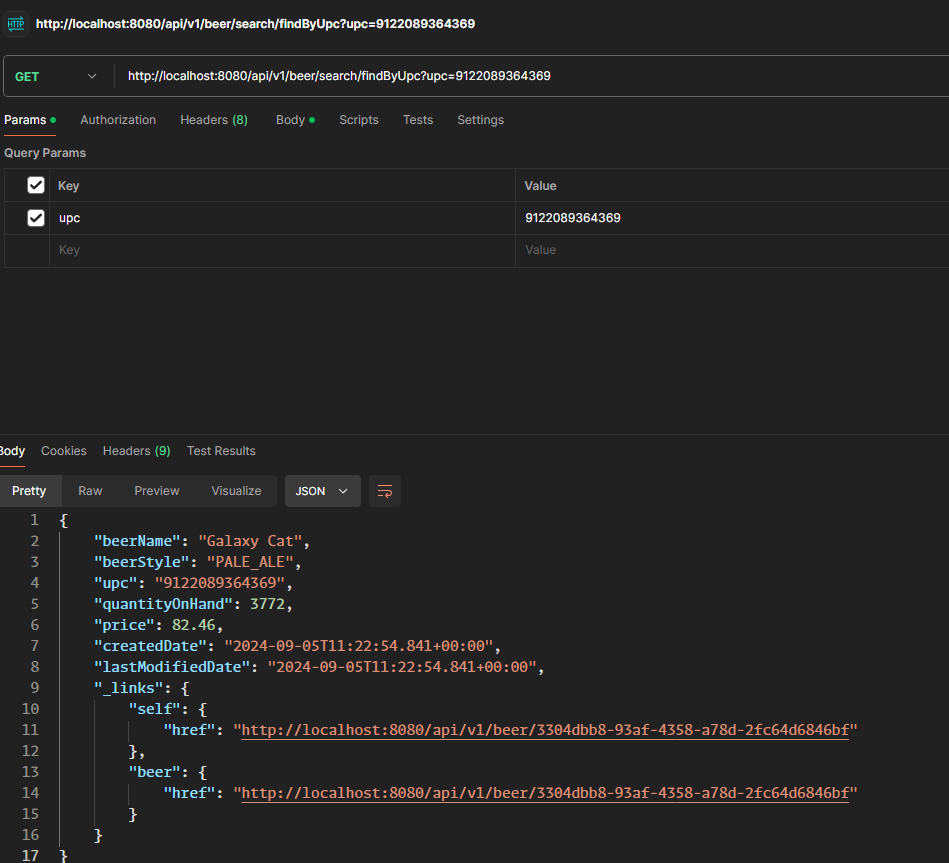

# 18 - Introduction to Spring Data REST

## 001 Introduction

## 002 Project Code Review

[Github Repo](https://github.com/springframeworkguru/sdjpa-spring-data-rest.git)

The GitHub repository **"sdjpa-spring-data-rest"** by **springframeworkguru** demonstrates a simple implementation of **Spring Data JPA** integrated with **Spring Data REST**. This project highlights how Spring can expose JPA-based repositories through RESTful endpoints automatically, without requiring explicit controller code for CRUD operations. It leverages the following key concepts:

1. **Spring Data JPA**: The project sets up JPA repositories to manage database entities. These repositories provide built-in methods for operations such as finding, saving, and deleting entities.
  
2. **Spring Data REST**: The integration with Spring Data REST allows the repositories to automatically be exposed as RESTful web services. This means entities can be interacted with over HTTP, with operations like GET, POST, PUT, and DELETE mapped to standard repository methods.
  
3. **Entities and Repositories**: The code defines typical **JPA entities** (likely domain models like `Customer`, `Product`, or similar) and their corresponding repositories. Each repository is then exposed as a RESTful resource, making it possible to perform operations such as querying all entities, fetching a specific entity by ID, and performing updates and deletions.

4. **Automated API**: With **Spring Data REST**, API endpoints are created for each repository, following REST principles. This allows for actions like fetching all records (`GET /entities`), fetching a single entity by ID (`GET /entities/{id}`), and performing CRUD operations on the entity data.

This repository serves as a practical example of how to use Spring Data JPA with Spring Data REST to build quick, CRUD-capable REST APIs without manually implementing controllers【77†source】【78†source】【79†source】.

## 003 Add Spring Data REST Dependency

```xml
        <dependency>
            <groupId>org.springframework.boot</groupId>
            <artifactId>spring-boot-starter-data-rest</artifactId>
        </dependency>
```

### **`spring-boot-starter-data-rest` Dependency: A Deep Explanation**

The **`spring-boot-starter-data-rest`** dependency in a Spring Boot project integrates **Spring Data JPA** and **Spring Data REST** to automatically expose **JPA repositories** as **RESTful services**. This allows developers to quickly generate REST APIs without the need to write controllers manually. The APIs provide CRUD functionality based on the repository methods, allowing for easy data manipulation through HTTP requests.

#### **Dependency Declaration**

```xml
<dependency>
    <groupId>org.springframework.boot</groupId>
    <artifactId>spring-boot-starter-data-rest</artifactId>
</dependency>
```

- **GroupId**: `org.springframework.boot` – This indicates that the dependency is part of the **Spring Boot** ecosystem.
- **ArtifactId**: `spring-boot-starter-data-rest` – This starter includes **Spring Data REST**, which enables automatic exposure of repository methods as RESTful endpoints.

---

### **Key Concepts of `spring-boot-starter-data-rest`**

1. **Automatic REST Endpoints**:
   - When you add **`spring-boot-starter-data-rest`** to your Spring Boot project, Spring automatically generates REST endpoints for **JPA repositories**.
   - The repository interfaces, such as `CrudRepository` or `JpaRepository`, expose CRUD operations like **create**, **read**, **update**, and **delete** via standard HTTP methods (`GET`, `POST`, `PUT`, `DELETE`).

2. **Convention Over Configuration**:
   - Spring Data REST relies on **conventions** to expose resources and define REST endpoints. For example:
     - `GET /customers` retrieves all customer entities.
     - `POST /customers` creates a new customer.
     - `GET /customers/{id}` retrieves a specific customer by its ID.

3. **HAL Format**:
   - By default, the responses from these REST endpoints are returned in **HAL (Hypertext Application Language)** format, which is a standard for representing **hypermedia-driven** APIs. HAL provides self-descriptive links to related resources within the response.
   
   Example:
   ```json
   {
     "_embedded": {
       "customers": [
         {
           "id": 1,
           "name": "John Doe",
           "_links": {
             "self": {
               "href": "http://localhost:8080/customers/1"
             },
             "customer": {
               "href": "http://localhost:8080/customers/1"
             }
           }
         }
       ]
     },
     "_links": {
       "self": {
         "href": "http://localhost:8080/customers"
       }
     }
   }
   ```

4. **Customizing Endpoints**:
   - Although Spring Data REST automatically generates endpoints, it also allows for **customization**. You can define which methods should be exposed, customize URLs, and add projections to filter the data returned by the APIs.
   
   Example of **customizing a repository method**:
   ```java
   @RepositoryRestResource(collectionResourceRel = "orders", path = "orders")
   public interface OrderRepository extends JpaRepository<Order, Long> {
       List<Order> findByCustomerName(@Param("name") String name);
   }
   ```

   In this example:
   - The `OrderRepository` is customized with a **different path** (`/orders`).
   - A custom query method, `findByCustomerName`, is exposed as `/orders/search/findByCustomerName?name=John`.

5. **Paging and Sorting**:
   - Spring Data REST also supports **pagination** and **sorting** out of the box. When you request a list of entities, you can add parameters like `size`, `page`, and `sort` to control the response.

   Example:
   ```http
   GET /customers?page=2&size=5&sort=name,asc
   ```

   This query will return the **third page** (since pages are zero-indexed) with **5 records per page**, sorted by the `name` field in **ascending order**.

6. **Integration with Spring Data JPA**:
   - The `spring-boot-starter-data-rest` builds on **Spring Data JPA**, which provides the repository abstraction for working with entities and performing database operations. The `JpaRepository` methods, such as `save()`, `findById()`, and `delete()`, are automatically exposed through the REST endpoints.

---

### **Example: Basic Usage**

Consider a simple **Customer** entity:

```java
@Entity
public class Customer {
    @Id
    @GeneratedValue(strategy = GenerationType.IDENTITY)
    private Long id;
    private String name;
    
    // Getters and Setters
}
```

And the corresponding **repository**:

```java
public interface CustomerRepository extends JpaRepository<Customer, Long> {
}
```

By adding the **`spring-boot-starter-data-rest`** dependency, Spring automatically creates the following RESTful endpoints:
- `GET /customers`: Retrieve all customers.
- `GET /customers/{id}`: Retrieve a specific customer by ID.
- `POST /customers`: Create a new customer.
- `PUT /customers/{id}`: Update an existing customer.
- `DELETE /customers/{id}`: Delete a customer.

No need for explicit controller code—Spring Data REST takes care of creating these endpoints based on the repository.

---

### **Advanced Customizations**

1. **Projections and Excerpts**:
   - Sometimes you don’t want to expose the entire entity but a subset of fields. Spring Data REST supports **projections** and **excerpts** to return specific data based on the use case.
   
   Example:
   ```java
   @Projection(name = "customerExcerpt", types = { Customer.class })
   public interface CustomerExcerpt {
       String getName();
   }
   ```

   By applying this projection, the REST endpoint will only return the `name` field of the `Customer` entity.

2. **Event Listeners**:
   - Spring Data REST also provides event hooks that allow you to handle events such as **beforeCreate**, **beforeSave**, and **afterDelete**.
   
   Example:
   ```java
   @Component
   public class CustomerEventHandler {
   
       @HandleBeforeSave
       public void handleCustomerSave(Customer customer) {
           // Custom logic before saving a customer
       }
   }
   ```

---

### **Benefits of Using `spring-boot-starter-data-rest`**

1. **Rapid Development**: You can quickly generate a RESTful API with minimal code.
2. **Consistent API**: It follows standard REST principles and provides a consistent structure for CRUD operations.
3. **Customizability**: While it automatically exposes repository methods, it allows full customization of the exposed API.
4. **HAL Support**: The built-in HAL support provides hypermedia-driven APIs, making it easy to navigate and interact with the API.

---

### **Conclusion**

The **`spring-boot-starter-data-rest`** dependency is a powerful tool for rapidly building REST APIs that interact with JPA-based repositories. It simplifies the process of exposing CRUD operations over HTTP, offers rich features like pagination, sorting, and HAL support, and provides extensive customization options for more advanced use cases. By integrating it into your Spring Boot application, you can quickly create scalable and maintainable RESTful services.

## 004 List All With Spring Data REST

```http
http://localhost:8080/beers
```

```json
{
    "_embedded": {
        "beers": [
            {
                "beerName": "Mango Bobs",
                "beerStyle": "ALE",
                "upc": "0631234200036",
                "quantityOnHand": 4288,
                "price": 84.48,
                "createdDate": "2024-09-05T10:50:52.397+00:00",
                "lastModifiedDate": "2024-09-05T10:50:52.397+00:00",
                "_links": {
                    "self": {
                        "href": "http://localhost:8080/beers/01c02d4c-7104-4b21-bf2a-95ee03a50b09"
                    },
                    "beer": {
                        "href": "http://localhost:8080/beers/01c02d4c-7104-4b21-bf2a-95ee03a50b09"
                    }
                }
            },
            {
                "beerName": "Galaxy Cat",
                "beerStyle": "PALE_ALE",
                "upc": "9122089364369",
                "quantityOnHand": 2612,
                "price": 32.54,
                "createdDate": "2024-09-05T10:50:52.404+00:00",
                "lastModifiedDate": "2024-09-05T10:50:52.404+00:00",
                "_links": {
                    "self": {
                        "href": "http://localhost:8080/beers/3ee98a58-59a3-4b7d-9fae-9f44f0149cf8"
                    },
                    "beer": {
                        "href": "http://localhost:8080/beers/3ee98a58-59a3-4b7d-9fae-9f44f0149cf8"
                    }
                }
            },
            {
                "beerName": "No Hammers On The Bar",
                "beerStyle": "WHEAT",
                "upc": "0083783375213",
                "quantityOnHand": 550,
                "price": 40.41,
                "createdDate": "2024-09-05T10:50:52.405+00:00",
                "lastModifiedDate": "2024-09-05T10:50:52.405+00:00",
                "_links": {
                    "self": {
                        "href": "http://localhost:8080/beers/28ab0ad4-99b2-4471-9154-98f51f508c66"
                    },
                    "beer": {
                        "href": "http://localhost:8080/beers/28ab0ad4-99b2-4471-9154-98f51f508c66"
                    }
                }
            },
            {
                "beerName": "Blessed",
                "beerStyle": "STOUT",
                "upc": "4666337557578",
                "quantityOnHand": 744,
                "price": 33.96,
                "createdDate": "2024-09-05T10:50:52.406+00:00",
                "lastModifiedDate": "2024-09-05T10:50:52.406+00:00",
                "_links": {
                    "self": {
                        "href": "http://localhost:8080/beers/66c3dcbe-ced4-41e0-86b7-0cf0e6d04457"
                    },
                    "beer": {
                        "href": "http://localhost:8080/beers/66c3dcbe-ced4-41e0-86b7-0cf0e6d04457"
                    }
                }
            },
            {
                "beerName": "Adjunct Trail",
                "beerStyle": "STOUT",
                "upc": "8380495518610",
                "quantityOnHand": 1074,
                "price": 5.89,
                "createdDate": "2024-09-05T10:50:52.406+00:00",
                "lastModifiedDate": "2024-09-05T10:50:52.406+00:00",
                "_links": {
                    "self": {
                        "href": "http://localhost:8080/beers/7fbbe674-7afa-4798-996a-e9daaf9ed987"
                    },
                    "beer": {
                        "href": "http://localhost:8080/beers/7fbbe674-7afa-4798-996a-e9daaf9ed987"
                    }
                }
            },
            {
                "beerName": "Very GGGreenn",
                "beerStyle": "IPA",
                "upc": "5677465691934",
                "quantityOnHand": 10,
                "price": 34.19,
                "createdDate": "2024-09-05T10:50:52.407+00:00",
                "lastModifiedDate": "2024-09-05T10:50:52.407+00:00",
                "_links": {
                    "self": {
                        "href": "http://localhost:8080/beers/7e9accd5-59f9-4bb3-96f6-bb90e3b1b545"
                    },
                    "beer": {
                        "href": "http://localhost:8080/beers/7e9accd5-59f9-4bb3-96f6-bb90e3b1b545"
                    }
                }
            },
            {
                "beerName": "Double Barrel Hunahpu's",
                "beerStyle": "STOUT",
                "upc": "5463533082885",
                "quantityOnHand": 4260,
                "price": 99.45,
                "createdDate": "2024-09-05T10:50:52.408+00:00",
                "lastModifiedDate": "2024-09-05T10:50:52.408+00:00",
                "_links": {
                    "self": {
                        "href": "http://localhost:8080/beers/8d142f37-424c-43ed-aa9f-a1ec411b1fd0"
                    },
                    "beer": {
                        "href": "http://localhost:8080/beers/8d142f37-424c-43ed-aa9f-a1ec411b1fd0"
                    }
                }
            },
            {
                "beerName": "Very Hazy",
                "beerStyle": "IPA",
                "upc": "5339741428398",
                "quantityOnHand": 1784,
                "price": 18.23,
                "createdDate": "2024-09-05T10:50:52.409+00:00",
                "lastModifiedDate": "2024-09-05T10:50:52.409+00:00",
                "_links": {
                    "self": {
                        "href": "http://localhost:8080/beers/0d71375d-8063-49f1-991d-75b97b4024b6"
                    },
                    "beer": {
                        "href": "http://localhost:8080/beers/0d71375d-8063-49f1-991d-75b97b4024b6"
                    }
                }
            },
            {
                "beerName": "SR-71",
                "beerStyle": "STOUT",
                "upc": "1726923962766",
                "quantityOnHand": 3068,
                "price": 47.49,
                "createdDate": "2024-09-05T10:50:52.410+00:00",
                "lastModifiedDate": "2024-09-05T10:50:52.410+00:00",
                "_links": {
                    "self": {
                        "href": "http://localhost:8080/beers/69c75de5-1414-4ca3-bd75-13aa80f2f923"
                    },
                    "beer": {
                        "href": "http://localhost:8080/beers/69c75de5-1414-4ca3-bd75-13aa80f2f923"
                    }
                }
            },
            {
                "beerName": "Pliny the Younger",
                "beerStyle": "IPA",
                "upc": "8484957731774",
                "quantityOnHand": 3261,
                "price": 45.04,
                "createdDate": "2024-09-05T10:50:52.410+00:00",
                "lastModifiedDate": "2024-09-05T10:50:52.410+00:00",
                "_links": {
                    "self": {
                        "href": "http://localhost:8080/beers/d5735ef0-2ab6-4c65-9494-d257f55a76ab"
                    },
                    "beer": {
                        "href": "http://localhost:8080/beers/d5735ef0-2ab6-4c65-9494-d257f55a76ab"
                    }
                }
            },
            {
                "beerName": "Blessed",
                "beerStyle": "STOUT",
                "upc": "6266328524787",
                "quantityOnHand": 272,
                "price": 95.69,
                "createdDate": "2024-09-05T10:50:52.411+00:00",
                "lastModifiedDate": "2024-09-05T10:50:52.411+00:00",
                "_links": {
                    "self": {
                        "href": "http://localhost:8080/beers/513002ee-e533-48d9-8611-abb49b763b32"
                    },
                    "beer": {
                        "href": "http://localhost:8080/beers/513002ee-e533-48d9-8611-abb49b763b32"
                    }
                }
            },
            {
                "beerName": "King Krush",
                "beerStyle": "IPA",
                "upc": "7490217802727",
                "quantityOnHand": 2921,
                "price": 25.11,
                "createdDate": "2024-09-05T10:50:52.412+00:00",
                "lastModifiedDate": "2024-09-05T10:50:52.412+00:00",
                "_links": {
                    "self": {
                        "href": "http://localhost:8080/beers/743dbce3-5365-4f07-9169-777b95bff188"
                    },
                    "beer": {
                        "href": "http://localhost:8080/beers/743dbce3-5365-4f07-9169-777b95bff188"
                    }
                }
            },
            {
                "beerName": "PBS Porter",
                "beerStyle": "PORTER",
                "upc": "8579613295827",
                "quantityOnHand": 95,
                "price": 87.60,
                "createdDate": "2024-09-05T10:50:52.413+00:00",
                "lastModifiedDate": "2024-09-05T10:50:52.413+00:00",
                "_links": {
                    "self": {
                        "href": "http://localhost:8080/beers/b712d24c-8466-4335-8c2a-9a9cad30d7bf"
                    },
                    "beer": {
                        "href": "http://localhost:8080/beers/b712d24c-8466-4335-8c2a-9a9cad30d7bf"
                    }
                }
            },
            {
                "beerName": "Pinball Porter",
                "beerStyle": "STOUT",
                "upc": "2318301340601",
                "quantityOnHand": 1512,
                "price": 16.25,
                "createdDate": "2024-09-05T10:50:52.414+00:00",
                "lastModifiedDate": "2024-09-05T10:50:52.414+00:00",
                "_links": {
                    "self": {
                        "href": "http://localhost:8080/beers/b75f9735-b437-4199-b71e-0b88c5a8bedf"
                    },
                    "beer": {
                        "href": "http://localhost:8080/beers/b75f9735-b437-4199-b71e-0b88c5a8bedf"
                    }
                }
            },
            {
                "beerName": "Golden Budda",
                "beerStyle": "STOUT",
                "upc": "9401790633828",
                "quantityOnHand": 2840,
                "price": 12.18,
                "createdDate": "2024-09-05T10:50:52.415+00:00",
                "lastModifiedDate": "2024-09-05T10:50:52.415+00:00",
                "_links": {
                    "self": {
                        "href": "http://localhost:8080/beers/00b4a158-dc40-4dcc-a6c1-a6d046847df6"
                    },
                    "beer": {
                        "href": "http://localhost:8080/beers/00b4a158-dc40-4dcc-a6c1-a6d046847df6"
                    }
                }
            },
            {
                "beerName": "Grand Central Red",
                "beerStyle": "LAGER",
                "upc": "4813896316225",
                "quantityOnHand": 2156,
                "price": 83.84,
                "createdDate": "2024-09-05T10:50:52.416+00:00",
                "lastModifiedDate": "2024-09-05T10:50:52.416+00:00",
                "_links": {
                    "self": {
                        "href": "http://localhost:8080/beers/95ef38cf-99e9-45af-a28b-19a6577cdcef"
                    },
                    "beer": {
                        "href": "http://localhost:8080/beers/95ef38cf-99e9-45af-a28b-19a6577cdcef"
                    }
                }
            },
            {
                "beerName": "Pac-Man",
                "beerStyle": "STOUT",
                "upc": "3431272499891",
                "quantityOnHand": 2160,
                "price": 61.23,
                "createdDate": "2024-09-05T10:50:52.417+00:00",
                "lastModifiedDate": "2024-09-05T10:50:52.417+00:00",
                "_links": {
                    "self": {
                        "href": "http://localhost:8080/beers/68f409df-4e08-4039-83a4-5551a0aeee0c"
                    },
                    "beer": {
                        "href": "http://localhost:8080/beers/68f409df-4e08-4039-83a4-5551a0aeee0c"
                    }
                }
            },
            {
                "beerName": "Ro Sham Bo",
                "beerStyle": "IPA",
                "upc": "2380867498485",
                "quantityOnHand": 2135,
                "price": 13.24,
                "createdDate": "2024-09-05T10:50:52.417+00:00",
                "lastModifiedDate": "2024-09-05T10:50:52.417+00:00",
                "_links": {
                    "self": {
                        "href": "http://localhost:8080/beers/00ebab0b-11fd-4d2a-9d78-ef9c094f0b89"
                    },
                    "beer": {
                        "href": "http://localhost:8080/beers/00ebab0b-11fd-4d2a-9d78-ef9c094f0b89"
                    }
                }
            },
            {
                "beerName": "Summer Wheatly",
                "beerStyle": "WHEAT",
                "upc": "4323950503848",
                "quantityOnHand": 1022,
                "price": 98.25,
                "createdDate": "2024-09-05T10:50:52.418+00:00",
                "lastModifiedDate": "2024-09-05T10:50:52.418+00:00",
                "_links": {
                    "self": {
                        "href": "http://localhost:8080/beers/9d3df433-de26-4c1d-9513-f8f7f1e70724"
                    },
                    "beer": {
                        "href": "http://localhost:8080/beers/9d3df433-de26-4c1d-9513-f8f7f1e70724"
                    }
                }
            },
            {
                "beerName": "Java Jill",
                "beerStyle": "LAGER",
                "upc": "4006016803570",
                "quantityOnHand": 673,
                "price": 96.00,
                "createdDate": "2024-09-05T10:50:52.419+00:00",
                "lastModifiedDate": "2024-09-05T10:50:52.419+00:00",
                "_links": {
                    "self": {
                        "href": "http://localhost:8080/beers/d2a400ed-a22f-4f29-8297-238fc0470e14"
                    },
                    "beer": {
                        "href": "http://localhost:8080/beers/d2a400ed-a22f-4f29-8297-238fc0470e14"
                    }
                }
            }
        ]
    },
    "_links": {
        "first": {
            "href": "http://localhost:8080/beers?page=0&size=20"
        },
        "self": {
            "href": "http://localhost:8080/beers"
        },
        "next": {
            "href": "http://localhost:8080/beers?page=1&size=20"
        },
        "last": {
            "href": "http://localhost:8080/beers?page=1&size=20"
        },
        "profile": {
            "href": "http://localhost:8080/profile/beers"
        },
        "search": {
            "href": "http://localhost:8080/beers/search"
        }
    },
    "page": {
        "size": 20,
        "totalElements": 30,
        "totalPages": 2,
        "number": 0
    }
}
```

## 005 Set Base Path
To set a **base path** for **Spring Data REST** endpoints in a Spring Boot application, you can configure it using the `spring.data.rest.basePath` property. This allows you to define a custom base path under which all your **Spring Data REST** repository endpoints will be exposed.

Here’s how to set it up:

### **1. Using `application.properties`**

You can specify the base path by adding the following line in the `application.properties` file:

```properties
spring.data.rest.basePath=/api
```

In this example, all your Spring Data REST endpoints will be available under `/api`. For instance:
- A repository for `Customer` entities that would typically be available at `http://localhost:8080/customers` will now be available at `http://localhost:8080/api/customers`.

### **2. Using `application.yml`**

If you’re using `application.yml` instead of `application.properties`, you can set the base path as follows:

```yaml
spring:
  data:
    rest:
      basePath: /api
```

This will have the same effect as the `application.properties` configuration, setting the base path for all Spring Data REST endpoints to `/api`.

### **3. Example of How It Works**

Assuming you have a `CustomerRepository` like this:

```java
@RepositoryRestResource
public interface CustomerRepository extends JpaRepository<Customer, Long> {
}
```

Without the base path, the REST endpoint would be available at:

```plaintext
GET http://localhost:8080/customers
```

After setting `spring.data.rest.basePath=/api`, the endpoint becomes:

```plaintext
GET http://localhost:8080/api/customers
```

### **Use Case for Setting a Base Path**

- **API Versioning**: You might want to version your API by setting a base path like `/api/v1`.
- **Separation of Concerns**: It can be useful to separate your REST endpoints from other routes by placing them under a dedicated base path like `/api`.

### **Conclusion**

Setting a base path for Spring Data REST is straightforward and can be achieved by configuring the `spring.data.rest.basePath` property in your Spring Boot application’s configuration file. This ensures all repository endpoints are grouped under a custom URI prefix, improving the structure and organization of your API.

```properties
spring.data.rest.base-path=/api/v1
```


## 006 Customize URL Path
`@RepositoryRestResource` is a Spring Data REST annotation used to customize the exposed REST API endpoints for a Spring Data repository. When applied to a repository interface, it allows you to configure various aspects of the REST resources that Spring Data REST automatically generates for you. 

### Key Features

1. **Path Customization**:
   - **`path`**: This attribute allows you to specify a custom URL path for the REST endpoint associated with the repository. By default, Spring Data REST generates a URL based on the repository's domain type, but you can override it to provide a more meaningful or user-friendly path.

2. **Rel Resource Customization**:
   - **`collectionResourceRel`**: This attribute defines the name of the collection resource's JSON key.
   - **`itemResourceRel`**: This attribute defines the name of the single item resource's JSON key.

3. **Repository Interface**:
   - The interface should extend one of the Spring Data repository interfaces, like `JpaRepository` or `CrudRepository`.

### Example Usage

Suppose you have an entity class `Beer` and you want to create a REST API for it. Here's how you might use `@RepositoryRestResource`:

#### 1. Define the Entity

```java
import javax.persistence.Entity;
import javax.persistence.Id;

@Entity
public class Beer {
    @Id
    private Long id;
    private String name;
    private String type;

    // Getters and setters
}
```

#### 2. Create the Repository Interface

```java
import org.springframework.data.repository.CrudRepository;
import org.springframework.data.rest.core.annotation.RepositoryRestResource;

@RepositoryRestResource(path = "beers", collectionResourceRel = "beers", itemResourceRel = "beer")
public interface BeerRepository extends CrudRepository<Beer, Long> {
    // Custom query methods can be added here
}
```

### Explanation

1. **`@RepositoryRestResource`**:
   - **`path`**: This attribute specifies that the REST endpoint for this repository should be `/beers`. By default, without this annotation, it would be `/beer` (the pluralized form of the entity name).
   - **`collectionResourceRel`**: This sets the name of the collection resource's JSON key to `beers`. When you fetch the collection of `Beer` objects, it will be wrapped in a JSON object with the key `beers`.
   - **`itemResourceRel`**: This sets the name of the single item resource's JSON key to `beer`. When you fetch an individual `Beer` object, it will be represented with the key `beer`.

#### 3. Accessing the API

After configuring the repository, Spring Data REST will automatically expose the following endpoints:

- **Collection Endpoint**: `GET /beers` - Retrieves a list of beers.
- **Item Endpoint**: `GET /beers/{id}` - Retrieves a specific beer by its ID.
- **POST /beers** - Creates a new beer.
- **PUT /beers/{id}`** - Updates an existing beer.
- **DELETE /beers/{id}`** - Deletes a beer.

#### 4. Example JSON Responses

- **Collection Response**:

```json
{
    "beers": [
        {
            "id": 1,
            "name": "IPA",
            "type": "Ale"
        },
        {
            "id": 2,
            "name": "Stout",
            "type": "Dark Ale"
        }
    ]
}
```

- **Item Response**:

```json
{
    "id": 1,
    "name": "IPA",
    "type": "Ale"
}
```

### Customizing Behavior

You can further customize the behavior of your REST endpoints by using additional Spring Data REST features like custom controllers, projections, and excerpts. For example, you can use `@RepositoryRestResource` in conjunction with `@RequestMapping` to add custom endpoints or override default behavior.

### Summary

`@RepositoryRestResource` is a powerful tool in Spring Data REST for customizing the REST API endpoints generated for your repositories. By setting attributes like `path`, `collectionResourceRel`, and `itemResourceRel`, you can tailor the API to better fit your application's needs and provide a more user-friendly interface.

```java
package guru.springframework.sfgrestbrewery.repositories;


import guru.springframework.sfgrestbrewery.domain.Beer;
import guru.springframework.sfgrestbrewery.domain.BeerStyleEnum;
import org.springframework.data.domain.Page;
import org.springframework.data.domain.Pageable;
import org.springframework.data.jpa.repository.JpaRepository;
import org.springframework.data.rest.core.annotation.RepositoryRestResource;


import java.util.UUID;

@RepositoryRestResource(path = "beer",collectionResourceRel = "beer")
public interface BeerRepository extends JpaRepository<Beer, UUID> {
    Page<Beer> findAllByBeerName(String beerName, Pageable pageable);

    Page<Beer> findAllByBeerStyle(BeerStyleEnum beerStyle, Pageable pageable);

    Page<Beer> findAllByBeerNameAndBeerStyle(String beerName, BeerStyleEnum beerStyle, Pageable pageable);

    Beer findByUpc(String upc);
}

```

## 007 Version Property - ETag Header
Spring Data REST may hide the `version` property of an entity when exposing it through REST endpoints due to several reasons:

### 1. **Version Management and Concurrency Control**

- **Optimistic Locking**: In Spring Data REST, the `version` property is typically used for optimistic locking to manage concurrency. Optimistic locking helps to ensure that no other transactions have modified an entity between the time it was read and the time it is updated. The `version` field is crucial for this purpose, but it's usually hidden from the REST API to prevent clients from manipulating it directly.

### 2. **Security and Encapsulation**

- **Data Exposure**: The `version` field is a technical detail that usually doesn't need to be exposed to clients. By hiding it, you prevent potential misuse or confusion among clients who might not understand its purpose or might try to manipulate it, leading to potential data integrity issues.

### 3. **Simplified API Design**

- **Client Simplicity**: APIs are often designed to expose only the necessary fields to clients. Including fields like `version` may complicate the API and its usage. By hiding such internal fields, the API remains simpler and more focused on the data that clients actually need.

### 4. **Custom Serialization**

- **Custom Serialization Logic**: If you want the `version` property to be included in the REST API responses, you can customize the serialization behavior. For example, you can use Jackson annotations like `@JsonInclude` or `@JsonProperty` to include the `version` field.

### Customizing Visibility of the `version` Property

If you need to expose the `version` property in your API, you can adjust the behavior by customizing the JSON serialization. Here’s how you can do that:

#### 1. **Using Jackson Annotations**

You can use Jackson annotations to include the `version` field in your JSON responses:

```java
import com.fasterxml.jackson.annotation.JsonInclude;
import com.fasterxml.jackson.annotation.JsonProperty;

@Entity
public class Beer {
    @Id
    private Long id;
    private String name;
    private String type;

    @Version
    @JsonProperty("version")
    private Long version;

    // Getters and setters
}
```

In this example, the `@JsonProperty("version")` annotation explicitly includes the `version` field in the JSON response.

#### 2. **Using Spring Data REST Customization**

You can also create a custom `Projection` or `Excerpt` to control which fields are exposed in the API responses:

```java
import org.springframework.data.rest.core.config.Projection;

@Projection(name = "inline", types = { Beer.class })
public interface BeerProjection {
    Long getId();
    String getName();
    String getType();
    Long getVersion();  // Explicitly include the version field
}
```

And configure Spring Data REST to use this projection:

```java
import org.springframework.data.rest.core.annotation.RepositoryRestResource;

@RepositoryRestResource(excerptProjection = BeerProjection.class)
public interface BeerRepository extends CrudRepository<Beer, Long> {
}
```

### Summary

Spring Data REST hides the `version` property by default to keep the API clean, secure, and focused on the data relevant to clients. However, you can customize the API to include the `version` field if needed by using Jackson annotations or Spring Data REST projections.
## 008 API Profile
```json
{
    "alps": {
        "version": "1.0",
        "descriptor": [
            {
                "id": "beer-representation",
                "href": "http://localhost:8080/api/v1/profile/beer",
                "descriptor": [
                    {
                        "name": "version",
                        "type": "SEMANTIC"
                    },
                    {
                        "name": "beerName",
                        "type": "SEMANTIC"
                    },
                    {
                        "name": "beerStyle",
                        "type": "SEMANTIC",
                        "doc": {
                            "format": "TEXT",
                            "value": "LAGER, PILSNER, STOUT, GOSE, PORTER, ALE, WHEAT, IPA, PALE_ALE, SAISON"
                        }
                    },
                    {
                        "name": "upc",
                        "type": "SEMANTIC"
                    },
                    {
                        "name": "quantityOnHand",
                        "type": "SEMANTIC"
                    },
                    {
                        "name": "price",
                        "type": "SEMANTIC"
                    },
                    {
                        "name": "createdDate",
                        "type": "SEMANTIC"
                    },
                    {
                        "name": "lastModifiedDate",
                        "type": "SEMANTIC"
                    }
                ]
            },
            {
                "id": "create-beer",
                "name": "beer",
                "type": "UNSAFE",
                "descriptor": [],
                "rt": "#beer-representation"
            },
            {
                "id": "get-beer",
                "name": "beer",
                "type": "SAFE",
                "descriptor": [
                    {
                        "name": "page",
                        "type": "SEMANTIC",
                        "doc": {
                            "format": "TEXT",
                            "value": "The page to return."
                        }
                    },
                    {
                        "name": "size",
                        "type": "SEMANTIC",
                        "doc": {
                            "format": "TEXT",
                            "value": "The size of the page to return."
                        }
                    },
                    {
                        "name": "sort",
                        "type": "SEMANTIC",
                        "doc": {
                            "format": "TEXT",
                            "value": "The sorting criteria to use to calculate the content of the page."
                        }
                    }
                ],
                "rt": "#beer-representation"
            },
            {
                "id": "delete-beer",
                "name": "beer",
                "type": "IDEMPOTENT",
                "descriptor": [],
                "rt": "#beer-representation"
            },
            {
                "id": "get-beer",
                "name": "beer",
                "type": "SAFE",
                "descriptor": [],
                "rt": "#beer-representation"
            },
            {
                "id": "update-beer",
                "name": "beer",
                "type": "IDEMPOTENT",
                "descriptor": [],
                "rt": "#beer-representation"
            },
            {
                "id": "patch-beer",
                "name": "beer",
                "type": "UNSAFE",
                "descriptor": [],
                "rt": "#beer-representation"
            },
            {
                "name": "findAllByBeerStyle",
                "type": "SAFE",
                "descriptor": [
                    {
                        "name": "beerStyle",
                        "type": "SEMANTIC",
                        "doc": {
                            "format": "TEXT",
                            "value": "LAGER, PILSNER, STOUT, GOSE, PORTER, ALE, WHEAT, IPA, PALE_ALE, SAISON"
                        }
                    }
                ]
            },
            {
                "name": "findAllByBeerName",
                "type": "SAFE",
                "descriptor": [
                    {
                        "name": "beerName",
                        "type": "SEMANTIC"
                    }
                ]
            },
            {
                "name": "findAllByBeerNameAndBeerStyle",
                "type": "SAFE",
                "descriptor": [
                    {
                        "name": "beerName",
                        "type": "SEMANTIC"
                    },
                    {
                        "name": "beerStyle",
                        "type": "SEMANTIC",
                        "doc": {
                            "format": "TEXT",
                            "value": "LAGER, PILSNER, STOUT, GOSE, PORTER, ALE, WHEAT, IPA, PALE_ALE, SAISON"
                        }
                    }
                ]
            },
            {
                "name": "findByUpc",
                "type": "SAFE",
                "descriptor": [
                    {
                        "name": "upc",
                        "type": "SEMANTIC"
                    }
                ]
            }
        ]
    }
}
```

The provided JSON document represents an **ALPS (Application-Level Profile Semantics)** description of the RESTful API at `http://localhost:8080/api/v1/profile/beer`. ALPS is a specification used to describe the semantics and structure of a RESTful API, making it easier for clients and tools to understand how to interact with the API. 

Let's break down and explain each part of the ALPS document:

### ALPS Document Structure

1. **ALPS Version and Descriptor**

    ```json
    {
        "alps": {
            "version": "1.0",
            "descriptor": [
                ...
            ]
        }
    }
    ```

    - **`version`**: Specifies the version of the ALPS specification used (e.g., `1.0`).
    - **`descriptor`**: An array of descriptors that define the structure and behavior of the API endpoints.

### Descriptors Breakdown

#### 1. **Beer Representation**

    ```json
    {
        "id": "beer-representation",
        "href": "http://localhost:8080/api/v1/profile/beer",
        "descriptor": [
            {
                "name": "version",
                "type": "SEMANTIC"
            },
            ...
        ]
    }
    ```

    - **`id`**: Identifier for this specific descriptor (`beer-representation`).
    - **`href`**: The URL where this representation can be accessed (`http://localhost:8080/api/v1/profile/beer`).
    - **`descriptor`**: Defines the properties of the `beer` resource. Each entry describes a property, its name, and type.
        - **`name`**: The name of the property (e.g., `version`, `beerName`).
        - **`type`**: The type of the property, typically `SEMANTIC`, indicating that it is a meaningful attribute.

    Properties include:
    - **`version`**: Used for concurrency control.
    - **`beerName`**: Name of the beer.
    - **`beerStyle`**: Style of the beer (with possible values listed).
    - **`upc`**: Universal Product Code.
    - **`quantityOnHand`**: Available quantity of the beer.
    - **`price`**: Price of the beer.
    - **`createdDate`** and **`lastModifiedDate`**: Timestamps for the creation and last modification of the beer entry.

#### 2. **Create Beer Endpoint**

    ```json
    {
        "id": "create-beer",
        "name": "beer",
        "type": "UNSAFE",
        "descriptor": [],
        "rt": "#beer-representation"
    }
    ```

    - **`id`**: Identifier for this action (`create-beer`).
    - **`name`**: The name of the action (`beer`).
    - **`type`**: `UNSAFE` indicates that this action can modify the state (creating a new beer).
    - **`rt`**: Reference to the representation type (`#beer-representation`).

#### 3. **Get Beer Endpoint**

    ```json
    {
        "id": "get-beer",
        "name": "beer",
        "type": "SAFE",
        "descriptor": [
            {
                "name": "page",
                "type": "SEMANTIC",
                "doc": {
                    "format": "TEXT",
                    "value": "The page to return."
                }
            },
            ...
        ],
        "rt": "#beer-representation"
    }
    ```

    - **`id`**: Identifier for this action (`get-beer`).
    - **`name`**: The name of the action (`beer`).
    - **`type`**: `SAFE` indicates that this action does not modify the state (retrieving beers).
    - **`descriptor`**: Defines parameters for pagination:
        - **`page`**: The page number of results.
        - **`size`**: Number of items per page.
        - **`sort`**: Sorting criteria.
    - **`rt`**: Reference to the representation type (`#beer-representation`).

#### 4. **Delete Beer Endpoint**

    ```json
    {
        "id": "delete-beer",
        "name": "beer",
        "type": "IDEMPOTENT",
        "descriptor": [],
        "rt": "#beer-representation"
    }
    ```

    - **`id`**: Identifier for this action (`delete-beer`).
    - **`name`**: The name of the action (`beer`).
    - **`type`**: `IDEMPOTENT` means that repeated calls to this action have the same effect as a single call (deleting a beer).
    - **`rt`**: Reference to the representation type (`#beer-representation`).

#### 5. **Update Beer Endpoint**

```json
{
    "id": "update-beer",
    "name": "beer",
    "type": "IDEMPOTENT",
    "descriptor": [],
    "rt": "#beer-representation"
}
```

- **`id`**: Identifier for this action (`update-beer`).
- **`name`**: The name of the action (`beer`).
- **`type`**: `IDEMPOTENT`, meaning that applying the update multiple times has the same result as applying it once.
- **`rt`**: Reference to the representation type (`#beer-representation`).
#### 6. **Patch Beer Endpoint**

```json
{
    "id": "patch-beer",
    "name": "beer",
    "type": "UNSAFE",
    "descriptor": [],
    "rt": "#beer-representation"
}
```
- **`id`**: Identifier for this action (`patch-beer`).
- **`name`**: The name of the action (`beer`).
- **`type`**: `UNSAFE`, indicating that this action modifies the state (partially updating a beer).
- **`rt`**: Reference to the representation type (`#beer-representation`).
#### 7. **Custom Query Endpoints**

- **`findAllByBeerStyle`**: Finds beers by style.
- **`findAllByBeerName`**: Finds beers by name.
- **`findAllByBeerNameAndBeerStyle`**: Finds beers by both name and style.
- **`findByUpc`**: Finds a beer by its UPC.
Each custom query endpoint provides a way to search for beers based on specific criteria, using `SAFE` type indicating that these queries do not modify the state.
### Summary

The ALPS document provides a detailed semantic description of the REST API exposed at `http://localhost:8080/api/v1/profile/beer`. It includes information about various endpoints (e.g., create, get, update, delete, patch) and their associated properties. The descriptors help clients understand the API’s structure, actions, and how to interact with the `beer` resource, including pagination and filtering options.
## 009 Create with Spring Data REST

```http
POST http://localhost:8080/api/v1/beer

{
    "beerName": "Mango Bobs",
    "beerStyle": "ALE",
    "upc": "0631234200036",
    "quantityOnHand": 1731,
    "price": 12.35
}

```

```json
{
    "beerName": "Mango Bobs",
    "beerStyle": "ALE",
    "upc": "0631234200036",
    "quantityOnHand": 1731,
    "price": 12.35,
    "createdDate": "2024-09-05T11:43:25.908+00:00",
    "lastModifiedDate": "2024-09-05T11:43:25.908+00:00",
    "_links": {
        "self": {
            "href": "http://localhost:8080/api/v1/beer/13734ee4-9863-4f44-a324-c17616a1c1eb"
        },
        "beer": {
            "href": "http://localhost:8080/api/v1/beer/13734ee4-9863-4f44-a324-c17616a1c1eb"
        }
    }
}
```

## 010 Update Data with Spring Data REST

```http

PUT http://localhost:8080/api/v1/beer/13734ee4-9863-4f44-a324-c17616a1c1eb

{
    "beerName": "Mango Bobs",
    "beerStyle": "ALE",
    "upc": "0631234200036",
    "quantityOnHand": 1731,
    "price": 12.35
}

```

```json
{
    "beerName": "Mango Bobs",
    "beerStyle": "ALE",
    "upc": "0631234200036",
    "quantityOnHand": 1731,
    "price": 12.35,
    "createdDate": "2024-09-05T11:43:25.908+00:00",
    "lastModifiedDate": "2024-09-05T11:43:25.908+00:00",
    "_links": {
        "self": {
            "href": "http://localhost:8080/api/v1/beer/13734ee4-9863-4f44-a324-c17616a1c1eb"
        },
        "beer": {
            "href": "http://localhost:8080/api/v1/beer/13734ee4-9863-4f44-a324-c17616a1c1eb"
        }
    }
}
```



## 011 Delete Data with Spring Data REST



## 012 Use Repository Methods

