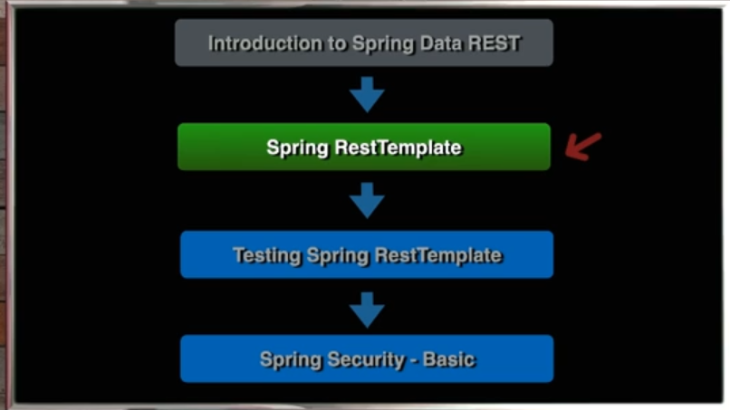

# 19 - Spring RestTemplate

## 001 Introduction

## 002 Project Code Review
## 003 Create Client Service
## 004 Get List as JSON String
## 005 Get List as Java Map
## 006 Get List as Jackson Object
## 007 Spring Pageable with Jackson
## 008 RestTemplateBuilder Configuration
## 009 Externalize Root URL
## 010 Uri Components Builder
## 011 Query Parameters
## 012 URL Parameters
## 013 HTTP Post with RestTemplate
## 014 Get Response Header
## 015 HTTP Put with RestTemplate
## 016 HTTP Delete with RestTemplate